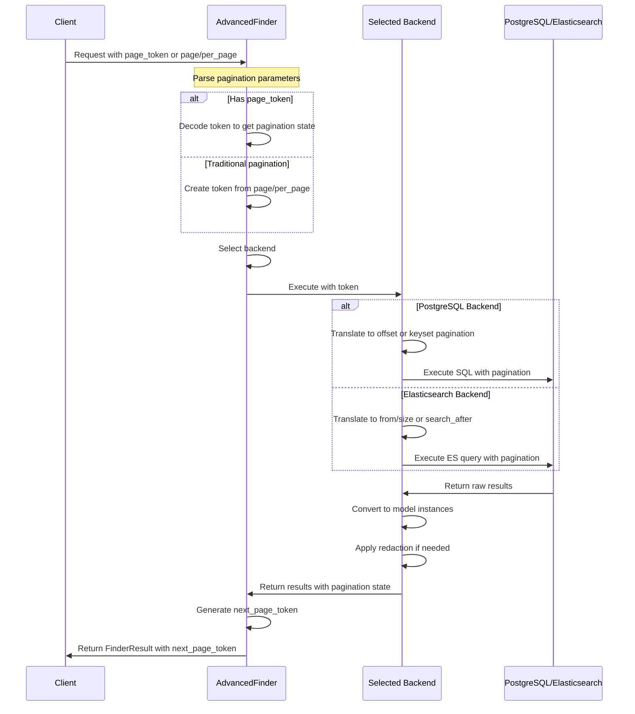

## Summary

This document describes a new advanced architecture for GitLab finders that can leverage both PostgreSQL and advanced search (Elasticsearch/OpenSearch) as data sources. Current finders return ActiveRecord relations, which limits their ability to use advanced search efficiently. Even though Elasticsearch queries could return ActiveRecord relations they cannot be composed with subsequent ActiveRecord queries (or at least not in the same way if they are already paginated). The new architecture aims to create a unified interface that can seamlessly switch between data sources while providing consistent pagination and result formatting.

## Business Objectives

Currently, searches performed through the dashboard or through the group and project interfaces rely exclusively on database operations rather than leveraging advanced search when available. This results in:

1. Slower search performance when data is already available in advanced search
2. Inconsistent search experience across different parts of the product, leading to user confusion and frustration (e.g., "issue search doesn't work" or "can't find projects in a dropdown")
3. Limited search capabilities - features like "find all issues with term X in comments" are too performance-intensive to implement with the current database-only approach
4. We can provide better user experience by utilizing multiple backends.
5. PostgreSQL is a finite (and costly) resource. This will help to offload expensive workload to advanced search.

By implementing Advanced Finders, we will:

- Improve search performance for users with advanced search enabled
- Enable more sophisticated search capabilities
- Provide a consistent search experience across the entire product, ensuring users can reliably find items with improved relevancy regardless of where they are searching
- Create a future-proof architecture that can adapt to different data sources

This work should address this long standing feature request https://gitlab.com/groups/gitlab-org/-/epics/14293 as well as other similar issues and epics.

## Overview

The Advanced Finders will:

1. Provide a consistent interface for accessing data from either PostgreSQL or advanced search
2. Return paginated collections of model instances rather than ActiveRecord relations
3. Support standard search filtering capabilities across both backends
4. Allow for backend-specific optimizations without affecting the consumer API

### Current State

Currently, GitLab finders follow a pattern where:

- They accept search parameters in their constructor
- They expose an `execute` method that returns an ActiveRecord relation
- The returned relation can be further filtered or chained with other queries
- They work exclusively with PostgreSQL as the data source

Example usage:

```ruby
relation = IssuesFinder.new(current_user, project_id: project.id).execute
issues = relation.with_label('bug').order_created_desc.limit(10)
```

This approach has the disadvantage that it cannot leverage advanced search, even when it's available and might provide better performance or additional search capabilities.

### Target State

The new Advanced Finders will:

- Accept search parameters and pagination options in their constructor
- Expose an `execute` method that returns a result object containing:
  - A collection of model instances (not an ActiveRecord relation)
  - Pagination metadata (total count, page info)
- Handle authorization and enforce permissions consistently across all backends
- Internally select the appropriate backend (PostgreSQL or advanced search) based on:
  - Advanced search availability
  - Query complexity
  - Configuration preferences
  - Parameter support in advanced search (using allowlists)
  - Data freshness and current indexing lag

Example usage:

```ruby
# Automatic backend selection
result = AdvancedFinder::Issues.new(
  current_user,
  project_id: project.id,
  with_labels: ['bug'],
  page: 2,
  per_page: 20
).execute

# Explicitly specify the backend
result = AdvancedFinder::Issues.new(
  current_user,
  project_id: project.id,
  with_labels: ['bug'],
  backend: AdvancedFinder::Backend::AdvancedSearch
).execute

# Check backend availability before using it
finder = AdvancedFinder::Issues.new(current_user, project_id: project.id)

if finder.backend_available?(AdvancedFinder::Backend::AdvancedSearch)
  # Create a new finder with advanced search backend
  result = AdvancedFinder::Issues.new(
    current_user,
    project_id: project.id,
    backend: AdvancedFinder::Backend::AdvancedSearch
  ).execute
else
  result = finder.execute  # Use automatic selection
end

# Access results
issues = result.items
pagination = result.pagination

# Convert to ActiveRecord relation if needed
active_record_relation = result.page_relation
```

## Goals and Key Results

### Goals

1. Enable filtered searches to leverage advanced search when available
2. Improve search performance for complex queries
3. Provide a clear migration path from current finders to dual-backend finders
4. Maintain feature parity with existing finders

### Key Results

1. At least three high-traffic finders (Issues, MergeRequests, Projects) refactored to use the new architecture
2. Measurable performance improvements (>30%) for complex searches when advanced search is enabled
3. Comprehensive test coverage ensuring identical results between PostgreSQL and advanced search backends
4. Documentation for both finder usage and creating new dual-backend finders

## Fundamental Design Areas

### Data Source Considerations

When implementing Advanced Finders, there are important considerations regarding how data is accessed from each backend:

- **PostgreSQL Backend**: Can utilize SQL joins across multiple tables to gather the necessary data before returning results
- **Elasticsearch/OpenSearch Backend**: Works with denormalized indices where data is already pre-joined

This architectural difference is managed internally by each backend implementation, but it's important to understand that:

1. The framework needs consistent result structures between PostgreSQL and Elasticsearch at runtime
2. Pagination and sorting must work consistently across both backends
3. The final returned result will be a paginated collection, not a chainable scope

Elasticsearch already uses a denormalized approach where each document contains all the searchable data. For PostgreSQL, the finder implementation will handle the necessary joins before returning the final result set.

This approach represents a tradeoff between query flexibility and the ability to leverage multiple backend technologies.

### Result Container

Rather than returning ActiveRecord relations, the new finders will return a result object that encapsulates both the collection items and metadata like pagination information. This represents a fundamental shift from the current pattern, as advanced finders will only return a single page of results (not a scope that can be further composed with additional queries).

### Backend Selection

The finder should be able to determine which backend to use based on:

- Advanced search availability
- Query complexity
- Feature flags
- User preferences (if applicable)
- Parameter support through allowlists

### Query Translation

Finders need to translate the same set of parameters into both SQL queries and Elasticsearch queries.

### Pagination

Both backends need to support consistent pagination with page numbers and per-page limits.

### Result Formatting

Results from both backends need to be formatted consistently to match the expected model instances.

### Parameter Support Allowlisting

Each finder will maintain an allowlist of supported parameters for each backend, allowing for transparent routing and gradual migration.

### Redaction Logic

A critical safety mechanism that ensures no unauthorized data is returned to users:

- Applies permission checks using `Ability.allowed?(current_user, permission, item)` on each result
- Serves as a final safety net after backend-specific visibility filtering
- Automatically adjusts pagination data to account for redacted items
- Provides transparency through a `redacted?` flag on the result object

This redaction mechanism is especially important when using advanced search, as it ensures consistent application of GitLab's permission model across all data sources, even if the search backend returns results that should be invisible to the current user.

## Key Design Decisions

### Return Type

**Decision**: Finders will return a `FinderResult` object rather than an ActiveRecord relation.

**Context**: Current finders return ActiveRecord relations, which cannot represent Elasticsearch results. While this change means losing the ability to compose queries (e.g., `finder.execute.where(...).order(...)`), it's necessary to support multi-backend results. We need a container that can hold results from either backend, and will need to address the query composition limitations through other patterns.

**Benefits**:

- Consistent interface regardless of backend
- Can include metadata (like pagination) that isn't part of the collection itself
- Allows for future extension (for example, facets, suggestions)

**Tradeoffs**:

- Not able to be chained like ActiveRecord relations, which is a significant limitation for code paths that currently rely on composing queries returned from finders
  - This limitation primarily affects lower-level code (services and other finders that build on existing finders)
  - Higher-level components like controllers typically don't need to compose relations and can work with the final result collection
  - Migration strategies and adapter patterns will help manage this transition
- Requires changing the API of finders
- **Different data access patterns**: The PostgreSQL backend can use joins as needed, while the Elasticsearch backend uses pre-joined denormalized documents (see [Data Source Considerations](#data-source-considerations) section)
- **Single-page limitation**: Unlike the current finder pattern that returns a chainable scope, advanced finders will only return a fixed page of results, which fundamentally changes how they can be used in the application

### Backend Selection Strategy

**Decision**: Use a registry of supported search backends with a prioritization mechanism and parameter support allowlisting, while also providing explicit backend selection for developers.

**Context**: We need a flexible system for backend selection that balances automatic optimization with developer control. The system should consider multiple factors for automatic selection, but also allow developers to explicitly specify a backend when they have specific performance requirements.

**Benefits**:

- Flexible prioritization logic for automatic selection
- Can be configured at runtime
- Supports gradual rollout through feature flags
- Parameter allowlisting allows for graceful degradation
- Can factor in data lag to ensure fresh results when needed
- **Developer Control**: Allows selecting a specific backend when performance requirements dictate it

**Tradeoffs**:

- Additional complexity compared to hardcoded backend selection
- Requires maintenance of parameter support allowlists
- Possibly leads to user and GitLab operator confusion as the query might seem to flip between Elasticsearch and Postgres based on various factors, but we hope to mitigate this by generally making Elasticsearch more reliable and up to date and make it easier to debug for operators if their Elasticsearch index is out of date. We also plan to implement a mechanism in advanced finders to automatically switch back to Postgres if Elasticsearch is not up to date
- Developers selecting a specific backend need to ensure it's available and supports their parameters

### Pagination Implementation

**Decision**: Implement a unified pagination approach using opaque page tokens that can transparently support offset-based, keyset, and scroll-based pagination across different backends.

**Context**: Different backends have different optimal pagination methods, and different queries have different sorting requirements:

- PostgreSQL traditionally uses offset-based pagination but can benefit from keyset pagination for better performance with large datasets
- Elasticsearch/OpenSearch performs better with cursor-based pagination (search_after) or scroll API for deep pagination
- The API needs to support various sorting criteria that impact how pagination works

**Benefits**:

- **Performance optimization**: Each backend can use its most efficient pagination method
- **Consistency**: Results remain stable even when data changes between requests
- **Flexibility**: Support for complex sorting while maintaining efficient pagination
- **API simplicity**: Clients use a single opaque token mechanism regardless of the underlying pagination method

**Tradeoffs**:

- More complex internal implementation compared to simple offset-based pagination
- Requires serialization/deserialization of pagination state

## Implementation Details

### Parameter Support Allowlisting

To facilitate gradual migration and ensure consistent results, we'll implement a parameter allowlist system:

```ruby
module Finders
  module ParameterSupport
    # Registry of supported parameters for each finder and backend
    PARAMETER_ALLOWLIST = {
      'IssuesFinder' => {
        advanced_search: [:project_id, :search, :label_name, ...],
        postgresql: [:project_id, :search, :label_name, :confidential, ...]
      },
      'MergeRequestsFinder' => {
        # Parameter lists for MRs...
      }
      # Other finders...
    }

    # Helper methods for checking parameter support
  end
end
```

### Transparent Transition Strategy

During the migration period, we'll implement a strategy to transparently route queries between legacy and Advanced Finders based on parameter support. This approach offers several advantages:

1. Progressive migration without breaking changes
2. The ability to validate new finders against legacy finders in production
3. Gradual adoption of new finder capabilities

The implementation involves creating adapter classes that:

- Check which arguments/filters are provided
- Use feature flags to control routing behavior
- Check parameter support allowlists
- Delegate to the appropriate finder implementation
- Convert results if necessary

### Naming and Architecture

The new advanced finders will follow a namespaced approach and be implemented as classes within the `AdvancedFinder` module, such as `AdvancedFinder::Issues`, `AdvancedFinder::MergeRequests`, etc. These classes will:

1. Extend a shared base class with common functionality
2. Handle the selection between different backends (legacy finder, PostgreSQL, or ES/OS)
3. Implement entity-specific query building and result formatting
4. Return `FinderResult` objects regardless of which backend is used

#### Class Structure

```ruby
module AdvancedFinder
  module Backend
    class Base
      # Base class defining the interface for all backends
      # with methods for identifier and availability checks
    end

    class PostgreSQL < Base
      # PostgreSQL backend implementation
    end

    class AdvancedSearch < Base
      # Advanced search (Elasticsearch/OpenSearch) backend implementation
    end

    class Legacy < Base
      # Legacy finder adapter for backward compatibility
    end
  end
end
```

#### Using Advanced Finders in Controllers and API Endpoints

```ruby
def index
  finder_params = { project_id: project.id, search: params[:search] }

  # Backend selection based on use case
  if time_critical_operation?
    # Force PostgreSQL for time-critical operations
    backend = AdvancedFinder::Backend::PostgreSQL
  elsif complex_text_search?
    # Use advanced search for complex text search if available
    temp_finder = AdvancedFinder::Issues.new(current_user, {})
    backend = temp_finder.backend_available?(AdvancedFinder::Backend::AdvancedSearch) ?
              AdvancedFinder::Backend::AdvancedSearch : nil
  end

  # Create finder with appropriate backend if specified
  finder_params[:backend] = backend if backend
  finder = AdvancedFinder::Issues.new(current_user, finder_params)
  result = finder.execute

  render json: {
    data: result.items,
    pagination: result.pagination
  }
end
```

This architecture offers several advantages:

1. **Clean API**: Consumers work with a single, consistent interface
2. **Backend Flexibility**: Supports automatic selection or explicit backend specification
3. **Performance Control**: Critical operations can use specific backends
4. **Gradual Migration**: Feature flags enable controlled rollout

### Unified Pagination with Page Tokens

Rather than relying solely on traditional offset-based pagination (page numbers), the Advanced Finders will implement a unified pagination approach using opaque page tokens. This approach allows each backend to use its optimal pagination method internally while presenting a consistent interface to API consumers.

Key components of this approach include:

#### Page Token Structure

Each page token encapsulates:

1. **Pagination type**: offset, keyset, or scroll
2. **Pagination state**:
   - For offset: page number
   - For keyset: cursor values for sort fields
   - For scroll: scroll ID
3. **Sort information**: fields and directions used for ordering

These tokens are encoded for several important reasons:

- **Abstraction**: Hides internal implementation details from API consumers
- **Flexibility**: Allows the internal structure to evolve without breaking client code
- **Simplicity**: Clients only need to handle a single opaque token rather than multiple pagination parameters
- **Compatibility**: Supports different pagination mechanisms through a unified interface

> **Note on Security**: The page tokens will be encrypted to prevent tampering and ensure that users cannot manipulate pagination state. This encryption provides essential security while maintaining all the usability benefits mentioned above.

#### Page Token Usage

The page token approach is designed for backward compatibility and gradual adoption:

**For API Consumers:**

- **Traditional pagination** remains supported: `?page=2&per_page=20`
- **Token-based pagination** is available as an enhancement: `?page_token=encoded_token`
- Responses include both traditional pagination metadata and a `next_page_token` for clients that wish to use it

**For Backend Implementation:**

1. When a request is received, the finder creates a page token from either:
   - The provided `page_token` parameter
   - Traditional pagination parameters (`page` and `per_page`)

2. The token is used to format the query appropriately for the selected backend:
   - For PostgreSQL: Translates to offset or keyset conditions
   - For Elasticsearch: Formats as `from/size`, `search_after`, or scroll parameters

3. After executing the query and receiving results, a new token for the next page is generated based on:
   - The current token type
   - The last item in the result set
   - The backend that was used

4. The response includes both the results and pagination metadata with the next token

This approach allows GitLab to internally use the most efficient pagination method for each backend while providing a consistent, backward-compatible API.

The following sequence diagram illustrates how unified pagination works across different backends:



This diagram shows how pagination requests flow through the system, with the finder translating between the unified external API (page_token) and the backend-specific pagination mechanisms.

#### API Parameters

The finder interface will support both traditional and token-based pagination:

- Traditional (backwards compatibility): `page: 1, per_page: 20`
- Token-based (preferred): `page_token: "encoded_token", per_page: 20`

#### Response Format

Responses will include:

```ruby
{
  data: [...],
  pagination: {
    total_count: 100,
    total_pages: 5,     # For backward compatibility
    current_page: 1,    # For backward compatibility
    next_page_token: "encoded_token_for_next_page"
  },
  data_source: :postgresql  # or :advanced_search
}
```

#### Backend-Specific Implementation

- **PostgreSQL**: Translates the token into either offset-based (`LIMIT/OFFSET`) or keyset queries based on sorting criteria. For custom ordering, keyset pagination uses a more complex condition structure that respects all sort fields (e.g., `WHERE (updated_at < X) OR (updated_at = X AND id > Y)` for a composite sort on `updated_at DESC, id ASC`)
- **Elasticsearch**: Uses `search_after` or scroll API depending on the pagination depth and query type

#### FinderResult Class

The `FinderResult` class will be enhanced to support this unified pagination approach, exposing both traditional pagination metadata (for backward compatibility) and the next page token. It will also track and expose which backend (PostgreSQL or advanced search) was used to generate the results, which is valuable for:

- Debugging and troubleshooting
- Analytics on backend usage patterns
- Transparency for developers consuming the API
- Performance analysis

To facilitate integration with existing code that expects ActiveRecord relations, the `FinderResult` class will provide a method to convert results to a relation:

```ruby
class AdvancedFinder::Issues
  # Other methods...

  def execute
    # This is for backwards compatibility with legacy finders
    # We'll print deprecation warning when this method is used to trace code
    # paths we need to modify
    result.page_relation
  end

  def result
    # ...
  end
end

class AdvancedFinder::Result
  # Other methods...

  # Returns an ActiveRecord relation containing the current page's items
  # This is particularly useful for GraphQL resolvers and other code
  # that needs to access associations on the model instances
  def page_relation
    # Get the model class from the first item or a configuration setting
    model_class = items.first&.class || model_class_for_finder
    ids = items.map(&:id)

    # Use a CTE to inform the planner this is a small set
    model_class.with(page_items: model_class.where(id: ids).select(:id))
               .joins('JOIN page_items ON page_items.id = ' + model_class.table_name + '.id')
               .order(...)
  end
end
```

This approach allows consumers that need ActiveRecord capabilities (like loading associations) to easily convert the FinderResult to a scoped relation while still benefiting from the advanced finder's backend selection.

### Base Dual-Backend Finder

The BaseAdvancedFinder class serves as the foundation for all advanced finders, providing:

#### Backend Selection

The finder intelligently selects the appropriate backend based on:

- **Advanced search availability**: Only uses Elasticsearch/OpenSearch if available
- **Parameter compatibility**: Checks if all requested parameters are supported by the advanced search backend
- **Query complexity**: Evaluates if the query is complex enough to benefit from advanced search
- **Feature flags**: Allows gradual rollout and testing

#### Query Execution Flow

The execution process follows these steps:

1. **Select backend** based on the criteria above
2. **Parse pagination parameters** into the appropriate format for the selected backend
3. **Execute the query** using the selected backend
4. **Apply redaction** to filter out results the user doesn't have access to
5. **Adjust pagination metadata** to account for any redacted items
6. **Return a FinderResult** with the filtered items and pagination information

#### Redaction Safety Net

A critical safety mechanism ensures no unauthorized data is returned:

- Applies permission checks using `Ability.allowed?(current_user, permission, item)` on each result
- Serves as a final verification after backend-specific visibility filtering
- Adjusts pagination data to account for redacted items
- Provides transparency through a `redacted?` flag on the result object

### Backend Implementations

#### PostgreSQL Backend

The PostgreSQL backend takes finder parameters and converts them to ActiveRecord relations. Key responsibilities include:

- **Query Building**: Constructing ActiveRecord relations based on filter parameters
- **Visibility Scoping**: Applying appropriate visibility rules and permissions
- **Pagination**: Supporting both traditional offset pagination and keyset pagination
- **Optimized Sorting**: Implementing efficient ordering based on sort parameters

Keyset pagination will be implemented to handle complex sorting requirements with conditions that respect the complete set of sort fields (e.g., properly handling `created_at DESC, id ASC` with appropriate WHERE clauses).

#### Advanced search Backend

The advanced search backend leverages Elasticsearch/OpenSearch for improved search performance. Key responsibilities include:

- **Query Translation**: Converting finder parameters to Elasticsearch queries
- **Pagination**: Implementing search_after for cursor-based pagination and scroll API for deep pagination
- **Result Formatting**: Converting Elasticsearch hits to model instances
- **Permission Filtering**: Applying visibility rules through Elasticsearch filters

The backend will select the appropriate pagination method based on the query context:

- **search_after**: For regular user-facing paginated results
- **scroll API**: For retrieving large result sets (e.g., exports)

### Implementation Examples

FinderResult and each backend type will have concrete implementations for specific entity types. For example, the IssuesFinder would:

- Define specialized PostgreSQL and Elasticsearch backends for issues
- Implement issue-specific filtering and sorting logic
- Handle issue-specific permissions and visibility rules
- Apply appropriate pagination based on the query context

This pattern will be repeated for other entity types like MergeRequests, Projects, etc., with each implementation focusing on the unique requirements of that entity type while leveraging the shared infrastructure.

## Rollout Strategy

1. Create the base infrastructure for Advanced Finders
2. Define initial parameter support allowlists for high-traffic finders
3. Implement the first finder (e.g., IssuesFinder) with both backends
4. Add feature flags to control backend selection
5. Create adapter classes that can transparently delegate to either new or legacy finders based on parameter support
6. Gradually expand parameter support allowlists as capabilities are added
7. Progressively replace existing finders with Advanced Finders
8. Update controllers and API endpoints to use the new finders
9. Monitor performance and correctness

## Testing Strategy

1. Unit tests for each backend implementation
2. Integration tests comparing results between backends
3. Tests for parameter support allowlist behavior
4. Performance benchmarks for representative queries
5. Load testing with large datasets

## Migration Plan

### Phase 1: Infrastructure and Allowlist Setup

- Implement base classes and interfaces
- Create testing framework
- Implement parameter support allowlists
- Implement feature flags for gradual rollout
- Plan the data access approach for each backend type:
  - For PostgreSQL: Define the necessary joins and relation building
  - For Elasticsearch: Validate that indices contain all required data in denormalized form

### Phase 2: Legacy Finder Adapter and Compatibility Layer

- Create adapter layer that can delegate to either new or legacy finders
- Implement parameter support detection using allowlists
- Ensure backward compatibility with existing code
- Implement compatibility strategies for the ActiveRecord relation dependency:
  - Add `page_relation` method to `FinderResult` that returns a scoped relation with `where(id: ...).order(...)`
  - For initial implementation, consider using `execute` as an alias to `page_relation` during transition
  - Add deprecation warnings when direct query composition is detected
  - Support GraphQL resolution by providing easy conversion to ActiveRecord relations
- Develop patterns for handling code paths that currently depend on query composition

### Phase 3: First Implementation with Limited Parameter Support

- Refactor IssuesFinder to use the new architecture
- Implement both PostgreSQL and advanced search backends
- Start with a small allowlist of supported parameters
- Deploy with feature flags disabled
- Perform extensive testing

### Phase 4: Transparent Migration with Expanding Parameter Support

- Enable feature flags for a percentage of users
- Have adapters automatically route queries to new finders based on parameter support
- Gradually expand parameter support by updating allowlists
- Monitor performance and error rates

### Phase 5: Additional Finders

- Refactor additional high-impact finders
- Document patterns for creating new finders
- Continue expanding parameter support allowlists

### Phase 6: Legacy Finder Deprecation

- Mark old finders as deprecated
- Create migration guides for custom finders
- Eventually remove old finders

## Conclusion

The Advanced Finders architecture provides a flexible, future-proof approach to retrieving data in GitLab. By supporting both PostgreSQL and advanced search backends with a consistent interface and parameter support allowlisting, we can improve search performance and capabilities while ensuring a smooth migration path.

It's important to note that this architecture represents a significant shift from the current finder pattern. Advanced Finders will only return single pages of results (not chainable scopes), which fundamentally changes how they can be used in the application. The PostgreSQL backend can still utilize joins across multiple tables, while the Elasticsearch backend will leverage the already denormalized indices. This approach enables us to select the most appropriate backend at runtime while maintaining consistent results.

## References

- [Epic: Use advanced search for Filtered Searches of Issues and Merge Requests](https://gitlab.com/groups/gitlab-org/-/epics/14293)
- [Issue: Finders should return ActiveRecord collections](https://gitlab.com/gitlab-org/gitlab/-/issues/298771)
- [Guidelines for reusing abstractions](https://docs.gitlab.com/development/reusing_abstractions/#finders)
- [Work Items API Performance Working Group](/handbook/engineering/development/dev/plan/working-groups/work-items-api-performance/)
- [Remove all indexes used for filtering /search only on GitLab.com](https://gitlab.com/gitlab-org/gitlab/-/issues/499949)
- [Package a search engine with GitLab](https://gitlab.com/gitlab-org/gitlab/-/issues/438178)
- [Remove trigram indexes and use ElasticSearch for searching merge requests and issues](https://gitlab.com/gitlab-org/gitlab/-/issues/331829)
