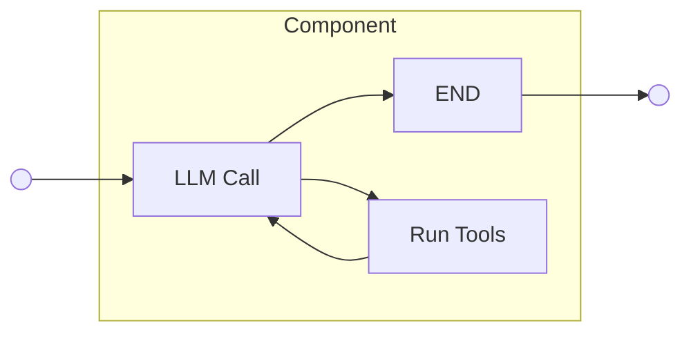
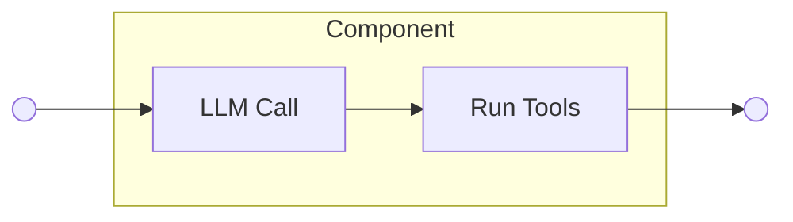
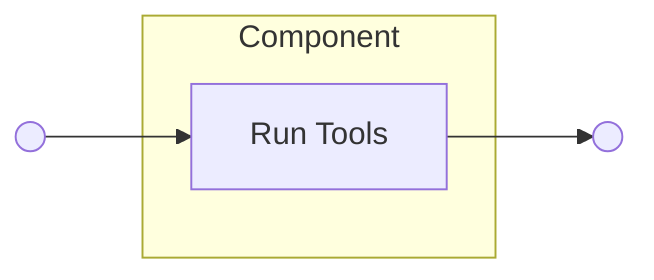
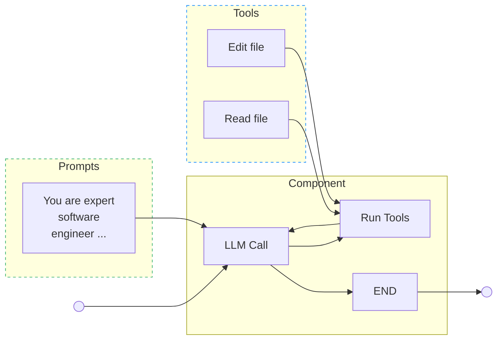
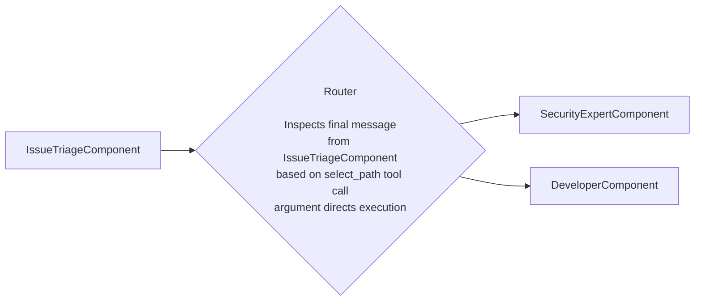



## Summary

This blueprint presents the implementation of an Agent Registry as part of the AI Gateway to centrally manage GitLab's growing collection of agent AI setups.
As GitLab continues transforming AI features to be agentic and building new agentic capabilities, there is a need for a standardized approach to building, managing, and orchestraing these agent setups.
The proposed Agent Registry will serve as a single entry point for LangGraph-based agent development and orchestration across the platform.

## Preamble

This section gives a high-level overview of the key concepts that define the AI Agents space at GitLab.
These concepts explain general details, while specific implementation details can be found in the subsequent sections.

### Large Language Models

Large Language Models (LLMs) are powerful text processing systems capable of understanding, reasoning, and generating human-like responses across diverse domains.
These AI systems are trained on vast amounts of text data from books, articles, and web content, allowing them to learn patterns in language and develop a broad understanding of human knowledge.
LLMs work by processing input text and predicting the most appropriate next words or phrases, enabling them to engage in conversations, answer questions, write content,
and assist with various language-related tasks.

### Prompting

To effectively communicate with LLMs, users need to provide clear instructions called prompts.
A prompt is the input text that tells the LLM what task to perform, what role to take, or what type of response is expected.
For example, a prompt might say "Act as a helpful assistant and explain quantum physics in simple terms" or "Summarize the following article in three bullet points."
The quality and specificity of prompts directly influence the LLM's output. Well-crafted prompts lead to more accurate and useful responses.
Prompting techniques range from simple questions to complex multi-step instructions that guide the model through reasoning processes, making it essential for unlocking the full potential of LLMs.

### Agents

LLMs are great at text generation but cannot directly interact with the real world.
To solve this limitation, we connect external tools (such as web search, APIs, or database queries) to the LLM via advanced prompting.
The LLM decides which tools to use based on the user's input, and then the system executes the selected tools to provide the user with actual real-world data.
For example, if the user asks "What's the current weather in New York?", the LLM would choose to use a web search tool.
An agent is this combination of an LLM with external tools that enables it to take actions and achieve specific goals in the real world.
This allows agents to perform complex, multi-step tasks such as researching topics online, sending emails, or controlling software applications, making them more practical for real-world problem-solving.

### Multi-agent setup

Multi-agent systems are setups that consist of several specialized agents orchestrated in some way.
In practice, one of the common orchestration methods is implementing a lead agent that manages other subagents.
However, other orchestration methods are possible as well, such as polling, peer-to-peer, etc.
The market has demonstrated that multi-agent setups are exceptionally effective at solving complex user tasks that would be challenging for a single agent to handle alone.
For example, Anthropic recently demonstrated that a multi-agent research system with Claude Opus 4 as the lead agent and Claude Sonnet 4 subagents
outperforms single-agent Claude Opus 4 by [90.2%](https://www.anthropic.com/engineering/built-multi-agent-research-system).

### Agents vs Workflows vs Duo Workflow: what is the difference?

In our codebase, we often rely on the terms Workflow and Duo Workflow to represent agentic behavior.
One of the issues is that the term workflow brings unnecessary complexity, potentially misleading Product and Engineering across GitLab.
Overall, a workflow is a series of steps connected through predefined code paths designed to achieve a specific task or goal.
Agents, on the other hand, are systems where LLMs dynamically direct their own processes and tool usage, maintaining control over how they accomplish tasks.
As we continue working on improving the Agents AI stack at GitLab, we're step by step moving away from workflow-related terms towards more specific terms.
For example, Duo Workflow engine becomes Duo Agent Platform and is a system for running various agents and their orchestration.
Here is another MR focused on improving our terminology in the official [docs](https://gitlab.com/gitlab-org/gitlab/-/merge_requests/193744/diffs).

>Note: Due to the ongoing development and legacy code, the Workflow term is still actively used and means a single or multi-agent setup for solving complex user tasks.

### Putting it all together

Given the concepts we define above, the overall picture of how LLMs, prompts, and agents work together looks as follows:


## Motivation

We recently migrated Duo Workflow Service to the AI Gateway.
We also reimplemented Duo Chat using the Duo Workflow codebase.
One of the future steps will be completely reconfiguring Duo Workflow engine to Duo Agent Platform, including clarification of our terminology.
Overall, this opens a path for creating various agents and flexible multi-agent setups on top of the existing work and future changes.
As we continue working increasingly on enhancing our AI Agent stack and transforming existing AI features to be agentic, there is a growing need for centralized management and orchestration of these agents.
The AI Gateway requires an Agent Registry to provide discoverability, governance, and seamless implementation of agentic features of varying complexity across the platform.

## Goal

Build a central Agent Registry in the AI Gateway that makes it easy to build, run, and manage Agent setups, including multi-agent setups with various orchestration approaches.

## Objectives

Based on the goal and motivation, we define the following objectives:

1. Build an Agent Registry as part of the AI Gateway and Workflow Service
1. Create examples showing how to use the Agent Registry and orchestrate agents
1. Write clear documentation to help developers build and improve AI Agents

## Non-goals

1. Customer-facing Agent Registry. This blueprint focuses on improving our internal stack for implementing AI Agents efficiently.
   However, the Agent Registry can be reused by the Duo Workflow Catalog team to further extend its functionality for customers.
2. DSL implementation. We have already had several ideas and conversations about implementing a [DSL](https://gitlab.com/gitlab-org/modelops/applied-ml/code-suggestions/ai-assist/-/issues/1074) on top of YAML to easily prototype new agentic setups.
   This blueprint focuses on one step before DSL and is mainly about organizing our architecture in Python.
   This architecture can later be extended by DSL when required.
   Building a DSL is risky at this moment as our AI stack is under active development and a DSL might become a bottleneck.

## Implementation details

At GitLab, we use LangGraph, a framework built on top of LangChain that enables the creation of complex, stateful, and multi-agent setups using directed graphs.
Every graph consists of nodes that contain specific logic (such as LLM calls, tool executions, or Python code) and edges that control the flow between these nodes.
This allows us to create complex agent behaviors by connecting different components together.
To share data between all parts of the graph, LangGraph provides a shared state object that nodes can read from and update.

Any agent setup (single or multi-agent) we develop at GitLab can be presented as a graph with its own state.
In the next sections, we define a set of primitives provided by the Agent Registry to compose reusable and maintainable agents that are easy to develop, find, and store.

### Agent graph composition

We define the following list of primitives supported by the Agent Registry for agent development:

1. Components
1. Routers
1. State
1. Prompts
1. Tools

The proposed framework has been tested early with a [PoC](https://gitlab.com/gitlab-org/modelops/applied-ml/code-suggestions/ai-assist/-/merge_requests/2788)
that served as the basis for a [demo recording](https://gitlab.zoom.us/rec/share/MvGkn2wnv4OohOYJhzN9EQXnXiJBZEyz87yPB0r9D49yrvXwmpZtEf1HDrweMdgi.dbSRQylaJ7OcoNdr?startTime=1750073407000).

#### 1\. Components

Components are the basic atomic units of operations to compose agent setups; they represent a certain responsibility.
For example, a component can be responsible for reviewing a merge request, or a component can be responsible for writing a new unit test to improve test coverage for a project.
One can perceive components as individuals within an organization, to whom various tasks in a business process can be delegated. Those tasks can vary in complexity and
be as simple as a one-off interaction (e.g., sending an email), to more elaborate tasks like reviewing a merge request. What creates an important distinction is the fact that
components must have **a single role** in the agent setup.
For example, when a feature is being developed, an engineer creates the feature implementation,
but a technical writer is responsible for providing user-facing documentation.
Each of those personas is an expert in their field, which ensures quality of their outputs.

##### Implementation

On a more technical level, the component is a collection of LangGraph nodes arranged in a certain architecture, which is designed to solve a category of problems.
There might be components designed to act as cyclic agents, one-off agents, or predefined non-AI steps in the process.
Example diagrams for the mentioned components are presented below:

1. Cyclic agent



1. One-off agent



1. Deterministic step



##### Inputs

Components may define a set of required inputs.
A component's inputs reflect attributes within a global graph [state](#3-state) object
that carry necessary information without which the component won't be able to fulfill its role.

##### Outputs

Components should specify a set of attributes within a global graph [state](#3-state) object
that they will modify or add during the course of their execution. This is necessary to ensure that
subsequent components within a graph will have their inputs present.

##### Generic components

Some components may serve as customizable blueprints flexible enough
to be reused in different roles. To specify a generic component into a
distinct role, one assigns them a [prompt](#4-prompts), and then defines the component permissions with an
assigned set of [tools](#5-tools), that restrict actions available to an individual in the role in the modeled process.

The diagram below pictures role specification:



#### 2\. Routers

Routers orchestrate Components into predefined structures, governing the order of operations within an agent setup.

Agent setups are composed of Components, but these components need to be arranged in a specific structure to model effective business processes.
Routers navigate between different components and ensure the required order of operations is respected.

On a technical level, Routers wrap LangGraph edges that connect components and implement logic that enforces correct execution flow through the agent setup.
They could make path selection decisions based on attributes within the agent setup's state, such as status or messages from preceding components.
Another example is a supervisor approach when one agent is a lead and other agents are subagents performing certain smaller tasks.

An example Router diagram is presented below:



#### 3\. State

Each agent setup has a global State object used to transport information between different components.

##### Implementation

The State object is a dictionary containing predefined required attributes and a flexible _context_ attribute.
The context is a nested dictionary that enables every component in an agent setup to write their outputs as key-value pairs for subsequent components to use.

```python
class AgentState(TypedDict):
    status: AgentStatusEnum
    conversation_history: Annotated[
        Dict[str, List[BaseMessage]]
    ]
   ui_chat_log: Annotated[List[UiChatLog]]
   context: Dict[str, Union[str, int, float]]
```

#### 4\. Prompts

Prompts are text templates used to specify roles for generic components.
Upon configuration, a generic component must be connected to a prompt via a _prompt id_.
Prompt templates can have placeholder fields for dynamic values. If a prompt template
has any placeholders, their names must match a component [input](#inputs).

##### Implementation

All prompts have to be placed into the prompt registry defined in the AI Gateway.

#### 5\. Tools

Tools represent actions in the external environment that a component can take in the course of its execution.
By way of analogy, tools can be imagined as permissions assigned to a role in an organization.
For example, a CFO can issue financial statements on behalf of a whole organization,
while a database admin has direct access to a database server. In the same fashion, tools should be
assigned to components based on their role in an agent setup.

##### Implementation

This proposal doesn't change any of the existing decisions around the way tools are developed and managed.
The tools implementation is described in this [document](https://gitlab.com/gitlab-org/modelops/applied-ml/code-suggestions/ai-assist/-/blob/main/docs/adding_new_tool.md?ref_type=heads),
while tools permissions and configurations are described in this [section](https://handbook.gitlab.com/handbook/engineering/architecture/design-documents/duo_workflow/#tools-permissions-and-approval-system)
of the Duo Workflow architecture blueprint.

### Timeline

We estimate completing the work on the Agent Registry in 1 milestone.

## Future evolution

Implementing DSL on top of the Agent Registry might be considered as the next step.
The DSL could potentially be used by customers. This work requires additional effort and collaboration with the
Duo Workflow Catalog team.
