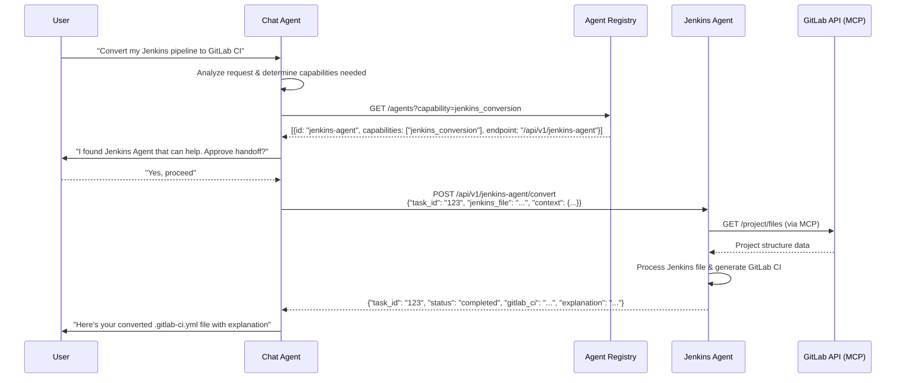



## Summary

Define how AI Agents interact with each other at GitLab and what kind of
system should be in place to support current and future Agents whether
they are built in-house or whether they are external dependencies.

## Motivation

GitLab's stake in the AI market has led to the creation of in-house AI agents. Individually, each
of these agents is empowered to solve a task on behalf of the user with a set of tools given at their
disposal. However, we currently have no way for these agents to collaborate, essentially limiting
our capacity to delegate large tasks to different agents. In practice, this means the Chat Agent
cannot handoff certain tasks to more specialized agents like the Developer Agent. For example,
when a user is within Agentic Chat, if they are looking to convert their Jenkins file to a .gitlab-ci.yml
file, the Chat Agent will not be able to delegate this task to the Jenkins Agent, which is a huge
missed opportunity.

We are starting to plan the GitLab Agentic Platform where we can propose Agentic Workflows to users
to execute. In time, we also hope that users could customize these workflows by linking different
tools and agents as they wish. This also entails defining *how* these agents and tools would communicate
and collaborate towards solving their task.

Dozens of different protocols are emerging for agents to communicate with each other. There needs to be
a conscious decision on GitLab's engineering vision on how we intend to build this to align all AI
features to the same standards. Delaying this decision will only force our hand to build our own
custom system which will emerge naturally from our feature work and could constrain us in the future
to iterate at too slow a pace to keep up with the fast-evolving AI solutions market.

### Goals

This ADR should define clearly and with examples how different agents can communicate.

1. Establish a standardized message schema supporting request/response, async notifications, and error handling
1. Implement agent discovery service allowing runtime enumeration of available agents and their capabilities
1. Decide on a transport layer considering the need for bidirectional communication between agents
1. Agent identity verification - How do we "trust" an agent?
1. Agent invocation - Make agents discoverable just like tools and get user permissions to handoff work
1. Agents and tools are implementation details and should be treated the same by the caller

Success will look like having a well-defined document on how to implement agent communication and a working
proof of concept of an agent handing off work to a different one seamlessly.

### Non-Goals

This ADR will not be looking at how to build new agents. It will also
not be looking into performance optimization.

## Proposal



We should define a simple JSON/RESTful structure for querying available Agents from an Agent Registry.
We can then make Agents fetch this list on startup to always know which Agents they could have to handoff
their work.

### High-level Interaction

To properly define how agents can communicate with each other, we can also reflect on what kinds of different
ways of invoking an agent we can have. In general, these could be broken down into two broad categories:

1. Natural language query
1. UI element interactions

UI element interactions are essentially shortcuts to pre-made prompts, but also as we build more and
more agents, this could lead to instantiating a specialized agent from the get-go. This consideration
is important to state as it means we may not always start with the same agent and that specialized agents
may not require Agent-to-Agent (A2A) communication. As different agents have different tools, the same
logic applies to A2A, namely that a starting agent reacting to a natural language query must have access
to a larger array of tools and agents to best address the user's needs, whereas UI interactions can be shortcut
to a specialized agent.

Once the query is sent and the agent has done the initial assessment, it will then look into its tools
and agents through a registry. If it were to select an agent as the best solution to the user's problem, then
it will ask for approval from the user. Once the user approves, then the Chat Agent will establish a connection

## Design and implementation details

### Agent Registry Service

Central discovery and capability matching implemented in Ruby on Rails API service

Key endpoints:

- `GET /agents - List all available agents`
- `GET /agents?capability=<capability> - Find agents by capability`
- `POST /agents - Register new agent`
- `GET /agents/:id/health - Health check`

### Standardized Agent API Contract

Every agent must implement:

```json
POST /api/v1/{agent-name}/invoke
{
  "task_id": "uuid",
  "user_id": "user_123",
  "request": {
    "type": "jenkins_conversion",
    "payload": { "jenkins_file": "pipeline { ... }" },
    "context": { "project_id": 456, "branch": "main" }
  },
  "callback_url": "https://chat-agent/api/callbacks"
}
```

### Authentication & Authorization

Agent-to-Agent: JWT tokens with agent-specific scopes
User Context: Passed through for permission checks

Request Format:

```json
{
  "task_id": "550e8400-e29b-41d4-a716-446655440000",
  "user_id": "user_123",
  "requesting_agent": "chat-agent",
  "request": {
    "type": "capability_name",
    "payload": {},
    "context": {
      "project_id": 456,
      "user_permissions": ["read", "write"],
      "deadline": "2025-06-10T16:00:00Z"
    }
  },
  "callback_url": "https://chat-agent/api/v1/callbacks",
  "timeout_seconds": 300
}
```

Response Format:

```json
{
  "task_id": "550e8400-e29b-41d4-a716-446655440000",
  "status": "completed|failed|in_progress",
  "result": {
    "type": "jenkins_conversion_result",
    "payload": {
      "gitlab_ci": "stages:\n  - build\n  - test",
      "explanation": "Converted 3 Jenkins stages to GitLab CI",
      "warnings": ["Manual approval step couldn't be converted"]
    }
  },
  "error": null,
  "processing_time_ms": 2500,
  "agent_version": "1.2.3"
}
```

### Error Handling Strategy

`200` - Success
`400` - Bad request (invalid payload)
`401` - Unauthorized agent
`403` - Insufficient permissions
`404` - Agent not found
`500` - Internal agent error
`503` - Agent unavailable

### Agent Registration

```json
jsonPOST /registry/agents
{
  "id": "jenkins-agent",
  "name": "Jenkins Pipeline Converter",
  "version": "1.2.3",
  "endpoint": "https://jenkins-agent.gitlab.com/api/v1",
  "capabilities": [
    {
      "name": "jenkins_conversion",
      "description": "Convert Jenkins pipelines to GitLab CI",
      "input_schema": { "$ref": "#/schemas/jenkins_file" },
      "output_schema": { "$ref": "#/schemas/gitlab_ci_file" }
    }
  ],
  "health_check_url": "/health",
  "max_concurrent_requests": 10,
  "average_response_time_ms": 2000
}
```

### Tool Integration via MCP

Although this is out of scope for this ADR, it is assumed that Agents use MCP for all external system access:

```json
{
  "mcp_tools": [
    {
      "name": "gitlab_api",
      "description": "Access GitLab project data",
      "server": "gitlab-mcp-server",
      "resources": ["projects", "files", "pipelines"]
    }
  ]
}
```

### Advantages of This Approach

1. This structure would be easy to migrate to A2A when/if the standard picks up
without over investing too early.
1. HTTP/REST is well-understood by all GitLab engineers
1. Existing monitoring and debugging tools work out-of-the-box
1. We can start with simple agents and add complexity over time
1. Compatible with existing GitLab infrastructure
1. Each agent is responsible for its own domain
1. Registry provides centralized governance
1. Standard HTTP logs and metrics

<!--
This section should contain enough information that the specifics of your
change are understandable. This may include API specs (though not always
required) or even code snippets. If there's any ambiguity about HOW your
proposal will be implemented, this is the place to discuss them.

If you are not sure how many implementation details you should include in the
document, the rule of thumb here is to provide enough context for people to
understand the proposal. As you move forward with the implementation, you may
need to add more implementation details to the document, as those may become
valuable context for important technical decisions made along the way. A
document is also a register of such technical decisions. If a technical
decision requires additional context before it can be made, you probably should
document this context in a document. If it is a small technical decision that
can be made in a merge request by an author and a maintainer, you probably do
not need to document it here. The impact a technical decision will have is
another helpful information - if a technical decision is very impactful,
documenting it, along with associated implementation details, is advisable.

If it's helpful to include workflow diagrams or any other related images.
Diagrams authored in GitLab flavored markdown are preferred. In cases where
that is not feasible, images should be placed under `images/` in the same
directory as the `index.md` for the proposal.
-->

## Alternative Solutions

<!--
It might be a good idea to include a list of alternative solutions or paths considered, although it is not required. Include pros and cons for
each alternative solution/path.

"Do nothing" and its pros and cons could be included in the list too.
-->
