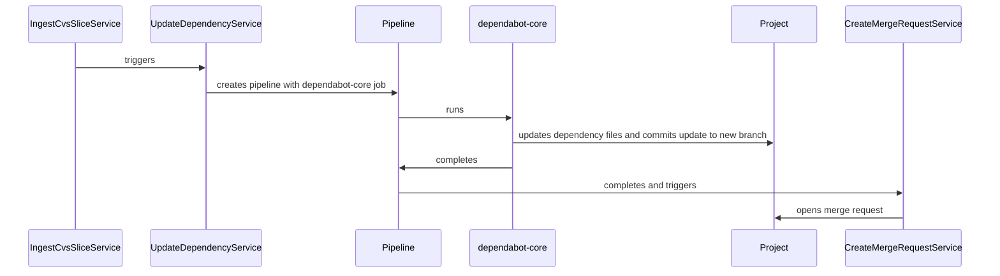
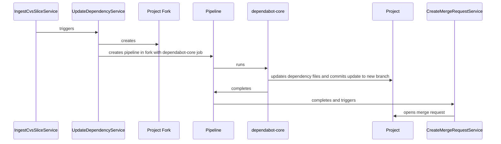

---
# This is the title of your design document. Keep it short, simple, and descriptive. A
# good title can help communicate what the design document is and should be considered
# as part of any review.
title: Automated dependency updates
status: proposed
creation-date: "2025-06-17"
authors: [ "@hacks4oats" ]
coaches: [ "@mbenayoun" ]
dris: [ "@johncrowley", "@nilieskou" ]
owning-stage: "~devops::application security testing"
participating-stages: [ ~"devops::application security testing" ]
# Hides this page in the left sidebar. Recommended so we don't pollute it.
toc_hide: true
---

<!-- Design Documents often contain forward-looking statements -->
<!-- vale gitlab.FutureTense = NO -->

<!-- This renders the design document header on the detail page, so don't remove it-->


## Summary

Automated dependency updates is a feature that will be responsible of keeping
project dependencies up to date. Keeping project dependencies up to date is
widely considered a good practice. Doing this ensures that the latest bug fixes,
performance enhancements, and security patches are applied to project
dependencies. The process of checking for and applying dependency updates is
quite often simple, but time consuming. The Automated Dependency Updates feature
aims to free up user time by automating this often manually done process.

## Motivation

Existing dependency management tools like [Renovate] and [dependabot-core]
can automate the process of checking for updates and can also create merge
requests with the updates found. They however suffer from some limitations:

- Installation can be difficult to scale up [^1]
- Users are required to manage the required access tokens which adds
  configuration overhead
- They often run abitrary code which requires additional security controls [^2] [^3]
- The dependency updates proposed by the tools lack critical context like if the
  updates resolve a vulnerability, and if it resolves a vulnerability what the
  severity is.

### Goals

- Automated MR creation for **non-breaking** language dependency updates [^4]
- Zero config feature enablement
- Allow for integration with GitLab Duo

### Non-Goals

- Custom dependency managers like the ones supported by [Renovate]
- Automated MR creation for **breaking** dependency updates
- Updating anything other than language dependencies

## Proposal

<!--
This is where we get down to the specifics of what the proposal actually is,
but keep it simple!  This should have enough detail that reviewers can
understand exactly what you're proposing, but should not include things like
API designs or implementation. The "Design Details" section below is for the
real nitty-gritty.

You might want to consider including the pros and cons of the proposed solution so that they can be
compared with the pros and cons of alternatives.
-->

Dependency management is inherently a complex problem space. While it's possible
to build a completely greenfield solution, it's a much more efficient option to
use an off the shelf tool that's been heavily used, and proven to work well. To
that effect, we've chosen to use the [dependabot-core] library to power our
automated dependency updates. The following pros and cons were considered while
evaluating this library as an option.

**Pros**:

- Diverse list of supported ecosystems
- Receives frequent contributions from core contributors and the open source community
- Written in a language that's heavily used at GitLab (Ruby)

**Cons**:

- Requires dependencies like interpreters and runtime managers [^5]
- Designed to run as an isolated CI/CD job, and not in the context of something
  like a Sidekiq worker
- Security recommendations require running a dependency proxy for private
  registries
- Only allows indirect dependency updates for projects that have a lock file

Despite some drawbacks, [dependabot-core] provides substantial benefits, and
allows us to delivery a solution that works for a wide percentage of our users.
Therefore, we'll be using [dependabot-core] in our automated dependency updates
feature.

## Design and implementation details

At a high level, the system will interact with the following components.

- **IngestCvsSliceService**: This [service][ingest cvs slice service] creates
  [Continuous Vulnerability Scanning] vulnerabilities. When a scan completes, it
  will forward vulnerable components for further analysis. Any vulnerable
  components that can be updated will be queued to do so.
- **UpdateDependencyService**: This new service will be responsible for creating
  a new pipeline that will **only** run the dependency update job. Apart from
  turning the feature on, no further user configuration will be required.
- **dependabot-core**: This software will run in a CI/CD job, and will resolve
  the latest version a dependency can update to. It will then commit the
  necessary changes in a branch.
- **CreateMergeRequestService**: This service will create a merge request once a
  dependency update pipeline completes. This means that the accounts used for
  the dependabot-core commits will not need the permissions to create merge
  requests at the project, group, or instance level.
- **RebaseMergeRequestService**: This service is responsible for rebasing any
  open dependency update merge requests in the case of a conflict.

**Project based system**

**Alternative fork-based system**

### Separation of responsibilities

As mentioned, the dependabot-core job has the ability to run arbitrary code when
updating certain dependencies. This powerful ability allows dependabot-core to
carry out some complex updates, but it also adds some risk that needs to be
mitigated. For this reason, two separate accounts, one used for the CI/CD job
and another for the merge request creation, will be used to perform the
dependency updates.

The CI/CD job will have access to an account that will be able to read the
repository, and will only be able to write to the set of dependency update
related branches. Additionally, the job will not have any package registry
tokens set, and will instead access registries via a hardened proxy service.

Since the CI/CD job will be unable to create merge requests via the API, a
separate account will be used to create the merge requests via the
`DependencyManagement::CreateMergeRequestService` class. This class will only
open new merge requests from the branches created by the dependabot-core job.
It will not be able to do anything outside of these preconfigured tasks.

### Module grouping

Careful consideration should be given to the module name used for this
feature set. While possible, it's not an easy task to change it later on. For
example, Sidekiq workers require [at least 3 milestones][sidekiq worker migrations]
before they can be removed.

To that effect, it's proposed that the `DependencyManagement` module is used for
all related code. This name is descriptive, easy to find, and provides a clear
boundary on what it should handle. The `UpdateDependencyService` and `CreateMergeRequestService` will both
reside in this module, and have the following references.

- `DependencyManagement::UpdateDependencyService`
- `DependencyManagement::CreateMergeRequestService`

### Image maintenance

TODO: investigate the following.

- Why did dependabot-core migrate from a
[monolithic image](https://github.com/dependabot/dependabot-core/blob/25dd534955500aebd0150e4c92fa919f841f65fe/README.md#dependabot-script).
- How many images will we need to build if we keep them separate?
- What's the security status of the individual images?

### Dependency management insights

TODO: how can users interact with open merge requests and jobs?

### Usage metrics and observability

TODO: define the following.

- How can we detect and action job failures?
- What's the minimal amount of telemetry we can collect to proactively
  build with our customer's feature usage in mind?

## Alternative Solutions

### Bootstrap our own dependency management service

This is a fairly large task that would require us to implement version
resolution for a large amount of package managers over time, but it does have
some advantages.

**Pros**:

- Bump version ranges for projects that **do not** have a lock file
- No need to install dependencies locally

**Cons**:

- Requires a large amount of work to support the same ecosystems of existing
  tools like [Renovate] or [dependabot-core].

[^1]: For example, Renovate requires a [global access or an allow list](https://docs.renovatebot.com/getting-started/installing-onboarding/#repository-installation).
[^2]: Renovate may execute [arbitrary code](https://docs.renovatebot.com/security-and-permissions/#execution-of-code),
    and often recommends using an allow list of user commands.
[^3]: dependabot-core may execute [arbitrary code](https://github.com/dependabot/dependabot-core#private-registry-credential-management)
    and requires the user to configure the job to run in isolation from access tokens for added security.
[^4]: Language dependencies are programming language dependencies managed by a
    package manager. Examples include Bundler managed Ruby gems, Go modules,
    Rust crates, and many more.
[^5]: For example, Python and PyEnv are required to run
    `dependabot-core/python`.

[dependabot-core]: https://github.com/dependabot/dependabot-core#
[ingest cvs slice service]: https://gitlab.com/gitlab-org/gitlab/blob/e4102ebc0e751446b73628c4a0161e5a4dcad504/ee/app/services/security/ingestion/ingest_cvs_slice_service.rb#L5
[remote registry configuration]: https://docs.gitlab.com/user/packages/package_registry/dependency_proxy/#configure-the-remote-registry
[Renovate]: https://docs.renovatebot.com/
[Continuous Vulnerability Scanning]: https://docs.gitlab.com/user/application_security/continuous_vulnerability_scanning/
[Sidekiq worker migrations]: https://docs.gitlab.com/development/sidekiq/compatibility_across_updates/#removing-worker-classes
