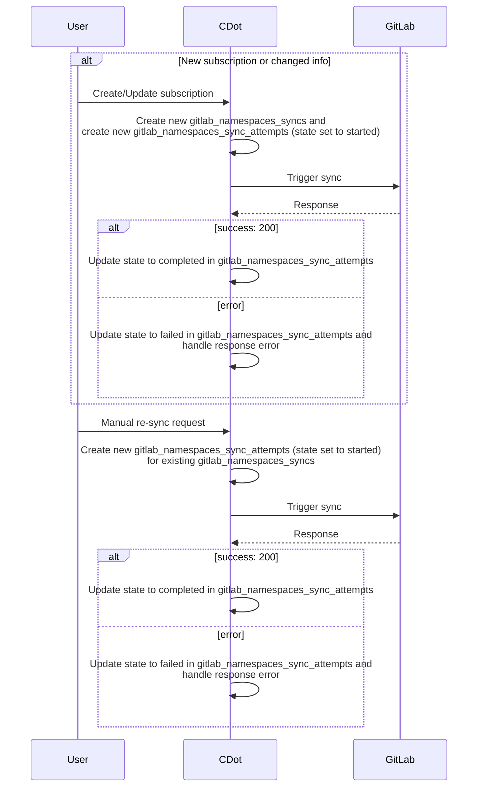
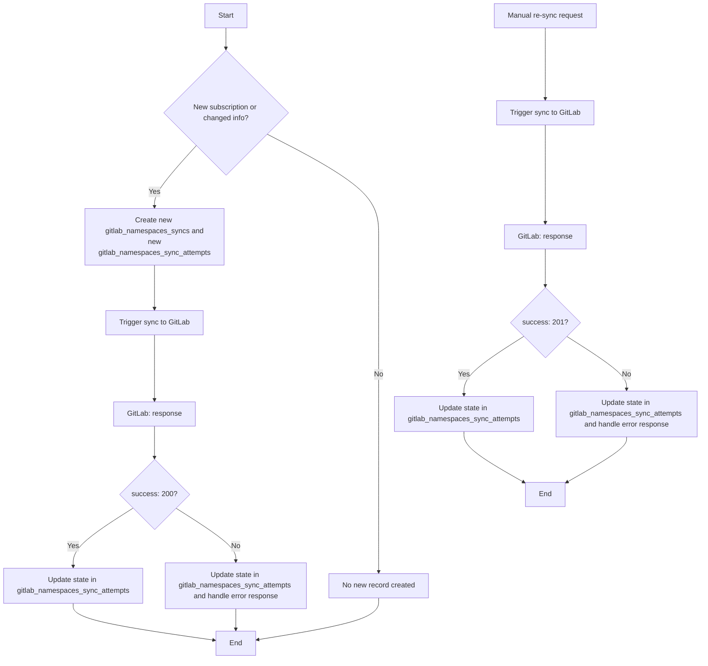
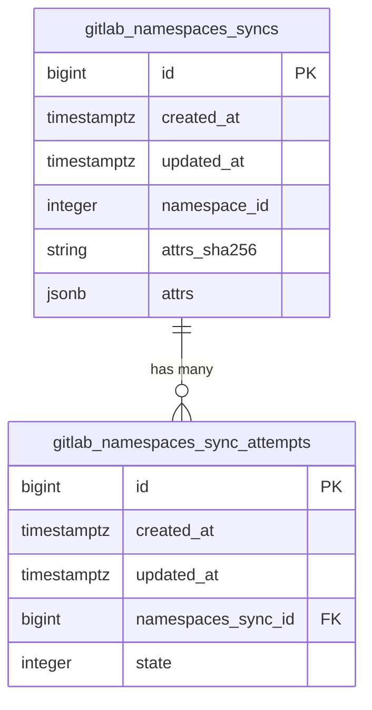
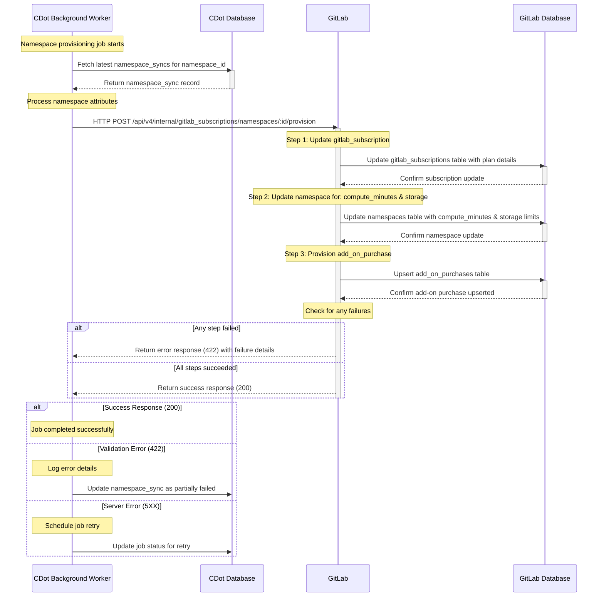




## Summary
As a part of aligning provisioning between Self-Managed and SaaS , we are restructuring the way provision for namespace is done on GitLab.com

## Motivation
The work for this will align the provisioning for GitLab.com closer to the way SM/Dedicated is provisioned. A similar approach will be implemented to sync a namespace's subscription (or trial) info.

## Goals
The goal of this blueprint is to produce:

   - an architectural design(s) on how the namespace will be provisioned in new process
   - an iteration plan to achieve the chosen design

## Proposal

We want to create a new table `namespace_syncs` that will hold the records for the `namespace` provision params generated. A `namespace_sync` recrod we will have many `sync_attempts` that will log the status of `namespace_sync`. The statuses can be `[started, failed, skipped, completed]`.

Whenever a `namespace_sync` record is created, it will always have a associated `sync_attempt` record with `started` state. We will then make a **internl HTTP request** to `GitLab` to provision the namespace with the associated `params`. We will update the status of `sync_attempt` record based on the response of provision call. The status will be updated to `completed` for `200 OK` response, and `failed` for any other.

Based on the failed response code we will perform further action:

- `5XX` : This is `Server` error and we will retry the sync few times
- `4XX` : This is validation error and will be related params generation by `Client`. We log will it and then investigate on case by case basis.

## Iteration 1

For Iteration 1, following are the `Sequence Diagram`, `Flow Chart` and `Database table` we plan to implement on `CustomersDot` and `GitLab`.

### CDot Side

#### Sequence Diagram



#### Flow chart



#### Database



### GitLab.com side

#### Sequence diagram



#### API Contract

A new internal endpoint will be created on `GitLab` that will do full provision of the namespace.

`POST /api/v4/internal/gitlab_subscriptions/namespaces/:id/provision`

The endpoint will accept following JSON body structure:

Notes:

* All params inside `provision` object are optional

```json
{
  "provision": {
    "main_plan": {
      "plan_code": "string_value",
      "start_date": "2023-06-01",
      "end_date": "2024-05-31",
      "seats": 100,
      "max_seats_used": 90,
      "trial": false,
      "trial_starts_on": "2023-07-01",
      "trial_ends_on": "2024-07-01",
      "auto_renew": true
    },
    "compute_minutes": {
      "shared_runners_minutes_limit": 50000,
      "extra_shared_runners_minutes_limit": 10000,
      "packs": [
        {
          "purchase_xid": "purchase_1",
          "number_of_minutes": 5000,
          "expires_at": "2023-12-31"
        },
        {
          "purchase_xid": "purchase_2",
          "number_of_minutes": 5000,
          "expires_at": "2024-06-30"
        }
      ]
    },
    "storage": {
      "additional_purchased_storage_size": 1000,
      "additional_purchased_storage_ends_on": "2024-05-31"
    },
    "add_on_purchases": {
      "duo_pro": [
        {
          "quantity": 100,
          "started_on": "2023-06-01",
          "expires_on": "2024-05-31",
          "purchase_xid": "purchase_123",
          "trial": false
        }
      ]
    }
  }
}
```

##### Response:

1. `200` : Successful Request :white_check_mark:
2. `422` : Unprocesssable Entity :warning:
3. `401` : Unauthorized Request :closed_lock_with_key:
4. `404` : Namespace not found :shrug:
5. `500`: Server Error :boom:
