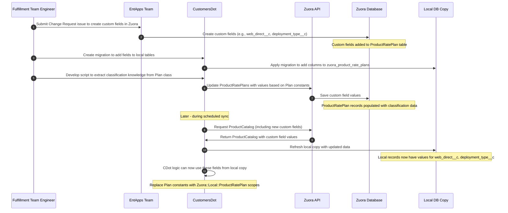



## Summary

The [GitLab Customers Portal](https://customers.gitlab.com/) is an independent application, distinct from the GitLab product, designed to empower GitLab customers in managing their accounts, subscriptions, and conducting tasks such as renewing and purchasing additional seats. More information about the Customers Portal can be found in [the GitLab docs](https://docs.gitlab.com/ee/subscriptions/customers_portal.html). Internally, the application is known as [CustomersDot](https://gitlab.com/gitlab-org/customers-gitlab-com) (also known as CDot).

GitLab uses [Zuora's platform](../../../../business-technology/enterprise-applications/guides/zuora/) as the SSoT for all product-related information. The [Zuora Product Catalog](https://knowledgecenter.zuora.com/Get_Started/Zuora_quick_start_tutorials/B_Billing/A_The_Zuora_Product_Catalog) represents the full list of revenue-making products and services that are sellable, or have been sold by GitLab, which is core knowledge for CustomersDot decision making. CustomersDot currently has a local cache of the Zuora Product Catalog via the [IronBank](https://github.com/zendesk/iron_bank) gem and [its LocalRecord extension](https://gitlab.com/gitlab-org/customers-gitlab-com/blob/45f5dedbb4fa803d19827472214ea0b5b0ce1861/lib/gem_extensions/iron_bank/local_records.rb#L1).

CustomersDot uses `Plan` as a wrapper class for easy access to all the details about a Plan in the Product Catalog. Given that the name, price, minimum quantity, and other details of the Plan are spread across the `Zuora::ProductRatePlan`, `Zuora::ProductRatePlanCharge`, and `Zuora::ProductRatePlanChargeTier` objects, traditional access to these details can be cumbersome. This class is very useful because it saves us from having to query for all these details. Additionally, the class helps with the classification of `Zuora::ProductRatePlan`s based on their tier, deployment type, and other criteria used across the app.

CustomersDot keeps a copy of the Zuora Product Catalog and refreshes it daily via a scheduled job. However, every time a new Product, Product Rate Plan, or Product Rate Plan Charge is updated or added to the Zuora Product Catalog, additional manual effort is required to add it to the `Plan` class and configure it.

The main goal of this design document is to improve the architecture and maintainability of the `Plan` model within CustomersDot. When the Product Catalog is updated in Zuora, it should automatically reflect in CustomersDot without requiring app restarts, code changes, or manual intervention.

## Motivation

Every time a new Product/SKU is added to the Zuora Product Catalog, even if the local copy is refreshed, it requires code changes in CustomersDot to make it available. This is due to the current strategy the `Plan` class uses for classification, which consists of assigning the `Zuora::ProductRatePlan` IDs to constants and then manually forming groups of IDs to represent different categories like all plans in the Ultimate tier or all the add-ons available for self-procurement for GitLab.com. These categories are then used for decision-making during execution.

As the codebase and number of products grow, this manual intervention becomes more expensive.

### Goals

The main goals are:

Automate the Plan management in CustomersDot so it will require no manual intervention for basic Product Catalog updates in Zuora. For example, when a new Product/SKU is added, a RatePlanCharge is updated, or a Product is discontinued. To achieve this, we need to move away from hardcoding product rate plan IDs within CustomersDot and transfer the classification knowledge to the Zuora Product Catalog (by adding CustomersDot metadata to it in the form of custom fields) to be able to resolve these sets dynamically.

## Proposal

Transfer CustomersDot's classification knowledge to the Zuora Product Catalog (by adding CustomersDot metadata to it in the form of custom fields) to be able to resolve `ProductRatePlan`s directly from our local copy of the Zuora Product Catalog in iteration until all the plan constants that refer to `ProductRatePlan` IDs are replaced and removed.



We are working on collecting the final set of custom fields to add to the Product Catalog:

### Product Rate Plan Level

- **WebDirect__c**: Boolean for self-service eligibility
- **PlanStatus__c**: `active`, `deprecated`, `legacy`, `not_applicable`
- **IsTrueUp__c**: Boolean for true-up plans
- **IsEcosystem__c**: Boolean for ecosystem plans
- **IsUsPubSec__c**: Boolean for US government plans
- **AddOnType__c**: `ci_minutes`, `storage`, `duo_pro`, `duo_enterprise`, `agile_planning`, `product_analytics`, `amazon_q`, `not_applicable`
- **CommunityType__c**: `education`, `open_source`, `startup`, `not_applicable`
- **BillingPeriod__c**: `monthly`, `annual`, `two_year`, `three_year`, `four_year`, `five_year` or duration in months:  `1`, `12`, `24`, `36`, `48`, `60`
- **Tier__c**: `ultimate`, `premium`, `bronze`, `silver`, `gold`, `starter`, `free`, `null`
- **DeploymentType__c**: `self_managed`, `dedicated`, `gitlab_dot_com`
- **Category**: `Base Products`, `Add On Services`, `Miscellaneous Products`

There is a [current effort](https://gitlab.com/gitlab-com/business-technology/enterprise-apps/financeops/finance-systems/-/issues/2126) to add some of these fields to Zuora, so we might be able to reuse these. If we are reusing these, we need to double-check that the values in Zuora and CustomersDot classification are aligned for each field. Note these fields are being added at the `ProductRatePlanCharge` level.

## Design and implementation details

For one custom field / set of fields at a time follow this iteration:

1. Add the custom field to Zuora
1. Populate the field in Zuora using a rake task from CustomersDot to transfer the CustomersDot knowledge to the Zuora Product Catalog
1. Update the local Zuora Product Catalog copy attributes so this new custom attribute is synced over our daily scheduled sync
1. Replace the usage of `Plan` constants that represent a collection of records that meet a given classification with a call to a method that loads the same collection from the local copy of the Product Catalog leveraging the custom field behind a feature flag.
1. Validate all is looking good in staging
1. Rollout the custom field usage to production

The following code example illustrates steps 4 and 5 from the iteration process described above. It shows how we would replace hardcoded constants in the `Plan` class with dynamic methods that leverage the custom fields from our local Product Catalog copy. This example specifically demonstrates migrating from hardcoded constants for SaaS plans to dynamic queries based on the `web_direct__c` and `delivery_type__c` fields. During implementation, these changes would be behind feature flags to allow for proper validation in staging before rolling out to production.

```ruby
# lib/plan_classifier.rb
module PlanClassifier
  # Returns all product rate plan IDs that are available for self-service
  # based on the WebDirect__c custom field from the local Product Catalog copy
  def self.self_service_gitlab_com_plans
    Zuora::Local::ProductRatePlan.where(web_direct__c: true, delivery_type__c: 'saas').map(&:id)
  end

  def self.all_gitlab_com_plans
    Zuora::Local::ProductRatePlan.where(delivery_type__c: 'saas').map(&:id)
  end
end

# In app/models/plan.rb
class Plan
  # before
  def self.self_service_gitlab_com_plans
    @@self_service_gitlab_com_plans ||= ALL_SELF_SERVICE_SAAS_PLANS
  end

  # after
  def self.self_service_gitlab_com_plans
    Zuora::Local::ProductRatePlan.web_direct.saas_delivery.map(&:id)
  end

  # before
  def self.all_gitlab_com_plans
    @@all_gitlab_com_plans ||= [
      BASIC_SAAS_1_YEAR_PLAN,
      PREMIUM_SAAS_PLANS,
      ULTIMATE_SAAS_PLANS,
      GITLAB_COM_BRONZE_PLANS,
      DEPRECATED_SILVER_SAAS_PLANS,
      DEPRECATED_GOLD_SAAS_PLANS,
      ALL_GITLAB_COM_EDU_OSS_PLANS,
      TRIAL_SAAS_PLANS
    ].flatten.compact
  end

  # after
  def self.all_gitlab_com_plans
    Zuora::Local::ProductRatePlan.saas_delivery.map(&:id)
  end
```
