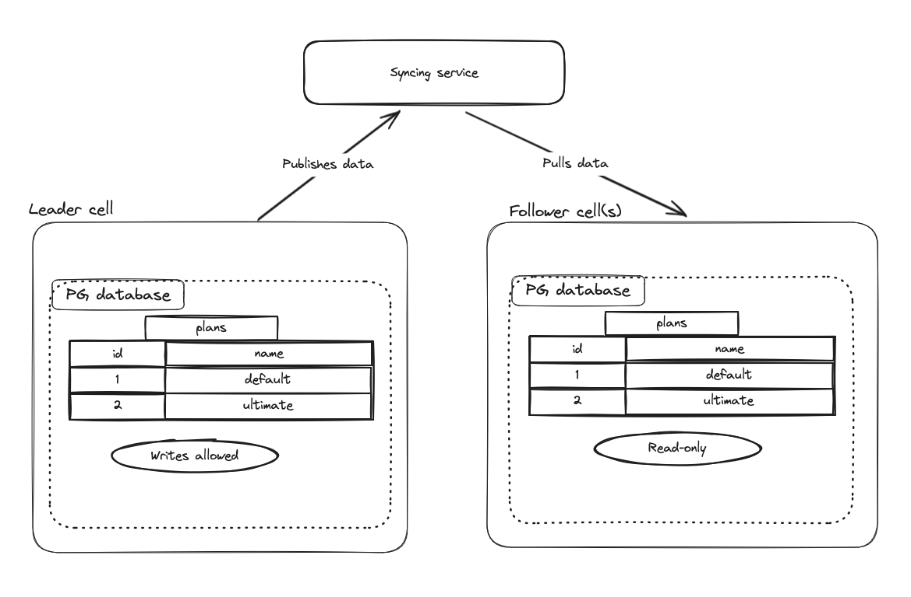

## Goal

In order for some features to work, the data for some
[clusterwide](https://docs.gitlab.com/ee/development/cells/#choose-either-the-gitlab_main_cell-or-gitlab_main_clusterwide-schema)
tables needs to be synchronized to all cells.
For example, the `plans`, `plan_limits`, and `licenses` tables do need to be the same across all cells.

## Requirements

- Clusterwide tables needs to be clearly marked in the database dictionary as participating in the sync process, or not.
- There should be no additional cell-to-cell networking added. In other words, a cell should only communicate with a central service for syncing.

## Proposal

Prerequisites:

1. Only clusterwide tables are allowed to be synced. Cell tables are not allowed to be synced.
1. Some clusterwide tables (like `users`) will not be synced in Cells 1.0.

There will be a leader cell:

1. A cell can be elected a leader. The leader will be the authoritative source for that table.
1. The legacy cell will start as the leader cell.

All other cells will be followers:

1. Other cells will be followers. Followers will synchronize data from the
   leader cell for that table.
1. Follower cells should not allow any write activity to that table.
   Ideally, this is enforced at the database level.
1. While the cell is operating, the table will be periodically re-synced from
   the leader cell.

Central service:

1. The Central service receives rows from the leader cell.
1. The Central service publishes rows to follower cells.

Syncing process:

1. A table is marked as partipating in the clusterwide sync process.
1. When a cell is created, the table will be synced from the leader cell.
1. The unit to be synchronized is a row.
   The key will be the primary key of the table.
1. All rows will be synchronized.
   Selective sync will not be available in Cells 1.0.
1. [Leader cell] Periodically, all rows of the table is sent to the Central service.
1. [Central Service] The latest state of the table is stored in a database.
1. [Follower cell] When a cell is created, it requests the rows for the table from
   the Central service.
1. [Follower cell] All rows for that table are then applied to the cells's database.
1. [Follower cell] Periodically, it requests the rows for the table from the
   Central service.

Conflicts:

1. It is undecided on what to do with extra rows.
1. Mising rows will be synchronized from the leader cell.
1. Rows with conflicting data will be replaced by data from the leader cell.

### Analysis of clusterwide tables

Below is an analysis of clusterwide tables, which can be categorized into 4
different types:

1. Reference table. Tables which are constant / exactly the same for all cells.
1. Instance Setting table. Tables which host settings which needs to affect all
   cells.
1. Organization / Cell table. Tables which may be better categorized as
   `gitlab_main_cell`.
1. User table. Tables related to users, and can be synchronized later in Cells 1.5+
   (not Cells 1.0).

| Table                                                     | Reference table | Instance Setting table | Organization / Cell table | User table |
|-----------------------------------------------------------|-----------------|------------------|------------------------|------|
| abuse_events                                              |                 |                  |                        | Y    |
| abuse_report_assignees                                    |                 |                  |                        | Y    |
| abuse_report_events                                       |                 |                  |                        | Y    |
| abuse_report_label_links                                  |                 |                  |                        | Y    |
| abuse_report_labels                                       |                 |                  |                        | Y    |
| abuse_report_notes                                        |                 |                  |                        | Y    |
| abuse_report_user_mentions                                |                 |                  |                        | Y    |
| abuse_reports                                             |                 |                  |                        | Y    |
| abuse_trust_scores                                        |                 |                  |                        | Y    |
| ai_feature_settings                                       |                 | Y                |                        |      |
| ai_self_hosted_models                                     | Y               |                  |                        |      |
| ai_settings                                               |                 | Y                |                        |      |
| ai_testing_terms_acceptances                              |                 |                  | Maybe                  |      |
| appearances                                               |                 | Y                |                        |      |
| application_setting_terms                                 | Y               |                  |                        |      |
| application_settings                                      |                 | Y                |                        |      |
| atlassian_identities                                      |                 |                  |                        | Y    |
| audit_events_instance_amazon_s3_configurations            |                 |                  | Maybe                  |      |
| audit_events_instance_external_audit_event_destinations   |                 |                  | Maybe                  |      |
| audit_events_instance_external_streaming_destinations     |                 |                  | Maybe                  |      |
| audit_events_instance_google_cloud_logging_configurations |                 |                  | Maybe                  |      |
| audit_events_instance_streaming_event_type_filters        |                 |                  | Maybe                  |      |
| audit_events_streaming_instance_event_type_filters        |                 |                  | Maybe                  |      |
| authentication_events                                     |                 |                  |                        | Y    |
| aws_roles                                                 |                 |                  |                        | Y    |
| banned_users                                              |                 |                  |                        | Y    |
| broadcast_messages                                        | Y               |                  | Maybe ?                |      |
| cloud_connector_access                                    |                 | Y                |                        |      |
| deploy_tokens                                             |                 |                  |                        | Y    |
| early_access_program_tracking_events                      |                 |                  |                        | Y    |
| emails                                                    |                 |                  |                        | Y    |
| ghost_user_migrations                                     |                 |                  |                        | Y    |
| gpg_key_subkeys                                           |                 |                  |                        | Y    |
| gpg_keys                                                  |                 |                  |                        | Y    |
| identities                                                |                 |                  |                        | Y    |
| instance_audit_events                                     |                 |                  | Maybe                  |      |
| instance_audit_events_streaming_headers                   |                 |                  | Maybe                  |      |
| instance_integrations                                     |                 |                  | Maybe                  |      |
| keys                                                      |                 |                  |                        | Y    |
| licenses                                                  | Y               |                  |                        |      |
| oauth_applications                                        |                 |                  | Maybe                  |      |
| plan_limits                                               |                 | Y                |                        |      |
| plans                                                     | Y               |                  |                        |      |
| programming_languages                                     |                 |                  | Maybe                  |      |
| redirect_routes                                           |                 |                  | Y                      |      |
| routes                                                    |                 |                  | Y                      |      |
| saved_replies                                             |                 |                  |                        | Y    |
| security_training_providers                               |                 |                  | Maybe                  |      |
| service_access_tokens                                     |                 | Y                |                        |      |
| smartcard_identities                                      |                 |                  |                        | Y    |
| spam_logs                                                 |                 |                  |                        | Y    |
| subscription_add_ons                                      | Y               |                  |                        |      |
| term_agreements                                           |                 |                  |                        | Y    |
| user_agent_details                                        |                 |                  |                        | Y    |
| user_audit_events                                         |                 |                  |                        | Y    |
| user_broadcast_message_dismissals                         |                 |                  |                        | Y    |
| user_callouts                                             |                 |                  |                        | Y    |
| user_credit_card_validations                              |                 |                  |                        | Y    |
| user_custom_attributes                                    |                 |                  |                        | Y    |
| user_details                                              |                 |                  |                        | Y    |
| user_follow_users                                         |                 |                  |                        | Y    |
| user_highest_roles                                        |                 |                  |                        | Y    |
| user_member_roles                                         |                 |                  |                        | Y    |
| user_permission_export_uploads                            |                 |                  |                        | Y    |
| user_phone_number_validations                             |                 |                  |                        | Y    |
| user_preferences                                          |                 |                  |                        | Y    |
| user_statuses                                             |                 |                  |                        | Y    |
| user_synced_attributes_metadata                           |                 |                  |                        | Y    |
| users                                                     |                 |                  |                        | Y    |
| users_statistics                                          |                 |                  |                        | Y    |
| vs_code_settings                                          |                 |                  |                        | Y    |
| webauthn_registrations                                    |                 |                  |                        | Y    |
| work_item_hierarchy_restrictions                          | Y               |                  |                        |      |
| work_item_related_link_restrictions                       | Y               |                  |                        |      |
| work_item_types                                           | Y               |                  |                        |      |
| work_item_widget_definitions                              | Y               |                  |                        |      |

### Post Cells 1.0

It is anticipated that other clusterwide tables like `users` will need to be
synced to other cells as required.

## Alternatives

- Not syncing.
- [Logical replication](https://www.postgresql.org/docs/current/logical-replication.html).
- [Geo](https://docs.gitlab.com/ee/development/geo.html).
- Terraform / IAC.
