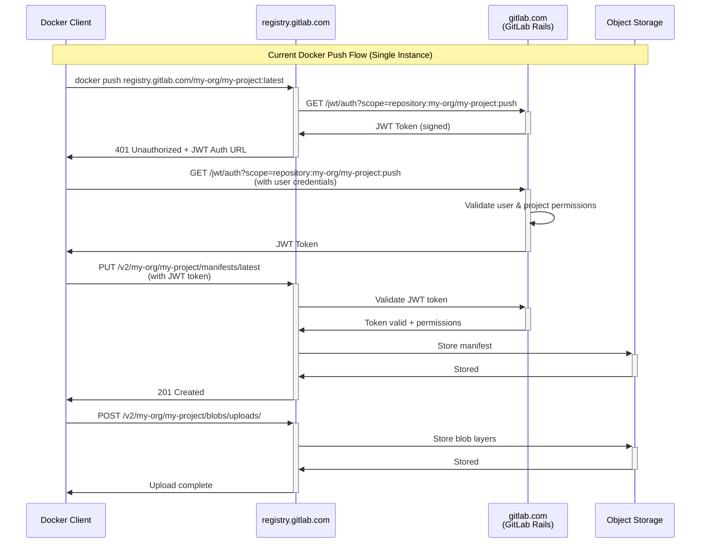
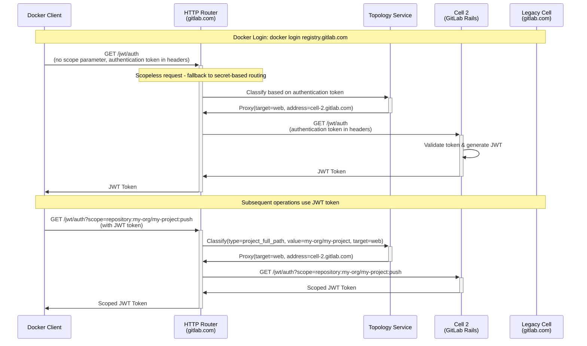
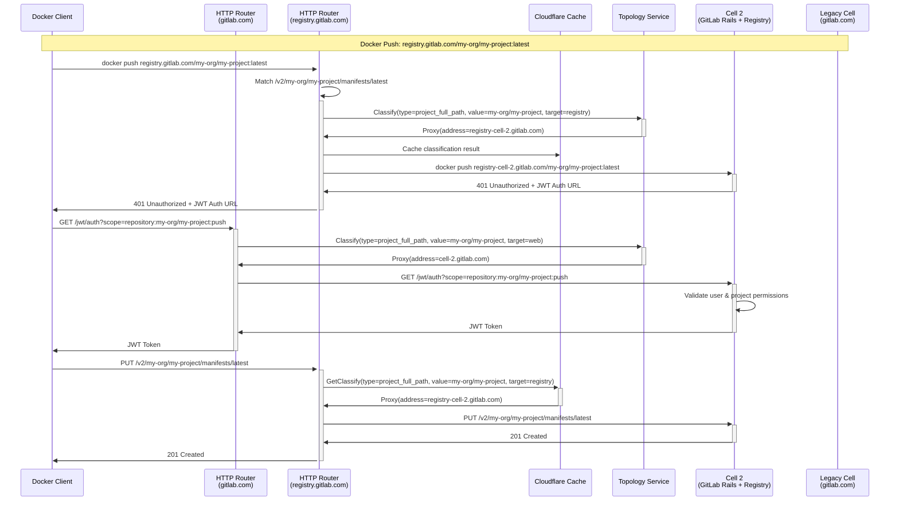
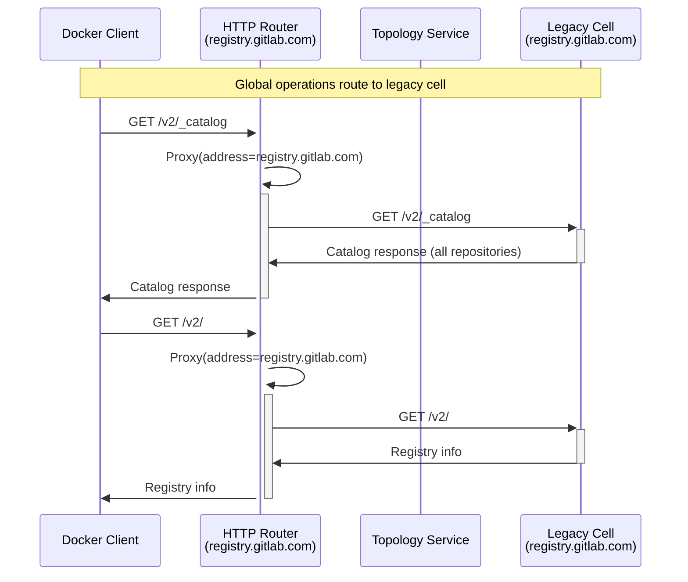
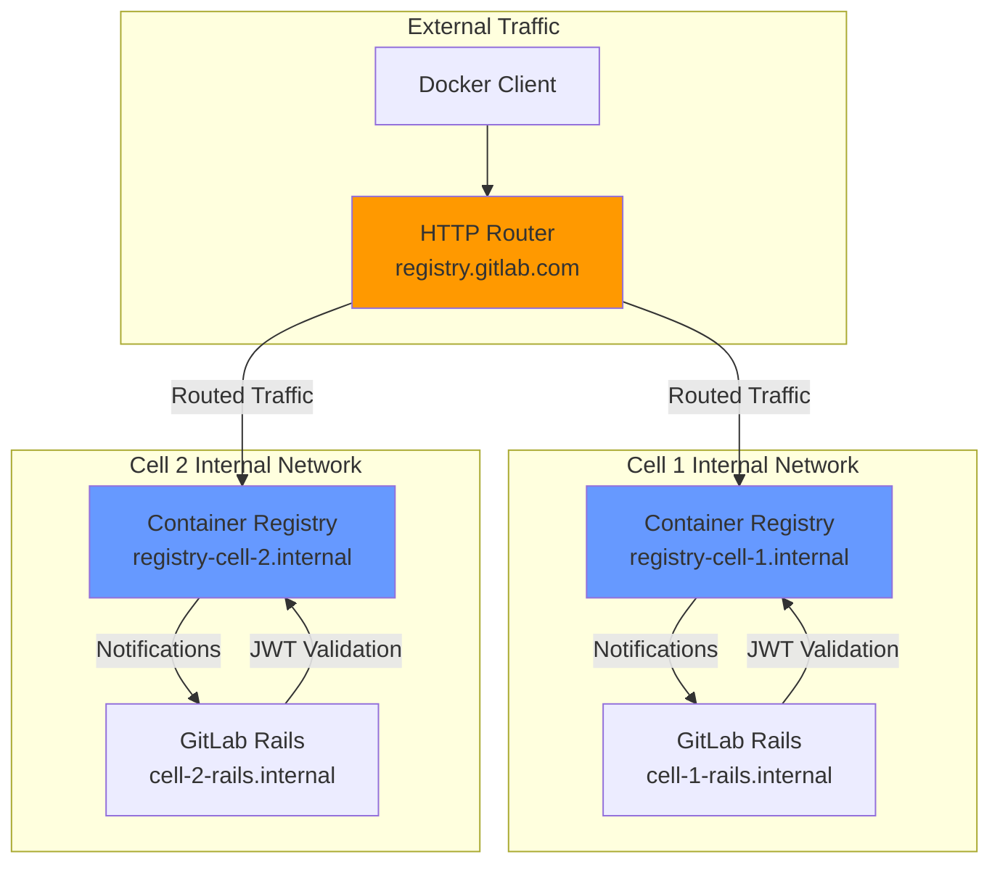



This document outlines the design goals and architecture of Container Registry Routing Service.

## Overview

This document describes the implementation of Container Registry routing within the GitLab Cells architecture using the HTTP Router. The Container Registry requires routing to the correct Cell based on project ownership using path-based routing.

## Current Docker Push Flow

Before diving into Cells implementation, let's understand how Docker push works today:



## Architecture Overview

In the Cells architecture, the `/jwt/auth` endpoint is part of GitLab Rails and must be processed by the HTTP Router to decode the scope and route to the correct Cell. Container Registry routing uses path-based routing exclusively, extracting project information from URL paths. All endpoints not explicitly classified will route to the legacy Cell.

### Key Components

- **HTTP Router**: Deployed as Cloudflare Worker, handles request routing
- **Container Registry**: Run as local service within each Cell
- **Topology Service**: Provides Cell discovery and classification
- **JWT Authentication**: `/jwt/auth` endpoint within GitLab Rails for Docker authentication
- **Legacy Cell**: Default target for all non-classified endpoints and global operations

## HTTP Router Rules Configuration

### Session Token Rules (`ruleset/session_token.json`)

Add the following rule to the existing session token ruleset for JWT authentication:

```json
{
  "comment": "Container Registry JWT Authentication - with scope (path-based routing)",
  "match": [
    {
      "type": "path",
      "regex_name": "jwt_auth",
      "regex_value": "^/jwt/auth$"
    },
    {
      "type": "query_string",
      "regex_name": "scope",
      "regex_value": "repository:(?<project_path>[^:]+):(?<actions>.*)"
    }
  ],
  "action": "classify",
  "classify": [
    {
      "type": "project_full_path",
      "value": "${project_path}",
      "target": "web"
    }
  ]
}
```

Note: `/jwt/auth` will be routed based on path only if scope repository is present, otherwise it will fallback to secret-based routing (handled by other rules in the session token ruleset).

### Container Registry Rules (`ruleset/container_registry.json`)

Minimal ruleset for Container Registry with only two rules:

```json
{
  "rules": [
    {
      "comment": "Container Registry v2 API - All project-related operations",
      "match": [
        {
          "type": "path",
          "regex_name": "project_path",
          "regex_value": "^/v2/(?<project_path>[^/]+(?:/[^/]+)*)/.*$"
        }
      ],
      "action": "classify",
      "classify": [
        {
          "type": "project_full_path",
          "value": "${project_path}",
          "target": "registry"
        }
      ]
    },
    {
      "comment": "All other registry endpoints route to legacy registry",
      "action": "proxy"
    }
  ]
}
```

## Topology Service Configuration Extension

### Current Topology Service Configuration

The Topology Service configuration needs to be extended to include Container Registry URL information for each Cell:

```toml
# Legacy Cell configuration
[[cells]]
address = "gitlab.com"
registry_address = "registry.gitlab.com"

[[cells]]
address = "cell-us-1.gitlab.com"
registry_address = "registry-cell-us-1.gitlab.com"

[[cells]]
address = "cell-eu-1.gitlab.com"
registry_address = "registry-cell-eu-1.gitlab.com"
```

## Docker Login Authentication Flow

### Docker Login Process

The `docker login` command is scopeless and will be routed using secret-based routing:



### Repository Linking Limitation

Repository linking functionality will not work in this architecture:

- **Cross-Cell Mounting**: Users cannot mount blobs from repositories in different Cells
- **Public Resource Access**: Users can only access public resources from other Organizations or Cells
- **Single Repository Routing**: Each JWT request is routed based on the first repository in the scope only

## Container Registry Request Flow

### Docker Push Flow with Separate HTTP Routers



### Legacy Cell Fallback Flow



## Implementation Details

### HTTP Router Configuration

Separate HTTP Routers are deployed for different domains:

```javascript
// wrangler.toml configuration for gitlab.com
[env.gprd.vars]
vars = { GITLAB_SESSION_RULES = "session_token", TOPOLOGY_SERVICE_URL = "https://topology-service.gitlab.com", ... }

// wrangler.toml configuration for registry.gitlab.com
[env.reg_gprd.vars]
vars = { GITLAB_SESSION_RULES = "container_registry", TOPOLOGY_SERVICE_URL = "https://topology-service.gitlab.com", GITLAB_PROXY_HOST = "registry-cell-1.gitlab.com", ... }
```

### HTTP Router Changes Required

The HTTP Router requires the following enhancements to support Container Registry routing:

#### 1. Target-Based Routing Support

Add support for the `target` parameter in routing rules:

```javascript
export interface ClassifyRequest {
  type: string;
  value?: string;
  target: string; // default to "web"
}
```

#### 2. Topology Service API Updates

Update the ClassifyRequest interface:

```proto
enum TargetType {
  WEB = 0;
  REGISTRY = 1;
}

message ClassifyRequest {
  ClassifyType type = 2;
  string value = 3;
  TargetType target = 4;
}
```

#### 3. Topology Service Config Updates

```toml

[[cells]]
id = 1
address = "my.cell-1.example.com"
registry_address = "registry.my.cell-1.example.com"
```

#### 4. Multiple Classification Matches Support

The HTTP Router must support multiple classification matches processed in sequence. Example rule structure:

```json
{
  "match": [
    {
      "type": "path",
      "regex_name": "jwt_auth",
      "regex_value": "^/jwt/auth$"
    },
    {
      "type": "query_string",
      "regex_name": "scope",
      "regex_value": "repository:(?<project_path>[^:]+):(?<actions>.*)"
    }
  ],
  ...
}
```

Matches are processed in sequence to then classify.

#### 4. Caching with Target Parameter

The target parameter will be automatically cached as part of the classify request body hash. The existing caching mechanism in the HTTP Router caches based on the request body hash, which will include the target parameter, ensuring proper cache isolation between different target types.

### Cell Configuration Requirements

No changes are required in GitLab Rails or Container Registry components. All connectivity is handled by the HTTP Router. Each Cell requires minimal configuration:

#### Container Registry Configuration

Each Cell's Container Registry must be configured with:

1. **Public Endpoint**: All Cells use `registry.gitlab.com` as the public host
2. **Internal Communication**: Each Cell uses internal URLs (`api_url`) for Cell-to-Registry communication
3. **Cell-Specific Keys**: Each Cell has its own signing keys for JWT token validation
4. **Internal Notifications**: Registry pushes notifications to Cell Rails using internal networking

#### GitLab Rails Configuration

GitLab Rails requires minimal configuration changes:

```yaml
# GitLab Rails configuration for Cell
gitlab:
  registry:
    enabled: true
    host: registry.gitlab.com  # Public endpoint
    port: 443
    api_url: http://registry-cell-1.internal:5000/  # Internal 
```

### Network Architecture

The HTTP Router handles all external routing, while Cells use internal networking:



## Related Documents

- [GitLab Cells Infrastructure Architecture](infrastructure/_index.md)
- [HTTP Router Configuration](https://gitlab.com/gitlab-org/cells/http-router/-/blob/main/docs/config.md)
- [HTTP Router Rulesets](https://gitlab.com/gitlab-org/cells/http-router/-/tree/main/config/ruleset)
- [Topology Service Implementation](https://gitlab.com/gitlab-org/cells/topology-service)
