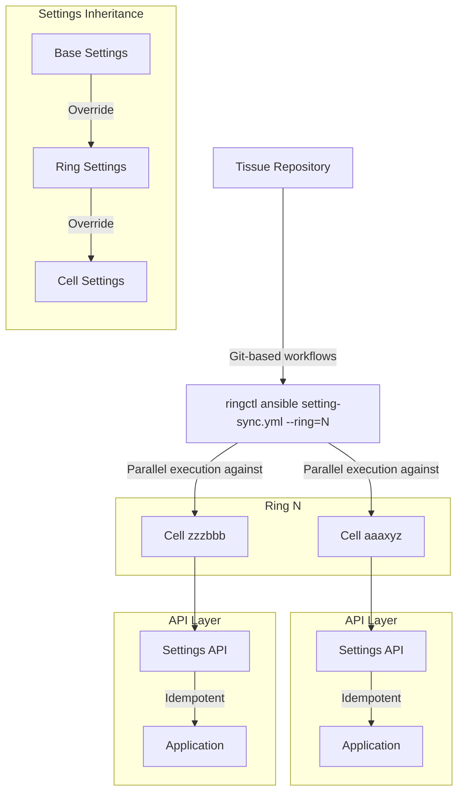

## Context

GitLab.com is transitioning from a monolithic architecture to a distributed deployment model with cells organized in rings. While the legacy monolith (Ring 0) has settings controlled via Helm charts, settings for cells in Ring 1+ require manual updates by SREs. This creates several challenges:

1. Operational overhead from manual configuration across cells
2. Risk of configuration drift between cells
3. No integration with the ring-based deployment model for settings
4. Inability to efficiently apply cell-specific customizations
5. Scalability concerns as we increase the number of cells and rings

We need an automated solution for synchronizing application settings across distributed cells that integrates with our existing ring-based deployment model while supporting both global consistency and local customizations.

## Decision

We will extend the existing `ringctl` tool with Ansible integration capabilities to synchronize application settings across cells. This approach will:

1. Use Go's goroutine-based concurrency for efficient parallel execution
2. Execute Ansible playbooks in local mode via API calls (avoiding SSH dependencies)
3. Implement a hierarchical settings structure with inheritance (base → ring → cell)
4. Use service account authentication for secure, non-PAT based access
5. Integrate with our existing CI/CD pipeline and ring deployment model

## Consequences

### Positive

- Eliminates manual configuration, reducing operational overhead and human error
- Enables progressive, ring-based deployment of settings changes
- Supports both global consistency and cell-specific customizations
- Leverages our existing tooling and deployment model
- Provides atomicity within rings (all cells in a ring updated concurrently)
- Scales efficiently as we increase the number of cells and rings

### Negative

- Requires development of new API endpoints for settings management
- Increases complexity of the `ringctl` tool
- Requires coordination between multiple teams (SRE, Backend, UI)
- May introduce new failure modes for settings deployment
- Needs secure credential management for service accounts

## Alternatives

1. Terraform: **Rejected** due to state file locking issues, complex workflow for application-level configuration, and lack of appropriate fit for managing dynamic application settings.
2. Pure Ansible via SSH: **Rejected** because it would require changes to cell provisioning to allow SSH access, introducing security concerns and deviating from our containerized deployment model.
3. Configuration Management Tools (Salt, Chef, Puppet): **Rejected** as they would require installing agents in cells or enabling SSH access, adding complexity and potential security concerns to our deployment.
4. Custom Tool: **Rejected** due to development overhead and duplication of existing functionality. Building a completely new tool would require significant effort and would not leverage our existing deployment mechanisms.
5. GitOps (ArgoCD/Flux): **Rejected** due to potential conflicts with Instrumentor, ringctl patching, and other design constraints of our current architecture.

## Implementation Proposal

### Architecture



### ringctl Extension

The implementation will add a new `ansible` command to `ringctl`:

```bash
ringctl ansible <playbook.yml> --ring=<ring_name> [options]
```

This will use Go's concurrency primitives to parallelize Ansible playbook execution against cells:

```go
// Simplified implementation
func runPlaybooksConcurrently(ctx context.Context, cells []cell.Cell,
    playbook string, extraVars map[string]string, concurrency int) []PlaybookResult {

    sem := semaphore.NewWeighted(int64(concurrency))
    var wg sync.WaitGroup
    resultsChan := make(chan PlaybookResult, len(cells))

    for _, cell := range cells {
        wg.Add(1)

        if err := sem.Acquire(ctx, 1); err != nil {
            resultsChan <- PlaybookResult{
                CellID: cell.ID,
                Error:  err,
            }
            wg.Done()
            continue
        }

        go func(c cell.Cell) {
            defer sem.Release(1)
            defer wg.Done()

            // Create cell-specific variables
            cellExtraVars := createCellVariables(c, extraVars)

            // Execute playbook locally using API calls
            args := []string{
                playbook,
                "--limit", "localhost",
                "--connection", "local",
                "--extra-vars", jsonString(cellExtraVars),
            }

            cmd := exec.CommandContext(ctx, "ansible-playbook", args...)
            output, err := cmd.CombinedOutput()

            resultsChan <- PlaybookResult{
                CellID:   c.ID,
                Output:   string(output),
                Error:    err,
                ExitCode: cmd.ProcessState.ExitCode(),
            }
        }(cell)
    }

    // Wait and collect results
    go func() {
        wg.Wait()
        close(resultsChan)
    }()

    var results []PlaybookResult
    for result := range resultsChan {
        results = append(results, result)
    }

    return results
}
```

### Settings Structure

Settings will use a hierarchical structure:

```bash
settings/
  all_cells.yml         # Base settings for all cells
  rings/
    ring1.yml           # Ring-specific overrides
    ring2.yml
  cells/
    cell_a.yml          # Cell-specific overrides
    cell_b.yml
```

### Required API Endpoints

The Backend team will need to develop:

1. `GET /api/v4/admin/<settings_endpoint>` - Retrieve current settings
2. `PUT /api/v4/admin/<settings_endpoint>` - Update settings (idempotent)

These endpoints must support proper authentication, validation, and return appropriate status codes.
