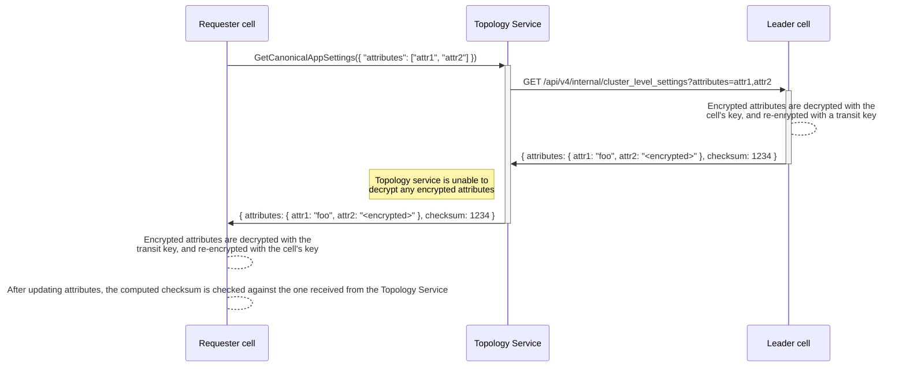
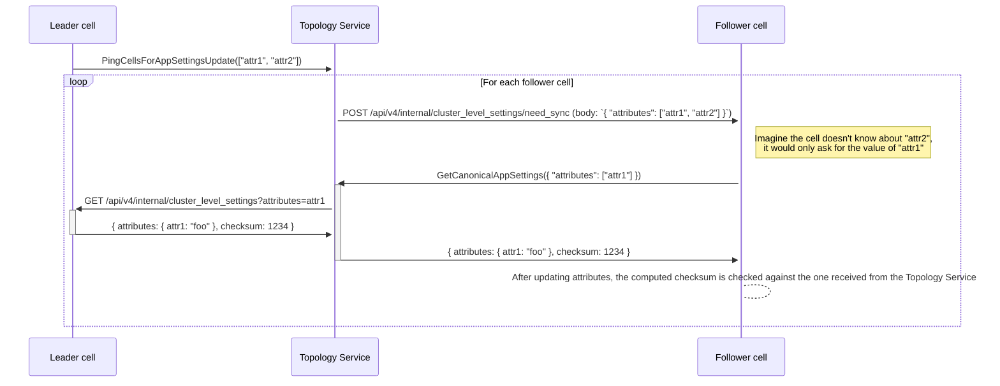

{}
This document is a work-in-progress and represents a very early state of the
Cells design. Significant aspects are not documented, though we expect to add
them in the future. This is one possible architecture for Cells, and we intend to
contrast this with alternatives before deciding which approach to implement.
This documentation will be kept even if we decide not to implement this so that
we can document the reasons for not choosing this approach.
{}

In our Cells architecture proposal we plan to share all admin related tables in GitLab.
This allows for simpler management of all Cells in one interface and reduces the risk of settings diverging in different Cells.
This introduces challenges with Admin Area pages that allow you to manage data that will be spread across all Cells.

## 1. Definition

There are consequences for Admin Area pages that contain data that span "the whole instance" as the Admin Area pages may be served by any Cell or possibly just one Cell.
There are already many parts of the Admin Area that will have data that span many Cells.
For example lists of all Groups, Projects, Topics, Jobs, Analytics, Applications and more.
There are also administrative monitoring capabilities in the Admin Area that will span many Cells such as the "Background Jobs" and "Background migrations" pages.

## 2. Data flow

## 3. Proposal

We will need to decide how to handle these exceptions with a few possible
options:

1. Move all these pages out into a dedicated per-Cell admin section. Probably
   the URL will need to be routable to a single Cell like `/cells/<cell_id>/admin`,
   then we can display these data per Cell. These pages will be distinct from
   other Admin Area pages which control settings that are shared across all Cells. We
   will also need to consider how this impacts self-managed customers and
   whether, or not, this should be visible for single-Cell instances of GitLab.
1. Build some aggregation interfaces for this data so that it can be fetched
   from all Cells and presented in a single UI. This may be beneficial to an
   administrator that needs to see and filter all data at a glance, especially
   when they don't know which Cell the data is on. The downside, however, is
   that building this kind of aggregation is very tricky when all Cells are
   designed to be totally independent, and it does also enforce stricter
   requirements on compatibility between Cells.

The following overview describes at what level each feature contained in the current Admin Area will be managed:

| Feature | Cluster | Cell | Organization |
| --- | --- | --- | --- |
| Abuse reports | ✓ | | |
| Analytics | | ✓ | |
| Applications | | ✓ | |
| Deploy keys | | ✓ | |
| Labels | | ✓ | |
| Broadcast messages | ✓ | | |
| Monitoring | | ✓ | |
| Subscription | ✓ | | |
| System hooks | | ✓ | |
| Overview | ✓ | ✓ | |
| Settings - General (1) | ✓ | ✓ | |
| Settings - Roles and permissions | | ✓ | |
| Settings - Search (1) | | ✓ | |
| Settings - Integrations (1) | ✓ | ✓ | |
| Settings - Repository (1) | ✓ | ✓ | |
| Settings - CI/CD (1) | ✓ | ✓ | |
| Settings - Security and compliance | | ✓ | |
| Settings - Analytics | | ✓ | |
| Settings - Reporting | ✓ | | |
| Settings - Templates | | ✓ | |
| Settings - Metrics (1) | ✓ | ✓ | |
| Settings - Service usage data | | ✓ | |
| Settings - Network (1) | ✓ | ✓ | |
| Settings - Appearance | ✓ | | |
| Settings - Preferences (1) | ✓ | ✓ | |

(1) Depending on the specific setting, some will be managed at the cluster-level, and some at the Cell-level.
The work to determine this is tracked at https://gitlab.com/gitlab-org/gitlab/-/issues/451957.

### 3.1. Abuse reports

Abuse reports should be cluster-level data as we want bad actors to be flagged globally on all cells.

### 3.2. Analytics

Analytics are cell-level data, but we could also have cluster-level analytics on the leader cell at some point (definitely not Cell 1.0).

Pages:

- DevOps Reports
- Usage trends

### 3.3. Applications

Applications are cell-level data.

### 3.4. Deploy keys

Deploy keys are cell-level data.

### 3.5. Labels

Labels are cell-level data.

### 3.6. Broadcast messages

Broadcast messages should be cluster-level data as we want to notify all users on all cells.

### 3.7. Monitoring

Monitoring are cell-level data.

Pages:

- System information
- Background migrations
- Background jobs
- Health check
- Audit events

### 3.8. Subscription

Subscription is global for a GitLab instance, so it's cluster-level data.

### 3.9 System hooks

System hooks are cell-level data.

### 3.10. Overview

Overview is cell-level data, but we could also have a cluster-level overview on the leader cell at some point (definitely not Cell 1.0).

Pages:

- Dashboard
- Organizations
- Projects
- Users
- Groups
- Topics
- Gitaly servers

### 3.11. Settings (`ApplicationSetting` model)

All `ApplicationSetting` attributes have a definition file under https://gitlab.com/gitlab-org/gitlab/-/tree/master/config/application_setting_columns
where the `clusterwide` key defines if the attribute is cluster-level or not. The definition files are consolidated and exposed in
[a dedicated documentation page](https://docs.gitlab.com/ee/development/cells/application_settings_analysis.html).

A solution will be implemented to synchronize cluster-level attributes from the leader cell to follower cells upon update of such cluster-level attributes.
See the [Implementation](#implementation) section below for the details.

#### Admin UI

##### Case 1: non-cell setup or single-cell setup

No change to the Admin UI as cluster-level is equal to cell-level in this setup (since no synchronisation between cells is needed).
In other words, the single-cell is the leader cell so it's possible to edit application settings, and no synchronisation is needed.

##### Case 2: multi-cell setup

**On the leader cell:**

- Show a `cluster-level` / `cell-level` badge next to each setting with a note explaining that sync will happen in the case of a cluster-level setting
- Upon update, if any cluster-level settings were changed, schedule a job that would send a request to the Topology service (see ["Upon attribute update on the leader cell"](#callback-process-upon-settings-update) for details)

Note: It means that an admin who wants to edit a cluster-level setting would need to navigate to the leader cell, which is something that is only possible through
[modifying the session prefix manually](https://gitlab.com/gitlab-org/cells/http-router/-/issues/20#note_2139392832) today.
In the future, we might add a way to navigate to a given cell through the UI.

**On follower cells:**

- Hide cluster-level settings and prevent update of any cluster-level settings on the backend. Show a note explaining that cluster-level settings can only be edited on the leader cell.
- Ideally, updates would also be prevented at the database level. This isn't mandatory, given that sync would happen regularly, ensuring eventual consistency.
- Upon update, no synchronisation is needed since only cell-level settings can be changed in this case
- In the future, cell-level settings could have an additional button to revert back to the leader cell setting value for this particular setting.

#### Synchronisation of cluster-level attributes

Investigation issue: https://gitlab.com/gitlab-org/gitlab/-/issues/451136

##### Data-pulling process

1. [In requester cell] Process is aborted if the last sync timestamp (stored in Redis) is present and it's fresh enough (e.g. < 1 hour)
1. [In requester cell] Sends a `GetCanonicalAppSettings({ "attributes": ["attr1", "attr2"] })` request to the [Topology Service](../../topology_service.md) to get canonical cluster-level attributes values
   - The request includes the list of attributes known by the cell. This allows each cell to be have different attributes, and removes any coupling between the leader cell database schema and the follower cells' one.
     This could happen if a follower cell is deployed with a schema change before the leader cell (or vice-versa). See [Schema change / cluster-level change use-cases](#schema-change--cluster-level-change-use-cases) below for more details.
1. [In Topology Service] If the requester cell is the leader cell, the process ends here since the leader cell already has the canonical cluster-level attributes values
1. [In Topology Service] Sends a `GET /api/v4/internal/cluster_level_settings?attributes=attr1,attr2` request to the leader cell to get the requested cluster-level attributes
1. [In leader cell] Sends the requested cluster-level attributes to the Topology Service
   - Encrypted attributes are sent encrypted ([see below for the handling of encrypted attributes](#special-case-of-encrypted-attributes))
   - The response includes a `checksum` of the JSON data (i.e. `Zlib.crc32(attributes.to_json)`). For encrypted attributes, the decrypted value is used in the checksum.
1. [In Topology Service] Forwards the API response from the leader cell to the requester cell
1. [In requester cell] Update its attributes based on the received data
   - After updating attributes, the computed checksum is checked against the one received from the Topology Service.
1. [In requester cell] The last sync timestamp is updated



This process would happen:

- At cell boot time, through a new Rails initializer at `config/initializers/2_application_settings.rb`.
- Periodically (to ensure no settings have drifted) on all cells, through a CRON-based background job. The periodicity is to be define, but every hour should be sufficient.

##### Callback process upon settings update

When a cell updates one ore many cluster-level attributes at once, a background job is started that:

1. [In leader cell] Sends a `PingCellsForAppSettingsUpdate(["attr1", "attr2"])` request to the Topology Service
   - The request includes the list of the updated attributes.
1. [In Topology Service] Sends a `POST /api/v4/internal/cluster_level_settings/need_sync` request with body `{ "attributes": ["attr1", "attr2"] }` to each follower cell
1. [In follower cell] If any of the updated attributes are know to the cell, a background job is started to perform the same actions as the one described above for boot time synchronisation



##### Special case of encrypted attributes

Encrypted attributes will need to be encrypted with a transit key that's shared by all cells (leader and followers).

Process on the leader cell:

1. Upon `GET /api/v4/internal/cluster_level_settings?attributes=attr1,attr2` requests, each encrypted attribute is decrypted and re-encrypted with the `db_key_transit` transit key
   - Encrypted attributes are sent encrypted, so that the Topology Service is unable to see the decrypted value of encrypted attributes (since it doesn't have access to the `db_key_transit` transit key)
   - The decrypted value is used to compute the `checksum` key of the response
1. Then the leader cell sends the relevant cluster-level attributes to the Topology Service

Process on follower cells:

1. When receiving attributes from the Topology Service, each encrypted attribute is decrypted with the `db_key_transit`, and automatically encrypted with the current cell encryption key
   when the attribute is assigned, thanks to [the encrypted attributes implementation](https://gitlab.com/groups/gitlab-org/-/epics/15226).
1. Attributes are then committed in the current cell's local database, after the `checksum` has been verified against decrypted (if applicable) values of attributes

##### Schema change / cluster-level change use-cases

By passing the list of cluster-level attributes a cell knows about to the `GetCanonicalAppSettings({ "attributes": ["attr1", "attr2"] })` request,
we handle all the following cases:

1. Added / removed cluster-level attribute:
   1. A cluster-level attribute is added to the leader cell, but not yet to the follower cells:
      - Follower cells wouldn't ask for the attribute so the leader cell wouldn't send it in the sync response.
      - Follower cells would ask for it as soon as the change is deployed to them.
   1. A cluster-level attribute is added to a follower cell, but not yet to the leader cell:
      - Follower cells would ask for the attribute in the sync request, but the leader would ignore it.
      - Leader cell would send it as soon as the change is deployed to it.
   1. A cluster-level attribute is removed from the leader cell, but not yet from the follower cells:
      - Follower cells would ask for the attribute in the sync request, but the leader would ignore it.
      - Follower cells would stop asking for it as soon as the change is deployed to them.
   1. A cluster-level attribute is removed from a follower cell, but not yet from the leader cell:
      - Follower cells wouldn't ask for the attribute so the leader cell wouldn't send it in the sync response.
      - No change when the change is deployed to the leader cell since the leader cell only sends requested attributes.
1. Change in cluster-level / cell-level status of an attribute:
   1. A cell-level attribute is changed to be cluster-level in the leader cell, but not yet in the follower cells (**same as 1.1**):
      - Follower cells wouldn't ask for the attribute so the leader cell wouldn't send it in the sync response.
      - Follower cells would ask for it as soon as the change is deployed to them.
   1. A cell-level attribute is changed to be cluster-level in the follower cells, but not yet in the leader cell (**same as 1.2**):
      - Follower cells would ask for the attribute in the sync request, but the leader would ignore it.
      - Leader cell would send it as soon as the change is deployed to it.
   1. A cluster-level attribute is changed to be cell-level in the leader cell, but not yet in the follower cells (**same as 1.3**):
      - Follower cells would ask for the attribute in the sync request, but the leader would ignore it.
      - Follower cells would stop asking for it as soon as the change is deployed to them.
   1. A cluster-level attribute is changed to be cell-level in the follower cells, but not yet in the leader cell (**same as 1.4**):
      - Follower cells wouldn't ask for the attribute so the leader cell wouldn't send it in the sync response.
      - No change when the change is deployed to the leader cell since the leader cell only sends requested attributes.

##### Authentication of `Topology Service -> Cell` and `Cell -> Topology Service` requests

[We will rely on Mutual TLS introduced in Phase 5.1](https://gitlab.com/groups/gitlab-org/-/epics/15680).

##### Implementation

Extend Topology Service with `MetadataService` to allow a Cell to publish information in a structured form (protobuf) to the Topology Service.

The interface would be as follows:

```proto
syntax = "proto3";
package gitlab.cells.topology_service;

import "google/api/annotations.proto";
import "proto/cell_info.proto";

option go_package = "../proto";

message GetCanonicalAppSettingsRequest {
  int64 from_cell_id = 1;
  repeated string attributes = 2;
}

message GetCanonicalAppSettingsResponse {
  string attributes = 1;
  int64 checksum = 2;
}

message PingCellsForAppSettingsUpdateRequest {
}

message PingCellsForAppSettingsUpdateResponse {
}

service SyncService {
  // Called from any cell.
  // -> Asks for canonical cluster-level application_settings from the leader cell
  // <- Returns canonical cluster-level application_settings from the leader cell
  rpc GetCanonicalAppSettings(GetCanonicalAppSettingsRequest) returns (GetCanonicalAppSettingsResponse) {
    option (google.api.http) = {
      get: "/v1/app_settings"
    };
  }

  // Called from the leader cell.
  // -> Tell follower cells to call GetCanonicalAppSettings for the given attributes
  // <- Returns success of pings
  rpc PingCellsForAppSettingsUpdate(PingCellsForAppSettingsUpdateRequest) returns (PingCellsForAppSettingsUpdateResponse) {}
}
```

## 4. Evaluation

## 4.1. Pros

- No changes required in a non-cell setup
- Synchronization is both pull (from follower cells) and push (from leader cell)
- Clear protocol with `protobuf`
- Minimal changes to the Admin UI: hide cluster-level attributes on non-leader cells, and show cluster-level/cell-level badges on leader cell

## 4.2. Cons

- No database-level replication (impossible since we need to decrypt/re-encrypt data between cells)
- Impossible to change cluster-level attributes on non-leader cell
