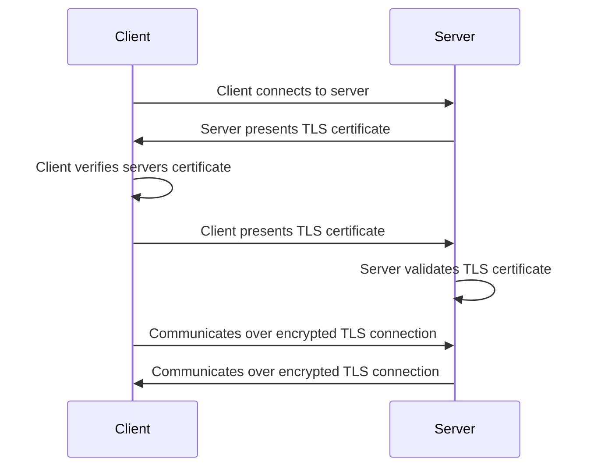

## Pre-Reads

- [Internal TLS](https://gitlab-com.gitlab.io/gl-infra/gitlab-dedicated/team/architecture/blueprints/internal_tls.html)

## Summary

We require that all communication between Cell services is secure and both parties identities are verified.

## Goals

- Ensure all communication between Cell services is secure with verified identities on both sides.
- Leverage existing Internal TLS infrastructure for consistent implementation.
- Provide a clear implementation path for both server and client services.
- Enable secure service-to-service authentication without introducing unnecessary complexity.
- Support authorization based on mTLS certificates where appropriate.

### Scope

This document focuses specifically on implementing mutual TLS (mTLS) authentication between Cell and it's services.

### Out of Scope

- Implementation of a service mesh (e.g., Istio) for encrypting traffic via mTLS is out of scope for the following reasons:
  - We already leverage mTLS inside a cell using [Internal TLS](https://gitlab-com.gitlab.io/gl-infra/gitlab-dedicated/team/architecture/blueprints/internal_tls.html), so extending this existing blueprint to support external services is more consistent with our architecture.
  - While service mesh provides a transparent way for application developers to implement mTLS with external services, this approach introduces security risks. If a vulnerability exists, attackers could exploit it to use the client as a proxy to send unauthorized requests to the mTLS server.
- While mTLS is used to secure communications between CDNs/load balancers and their backends, as well as between internal services, this scope explicitly excludes:
  - Communication from external clients to GitLab services.
  - Communication between services inside a cell and those outside a cell.

### Implementation Principles

- **Developer Experience:** mTLS implementation should be transparent to developers with minimal code changes.
- **Security:** Only authorized services should be able to communicate with one another.
- **High Availability:** Certificate rotation must occur automatically without service interruption.
- **Scalability:** Solution must work for all Cell services.

## Requirements

| Requirement                            | Description                                                                                     | Priority |
| ---------------------------------------| ------------------------------------------------------------------------------------------------| -------- |
| Security                               | Only authorized services can communicate with one another                                       | high     |
| High availability                      | Certificates can be rotated automatically without service interruption                          | high     |
| Cells support                          | Can be used for all cells services                                                              | high     |
| Authorization support                  | Application Developers can use mTLS for authorization                                           | high     |
| Provision certificates within seconds  | We can create a new certificate in seconds                                                      | high     |
| Multiple Protocol support              | Support HTTP/1.1, HTTP/2, gRPC                                                                  | high     |
| Internal Traffic                       | All traffic between client and server services must remain within the cloud provider's network  | high     |
| Gradual Adoption                       | First allow traffic without a certificate to be accepted                                        | med      |
| Auditable                              | Can validate all services are using secure authentication via mTLS                              | med      |
| Cloud-managed                          | Can be integrated with cloud services                                                           | med      |

## Non-Goals

- mTLS should not be considered for managing user level authorization

## Design and implementation details

### mTLS Architecture

### mTLS Implementation Flow

From the [Internal TLS Blueprint](https://gitlab-com.gitlab.io/gl-infra/gitlab-dedicated/team/architecture/blueprints/internal_tls.html#end-entity-certificates), we obtain end-entity client certificates from GCP Secrets Manager for the GKE cluster.

#### Server/Producer Configuration

The external service host requires these changes:

- Deploy the service behind an [Internal Load Balancer](https://cloud.google.com/load-balancing/docs/l7-internal) to ensure the service is not publicly accessible
- Configure [mTLS Client Authentication on the Load Balancer](https://cloud.google.com/load-balancing/docs/mtls#validation-steps)
  - Upload the Private Root CA Certificate to the [Trust Config to enforce authenticated access only](https://cloud.google.com/load-balancing/docs/mtls#architecture)
- Configure Private Service Connect (PSC) with the Load Balancer as a backend
- Grant access permissions to client projects for connecting to the PSC endpoint

#### Client/Consumer Configuration

The service consuming the external API requires these changes:

- Connect to the PSC endpoint using the VPC where the client service is deployed
- Mount the certificate/key pair in the client application
- Update client code to establish mTLS connections through the PSC endpoint

The diagram below illustrates the complete request flow between a Pod in a Cell and an external service, including the supporting infrastructure:

[`source`](https://lucid.app/lucidchart/d2aff2f6-639b-44f2-a06b-6fbed225d254/edit?viewport_loc=-290%2C-378%2C5311%2C2450%2C0_0&invitationId=inv_21038e17-917c-40a7-a423-c563ee0db347)

For detailed implementation examples and proof-of-concept documentation of this architecture, refer to: https://gitlab.com/gitlab-org/gitlab/-/issues/468640.

## Supported clients & servers

| Client | Server |
| ------ | ------ |
|GitLab|Topology Service|
