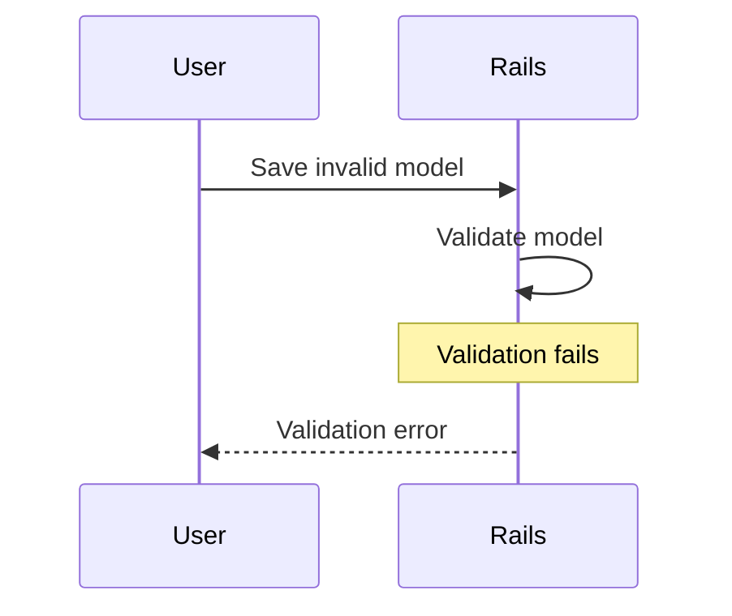
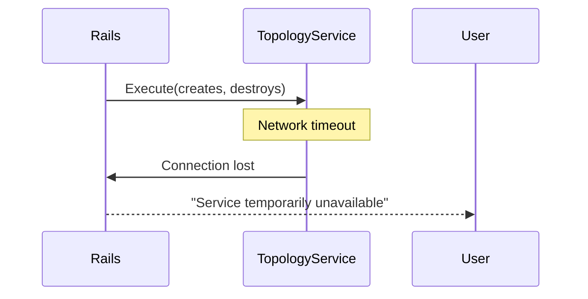
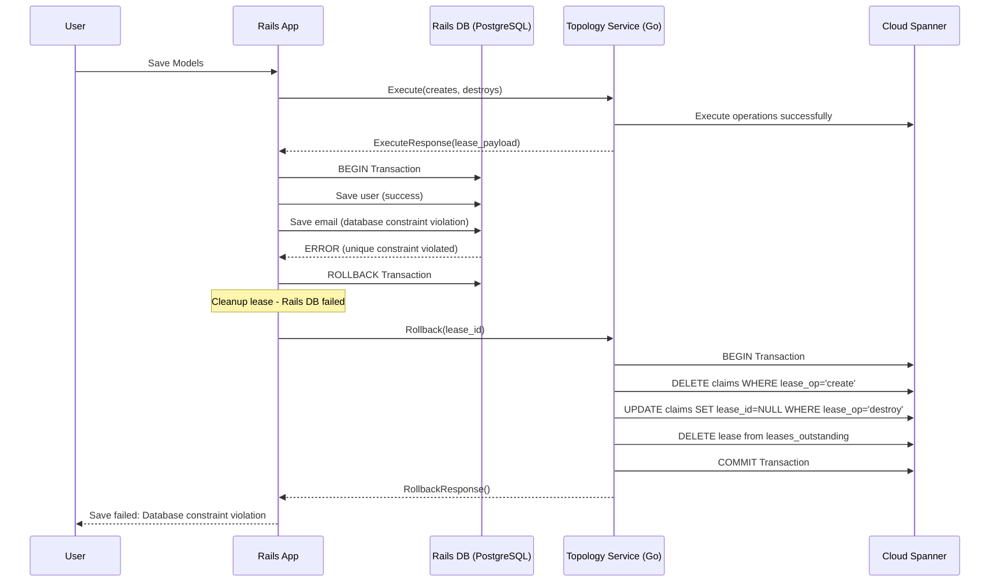
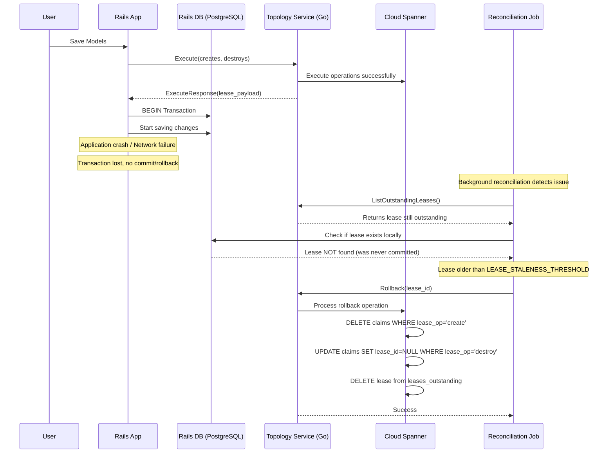
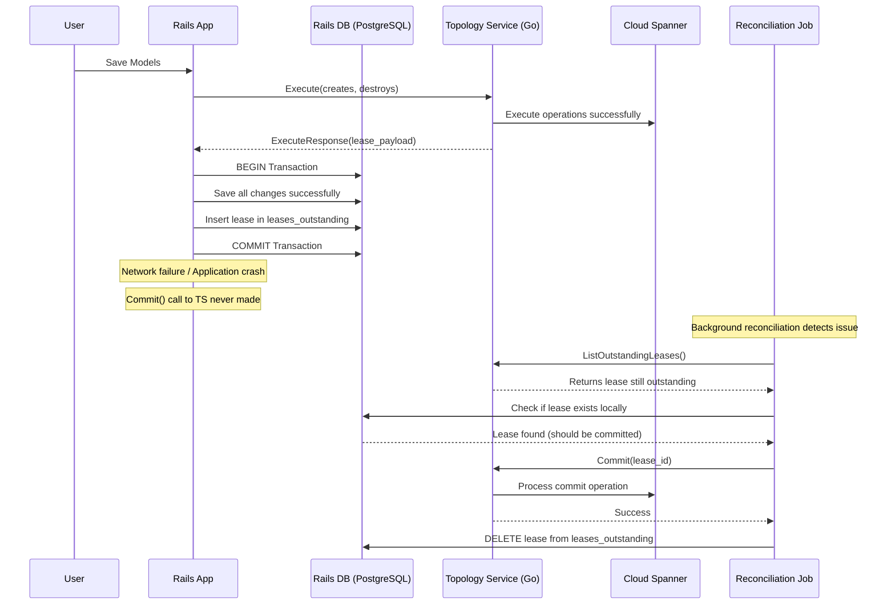
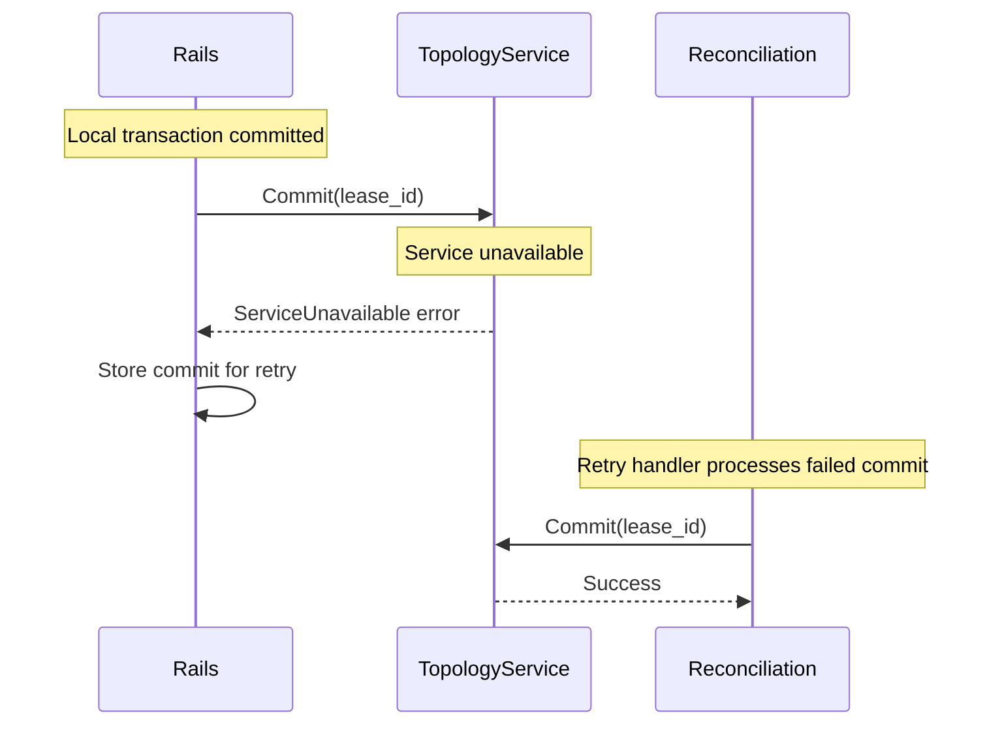
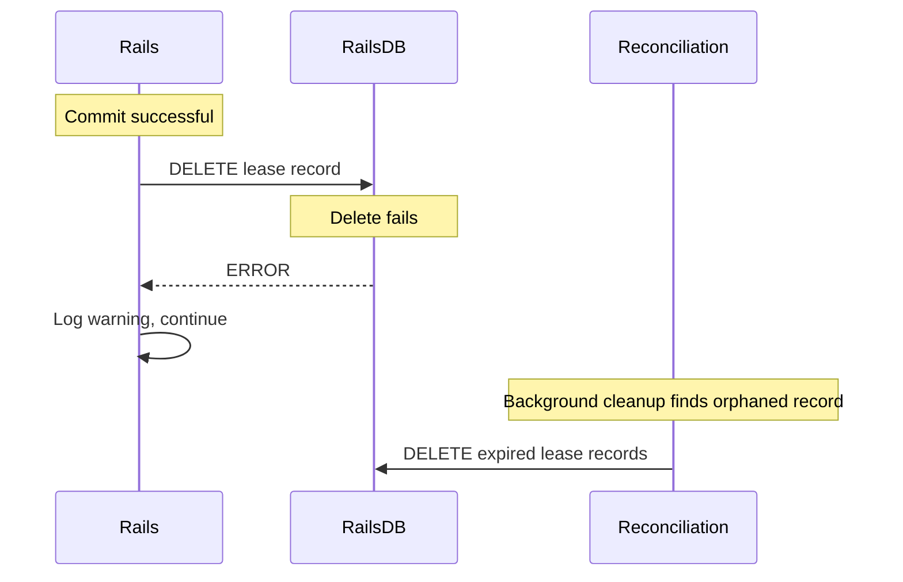

title: "Topology Service Transactional Behavior"
status: proposed
creation-date: "2025-07-02"
authors: [ "@ayufan" ]
toc_hide: true
---



This document outlines the design goals and architecture of Topology Service implementing transactional behavior for Claims Service.

## Essential Concepts

### **Distributed Lease-Based Coordination**
This system implements a **distributed lease-based coordination mechanism** for managing globally unique claims (usernames, emails, routes) across multiple GitLab cells. It ensures only one cell can "own" a particular claim at any given time, preventing conflicts in a distributed environment.

### **Core Behavioral Principles**

#### **1. Lease-First Coordination**
The system follows a "lease-first, commit-later" pattern:
- **Before** making any local changes, acquire a lease from the Topology Service
- **Only after** successful lease acquisition, proceed with local database operations
- **After** local success, commit the lease to make changes permanent
- **If anything fails**, rollback the lease to maintain consistency

#### **2. Atomic Batch Operations**
Multiple related models MUST be processed together:
- Collect all claim changes from multiple models
- Send a single batch request to Topology Service
- Process all local database changes in one transaction
- Commit or rollback all claims together

**Critical Constraint**: Creates and destroys must point to different claims within a single batch - a claim cannot be both created and destroyed in the same operation, as this creates modeling complexity in the Topology Service.

#### **3. Time-Bounded Leases**
Leases are time-bounded through the reconciliation process:
- Leases only have creation timestamps, no explicit expiration
- Reconciliation process determines staleness based on age (default 10 minutes threshold)
- Prevents indefinite locks if a cell crashes through background cleanup
- Background reconciliation ensures consistency

#### **4. Lease Exclusivity**
**Critical Rule**: Objects with active leases (`lease_id != NULL`) cannot be claimed by other operations:
- **Create Operations**: Will fail with primary key constraint if object already exists
- **Destroy Operations**: Will fail with conditional update if object has active lease
- **Temporal Lock**: Objects remain locked until lease expires or is committed/rolled back
- **Automatic Release**: Stale leases are cleaned up through reconciliation, making objects available again

#### **5. Ownership Security**
**Critical Security Constraint**: Only the cell that created a claim can destroy it:
- **Cell ID Verification**: All destroy operations require the requesting cell to match the claim's original creator
- **Prevents Interference**: Cells cannot destroy claims created by other cells
- **Security Isolation**: Malicious or buggy cells cannot disrupt other cells' data

## System Participants

### **Rails Client (User-Initiated)**
- **Primary Role**: Handles user actions that modify globally unique attributes
- **Responsibilities**:
  - Validates models locally before claiming
  - Collects all claims from multiple models into batch requests
  - Coordinates with Topology Service for lease acquisition
  - Manages local database transactions
  - Handles immediate commit/rollback after local operations

### **Background Reconciliation Processes**

#### **Expired Lease Cleanup**
- **Frequency**: Every minute
- **Operation**: Finds leases older than staleness threshold and removes them
- **Staleness Determination**: Based on lease creation time vs. current time (not explicit expiration)
- **Components**:
  - **Cloud Spanner Cleanup**: Deletes claims created by stale leases, clears lease_id from claims marked for destroy
  - **Rails DB Cleanup**: Removes stale local lease tracking records

#### **Lost Transaction Recovery**
- **Frequency**: Every 5-10 minutes
- **Operation**: Reconciles leases that exist in Topology Service but not in Rails (or vice versa)
- **Strategy**: Rails-driven cleanup with idempotent Topology Service operations
- **Process**: 
  - List outstanding leases from Topology Service with cursor-based pagination
  - Separate stale and active leases based on creation time and staleness threshold
  - Commit active leases that exist locally, rollback stale leases
  - Clean up orphaned local lease records

#### **Retry Handler**
- **Trigger**: Failed commit/rollback operations
- **Strategy**: Exponential backoff with jitter
- **Scope**: Handles network failures and temporary service unavailability

### **Topology Service**
- **Primary Role**: Centralized coordination service managing global claim state
- **Responsibilities**:
  - Enforces lease exclusivity through database constraints
  - Manages lease lifecycle (create, commit, rollback)
  - Provides atomic batch operations for multiple claims
  - Handles lease expiration and cleanup
  - Ensures only claim creators can destroy their claims

## Happy Path Workflow


### **Detailed Process Flow**

#### **Phase 1: Pre-Flight Claims Acquisition**
```
User saves models → Rails validates → Claims generated → Topology Service called
```

**What happens:**
1. **Model Validation**: Rails validates the model locally first
2. **Claim Generation**: For each changed unique attribute, generate create/destroy claims
3. **Batch Collection**: If multiple models are being saved, collect all claims together
4. **Topology Service Call**: Send `Execute()` request with all claims BEFORE local DB transaction

**Why this order:**
- **Fail Fast**: If claims conflict, fail before making any local changes
- **Atomicity**: Either all claims succeed or all fail
- **Efficiency**: Single network call for multiple models. Important due to long write latency on doing multi-region writes.

#### **Phase 2: Atomic Lease Creation in Cloud Spanner**
```
Execute() → Single transaction → Database constraints + lease exclusivity enforced
```

**What happens in Topology Service transaction:**
1. **Lease Record**: Insert into `leases_outstanding` with full payload
2. **Create Claims**: Insert new claims with `lease_op='create'` and the lease_id
   - Primary key constraint on (scope, scope_value) prevents duplicates
   - **Constraint**: Creates must reference claims that don't exist in the system
3. **Mark Destroys**: Update existing claims ONLY if `lease_id IS NULL` AND `cell_id` matches the requesting cell
   - Conditional update ensures no concurrent operations on same object AND only creator can destroy
   - **Constraint**: Destroys must reference claims that already exist and are owned by the requesting cell
4. **Batch Validation**: Creates and destroys within a single batch cannot reference the same claim (scope, scope_value) as this creates irreconcilable state transitions
5. **Lease Exclusivity**: Objects with `lease_id != NULL` cannot be claimed by other operations
6. **Atomic Success/Failure**: If any operation fails, entire transaction automatically rolls back

**Critical Lease Rule**: 
- **Only unlocked objects** (where `lease_id IS NULL`) can be claimed
- **Objects with active leases** are temporarily unavailable to other operations
- **This prevents concurrent modifications** and ensures operation isolation

**Why this approach:**
- **Exclusive Access**: Only one operation can work on an object at a time
- **Prevents Race Conditions**: Cannot claim objects already being modified
- **Temporal Isolation**: Leases provide time-bounded exclusive access
- **Database-Level Enforcement**: Constraints are faster and more reliable than application checks
- **No Explicit Conflict Checking**: Database constraints handle uniqueness automatically

#### **Phase 3: Local Database Transaction**
```
Lease acquired → Rails DB transaction → Save all models → Create lease record
```

**What happens in Rails:**
1. **Transaction Start**: Begin Rails database transaction
2. **Model Saves**: Save all the model changes that generated the claims
3. **Lease Tracking**: Create `leases_outstanding` record with lease_id and expiration
4. **Transaction Commit**: Commit all changes together

**Why after lease acquisition:**
- **Safety**: Local changes only happen after global coordination succeeds
- **Immediate Cleanup**: Lease record in Rails DB enables prompt cleanup after transaction completion
- **Rollback Capability**: If local DB fails, we have lease_id to clean up

#### **Phase 4: Lease Commitment**
```
Local success → Commit() → Finalize claims → Remove lease
```

**What happens in Topology Service:**
1. **Destroy Processing**: DELETE claims where lease_op='destroy' 
2. **Create Finalization**: UPDATE claims SET lease_id=NULL, lease_op='no-op' where lease_op='create'
3. **Lease Cleanup**: DELETE from leases_outstanding
4. **Rails Cleanup**: Rails deletes its leases_outstanding record

**Why this two-phase approach:**
- **Durability**: Creates become permanent, destroys are executed
- **Immediate Cleanup**: Leases are removed immediately after successful completion
- **Idempotency**: Commit can be retried safely - operations are idempotent

## Terminology by Participant

### **Rails Client**

#### **Local Schema**
```sql
-- Rails migration for leases_outstanding table (synchronized with Cloud Spanner)
-- This table only contains active leases - entries are deleted when consumed
CREATE TABLE leases_outstanding (
  lease_id STRING(36) NOT NULL UNIQUE,
  created_at TIMESTAMP NOT NULL,
  updated_at TIMESTAMP NOT NULL
);

-- Indexes for performance and operational queries
CREATE INDEX idx_leases_outstanding_created ON leases_outstanding(created_at);
```

#### **Model Definition**
```ruby
# Rails ActiveRecord concern for handling distributed claims
module CellsUniqueness
  extend ActiveSupport::Concern

  class_methods do
    def cell_cluster_unique_attributes(*attributes, sharding_key_object:, claim_type:, owner_type:)
      @cell_unique_config = {
        attributes: attributes,
        sharding_key_object: sharding_key_object,
        claim_type: claim_type,
        owner_type: owner_type
      }
    end
  end
end

# Example model implementation
class Route < ApplicationRecord
  include CellsUniqueness

  belongs_to :project, optional: true
  belongs_to :group, optional: true

  cell_cluster_unique_attributes :path, :name,
    sharding_key_object: -> { project || group },
    claim_type: Gitlab::Cells::ClaimType::Routes,
    owner_type: :project
end
```

#### **Operations**
- **Claim Generation**: Extract unique attributes from model changes into create/destroy claims
- **Batch Collection**: Aggregate claims from multiple models into single ExecuteRequest
- **Batch Validation**: Ensure creates and destroys within a batch reference different claims to avoid modeling conflicts
- **Lease Tracking**: Store lease_id locally for reconciliation and cleanup
- **Immediate Cleanup**: Remove lease records after successful commit/rollback
- **Error Handling**: Convert gRPC errors to Rails validation errors

### **Background Reconciliation**

#### **Rails-Driven Cleanup Process**
```ruby
# Rails-driven cleanup with idempotent Topology Service operations
class ClaimsLeaseReconciliationService
  LEASE_STALENESS_THRESHOLD = 10.minutes  # Consider lease stale if older than threshold
  
  def self.reconcile_outstanding_leases
    topology_service = Gitlab::Cells::TopologyServiceClient.new
    cursor = nil
    
    loop do
      # Get leases from Topology Service with cursor-based pagination
      response = topology_service.list_outstanding_leases(
        ListOutstandingLeasesRequest.new(
          cell_id: current_cell_id,
          cursor: cursor
        )
      )
      
      break if response.leases.empty?
      
      topology_leases = response.leases.map(&:lease_payload)
      
      # Separate stale and active leases based on creation time
      now = Time.current
      stale_leases = topology_leases.select { |lease| 
        lease.created_at.to_time < (now - LEASE_STALENESS_THRESHOLD) 
      }
      active_leases = topology_leases - stale_leases
      
      # Process active leases: commit if they exist locally
      active_lease_ids = active_leases.map(&:lease_id)
      local_active_leases = LeasesOutstanding.where(lease_id: active_lease_ids).pluck(:lease_id)
      
      local_active_leases.each do |lease_id|
        topology_service.commit(CommitRequest.new(cell_id: current_cell_id, lease_id: lease_id))
        LeasesOutstanding.find_by(lease_id: lease_id)&.destroy!
      end
      
      # Process stale leases: rollback all (idempotent)
      stale_leases.each do |lease|
        topology_service.rollback(RollbackRequest.new(cell_id: current_cell_id, lease_id: lease.lease_id))
        # Clean up any local record that might exist
        LeasesOutstanding.find_by(lease_id: lease.lease_id)&.destroy!
      end
      
      # Update cursor for next iteration
      cursor = response.next_cursor
      break if cursor.blank?  # No more pages
    end
    
    # Exception case: leases missing from TS but present locally
    stale_local_leases = LeasesOutstanding.where('created_at < ?', Time.current - LEASE_STALENESS_THRESHOLD)
    if stale_local_leases.exists?
      Rails.logger.error "Found #{stale_local_leases.count} stale local leases without TS counterparts"
      stale_local_leases.destroy_all
    end
  end
end
```

#### **Reconciliation Principles**
- **Primary Cleanup**: Rails is responsible for cleaning up outstanding leases
- **Cursor-Based Pagination**: Guarantees iteration through all leases without infinite loops
- **Idempotent Operations**: Topology Service Commit/Rollback operations are idempotent
- **Staleness-Based Cleanup**: Leases older than threshold are considered stale (local property)
- **Complete Processing**: Both stale and active leases are processed to ensure forward progress
- **Exception Handling**: Local leases without corresponding TS leases indicate system issues
- **Immediate Cleanup**: Leases are removed as soon as possible via Rails `after_commit`/`after_rollback` hooks

### **Topology Service**

#### **Cloud Spanner Schema**
```sql
-- Claims table with integrated lease tracking
CREATE TABLE claims (
  claim_id STRING(36) NOT NULL,                    -- UUID for internal tracking
  scope STRING(50) NOT NULL,                       -- Type of claim (ROUTES, EMAIL, USERNAME)
  scope_value STRING(255) NOT NULL,                -- The actual value being claimed
  owner_type STRING(50) NOT NULL,                  -- Type of owner (USER, PROJECT, GROUP)
  owner_value STRING(255) NOT NULL,                -- Owner identifier
  cell_id STRING(100) NOT NULL,                    -- Cell ID that created this claim
  lease_id STRING(36),                             -- NULL for committed claims, UUID for leased claims
  lease_op STRING(10) NOT NULL DEFAULT 'no-op',   -- 'no-op', 'create', 'destroy'
  created_at TIMESTAMP NOT NULL OPTIONS (allow_commit_timestamp=true),
  updated_at TIMESTAMP NOT NULL OPTIONS (allow_commit_timestamp=true),
) PRIMARY KEY (scope, scope_value);

-- CRITICAL CONSTRAINTS: 
-- 1. Objects with lease_id != NULL cannot be claimed by other operations
-- 2. Only the cell that created a claim (cell_id) can destroy it
-- These constraints prevent concurrent operations and unauthorized access

-- Outstanding leases table (mirrored with Rails for synchronization)
CREATE TABLE leases_outstanding (
  lease_id STRING(36) NOT NULL,                    -- UUID of the lease
  cell_id STRING(100) NOT NULL,                    -- Cell ID that owns the lease
  lease_payload BYTES(MAX) NOT NULL,               -- Serialized LeasePayload protobuf
  created_at TIMESTAMP NOT NULL OPTIONS (allow_commit_timestamp=true),
) PRIMARY KEY (lease_id);

-- Performance and operational indexes
CREATE INDEX idx_leases_outstanding_cell ON leases_outstanding(cell_id);
CREATE INDEX idx_leases_outstanding_created ON leases_outstanding(created_at);

CREATE INDEX idx_claims_cell ON claims(cell_id);
CREATE INDEX idx_claims_lease_id ON claims(lease_id) STORING (lease_op);
CREATE INDEX idx_claims_lease_op ON claims(lease_op) WHERE lease_op != 'no-op';
CREATE INDEX idx_claims_scope_lease ON claims(scope, lease_id) WHERE lease_id IS NOT NULL;
CREATE INDEX idx_claims_owner ON claims(owner_type, owner_value);
```

#### **Protobuf Definitions**
```protobuf
syntax = "proto3";

package gitlab.cells.claims.v1;

option go_package = "gitlab.com/gitlab-org/cells/claims/v1;claimsv1";

import "google/protobuf/timestamp.proto";

// Service definition for Topology Service Claims API
service ClaimsService {
  // Execute creates/destroys with lease - atomic operation
  rpc Execute(ExecuteRequest) returns (ExecuteResponse);
  
  // Commit finalizes the operations and removes lease
  rpc Commit(CommitRequest) returns (CommitResponse);
  
  // Rollback reverts the operations and removes lease
  rpc Rollback(RollbackRequest) returns (RollbackResponse);
  
  // List outstanding leases for a client (for reconciliation)
  rpc ListOutstandingLeases(ListOutstandingLeasesRequest) returns (ListOutstandingLeasesResponse);
}

// Core claim record definition
message ClaimRecord {
  enum Scope {
    UNSPECIFIED = 0;
    ROUTES = 1;
    USERNAME = 2;
    EMAIL = 3;
  }

  enum Owner {
    UNSPECIFIED = 0;
    GROUP = 1;
    PROJECT = 2;
    USER = 3;
  }

  Scope scope = 1;
  string scope_value = 2;  // The actual value being claimed (e.g., "john@example.com")
  Owner owner = 3;
  
  oneof owner_value {
    string str = 4;  // String owner ID
    int64 i64 = 5;   // Integer owner ID
  }
}

// Execute operation request - can include multiple creates and destroys
message ExecuteRequest {
  string cell_id = 1; // Cell ID requesting the lease
  repeated ClaimRecord creates = 2;   // Claims to create
  repeated ClaimRecord destroys = 3;  // Claims to destroy
}

// Lease payload stored in Cloud Spanner and returned to clients
message LeasePayload {
  string lease_id = 1; // UUID of the lease
  string cell_id = 2; // Cell ID that owns the lease
  google.protobuf.Timestamp created_at = 3;
  ExecuteRequest original_request = 4; // Complete original request for reconciliation
}

// Execute operation response
message ExecuteResponse {
  LeasePayload lease_payload = 1;
}

// Commit operation request
message CommitRequest {
  string cell_id = 1;
  string lease_id = 2;
}

// Commit operation response
message CommitResponse {
  // Empty response - success indicated by no gRPC error
}

// Rollback operation request
message RollbackRequest {
  string cell_id = 1;
  string lease_id = 2;
}

// Rollback operation response
message RollbackResponse {
  // Empty response - success indicated by no gRPC error
}

// List outstanding leases request
message ListOutstandingLeasesRequest {
  string cell_id = 1;
  string cursor = 2;  // Optional cursor for pagination
}

// Outstanding lease information
message OutstandingLease {
  LeasePayload lease_payload = 1;
}

// List outstanding leases response
message ListOutstandingLeasesResponse {
  repeated OutstandingLease leases = 1;
  string next_cursor = 2;  // Cursor for next page, empty if no more pages
}
```

#### **gRPC API Behaviors**
- **Execute()**: Atomically acquire leases for batch operations, enforce exclusivity constraints
  - **Validation**: Ensures creates and destroys reference different claims within the same batch
  - **Create Processing**: Inserts new claims that don't exist in the system
  - **Destroy Processing**: Updates existing claims owned by the requesting cell
- **Commit()**: Finalize claims (DELETE destroys, clear lease_id from creates) and remove leases
- **Rollback()**: Revert claims (DELETE creates, clear lease_id from destroys) and remove leases
- **ListOutstandingLeases()**: Retrieve leases for reconciliation with cursor-based pagination

## Unhappy Path Workflows

### **Failure Point 1: Pre-flight Validation Failure**

**Scenario**: Model validation fails before lease acquisition


**Recovery**: No recovery needed - no resources acquired, user sees validation error

---

### **Failure Point 2: Lease Acquisition Failure**

#### **Scenario 2A: Topology Service Conflict - Permanent Claim**


**Different conflict types:**
1. **Permanent Conflict**: Object permanently owned by another cell → "Already taken"
2. **Temporary Conflict**: Object temporarily leased by another operation → "Try again later"
3. **Batch Validation Conflict**: Creates and destroys reference same claim → "Invalid batch operation"

**Recovery**: No recovery needed - user sees appropriate error message

#### **Scenario 2B: Network Failure During Execute**


**Recovery**: No recovery needed - no lease acquired, safe to retry

---

### **Failure Point 3: Local Database Transaction Failure**

#### **Scenario 3A: Rails Database Constraint Violation**


**Recovery**: Automatic rollback of lease, user sees error

#### **Scenario 3B: Application Crash During Local Transaction**


**Recovery**: Background reconciliation rolls back orphaned lease

---

### **Failure Point 4: Lease Commitment Failure**

#### **Scenario 4A: Missing Commit After Successful Local Transaction**


**Recovery**: Background reconciliation commits the lease

#### **Scenario 4B: Topology Service Unavailable During Commit**


**Recovery**: Retry handler eventually commits the lease

---

### **Failure Point 5: Cleanup Failure**

#### **Scenario 5A: Failed to Delete Local Lease Record**


**Recovery**: Background reconciliation eventually removes stale records

## Advanced Behaviors

### **Lease Exclusivity and Concurrency Control**

```
Cell A: Execute(create email@example.com) → Lease acquired
Cell B: Execute(destroy email@example.com) → BLOCKED until Cell A commits/rollbacks
```

**Behavior**: Objects with active leases cannot be claimed:
- **Creates**: Will fail with primary key constraint if object exists (regardless of lease status)
- **Destroys**: Will fail with conditional update if object has `lease_id != NULL`
- **Temporal Lock**: Object remains locked until lease expires or is committed/rolled back
- **Automatic Release**: Expired leases are cleaned up, making objects available again

**Example scenarios:**
1. **Email change collision**: User changes email while admin tries to delete it → One succeeds, other waits
2. **Route transfer conflict**: Two operations try to move same route → Serialized execution
3. **Concurrent creation**: Two cells try to create same username → First wins, second fails permanently

### **Multi-Model Coordination**

```
User + Email + Route changes → Single batch Execute() → All-or-nothing semantics
```

**Example**: Creating user with email and route:
1. User model generates username claim
2. Email model generates email claim  
3. Route model generates path and name claims
4. All 4 claims sent in single Execute() call
5. All models saved in single Rails transaction
6. All claims committed together

**Why**: Business operations often span multiple models - atomic coordination required

## Performance Characteristics

### **Optimizations**

- **Batch Processing**: Multiple claims in single RPC call
- **Efficient Indexes**: Cloud Spanner indexes optimized for lease operations
- **Connection Pooling**: Reuse gRPC connections
- **Background Processing**: Async cleanup doesn't block user operations
- **Constraint-Based Conflicts**: Database handles uniqueness without application logic

### **Scalability**

- **Cell Independence**: Each cell operates independently until conflicts
- **Centralized Coordination**: Only conflicts require cross-cell communication  
- **Time-Bounded Locks**: Automatic cleanup prevents indefinite blocking through staleness detection
- **Horizontal Scaling**: Cloud Spanner scales with claim volume

## Why This Design Works

### **1. Exclusive Access Control**
- Objects can only be modified by one operation at a time
- Prevents data corruption from concurrent modifications
- Clear temporal boundaries for exclusive access

### **2. Graceful Concurrency Handling**
- Permanent conflicts (duplicates) fail immediately
- Temporary conflicts (leases) can be retried
- Users get appropriate feedback for different conflict types

### **3. Consistency Without Distributed Transactions**
- Uses leases instead of 2PC (Two-Phase Commit)
- Simpler failure modes than distributed transactions
- Time-bounded recovery from failures
- **No 2PC Required**: Each cell manages its own local state independently, with coordination only happening through the centralized Topology Service

### **4. Operational Simplicity**  
- Clear failure modes and recovery procedures
- Observable through standard metrics and logs
- Self-healing through Rails-driven cleanup with idempotent Topology Service operations
- **Immediate Cleanup**: Leases are removed as soon as possible - lingering leases indicate exceptions

### **5. Developer Ergonomics**
- Transparent integration with ActiveRecord
- Declarative configuration
- Familiar transaction semantics

### **6. Production Robustness**
- Handles network partitions gracefully
- Automatic recovery from cell crashes
- Comprehensive error handling and retry logic

## Open Questions and Considerations

### **Performance Considerations**
- **Batch Size Limits**: What's the maximum number of claims per batch to optimize performance vs. transaction size?
- **Lease Duration**: Rather than explicit expiration, should the staleness threshold be configurable per operation type?
- **Connection Pooling**: How many concurrent connections should Rails maintain to Topology Service, and how should they be distributed across cells?

### **Security Considerations**
- **Authentication**: How does Topology Service authenticate cells - mutual TLS, API keys, or JWT tokens?
- **Authorization**: Should there be additional authorization beyond cell_id matching for cross-cell operations?
- **Audit Trail**: Should all claim operations be logged for security auditing and compliance?
- **Rate Limiting**: Should there be per-cell rate limits to prevent abuse or runaway operations?

### **Operational Considerations**
- **Monitoring**: What metrics should be tracked - lease age, conflict rates, reconciliation frequency?
- **Alerting**: When should operators be notified - stale lease threshold, reconciliation failures, or high conflict rates?
- **Disaster Recovery**: How to handle Topology Service outages and ensure data consistency during recovery?

### **Edge Cases**
- **Clock Skew**: How does the system handle clock differences between cells and Cloud Spanner?
- **Lease Staleness Race**: What happens if a lease becomes stale during commit - should it be allowed or rejected?
- **Partial Batch Failures**: Should the system support partial success in batch operations, or maintain all-or-nothing semantics?
- **Concurrent Reconciliation**: How to handle multiple reconciliation processes running simultaneously?
- **Create/Destroy Conflicts**: How should the system handle requests that try to create and destroy the same claim in a single batch?

### **Future Enhancements**
- **Lease Renewal**: Should long-running operations be able to refresh leases to prevent staleness?
- **Lease Queuing**: Should there be a queue for waiting operations when leases conflict?
- **Lease Priorities**: Should certain operations (admin vs. user) have priority over others?

### **Testing Strategy**
- **Chaos Engineering**: How to test behavior under various failure scenarios - network partitions, service crashes, clock skew?
- **Load Testing**: What's the maximum throughput the system can handle under various conflict scenarios?
- **Consistency Testing**: How to verify consistency across all failure modes?
- **Integration Testing**: How to test the complete flow across Rails, Topology Service, and Cloud Spanner?

## Alternative Approaches to Consider

### **In-Transaction Claims Processing**
Execute claims within the Rails transaction rather than before it:

```
1. Local DB: BEGIN
2. Local DB: INSERT/UPDATE/DESTROY (local operations)
3. TS DB: Execute() => lease (~100ms)
4. Local DB: INSERT lease
5. Local DB: COMMIT
6. TS DB: Commit(lease)
```

**Considerations**:
- **Connection Pool Impact**: Would require strict 250ms timeout on TS Execute to prevent connection pool bottlenecks
- **Transaction Duration**: Extends every local database transaction by network round-trip time
- **Lock Contention**: Holds database locks and connections during network operations
- **Scalability Impact**: Could exhaust connection pools under high concurrency

**Trade-offs**:
- **Error handling**: Simpler error handling vs. resource contention and scalability concerns
- **Implementation**: Follows well current lazy evaluation approach in Rails allowing to properly capture
  all claims as they are saved to database significantly reducing development complexity.

### **Separate Leased Table with UUID Cross-Join**
Create a separate `leased` table that references claims by UUID:

```sql
CREATE TABLE leased (
  claim_id STRING(36) NOT NULL, -- References claims.claim_id
  lease_id STRING(36) NOT NULL,
  lease_op STRING(10) NOT NULL, -- 'create', 'destroy'
  client_id STRING(100) NOT NULL,
  created_at TIMESTAMP NOT NULL,
) PRIMARY KEY (claim_id);
```

**Benefits**:
- **Cleaner Separation**: Permanent ownership (claims) vs. temporary locking (leased)
- **Efficient Lease Queries**: Direct queries against leased table
- **Complex Lease Metadata**: Room for detailed lease analytics without cluttering claims table

**Considerations**:
- **JOIN Complexity**: Most queries require joins between claims and leased tables
- **Transaction Atomicity**: More complex to ensure referential integrity across tables
- **Race Conditions**: Higher risk of inconsistent state between table operations
- **Cloud Spanner Limitations**: No foreign key constraints, potential for orphaned records
- **Eventual Consistency**: Is it affecting the cross-join table?

**Trade-offs**: Better separation of concerns vs. increased transaction complexity and performance overhead

### **Two-Phase Commit (2PC)**
Use traditional distributed transactions across cells:

**Benefits**:
- **Proven Pattern**: Well-understood distributed transaction semantics
- **Strict Consistency**: Guaranteed atomicity across all participants

**Considerations**:
- **Overkill**: 2PC is needed when there are many writers to a single dataset. In the case of Topology Service
  there's no need for complex 2PC as Topology Service does contain a view of a Cell, and no other Cell needs to update
  and synchronize data belonging to another Cell.
- **Coordinator Failure**: Single point of failure that can block all participants
- **Performance Overhead**: Multiple network round-trips and blocking phases
- **Operational Complexity**: Requires distributed transaction coordinator management
- **Recovery Complexity**: Manual intervention often needed for failed transactions
