

This document outlines the design goals and architecture of Topology Service implementing transactional behavior for Claims Service.

## Overview

This system implements a **distributed lease-based coordination mechanism** for managing globally unique claims (like usernames, emails, routes) across multiple GitLab cells.
It ensures that only one cell can "own" a particular claim at any given time, preventing conflicts in a distributed environment.

## Core Behavioral Principles

### 1. **Lease-First Coordination**
The system follows a "lease-first, commit-later" pattern:
- **Before** making any local changes, acquire a lease from the central Topology Service
- **Only after** successful lease acquisition, proceed with local database operations
- **After** local success, commit the lease to make changes permanent
- **If anything fails**, rollback the lease to maintain consistency

### 2. **Atomic Batch Operations**
Multiple related models MUST be processed together:
- Collect all claim changes from multiple models
- Send a single batch request to Topology Service
- Process all local database changes in one transaction
- Commit or rollback all claims together

### 3. **Time-Bounded Leases**
All leases have expiration times (default 5 minutes):
- Prevents indefinite locks if a cell crashes
- Automatic cleanup of expired leases
- Background reconciliation ensures consistency

## Detailed Process Flow

### Phase 1: Pre-Flight Claims Acquisition

```
User saves models → Rails validates → Claims generated → Topology Service called
```

**What happens:**
1. **Model Validation**: Rails validates the model locally first
2. **Claim Generation**: For each changed unique attribute, generate create/destroy claims
3. **Batch Collection**: If multiple models are being saved, collect all claims together
4. **Topology Service Call**: Send `Execute()` request with all claims BEFORE local DB transaction

**Why this order:**
- **Fail Fast**: If claims conflict, fail before making any local changes
- **Atomicity**: Either all claims succeed or all fail
- **Efficiency**: Single network call for multiple models. Important due to long write latency on doing multi-region writes.

### Phase 2: Atomic Lease Creation in Cloud Spanner

```
Execute() → Single transaction → Database constraints + lease exclusivity enforced
```

**What happens in Cloud Spanner transaction:**
1. **Lease Record**: Insert into `leases_outstanding` with full payload
2. **Create Claims**: Insert new claims with `lease_op='create'` and the lease_id
   - Primary key constraint on (scope, scope_value) prevents duplicates
3. **Mark Destroys**: Update existing claims ONLY if `lease_id IS NULL`
   - Conditional update ensures no concurrent operations on same object
4. **Lease Exclusivity**: Objects with `lease_id != NULL` cannot be claimed by other operations
5. **Atomic Success/Failure**: If any operation fails, entire transaction automatically rolls back

**Critical Lease Rule**: 
- **Only unlocked objects** (where `lease_id IS NULL`) can be claimed
- **Objects with active leases** are temporarily unavailable to other operations
- **This prevents concurrent modifications** and ensures operation isolation

**Why this approach:**
- **Exclusive Access**: Only one operation can work on an object at a time
- **Prevents Race Conditions**: Cannot claim objects already being modified
- **Temporal Isolation**: Leases provide time-bounded exclusive access
- **Automatic Cleanup**: Expired leases automatically release objects

### Phase 3: Local Database Transaction

```
Lease acquired → Rails DB transaction → Save all models → Create lease record
```

**What happens in Rails:**
1. **Transaction Start**: Begin Rails database transaction
2. **Model Saves**: Save all the model changes that generated the claims
3. **Lease Tracking**: Create `leases_outstanding` record with lease_id and expiration
4. **Transaction Commit**: Commit all changes together

**Why after lease acquisition:**
- **Safety**: Local changes only happen after global coordination succeeds
- **Consistency**: Lease record in Rails DB matches Cloud Spanner state
- **Rollback Capability**: If local DB fails, we have lease_id to clean up

### Phase 4: Lease Commitment

```
Local success → Commit() → Finalize claims → Remove lease
```

**What happens in Cloud Spanner:**
1. **Destroy Processing**: DELETE claims where lease_op='destroy' 
2. **Create Finalization**: UPDATE claims SET lease_id=NULL, lease_op='no-op' where lease_op='create'
3. **Lease Cleanup**: DELETE from leases_outstanding
4. **Rails Cleanup**: Rails deletes its leases_outstanding record

**Why this two-phase approach:**
- **Durability**: Creates become permanent, destroys are executed
- **Clean State**: No lease artifacts remain after successful completion
- **Idempotency**: Commit can be retried safely

## Error Handling Behaviors

### Lease Conflict Detection (Phase 2 Failure)

```
Execute() → Attempt claim → Object has active lease → Transaction fails → Return error
```

**Behavior when object is already leased:**
- **Create Operations**: Primary key constraint prevents duplicate (scope, scope_value)
- **Destroy Operations**: Conditional update `WHERE lease_id IS NULL` fails if object is leased
- **Transaction Rollback**: Cloud Spanner automatically rolls back entire transaction
- **Error Response**: Rails receives specific error about lease conflict
- **User Experience**: "Object is temporarily locked - please try again"

**Different conflict types:**
1. **Permanent Conflict**: Object permanently owned by another cell → "Already taken"
2. **Temporary Conflict**: Object temporarily leased by another operation → "Try again later"

**Why lease exclusivity matters:**
- **Prevents corruption**: Two cells can't modify same object simultaneously  
- **Ensures atomicity**: Complex operations complete without interference
- **Provides isolation**: Operations don't see partial state from other operations

### Local Database Failure (Phase 3 Failure)

```
Local DB fails → Rollback() → Undo claims → Clean up lease
```

**Behavior**: If Rails DB constraint violation or other local error:
- Rails transaction rolls back
- Rollback() called to Topology Service
- Claims with lease_op='create' are deleted
- Claims with lease_op='destroy' have lease_id cleared
- Both Rails and Cloud Spanner lease records removed

**Why**: Maintain consistency - if local changes fail, global claims must be reverted

### Network Failures and Timeouts

**During Execute()**: Rails gets error, no local changes made, user sees error
**During Commit()**: Background job retries, or lease expires and gets cleaned up
**During Rollback()**: Background job retries, or lease expires and gets cleaned up

## Background Behaviors

### Lease Expiration Cleanup

```
Every minute → Find expired leases → Delete creates → Clear destroys → Remove leases
```

**Cloud Spanner Cleanup**:
- Finds leases where `expires_at <= NOW()`
- Deletes claims created by expired leases  
- Clears lease_id from claims marked for destroy
- Removes expired lease records

**Why**: Automatic recovery from crashed cells or network partitions

### Reconciliation Between Rails and Cloud Spanner

```
Periodically → Compare lease tables → Remove orphans → Log inconsistencies
```

**Rails Reconciliation**:
- Lists all Rails `leases_outstanding`
- Calls `ListOutstandingLeases()` to get Cloud Spanner state
- Removes Rails leases that don't exist in Cloud Spanner
- Queues retry jobs for stuck leases

**Why**: Handle edge cases where network failures cause inconsistency

## Advanced Behaviors

### Lease Exclusivity and Concurrency Control

```
Cell A: Execute(create email@example.com) → Lease acquired
Cell B: Execute(destroy email@example.com) → BLOCKED until Cell A commits/rollbacks
```

**Behavior**: Objects with active leases cannot be claimed:
- **Creates**: Will fail with primary key constraint if object exists (regardless of lease status)
- **Destroys**: Will fail with conditional update if object has `lease_id != NULL`
- **Temporal Lock**: Object remains locked until lease expires or is committed/rolled back
- **Automatic Release**: Expired leases are cleaned up, making objects available again

**Example scenarios:**
1. **Email change collision**: User changes email while admin tries to delete it → One succeeds, other waits
2. **Route transfer conflict**: Two operations try to move same route → Serialized execution
3. **Concurrent creation**: Two cells try to create same username → First wins, second fails permanently

### Multi-Model Coordination

```
User + Email + Route changes → Single batch Execute() → All-or-nothing semantics
```

**Example**: Creating user with email and route:
1. User model generates username claim
2. Email model generates email claim  
3. Route model generates path and name claims
4. All 4 claims sent in single Execute() call
5. All models saved in single Rails transaction
6. All claims committed together

**Why**: Business operations often span multiple models - atomic coordination required

### Ownership Transfers

```
Route.project_id change → Destroy old claim + Create new claim → Atomic transfer
```

**Example**: Moving route from Project A to Project B:
1. Generate destroy claim for route@projectA
2. Generate create claim for route@projectB  
3. Execute() both in single call
4. Update route.project_id in Rails
5. Commit() makes transfer permanent

**Why**: Ownership changes must be atomic to prevent conflicts or ownership gaps

## Performance Characteristics

### Optimizations

- **Batch Processing**: Multiple claims in single RPC call
- **Efficient Indexes**: Cloud Spanner indexes optimized for conflict detection
- **Connection Pooling**: Reuse gRPC connections
- **Background Processing**: Async cleanup doesn't block user operations

### Scalability

- **Cell Independence**: Each cell operates independently until conflicts
- **Centralized Coordination**: Only conflicts require cross-cell communication  
- **Time-Bounded Locks**: Automatic cleanup prevents indefinite blocking
- **Horizontal Scaling**: Cloud Spanner scales with claim volume

## Why This Design Works

### 1. **Consistency Without Distributed Transactions**
- Uses leases instead of 2PC (Two-Phase Commit)
- Simpler failure modes than distributed transactions
- Time-bounded recovery from failures

### 2. **Operational Simplicity**  
- Clear failure modes and recovery procedures
- Observable through standard metrics and logs
- Self-healing through background processes

### 3. **Developer Ergonomics**
- Transparent integration with ActiveRecord
- Declarative configuration
- Familiar transaction semantics

### 4. **Production Robustness**
- Handles network partitions gracefully
- Automatic recovery from cell crashes
- Comprehensive error handling and retry logic

This design provides strong consistency guarantees for global uniqueness while maintaining the operational characteristics needed for a large-scale distributed system like GitLab.

## Diagram

```mermaid
sequenceDiagram
    participant User
    participant Rails as Rails App
    participant RailsDB as Rails DB (PostgreSQL)
    participant TopologyService as Topology Service (Go)
    participant CloudSpanner as Cloud Spanner

    Note over User, CloudSpanner: Multi-Model Batch Operation - Happy Path

    User->>Rails: Save Multiple Models (User + Email + Route)
    Rails->>Rails: Validate all models
    Rails->>Rails: Collect claims from all models
    Rails->>Rails: Generate batch CreateOrDestroyRequest
    
    Note over Rails: BEFORE Rails DB Transaction
    Rails->>TopologyService: Execute(batched creates, destroys)
    
    TopologyService->>CloudSpanner: BEGIN Transaction
    TopologyService->>CloudSpanner: Insert lease in leases_outstanding
    TopologyService->>CloudSpanner: Insert claims with lease_id + lease_op='create'
    TopologyService->>CloudSpanner: Update destroy claims with lease_id + lease_op='destroy'
    Note over CloudSpanner: Unique constraints + lease checks enforce conflicts
    Note over CloudSpanner: - (scope, scope_value) must be unique for creates
    Note over CloudSpanner: - Objects with lease_id != NULL cannot be claimed
    CloudSpanner-->>TopologyService: Success OR Constraint/Lease violation
    TopologyService->>CloudSpanner: COMMIT Transaction
    
    TopologyService-->>Rails: ExecuteResponse(lease_payload)
    
    Note over Rails: START Rails DB Transaction
    Rails->>RailsDB: BEGIN Transaction
    Rails->>RailsDB: Save user changes
    Rails->>RailsDB: Save email changes
    Rails->>RailsDB: Save route changes
    Rails->>RailsDB: Insert lease in leases_outstanding
    Rails->>RailsDB: COMMIT Transaction
    
    Note over Rails: AFTER Rails DB Commit
    Rails->>TopologyService: Commit(lease_id)
    
    TopologyService->>CloudSpanner: BEGIN Transaction
    TopologyService->>CloudSpanner: Delete claims with lease_op='destroy'
    TopologyService->>CloudSpanner: Clear lease_id from claims with lease_op='create' (make permanent)
    TopologyService->>CloudSpanner: Delete lease from leases_outstanding
    TopologyService->>CloudSpanner: COMMIT Transaction
    
    TopologyService-->>Rails: CommitResponse()
    Rails->>RailsDB: Delete lease from leases_outstanding
    Rails-->>User: Success - All models saved atomically

    Note over User, CloudSpanner: Error Path: Topology Service Conflict

    User->>Rails: Save Model with conflicting claim
    Rails->>Rails: Validate model and generate claims
    Rails->>TopologyService: Execute(creates, destroys)
    
    TopologyService->>CloudSpanner: BEGIN Transaction
    TopologyService->>CloudSpanner: Insert lease in leases_outstanding  
    TopologyService->>CloudSpanner: Insert claims with lease_id + lease_op='create'
    TopologyService->>CloudSpanner: Update destroy claims with lease_id + lease_op='destroy'
    Note over CloudSpanner: Cannot claim - object has active lease (lease_id != NULL)
    CloudSpanner-->>TopologyService: ABORTED: Lease conflict or constraint violation
    TopologyService->>CloudSpanner: Transaction automatically rolled back
    
    TopologyService-->>Rails: gRPC Error (AlreadyExists: "Object already leased or claimed")
    Rails->>Rails: Add validation error to model
    Rails-->>User: Save failed: "Email is temporarily locked by another operation"

    Note over User, CloudSpanner: Error Path: Rails DB Failure After Lease Acquired

    User->>Rails: Save Models
    Rails->>TopologyService: Execute(creates, destroys)
    TopologyService->>CloudSpanner: Execute operations successfully
    TopologyService-->>Rails: ExecuteResponse(lease_payload)
    
    Rails->>RailsDB: BEGIN Transaction
    Rails->>RailsDB: Save user (success)
    Rails->>RailsDB: Save email (database constraint violation)
    RailsDB-->>Rails: ERROR (unique constraint violated)
    Rails->>RailsDB: ROLLBACK Transaction
    
    Note over Rails: Cleanup lease - Rails DB failed
    Rails->>TopologyService: Rollback(lease_id)
    
    TopologyService->>CloudSpanner: BEGIN Transaction
    TopologyService->>CloudSpanner: Delete claims with lease_op='create'
    TopologyService->>CloudSpanner: Clear lease_id from claims with lease_op='destroy'
    TopologyService->>CloudSpanner: Delete lease from leases_outstanding
    TopologyService->>CloudSpanner: COMMIT Transaction
    
    TopologyService-->>Rails: RollbackResponse()
    Rails-->>User: Save failed: Database constraint violation

    Note over User, CloudSpanner: Background Process: Lease Reconciliation

    Rails->>Rails: Background reconciliation job runs
    Rails->>RailsDB: Query all leases in leases_outstanding
    Rails->>TopologyService: ListOutstandingLeases(client_id)
    
    TopologyService->>CloudSpanner: Query leases_outstanding table
    CloudSpanner-->>TopologyService: Return active leases with payloads
    TopologyService-->>Rails: OutstandingLeases response
    
    Rails->>Rails: Compare Rails DB vs Cloud Spanner leases
    
    alt Lease exists in Rails but not Cloud Spanner
        Rails->>RailsDB: Delete orphaned lease from Rails DB
        Rails->>Rails: Log reconciliation action
    else Lease expired in both systems
        Rails->>Rails: Queue cleanup job
    else Lease consistent in both systems
        Rails->>Rails: No action needed
    end

    Note over User, CloudSpanner: Background Process: Auto-Expiration Cleanup

    CloudSpanner->>CloudSpanner: Background cleanup service runs
    CloudSpanner->>CloudSpanner: Find leases WHERE expires_at <= NOW()
    
    CloudSpanner->>CloudSpanner: BEGIN Transaction
    CloudSpanner->>CloudSpanner: DELETE claims WHERE lease_op='create' AND lease_id IN (expired)
    CloudSpanner->>CloudSpanner: UPDATE claims SET lease_id=NULL WHERE lease_op='destroy' AND lease_id IN (expired)
    CloudSpanner->>CloudSpanner: DELETE FROM leases_outstanding WHERE lease_id IN (expired)
    CloudSpanner->>CloudSpanner: COMMIT Transaction
    
    Note over CloudSpanner: Expired leases and associated claims cleaned up

    Note over User, CloudSpanner: Complex Business Operation Example

    User->>Rails: Transfer route ownership (Project A → Project B)
    Rails->>Rails: Route model detects project_id change
    Rails->>Rails: Generate destroy claim for old project, create claim for new project
    
    Rails->>TopologyService: Execute([destroy: route@projectA], [create: route@projectB])
    TopologyService->>CloudSpanner: Atomic lease creation for ownership transfer
    TopologyService-->>Rails: Lease acquired for transfer
    
    Rails->>RailsDB: Update route.project_id in transaction
    Rails->>TopologyService: Commit(lease_id)
    TopologyService->>CloudSpanner: Finalize ownership transfer atomically
    
    Rails-->>User: Route ownership transferred successfully
```



## Claims Service API

```protobuf
// Service definition for Topology Service Claims API
service ClaimsService {
  // Execute creates/destroys with lease
  rpc Execute(ExecuteRequest) returns (ExecuteResponse);
  
  // Commit finalizes the operations
  rpc Commit(CommitRequest) returns (CommitResponse);
  
  // Rollback reverts the operations
  rpc Rollback(RollbackRequest) returns (RollbackResponse);
  
  // List outstanding leases for a client
  rpc ListOutstandingLeases(ListOutstandingLeasesRequest) returns (ListOutstandingLeasesResponse);
}

// Core claim record definition
message ClaimRecord {
  enum Scope {
    UNSPECIFIED = 0;
    ROUTES = 1;
    USERNAME = 2;
    EMAIL = 3;
  }

  enum Owner {
    UNSPECIFIED = 0;
    GROUP = 1;
    PROJECT = 2;
    USER = 3;
  }

  Scope scope = 1;
  string scope_value = 2;
  Owner owner = 3;
  
  oneof owner_value {
    string str = 4;
    int64 i64 = 5;
  }
}

// Execute operation request
message ExecuteRequest {
  string client_id = 1; // Cell ID
  repeated ClaimRecord creates = 2;
  repeated ClaimRecord destroys = 3;
  
  // Optional custom lease duration (defaults to 5 minutes)
  google.protobuf.Timestamp lease_expires_at = 4;
}

// Lease payload stored in Cloud Spanner and returned to clients
message LeasePayload {
  string lease_id = 1; // UUID
  string client_id = 2;
  google.protobuf.Timestamp lease_expires_at = 3;
  google.protobuf.Timestamp created_at = 4;
  ExecuteRequest original_request = 5;
}

// Execute operation response
message ExecuteResponse {
  LeasePayload lease_payload = 1;
}

// Commit operation request
message CommitRequest {
  string client_id = 1;
  string lease_id = 2;
}

// Commit operation response
message CommitResponse {
  // Empty response - success indicated by no error
}

// Rollback operation request
message RollbackRequest {
  string client_id = 1;
  string lease_id = 2;
}

// Rollback operation response
message RollbackResponse {
  // Empty response - success indicated by no error
}

// List outstanding leases request
message ListOutstandingLeasesRequest {
  string client_id = 1;
}

// Outstanding lease information
message OutstandingLease {
  LeasePayload lease_payload = 1;
}

// List outstanding leases response
message ListOutstandingLeasesResponse {
  repeated OutstandingLease leases = 1;
}
```

## Rails Concern to claim attributes

```ruby
# Rails ActiveRecord concern for handling distributed claims
module CellsUniqueness
  extend ActiveSupport::Concern

  included do
    attr_accessor :pending_claims_batch
  end

  class_methods do
    def cell_cluster_unique_attributes(*attributes, sharding_key_object:, claim_type:, owner_type:)
      @cell_unique_config ||= {
        attributes: attributes,
        sharding_key_object: sharding_key_object,
        claim_type: claim_type,
        owner_type: owner_type
      }
    end
  end

  ...
end

# Example model implementations
class User < ApplicationRecord
  include CellsUniqueness

  has_many :emails, dependent: :destroy
  has_many :routes, dependent: :destroy

  cell_cluster_unique_attributes :username,
    sharding_key_object: -> { self },
    claim_type: Gitlab::Cells::ClaimType::Usernames,
    owner_type: :user

  private

  def user_id
    id
  end
end
```

## Rails DB Migrations

```ruby
# Rails migration for leases_outstanding table (synchronized with Cloud Spanner)
class CreateLeasesOutstanding < ActiveRecord::Migration[7.0]
  def change
    create_table :leases_outstanding do |t|
      t.string :lease_id, null: false, index: { unique: true }
      t.datetime :expires_at, null: false
      t.timestamps

      t.index [:expires_at]
      t.index :created_at
    end
  end
end
```

## Topology Service Cloud Spanner schema

```sql
-- Claims table with integrated lease tracking
CREATE TABLE claims (
  claim_id STRING(36) NOT NULL,
  scope STRING(50) NOT NULL,
  scope_value STRING(255) NOT NULL,
  owner_type STRING(50) NOT NULL,
  owner_value STRING(255) NOT NULL,
  client_id STRING(100) NOT NULL,
  lease_id STRING(36), -- NULL for committed claims, UUID for leased claims
  lease_op STRING(10) NOT NULL DEFAULT 'no-op', -- 'no-op', 'create', 'destroy'
  created_at TIMESTAMP NOT NULL OPTIONS (allow_commit_timestamp=true),
  updated_at TIMESTAMP NOT NULL OPTIONS (allow_commit_timestamp=true),
) PRIMARY KEY (scope, scope_value);

-- CRITICAL: Only one claim per (scope, scope_value) can exist
-- Objects with lease_id != NULL cannot be claimed by other operations
-- This prevents concurrent operations on the same object

-- Outstanding leases table (mirrored with Rails)
CREATE TABLE leases_outstanding (
  lease_id STRING(36) NOT NULL,
  client_id STRING(100) NOT NULL,
  expires_at TIMESTAMP NOT NULL,
  lease_payload BYTES(MAX) NOT NULL, -- Serialized LeasePayload protobuf
  created_at TIMESTAMP NOT NULL OPTIONS (allow_commit_timestamp=true),
) PRIMARY KEY (lease_id);

-- Performance indexes
CREATE INDEX idx_leases_outstanding_client ON leases_outstanding(client_id);
CREATE INDEX idx_leases_outstanding_expires ON leases_outstanding(expires_at);
CREATE INDEX idx_claims_client ON claims(client_id);
CREATE INDEX idx_claims_lease_id ON claims(lease_id) STORING (lease_op);
CREATE INDEX idx_claims_lease_op ON claims(lease_op) WHERE lease_op != 'no-op';
CREATE INDEX idx_claims_scope_lease ON claims(scope, lease_id) WHERE lease_id IS NOT NULL;
```
## Alternative Design: Separate Leased Table with UUID Cross-Join

An alternative approach would be to create a separate `leased` table that references claims by their UUID instead of adding `lease_id` and `lease_op` columns to the claims table:

```sql
CREATE TABLE leased (
  claim_id STRING(36) NOT NULL, -- References claims.claim_id
  lease_id STRING(36) NOT NULL,
  lease_op STRING(10) NOT NULL, -- 'create', 'destroy'
  client_id STRING(100) NOT NULL,
  created_at TIMESTAMP NOT NULL OPTIONS (allow_commit_timestamp=true),
) PRIMARY KEY (claim_id);
```

## Alternative Design: Separate Leased Table with UUID Cross-Join

An alternative approach would be to create a separate `leased` table that
references claims by their `UUID` instead of adding `lease_id` and `lease_op` columns to the claims table:

```sql
CREATE TABLE leased (
  claim_id STRING(36) NOT NULL, -- References claims.claim_id
  lease_id STRING(36) NOT NULL,
  lease_op STRING(10) NOT NULL, -- 'create', 'destroy'
  client_id STRING(100) NOT NULL,
  created_at TIMESTAMP NOT NULL OPTIONS (allow_commit_timestamp=true),
) PRIMARY KEY (claim_id);
```

In this approach, the primary key constraint on `claim_id` in the `leased` table would prevent double-leasing of the same claim object.
Operations would query `claims LEFT JOIN leased ON claims.claim_id = leased.claim_id` to determine lease status.
Create operations would insert into both `claims` and `leased` tables, while destroy operations would insert only into
`leased` (cross-referencing existing claims by UUID). An object would be considered unlocked if no corresponding record exists
in the `leased` table. This design provides cleaner separation between permanent ownership (claims table) and temporary locking
(leased table), makes lease queries more efficient since you can directly query the leased table, and allows for more complex
lease metadata without cluttering the main claims table. However, it requires JOIN operations for most queries and increases
transaction complexity. The current integrated approach was chosen for simplicity and single-table query performance,
but the separate leased table could be preferable for scenarios requiring detailed lease analytics or when lease metadata
becomes more complex.

### Feasibility to do it atomically in Cloud Spanner

Due to lack of triggers and complex constructs in Cloud Spanner this might not be feasible to follow a pattern to pre-built
transaction and send this as an atomic transaction to Cloud Spanner to execute.

