

This document outlines the design goals and architecture of Topology Service implementing transactional behavior for Claims Service.

## Overview

This system implements a **distributed lease-based coordination mechanism** for managing globally unique claims (like usernames, emails, routes) across multiple GitLab cells. It ensures that only one cell can "own" a particular claim at any given time, preventing conflicts in a distributed environment.

The system follows a **"Lease-Based Mutual Exclusion with Optimistic Concurrency Control"** protocol pattern, similar to solutions like Google Chubby, Kubernetes Leader Election, and Apache Kafka Controller Election, but optimized for GitLab's cellular architecture with multi-resource atomic batching capabilities.

## Core Behavioral Principles

### 1. **Lease-First Coordination**
The system follows a "lease-first, commit-later" pattern:
- **Before** making any local changes, acquire a lease from the central Topology Service
- **Only after** successful lease acquisition, proceed with local database operations
- **After** local success, commit the lease to make changes permanent
- **If anything fails**, rollback the lease to maintain consistency

### 2. **Atomic Batch Operations**
Multiple related models MUST be processed together:
- Collect all claim changes from multiple models
- Send a single batch request to Topology Service
- Process all local database changes in one transaction
- Commit or rollback all claims together

### 3. **Time-Bounded Leases**
All leases have expiration times (default 5 minutes):
- Prevents indefinite locks if a cell crashes
- Automatic cleanup of expired leases
- Background reconciliation ensures consistency

### 4. **Lease Exclusivity**
**Critical Rule**: Objects with active leases (`lease_id != NULL`) cannot be claimed by other operations:
- **Create Operations**: Will fail with primary key constraint if object already exists
- **Destroy Operations**: Will fail with conditional update if object has active lease
- **Temporal Lock**: Objects remain locked until lease expires or is committed/rolled back
- **Automatic Release**: Expired leases are cleaned up, making objects available again

## Detailed Process Flow

### Phase 1: Pre-Flight Claims Acquisition

```
User saves models → Rails validates → Claims generated → Topology Service called
```

**What happens:**
1. **Model Validation**: Rails validates the model locally first
2. **Claim Generation**: For each changed unique attribute, generate create/destroy claims
3. **Batch Collection**: If multiple models are being saved, collect all claims together
4. **Topology Service Call**: Send `Execute()` request with all claims BEFORE local DB transaction

**Why this order:**
- **Fail Fast**: If claims conflict, fail before making any local changes
- **Atomicity**: Either all claims succeed or all fail
- **Efficiency**: Single network call for multiple models. Important due to long write latency on doing multi-region writes.

### Phase 2: Atomic Lease Creation in Cloud Spanner

```
Execute() → Single transaction → Database constraints + lease exclusivity enforced
```

**What happens in Topology Service transaction:**
1. **Lease Record**: Insert into `leases_outstanding` with full payload
2. **Create Claims**: Insert new claims with `lease_op='create'` and the lease_id
   - Primary key constraint on (scope, scope_value) prevents duplicates
3. **Mark Destroys**: Update existing claims ONLY if `lease_id IS NULL` AND `cell_id` matches the requesting cell
   - Conditional update ensures no concurrent operations on same object AND only creator can destroy
4. **Lease Exclusivity**: Objects with `lease_id != NULL` cannot be claimed by other operations
5. **Atomic Success/Failure**: If any operation fails, entire transaction automatically rolls back

**Critical Lease Rule**: 
- **Only unlocked objects** (where `lease_id IS NULL`) can be claimed
- **Objects with active leases** are temporarily unavailable to other operations
- **This prevents concurrent modifications** and ensures operation isolation

**Why this approach:**
- **Exclusive Access**: Only one operation can work on an object at a time
- **Prevents Race Conditions**: Cannot claim objects already being modified
- **Temporal Isolation**: Leases provide time-bounded exclusive access
- **Database-Level Enforcement**: Constraints are faster and more reliable than application checks
- **No Explicit Conflict Checking**: Database constraints handle uniqueness automatically

### Phase 3: Local Database Transaction

```
Lease acquired → Rails DB transaction → Save all models → Create lease record
```

**What happens in Rails:**
1. **Transaction Start**: Begin Rails database transaction
2. **Model Saves**: Save all the model changes that generated the claims
3. **Lease Tracking**: Create `leases_outstanding` record with lease_id and expiration
4. **Transaction Commit**: Commit all changes together

**Why after lease acquisition:**
- **Safety**: Local changes only happen after global coordination succeeds
- **Consistency**: Lease record in Rails DB matches Cloud Spanner state
- **Rollback Capability**: If local DB fails, we have lease_id to clean up

### Phase 4: Lease Commitment

```
Local success → Commit() → Finalize claims → Remove lease
```

**What happens in Topology Service:**
1. **Destroy Processing**: DELETE claims where lease_op='destroy' 
2. **Create Finalization**: UPDATE claims SET lease_id=NULL, lease_op='no-op' where lease_op='create'
3. **Lease Cleanup**: DELETE from leases_outstanding
4. **Rails Cleanup**: Rails deletes its leases_outstanding record

**Why this two-phase approach:**
- **Durability**: Creates become permanent, destroys are executed
- **Clean State**: No lease artifacts remain after successful completion
- **Idempotency**: Commit can be retried safely

## Error Handling Behaviors

### Lease Conflict Detection (Phase 2 Failure)

```
Execute() → Attempt claim → Object has active lease → Transaction fails → Return error
```

**Behavior when object is already leased:**
- **Create Operations**: Primary key constraint prevents duplicate (scope, scope_value)
- **Destroy Operations**: Conditional update `WHERE lease_id IS NULL` fails if object is leased
- **Transaction Rollback**: Cloud Spanner automatically rolls back entire transaction
- **Error Response**: Rails receives specific error about lease conflict
- **User Experience**: Different messages for different conflict types

**Different conflict types:**
1. **Permanent Conflict**: Object permanently owned by another cell → "Already taken"
2. **Temporary Conflict**: Object temporarily leased by another operation → "Try again later"

**Why lease exclusivity matters:**
- **Prevents corruption**: Two cells can't modify same object simultaneously  
- **Ensures atomicity**: Complex operations complete without interference
- **Provides isolation**: Operations don't see partial state from other operations

### Local Database Failure (Phase 3 Failure)

```
Local DB fails → Rollback() → Undo claims → Clean up lease
```

**Behavior**: If Rails DB constraint violation or other local error:
- Rails transaction rolls back
- Rollback() called to Topology Service
- Claims with lease_op='create' are deleted
- Claims with lease_op='destroy' have lease_id cleared
- Both Rails and Cloud Spanner lease records removed

**Why**: Maintain consistency - if local changes fail, global claims must be reverted

### Network Failures and Timeouts

**During Execute()**: Rails gets error, no local changes made, user sees error
**During Commit()**: Background job retries, or lease expires and gets cleaned up
**During Rollback()**: Background job retries, or lease expires and gets cleaned up

## Background Behaviors

### Lease Expiration Cleanup

```
Every minute → Find expired leases → Delete creates → Clear destroys → Remove leases
```

**Cloud Spanner Cleanup**:
- Finds leases where `expires_at <= NOW()`
- Deletes claims created by expired leases  
- Clears lease_id from claims marked for destroy
- Removes expired lease records

**Why**: Automatic recovery from crashed cells or network partitions

### Reconciliation Between Rails and Cloud Spanner

```
Periodically → Compare lease tables → Remove orphans → Log inconsistencies
```

**Rails Reconciliation**:
- Lists all Rails `leases_outstanding`
- Calls `ListOutstandingLeases()` to get Cloud Spanner state
- Removes Rails leases that don't exist in Cloud Spanner
- Queues retry jobs for stuck leases

**Why**: Handle edge cases where network failures cause inconsistency

## Advanced Behaviors

### Lease Exclusivity and Concurrency Control

```
Cell A: Execute(create email@example.com) → Lease acquired
Cell B: Execute(destroy email@example.com) → BLOCKED until Cell A commits/rollbacks
```

**Behavior**: Objects with active leases cannot be claimed:
- **Creates**: Will fail with primary key constraint if object exists (regardless of lease status)
- **Destroys**: Will fail with conditional update if object has `lease_id != NULL`
- **Temporal Lock**: Object remains locked until lease expires or is committed/rolled back
- **Automatic Release**: Expired leases are cleaned up, making objects available again

**Example scenarios:**
1. **Email change collision**: User changes email while admin tries to delete it → One succeeds, other waits
2. **Route transfer conflict**: Two operations try to move same route → Serialized execution
3. **Concurrent creation**: Two cells try to create same username → First wins, second fails permanently

### Multi-Model Coordination

```
User + Email + Route changes → Single batch Execute() → All-or-nothing semantics
```

**Example**: Creating user with email and route:
1. User model generates username claim
2. Email model generates email claim  
3. Route model generates path and name claims
4. All 4 claims sent in single Execute() call
5. All models saved in single Rails transaction
6. All claims committed together

**Why**: Business operations often span multiple models - atomic coordination required

### Ownership Transfers

```
Route.project_id change → Destroy old claim + Create new claim → Atomic transfer
```

**Example**: Moving route from Project A to Project B:
1. Generate destroy claim for route@projectA
2. Generate create claim for route@projectB  
3. Execute() both in single call
4. Update route.project_id in Rails
5. Commit() makes transfer permanent

**Why**: Ownership changes must be atomic to prevent conflicts or ownership gaps

## Performance Characteristics

### Optimizations

- **Batch Processing**: Multiple claims in single RPC call
- **Efficient Indexes**: Cloud Spanner indexes optimized for lease operations
- **Connection Pooling**: Reuse gRPC connections
- **Background Processing**: Async cleanup doesn't block user operations
- **Constraint-Based Conflicts**: Database handles uniqueness without application logic

### Scalability

- **Cell Independence**: Each cell operates independently until conflicts
- **Centralized Coordination**: Only conflicts require cross-cell communication  
- **Time-Bounded Locks**: Automatic cleanup prevents indefinite blocking
- **Horizontal Scaling**: Cloud Spanner scales with claim volume


## Why This Design Works

### 1. **Exclusive Access Control**
- Objects can only be modified by one operation at a time
- Prevents data corruption from concurrent modifications
- Clear temporal boundaries for exclusive access

### 2. **Graceful Concurrency Handling**
- Permanent conflicts (duplicates) fail immediately
- Temporary conflicts (leases) can be retried
- Users get appropriate feedback for different conflict types

### 3. **Consistency Without Distributed Transactions**
- Uses leases instead of 2PC (Two-Phase Commit)
- Simpler failure modes than distributed transactions
- Time-bounded recovery from failures
- **No 2PC Required**: Each cell manages its own local state independently, with coordination only happening through the centralized Topology Service

### 4. **Operational Simplicity**  
- Clear failure modes and recovery procedures
- Observable through standard metrics and logs
- Self-healing through background processes

### 5. **Developer Ergonomics**
- Transparent integration with ActiveRecord
- Declarative configuration
- Familiar transaction semantics

### 6. **Production Robustness**
- Handles network partitions gracefully
- Automatic recovery from cell crashes
- Comprehensive error handling and retry logic

This design provides strong consistency guarantees for global uniqueness while maintaining the operational characteristics needed for a large-scale distributed system like GitLab.

## Diagram

```mermaid
sequenceDiagram
    participant User
    participant Rails as Rails App
    participant RailsDB as Rails DB (PostgreSQL)
    participant TopologyService as Topology Service (Go)
    participant CloudSpanner as Cloud Spanner

    Note over User, CloudSpanner: Multi-Model Batch Operation - Happy Path

    User->>Rails: Save Multiple Models (User + Email + Route)
    Rails->>Rails: Validate all models
    Rails->>Rails: Collect claims from all models
    Rails->>Rails: Generate batch CreateOrDestroyRequest
    
    Note over Rails: BEFORE Rails DB Transaction
    Rails->>TopologyService: Execute(batched creates, destroys)
    
    TopologyService->>CloudSpanner: BEGIN Transaction
    TopologyService->>CloudSpanner: Insert lease in leases_outstanding
    TopologyService->>CloudSpanner: Insert claims with lease_id + lease_op='create'
    TopologyService->>CloudSpanner: UPDATE claims SET lease_id=@id WHERE lease_id IS NULL (destroys)
    Note over CloudSpanner: Primary key constraints + conditional updates enforce exclusivity
    Note over CloudSpanner: - (scope, scope_value) must be unique for creates
    Note over CloudSpanner: - Objects with lease_id != NULL cannot be claimed
    CloudSpanner-->>TopologyService: Success - All constraints satisfied
    TopologyService->>CloudSpanner: COMMIT Transaction
    
    TopologyService-->>Rails: ExecuteResponse(lease_payload)
    
    Note over Rails: START Rails DB Transaction
    Rails->>RailsDB: BEGIN Transaction
    Rails->>RailsDB: Save user changes
    Rails->>RailsDB: Save email changes
    Rails->>RailsDB: Save route changes
    Rails->>RailsDB: Insert lease in leases_outstanding
    Rails->>RailsDB: COMMIT Transaction
    
    Note over Rails: AFTER Rails DB Commit
    Rails->>TopologyService: Commit(lease_id)
    
    TopologyService->>CloudSpanner: BEGIN Transaction
    TopologyService->>CloudSpanner: DELETE claims WHERE lease_op='destroy'
    TopologyService->>CloudSpanner: UPDATE claims SET lease_id=NULL WHERE lease_op='create'
    TopologyService->>CloudSpanner: DELETE lease from leases_outstanding
    TopologyService->>CloudSpanner: COMMIT Transaction
    
    TopologyService-->>Rails: CommitResponse()
    Rails->>RailsDB: DELETE lease from leases_outstanding
    Rails-->>User: Success - All models saved atomically

    Note over User, CloudSpanner: Error Path: Lease Conflict (Object Already Leased)

    User->>Rails: Save Model with claim on leased object
    Rails->>Rails: Validate model and generate claims
    Rails->>TopologyService: Execute(creates, destroys)
    
    TopologyService->>CloudSpanner: BEGIN Transaction
    TopologyService->>CloudSpanner: Insert lease in leases_outstanding
    TopologyService->>CloudSpanner: Try to INSERT claim (create) or UPDATE claim (destroy)
    Note over CloudSpanner: Conditional UPDATE WHERE lease_id IS NULL fails
    Note over CloudSpanner: Object has active lease (lease_id != NULL)
    CloudSpanner-->>TopologyService: ABORTED: Conditional update affected 0 rows
    TopologyService->>CloudSpanner: Transaction automatically rolled back
    
    TopologyService-->>Rails: gRPC Error (FailedPrecondition: "Object locked by another lease")
    Rails->>Rails: Add validation error to model
    Rails-->>User: Save failed: "Object is temporarily locked - try again later"

    Note over User, CloudSpanner: Error Path: Permanent Conflict (Duplicate Object)

    User->>Rails: Save Model with permanently conflicting claim
    Rails->>Rails: Validate model and generate claims
    Rails->>TopologyService: Execute(creates, destroys)
    
    TopologyService->>CloudSpanner: BEGIN Transaction
    TopologyService->>CloudSpanner: Insert lease in leases_outstanding
    TopologyService->>CloudSpanner: Try to INSERT claim with existing (scope, scope_value)
    Note over CloudSpanner: Primary key constraint violation
    CloudSpanner-->>TopologyService: ABORTED: Already exists
    TopologyService->>CloudSpanner: Transaction automatically rolled back
    
    TopologyService-->>Rails: gRPC Error (AlreadyExists: "Claim already exists")
    Rails->>Rails: Add validation error to model
    Rails-->>User: Save failed: "Email already taken by another cell"

    Note over User, CloudSpanner: Error Path: Rails DB Failure After Lease Acquired

    User->>Rails: Save Models
    Rails->>TopologyService: Execute(creates, destroys)
    TopologyService->>CloudSpanner: Execute operations successfully
    TopologyService-->>Rails: ExecuteResponse(lease_payload)
    
    Rails->>RailsDB: BEGIN Transaction
    Rails->>RailsDB: Save user (success)
    Rails->>RailsDB: Save email (database constraint violation)
    RailsDB-->>Rails: ERROR (unique constraint violated)
    Rails->>RailsDB: ROLLBACK Transaction
    
    Note over Rails: Cleanup lease - Rails DB failed
    Rails->>TopologyService: Rollback(lease_id)
    
    TopologyService->>CloudSpanner: BEGIN Transaction
    TopologyService->>CloudSpanner: DELETE claims WHERE lease_op='create'
    TopologyService->>CloudSpanner: UPDATE claims SET lease_id=NULL WHERE lease_op='destroy'
    TopologyService->>CloudSpanner: DELETE lease from leases_outstanding
    TopologyService->>CloudSpanner: COMMIT Transaction
    
    TopologyService-->>Rails: RollbackResponse()
    Rails-->>User: Save failed: Database constraint violation

    Note over User, CloudSpanner: Background Process: Lease Reconciliation

    Rails->>Rails: Background reconciliation job runs
    Rails->>RailsDB: Query all leases in leases_outstanding
    Rails->>TopologyService: ListOutstandingLeases(client_id)
    
    TopologyService->>CloudSpanner: Query leases_outstanding table
    CloudSpanner-->>TopologyService: Return active leases with payloads
    TopologyService-->>Rails: OutstandingLeases response
    
    Rails->>Rails: Compare Rails DB vs Cloud Spanner leases
    
    alt Lease exists in Rails but not Cloud Spanner
        Rails->>RailsDB: DELETE orphaned lease from Rails DB
        Rails->>Rails: Log reconciliation action
    else Lease expired in both systems
        Rails->>Rails: Queue ClaimsLeaseCommitJob for cleanup
    else Lease consistent in both systems
        Rails->>Rails: No action needed - systems in sync
    end

    Note over User, CloudSpanner: Background Process: Auto-Expiration Cleanup

    CloudSpanner->>CloudSpanner: Background cleanup service runs every minute
    CloudSpanner->>CloudSpanner: Find leases WHERE expires_at <= NOW()
    
    CloudSpanner->>CloudSpanner: BEGIN Transaction
    CloudSpanner->>CloudSpanner: DELETE FROM claims WHERE lease_op='create' AND lease_id IN (expired)
    CloudSpanner->>CloudSpanner: UPDATE claims SET lease_id=NULL WHERE lease_op='destroy' AND lease_id IN (expired)
    CloudSpanner->>CloudSpanner: DELETE FROM leases_outstanding WHERE lease_id IN (expired)
    CloudSpanner->>CloudSpanner: COMMIT Transaction
    
    Note over CloudSpanner: Expired leases and associated claims cleaned up automatically

    Note over User, CloudSpanner: Complex Business Operation: Route Ownership Transfer

    User->>Rails: Transfer route ownership (Project A → Project B)
    Rails->>Rails: Route model detects project_id change
    Rails->>Rails: Generate destroy claim for route@projectA, create claim for route@projectB
    
    Rails->>TopologyService: Execute([destroy: route@projectA], [create: route@projectB])
    
    TopologyService->>CloudSpanner: BEGIN Transaction
    TopologyService->>CloudSpanner: Insert lease in leases_outstanding
    TopologyService->>CloudSpanner: UPDATE claims SET lease_id=@id WHERE scope='ROUTES' AND scope_value='route-path' AND lease_id IS NULL
    TopologyService->>CloudSpanner: INSERT new claim (scope='ROUTES', scope_value='route-path', owner=projectB, lease_id=@id, lease_op='create')
    Note over CloudSpanner: Atomic ownership transfer - old claim marked for destroy, new claim created
    CloudSpanner-->>TopologyService: Success - Ownership transfer lease acquired
    TopologyService->>CloudSpanner: COMMIT Transaction
    
    TopologyService-->>Rails: ExecuteResponse(lease_payload)
    
    Rails->>RailsDB: BEGIN Transaction
    Rails->>RailsDB: UPDATE routes SET project_id = new_project_id
    Rails->>RailsDB: INSERT lease in leases_outstanding
    Rails->>RailsDB: COMMIT Transaction
    
    Rails->>TopologyService: Commit(lease_id)
    
    TopologyService->>CloudSpanner: BEGIN Transaction
    TopologyService->>CloudSpanner: DELETE old claim (destroy operation)
    TopologyService->>CloudSpanner: UPDATE new claim SET lease_id=NULL (make permanent)
    TopologyService->>CloudSpanner: DELETE lease from leases_outstanding
    TopologyService->>CloudSpanner: COMMIT Transaction
    
    TopologyService-->>Rails: CommitResponse()
    Rails->>RailsDB: DELETE lease from leases_outstanding
    Rails-->>User: Route ownership transferred successfully

    Note over User, CloudSpanner: Edge Case: Concurrent Operations on Same Object

    User->>Rails: Cell A: Change email from old@example.com to new@example.com
    User->>Rails: Cell B: Delete user (including old@example.com)
    
    par Concurrent Operations
        Rails->>TopologyService: Cell A: Execute([destroy: old@example.com], [create: new@example.com])
    and
        Rails->>TopologyService: Cell B: Execute([destroy: old@example.com])
    end
    
    TopologyService->>CloudSpanner: Cell A: BEGIN Transaction
    TopologyService->>CloudSpanner: Cell A: UPDATE claims SET lease_id=@id WHERE scope='EMAIL' AND scope_value='old@example.com' AND lease_id IS NULL
    TopologyService->>CloudSpanner: Cell A: Acquires lease on old@example.com
    TopologyService->>CloudSpanner: Cell A: COMMIT Transaction
    
    TopologyService->>CloudSpanner: Cell B: BEGIN Transaction  
    TopologyService->>CloudSpanner: Cell B: UPDATE claims SET lease_id=@id WHERE scope='EMAIL' AND scope_value='old@example.com' AND lease_id IS NULL
    Note over CloudSpanner: Cell B: Conditional update affects 0 rows (already leased by Cell A)
    CloudSpanner-->>TopologyService: Cell B: ABORTED - Object already leased
    TopologyService->>CloudSpanner: Cell B: Transaction automatically rolled back
    
    TopologyService-->>Rails: Cell A: ExecuteResponse(lease_payload)
    TopologyService-->>Rails: Cell B: Error (FailedPrecondition: "Object locked by another lease")
    
    Rails-->>User: Cell A: Proceeds with email change
    Rails-->>User: Cell B: Error - "Email temporarily locked, try again later"
```



## Claims Service API

```protobuf
syntax = "proto3";

package gitlab.cells.claims.v1;

option go_package = "gitlab.com/gitlab-org/cells/claims/v1;claimsv1";

import "google/protobuf/timestamp.proto";

// Service definition for Topology Service Claims API
service ClaimsService {
  // Execute creates/destroys with lease - atomic operation
  rpc Execute(ExecuteRequest) returns (ExecuteResponse);
  
  // Commit finalizes the operations and removes lease
  rpc Commit(CommitRequest) returns (CommitResponse);
  
  // Rollback reverts the operations and removes lease
  rpc Rollback(RollbackRequest) returns (RollbackResponse);
  
  // List outstanding leases for a client (for reconciliation)
  rpc ListOutstandingLeases(ListOutstandingLeasesRequest) returns (ListOutstandingLeasesResponse);
}

// Core claim record definition
message ClaimRecord {
  enum Scope {
    UNSPECIFIED = 0;
    ROUTES = 1;
    USERNAME = 2;
    EMAIL = 3;
  }

  enum Owner {
    UNSPECIFIED = 0;
    GROUP = 1;
    PROJECT = 2;
    USER = 3;
  }

  Scope scope = 1;
  string scope_value = 2;  // The actual value being claimed (e.g., "john@example.com")
  Owner owner = 3;
  
  oneof owner_value {
    string str = 4;  // String owner ID
    int64 i64 = 5;   // Integer owner ID
  }
}

// Execute operation request - can include multiple creates and destroys
message ExecuteRequest {
  string client_id = 1; // Cell ID requesting the lease
  repeated ClaimRecord creates = 2;   // Claims to create
  repeated ClaimRecord destroys = 3;  // Claims to destroy
  
  // Optional custom lease duration (defaults to 5 minutes)
  google.protobuf.Timestamp lease_expires_at = 4;
}

// Lease payload stored in Cloud Spanner and returned to clients
message LeasePayload {
  string lease_id = 1; // UUID of the lease
  string client_id = 2; // Cell ID that owns the lease
  google.protobuf.Timestamp lease_expires_at = 3;
  google.protobuf.Timestamp created_at = 4;
  ExecuteRequest original_request = 5; // Complete original request for reconciliation
}

// Execute operation response
message ExecuteResponse {
  LeasePayload lease_payload = 1;
}

// Commit operation request
message CommitRequest {
  string client_id = 1;
  string lease_id = 2;
}

// Commit operation response
message CommitResponse {
  // Empty response - success indicated by no gRPC error
}

// Rollback operation request
message RollbackRequest {
  string client_id = 1;
  string lease_id = 2;
}

// Rollback operation response
message RollbackResponse {
  // Empty response - success indicated by no gRPC error
}

// List outstanding leases request
message ListOutstandingLeasesRequest {
  string client_id = 1;
}

// Outstanding lease information
message OutstandingLease {
  LeasePayload lease_payload = 1;
}

// List outstanding leases response
message ListOutstandingLeasesResponse {
  repeated OutstandingLease leases = 1;
}
```

## Rails Concern to claim attributes

```ruby
# Rails ActiveRecord concern for handling distributed claims
module CellsUniqueness
  extend ActiveSupport::Concern

  included do
    attr_accessor :pending_claims_batch
  end

  class_methods do
    def cell_cluster_unique_attributes(*attributes, sharding_key_object:, claim_type:, owner_type:)
      @cell_unique_config = {
        attributes: attributes,
        sharding_key_object: sharding_key_object,
        claim_type: claim_type,
        owner_type: owner_type
      }
    end

    def cell_unique_config
      @cell_unique_config
    end

    # Execute claims for multiple models in a single batch request
    def execute_batched_claims(models)
      return unless models.any? { |model| model.should_execute_claims? }

      creates = []
      destroys = []
      client_id = models.first.current_cell_id

      # Collect all creates and destroys from all models
      models.each do |model|
        next unless model.should_execute_claims?
        
        model_creates, model_destroys = model.build_claim_records
        creates.concat(model_creates)
        destroys.concat(model_destroys)
      end

      return if creates.empty? && destroys.empty?

      begin
        request = Gitlab::Cells::Claims::V1::ExecuteRequest.new(
          client_id: client_id,
          creates: creates,
          destroys: destroys
        )
        
        response = topology_service_client.execute(request)
        
        # Create lease record in Rails DB (synchronized with Cloud Spanner)
        lease = LeasesOutstanding.create!(
          lease_id: response.lease_payload.lease_id,
          expires_at: response.lease_payload.lease_expires_at.to_time
        )

        # Store lease reference in all models for commit/rollback
        models.each do |model|
          model.pending_claims_batch = lease if model.should_execute_claims?
        end

        lease
      rescue GRPC::BadStatus => e
        # Add errors to all models that have changes
        models.each do |model|
          if model.should_execute_claims?
            error_message = case e.code
            when GRPC::Core::StatusCodes::ALREADY_EXISTS
              "#{model.class.name} value already taken by another cell"
            when GRPC::Core::StatusCodes::RESOURCE_EXHAUSTED
              "#{model.class.name} is temporarily locked - please try again"
            else
              "Topology service error: #{e.message}"
            end
            model.errors.add(:base, error_message)
          end
        end
        raise ActiveRecord::RecordInvalid.new(models.first)
      end
    end

    private

    def topology_service_client
      @topology_service_client ||= Gitlab::Cells::TopologyServiceClient.new
    end
  end

  # Instance methods for individual model handling
  def should_execute_claims?
    return false unless self.class.cell_unique_config
    
    config = self.class.cell_unique_config
    config[:attributes].any? { |attr| attribute_changed?(attr) }
  end

  def build_claim_records
    config = self.class.cell_unique_config
    creates = []
    destroys = []
    
    config[:attributes].each do |attr|
      if attribute_changed?(attr)
        old_value = attribute_was(attr)
        new_value = attribute_change(attr)[1]
        
        # If there was an old value, mark it for destruction
        if old_value.present?
          destroys << build_claim_record(attr, old_value, config)
        end
        
        # If there's a new value, mark it for creation
        if new_value.present?
          creates << build_claim_record(attr, new_value, config)
        end
      end
    end
    
    [creates, destroys]
  end

  private

  def build_claim_record(attribute, value, config)
    owner_value = case config[:owner_type]
    when :user
      { str: resolve_user_id.to_s }
    when :project
      { i64: resolve_project_id }
    when :group
      { i64: resolve_group_id }
    else
      { str: 'unknown' }
    end

    Gitlab::Cells::Claims::V1::ClaimRecord.new(
      scope: map_claim_type_to_scope(config[:claim_type]),
      scope_value: value,
      owner: config[:owner_type].to_s.upcase,
      **owner_value
    )
  end

  def resolve_user_id
    respond_to?(:user_id) ? user_id : id
  end

  def resolve_project_id
    respond_to?(:project_id) ? project_id : (respond_to?(:group_id) ? group_id : id)
  end

  def resolve_group_id
    respond_to?(:group_id) ? group_id : id
  end

  def map_claim_type_to_scope(claim_type)
    case claim_type
    when Gitlab::Cells::ClaimType::Emails
      :EMAIL
    when Gitlab::Cells::ClaimType::Routes
      :ROUTES
    when Gitlab::Cells::ClaimType::Usernames
      :USERNAME
    else
      :UNSPECIFIED
    end
  end

  def current_cell_id
    Gitlab::Cells.current_cell_id
  end
end

# ActiveRecord model for outstanding leases (mirrored with Cloud Spanner)
class LeasesOutstanding < ApplicationRecord
  scope :expired, -> { where('expires_at <= ?', Time.current) }

  validates :lease_id, presence: true, uniqueness: true
  validates :expires_at, presence: true

  def expired?
    expires_at <= Time.current
  end

  # Commit the lease and remove from both Rails DB and Cloud Spanner
  def commit!
    begin
      commit_request = Gitlab::Cells::Claims::V1::CommitRequest.new(
        client_id: Gitlab::Cells.current_cell_id,
        lease_id: lease_id
      )
      
      topology_service_client.commit(commit_request)
      
      # Remove from Rails DB after successful commit to Cloud Spanner
      destroy!
    rescue => e
      Rails.logger.error "Failed to commit lease #{lease_id}: #{e.message}"
      ClaimsLeaseCommitJob.perform_later(lease_id)
      raise
    end
  end

  # Rollback the lease and remove from both Rails DB and Cloud Spanner
  def rollback!
    begin
      rollback_request = Gitlab::Cells::Claims::V1::RollbackRequest.new(
        client_id: Gitlab::Cells.current_cell_id,
        lease_id: lease_id
      )
      
      topology_service_client.rollback(rollback_request)
      
      # Remove from Rails DB after successful rollback in Cloud Spanner
      destroy!
    rescue => e
      Rails.logger.error "Failed to rollback lease #{lease_id}: #{e.message}"
      raise
    end
  end

  private

  def topology_service_client
    @topology_service_client ||= Gitlab::Cells::TopologyServiceClient.new
  end
end

# Transaction wrapper for batched claims handling
class ClaimsBatchedTransaction
  def self.execute(models, &block)
    # Filter models that need claims processing
    models_with_claims = models.select(&:should_execute_claims?)
    
    return yield if models_with_claims.empty?

    # Execute claims lease BEFORE Rails DB transaction
    lease = models.first.class.execute_batched_claims(models)
    
    begin
      # Execute the Rails DB transaction
      result = ApplicationRecord.transaction do
        yield
      end

      # Commit the lease AFTER successful Rails DB transaction
      lease.commit!
      result
    rescue => e
      # Rollback the lease if Rails DB transaction failed
      lease.rollback! if lease&.persisted?
      raise
    end
  end
end

# Example model implementations
class User < ApplicationRecord
  include CellsUniqueness

  has_many :emails, dependent: :destroy
  has_many :routes, dependent: :destroy

  cell_cluster_unique_attributes :username,
    sharding_key_object: -> { self },
    claim_type: Gitlab::Cells::ClaimType::Usernames,
    owner_type: :user

  private

  def user_id
    id
  end
end

class Email < ApplicationRecord
  include CellsUniqueness

  belongs_to :user

  cell_cluster_unique_attributes :email,
    sharding_key_object: -> { user },
    claim_type: Gitlab::Cells::ClaimType::Emails,
    owner_type: :user

  private

  def user_id
    user.id
  end
end

class Route < ApplicationRecord
  include CellsUniqueness

  belongs_to :project, optional: true
  belongs_to :group, optional: true

  cell_cluster_unique_attributes :path, :name,
    sharding_key_object: -> { project || group },
    claim_type: Gitlab::Cells::ClaimType::Routes,
    owner_type: :project

  private

  def project_id
    project&.id || group&.id
  end
end
```

## Rails DB Migrations

```ruby
# Rails migration for leases_outstanding table (synchronized with Cloud Spanner)
# This table only contains active leases - entries are deleted when consumed
class CreateLeasesOutstanding < ActiveRecord::Migration[7.0]
  def change
    create_table :leases_outstanding do |t|
      t.string :lease_id, null: false, index: { unique: true }
      t.datetime :expires_at, null: false
      t.timestamps

      t.index [:expires_at]
      t.index :created_at
    end
  end
end


```

## Topology Service Cloud Spanner schema

```sql
-- Claims table with integrated lease tracking
CREATE TABLE claims (
  claim_id STRING(36) NOT NULL,                    -- UUID for internal tracking
  scope STRING(50) NOT NULL,                       -- Type of claim (ROUTES, EMAIL, USERNAME)
  scope_value STRING(255) NOT NULL,                -- The actual value being claimed
  owner_type STRING(50) NOT NULL,                  -- Type of owner (USER, PROJECT, GROUP)
  owner_value STRING(255) NOT NULL,                -- Owner identifier
  cell_id STRING(100) NOT NULL,                    -- Cell ID that created this claim
  lease_id STRING(36),                             -- NULL for committed claims, UUID for leased claims
  lease_op STRING(10) NOT NULL DEFAULT 'no-op',   -- 'no-op', 'create', 'destroy'
  created_at TIMESTAMP NOT NULL OPTIONS (allow_commit_timestamp=true),
  updated_at TIMESTAMP NOT NULL OPTIONS (allow_commit_timestamp=true),
) PRIMARY KEY (scope, scope_value);

-- CRITICAL CONSTRAINTS: 
-- 1. Objects with lease_id != NULL cannot be claimed by other operations
-- 2. Only the cell that created a claim (cell_id) can destroy it
-- These constraints prevent concurrent operations and unauthorized access

-- Outstanding leases table (mirrored with Rails for synchronization)
CREATE TABLE leases_outstanding (
  lease_id STRING(36) NOT NULL,                    -- UUID of the lease
  client_id STRING(100) NOT NULL,                  -- Cell ID that owns the lease
  expires_at TIMESTAMP NOT NULL,                   -- When the lease expires
  lease_payload BYTES(MAX) NOT NULL,               -- Serialized LeasePayload protobuf
  created_at TIMESTAMP NOT NULL OPTIONS (allow_commit_timestamp=true),
) PRIMARY KEY (lease_id);

-- Performance and operational indexes
CREATE INDEX idx_leases_outstanding_client ON leases_outstanding(client_id);
CREATE INDEX idx_leases_outstanding_expires ON leases_outstanding(expires_at);
CREATE INDEX idx_leases_outstanding_created ON leases_outstanding(created_at);

CREATE INDEX idx_claims_cell ON claims(cell_id);
CREATE INDEX idx_claims_lease_id ON claims(lease_id) STORING (lease_op);
CREATE INDEX idx_claims_lease_op ON claims(lease_op) WHERE lease_op != 'no-op';
CREATE INDEX idx_claims_scope_lease ON claims(scope, lease_id) WHERE lease_id IS NOT NULL;
CREATE INDEX idx_claims_owner ON claims(owner_type, owner_value);
```

## Alternative Design: Separate Leased Table with UUID Cross-Join

An alternative approach would be to create a separate `leased` table that references claims by their UUID instead of adding `lease_id` and `lease_op` columns to the claims table:

```sql
CREATE TABLE leased (
  claim_id STRING(36) NOT NULL, -- References claims.claim_id
  lease_id STRING(36) NOT NULL,
  lease_op STRING(10) NOT NULL, -- 'create', 'destroy'
  client_id STRING(100) NOT NULL,
  created_at TIMESTAMP NOT NULL OPTIONS (allow_commit_timestamp=true),
) PRIMARY KEY (claim_id);
```

In this approach, the primary key constraint on `claim_id` in the `leased` table would prevent double-leasing of the same claim object. Operations would query `claims LEFT JOIN leased ON claims.claim_id = leased.claim_id` to determine lease status. Create operations would insert into both `claims` and `leased` tables, while destroy operations would insert only into `leased` (cross-referencing existing claims by UUID). An object would be considered unlocked if no corresponding record exists in the `leased` table. This design provides cleaner separation between permanent ownership (claims table) and temporary locking (leased table), makes lease queries more efficient since you can directly query the leased table, and allows for more complex lease metadata without cluttering the main claims table. However, it requires JOIN operations for most queries and increases transaction complexity. The current integrated approach was chosen for simplicity and single-table query performance, but the separate leased table could be preferable for scenarios requiring detailed lease analytics or when lease metadata becomes more complex.

### Cloud Spanner Transaction Challenges with Separate Leased Table

The separate `leased` table approach introduces significant complexity for atomic transactions in Cloud Spanner, particularly around ensuring referential integrity and preventing race conditions.

**Race Condition Issues:**
- **Create Operations**: Need to atomically INSERT into `claims` and `leased`, but if another transaction inserts the same claim between these operations, you get inconsistent state
- **Destroy Operations**: Need to verify claim exists in `claims` before inserting into `leased`, creating a window for race conditions
- **Cross-Table Consistency**: Ensuring `leased.claim_id` always references valid `claims.claim_id` requires careful transaction ordering

**Cloud Spanner Specific Limitations:**
- **No Foreign Key Constraints**: Cloud Spanner doesn't enforce referential integrity automatically, so orphaned `leased` records are possible
- **Transaction Hotspots**: High contention on popular claims could cause transaction aborts when multiple operations try to lease the same object
- **JOIN Performance**: Cross-table joins in transactions can impact performance and increase abort rates under high concurrency

**Atomic Transaction Complexity:**
```sql
-- This sequence must be atomic but is prone to race conditions:
1. CHECK if claim exists in claims table
2. CHECK if claim is not in leased table  
3. INSERT/UPDATE claims table
4. INSERT into leased table
-- Any failure between steps leaves inconsistent state
```

The current integrated approach with `lease_id` and `lease_op` columns in the claims table avoids these issues by keeping all lease state in a single table, making atomic operations straightforward and reducing the likelihood of transaction conflicts. While the separate table design has theoretical benefits for separation of concerns, the practical challenges of maintaining atomicity across multiple tables in a distributed database make the integrated approach more reliable for this use case.

This comprehensive design provides a robust foundation for distributed coordination in GitLab's cellular architecture while maintaining operational simplicity and strong consistency guarantees.

## Why 2PC (Two-Phase Commit) is Not Needed

Traditional distributed systems often require 2PC to ensure atomicity across multiple databases. However, this design avoids 2PC complexity through several key architectural decisions:

### **Centralized Coordination**
- **Single Source of Truth**: All global state is managed in one place (Topology Service with Cloud Spanner)
- **Local Autonomy**: Each cell manages only its local state independently
- **No Cross-Cell Transactions**: Cells never need to coordinate directly with each other

### **Lease-Based Temporal Coordination**
- **Time-Bounded Locks**: Operations are coordinated through time-bounded exclusive access rather than distributed locks
- **Eventual Consistency**: Failed operations automatically clean up through lease expiration
- **No Blocking**: Other cells can proceed with different operations while one cell holds a lease

### **Simplified Failure Modes**
- **No Coordinator Failure**: Unlike 2PC, there's no distributed coordinator that can fail and block all participants
- **Automatic Recovery**: Expired leases automatically release resources without manual intervention
- **Independent Rollback**: Each cell can independently rollback its local changes without coordinating with other cells

### **Operational Benefits**
- **Reduced Complexity**: No need to manage distributed transaction coordinators or prepare/commit protocols
- **Better Performance**: Eliminates the coordination overhead and network round-trips of 2PC
- **Easier Debugging**: Simpler failure scenarios and clearer error paths

## Claim Ownership and Destruction

**Critical Security Constraint**: Only the cell that created a claim can destroy it.

### **Ownership Enforcement**
- **Cell ID Verification**: All destroy operations require the requesting cell to match the claim's original creator
- **Prevents Interference**: Cells cannot destroy claims created by other cells
- **Security Isolation**: Malicious or buggy cells cannot disrupt other cells' data

### **Implementation Details**
```sql
-- Destroy operations verify claim ownership
UPDATE claims 
SET lease_id = @lease_id, lease_op = 'destroy', updated_at = PENDING_COMMIT_TIMESTAMP()
WHERE scope = @scope AND scope_value = @scope_value 
  AND lease_id IS NULL 
  AND cell_id = @requesting_cell_id  -- Only creator can destroy
```

### **Operational Benefits**
- **Data Protection**: Claims are protected from accidental or malicious deletion by other cells
- **Audit Trail**: Clear ownership chain for all claim operations
- **Prevents Conflicts**: Eliminates scenarios where multiple cells try to manage the same claim

## Glossary

**Cell**: An independent GitLab instance that can operate autonomously but coordinates with other cells for global uniqueness.

**Claim**: A request to own a globally unique resource (username, email, route path, etc.).

**Lease**: A time-bounded exclusive lock on one or more claims, preventing other cells from modifying the same resources.

**Lease Exclusivity**: The property that objects with active leases (`lease_id != NULL`) cannot be claimed by other operations.

**Lease Payload**: The complete context of a lease, including the original request, stored as a protobuf in Cloud Spanner.

**Topology Service**: The centralized coordination service that manages claims and leases across all GitLab cells.

**Cell ID**: The unique identifier for a GitLab cell, used to track which cell created each claim and enforce destruction permissions.

**Scope**: The type of claim being made (EMAIL, USERNAME, ROUTES, etc.).

**Scope Value**: The actual value being claimed (e.g., "john@example.com" for an email claim).

**Lease Operation (lease_op)**: The intended operation on a claim - 'create' for new claims, 'destroy' for removing claims, 'no-op' for committed claims.

**Conditional Update**: A database operation that only succeeds if certain conditions are met (e.g., `WHERE lease_id IS NULL`).

**Lease Expiration**: The automatic cleanup process that removes expired leases and their associated claims.

**Reconciliation**: The background process that synchronizes lease state between Rails and Cloud Spanner.

**Atomic Batch Operation**: Processing multiple related claims together in a single transaction to ensure all-or-nothing semantics.

**Temporal Isolation**: The property that operations are isolated in time through leases, preventing concurrent modifications.
