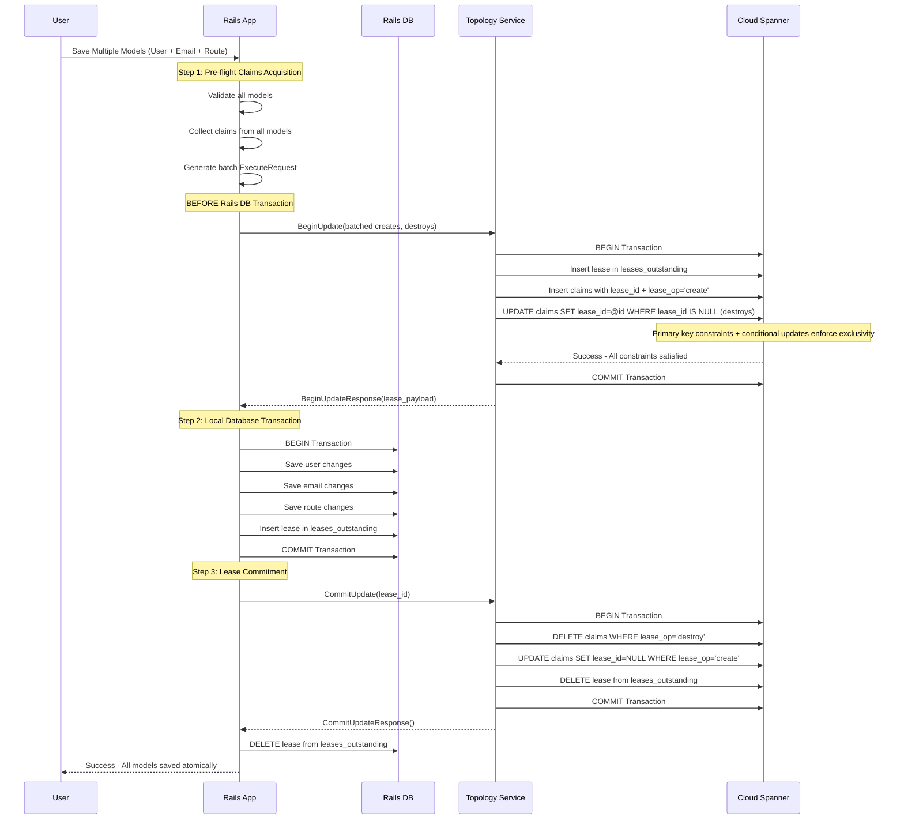
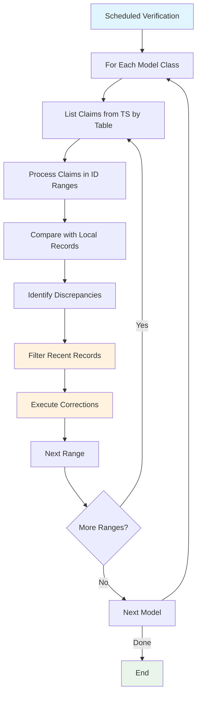
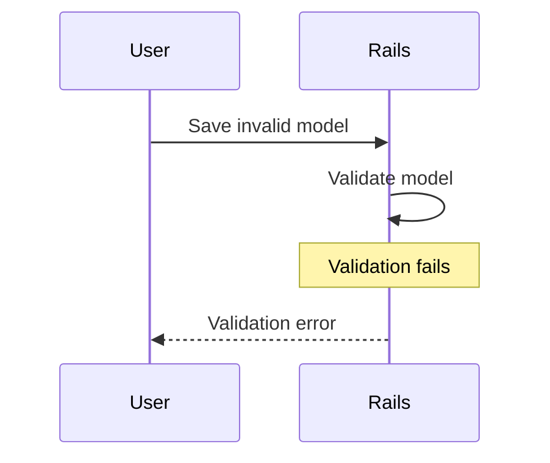
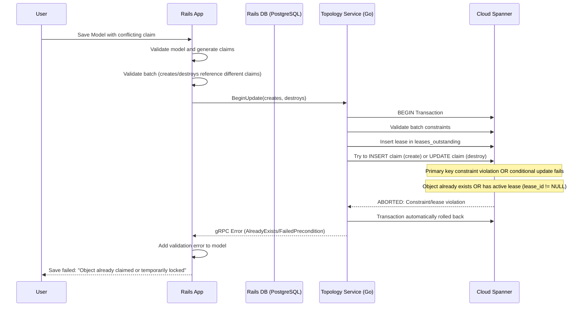
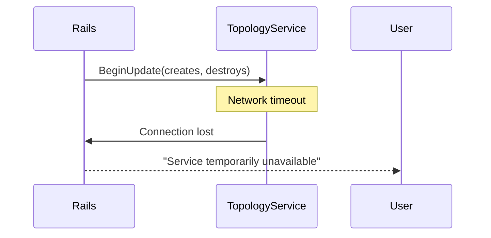
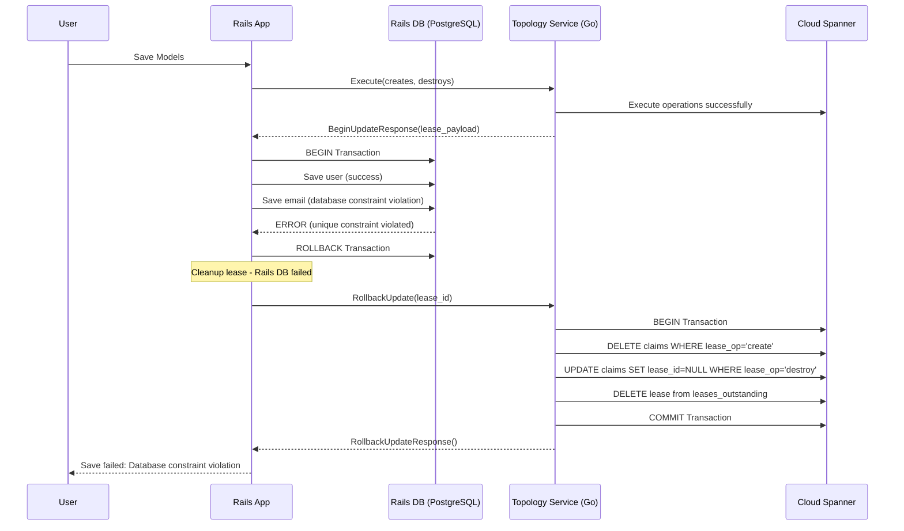
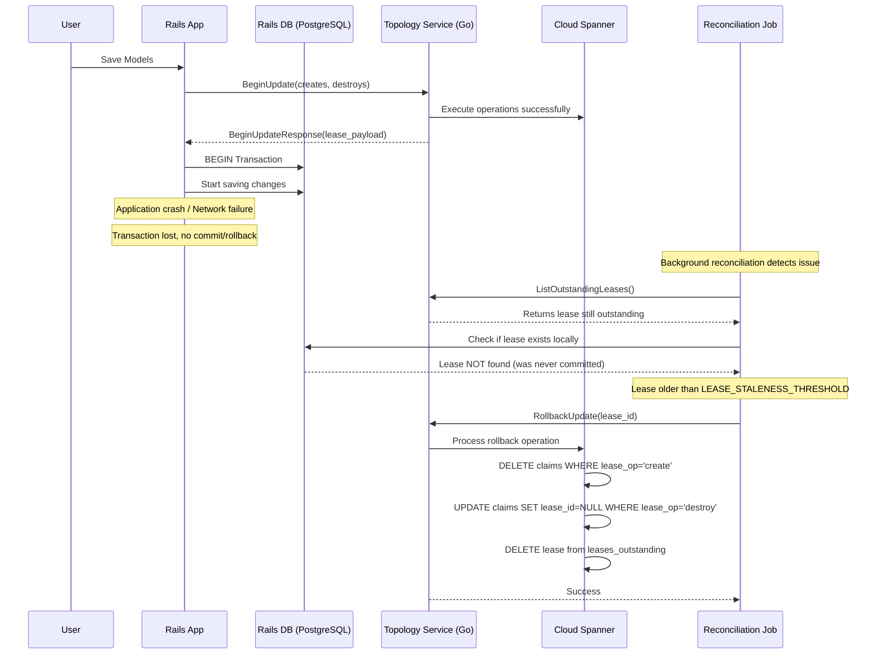
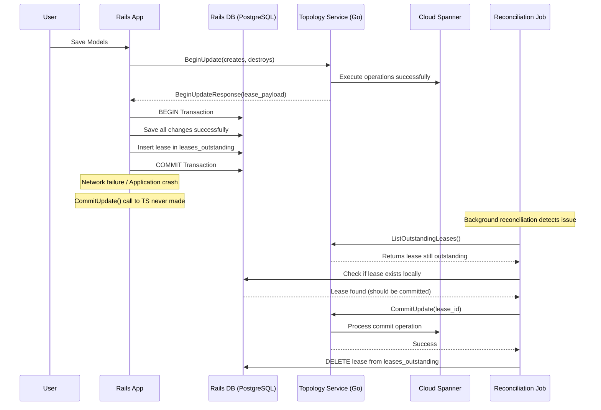
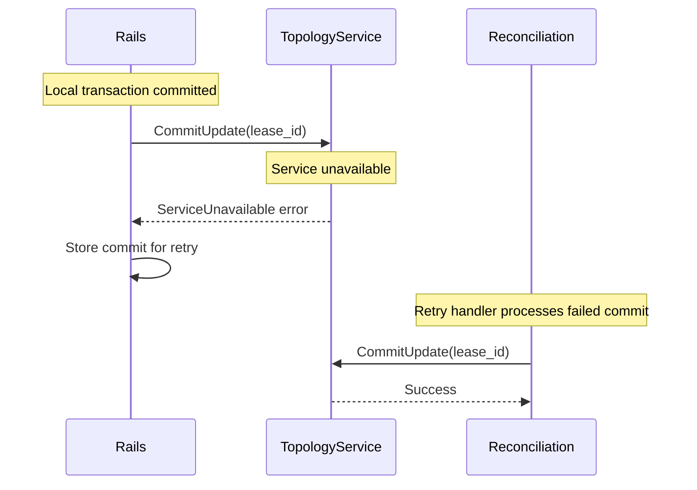
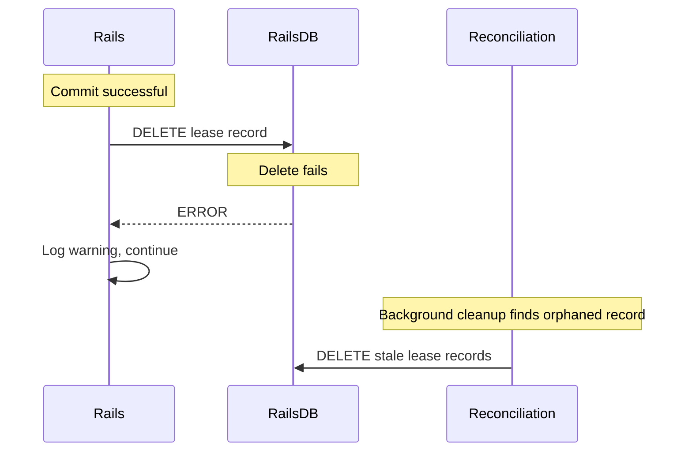



This document outlines the design goals and architecture of Topology Service implementing transactional behavior for Claims Service.

## Essential Concepts

### **Distributed Lease-Based Coordination**

This system implements a **distributed lease-based coordination mechanism** for managing globally unique claims (usernames, emails, routes) across multiple GitLab cells. It ensures only one cell can "own" a particular claim at any given time, preventing conflicts in a distributed environment.

### **Core Behavioral Principles**

#### **1. Lease-First Coordination**

The system follows a "lease-first, commit-later" pattern:

- **Before** making any local changes, acquire a lease from the central Topology Service
- **Only after** successful lease acquisition, proceed with local database operations
- **After** local success, commit the lease to make changes permanent
- **If anything fails**, rollback the lease to maintain consistency

#### **2. Atomic Batch Operations**

Multiple related models MUST be processed together:

- Collect all claim changes from multiple models
- Send a single batch request to Topology Service
- Process all local database changes in one transaction
- Commit or rollback all claims together

**Critical Constraint**: Creates and destroys must point to different claims within a single batch - a claim cannot be both created and destroyed in the same operation, as this creates modeling complexity in the Topology Service.

#### **3. Time-Bounded Leases**

Leases are time-bounded through the reconciliation process:

- Leases only have creation timestamps, no explicit expiration
- Reconciliation process determines staleness based on age (default 10 minutes threshold)
- Prevents indefinite locks if a cell crashes through background cleanup
- Background reconciliation ensures consistency

#### **4. Lease Exclusivity**

**Critical Rule**: Objects with active leases (`lease_id != NULL`) cannot be claimed by other operations:

- **Create Operations**: Will fail with primary key constraint if object already exists
- **Destroy Operations**: Will fail with conditional update if object has active lease
- **Temporal Lock**: Objects remain locked until lease expires or is committed/rolled back
- **Automatic Release**: Stale leases are cleaned up through reconciliation, making objects available again

#### **5. Ownership Security**

**Critical Security Constraint**: Only the cell that created a claim can destroy it:

- **Cell ID Verification**: All destroy operations require the requesting cell to match the claim's original creator
- **Prevents Interference**: Cells cannot destroy claims created by other cells
- **Security Isolation**: Malicious or buggy cells cannot disrupt other cells' data

## System Participants

### **Rails Client (User-Initiated)**

- **Primary Role**: Handles user actions that modify globally unique attributes
- **Responsibilities**:
  - Validates models locally before claiming
  - Collects all claims from multiple models into batch requests
  - Coordinates with Topology Service for lease acquisition
  - Manages local database transactions
  - Handles immediate commit/rollback after local operations

### **Background Reconciliation Processes**

#### **Expired Lease Cleanup**

**Frequency**: Every minute

**Operation**: Finds leases older than staleness threshold and removes them

**Staleness Determination**: Based on lease creation time vs. current time (not explicit expiration)

**Components**:

- **Cloud Spanner Cleanup**: Deletes claims created by stale leases, clears lease_id from claims marked for destroy
- **Rails DB Cleanup**: Removes stale local lease tracking records

#### **Lost Transaction Recovery**

**Frequency**: Every 5-10 minutes

**Operation**: Reconciles leases that exist in Topology Service but not in Rails (or vice versa)

**Strategy**: Rails-driven cleanup with idempotent Topology Service operations

**Process**: 

- List outstanding leases from Topology Service with cursor-based pagination
- Separate stale and active leases based on creation time and staleness threshold
- Commit active leases that exist locally, rollback stale leases
- Clean up orphaned local lease records

#### **Retry Handler**

**Trigger**: Failed commit/rollback operations

**Strategy**: Exponential backoff with jitter

**Scope**: Handles network failures and temporary service unavailability

### **Topology Service**

**Primary Role**: Centralized coordination service managing global claim state

**Responsibilities**:

- Enforces lease exclusivity through database constraints
- Manages lease lifecycle (create, commit, rollback)
- Provides atomic batch operations for multiple claims
- Handles lease expiration and cleanup
- Ensures only claim creators can destroy their claims

## Happy Path Workflow



### **Detailed Steps**

1. **Pre-flight Validation**: Rails validates all models locally and generates batch claim requests
2. **Lease Acquisition**: Single atomic transaction in Topology Service acquires leases for all claims
3. **Local Database Transaction**: Rails saves all changes and creates lease tracking record
4. **Lease Commitment**: Topology Service finalizes all claims and removes lease
5. **Cleanup**: Rails removes local lease tracking record

### **Detailed Process Flow**

#### **Phase 1: Pre-Flight Claims Acquisition**

```text
User saves models → Rails validates → Claims generated → Topology Service called
```

**What happens:**

1. **Model Validation**: Rails validates the model locally first
2. **Claim Generation**: For each changed unique attribute, generate create/destroy claims
3. **Batch Collection**: If multiple models are being saved, collect all claims together
4. **Topology Service Call**: Send `BeginUpdate()` request with all claims BEFORE local DB transaction

**Why this order:**

- **Fail Fast**: If claims conflict, fail before making any local changes
- **Atomicity**: Either all claims succeed or all fail
- **Efficiency**: Single network call for multiple models. Important due to long write latency on doing multi-region writes.

#### **Phase 2: Atomic Lease Creation in Cloud Spanner**

```text
BeginUpdate() → Single transaction → Database constraints + lease exclusivity enforced
```

**What happens in Topology Service transaction:**

1. **Lease Record**: Insert into `leases_outstanding` with full payload
2. **Create Claims**: Insert new claims with `lease_op='create'` and the lease_id
   - Primary key constraint on (claim_type, claim_value) prevents duplicates
   - **Constraint**: Creates must reference claims that don't exist in the system
3. **Mark Destroys**: Update existing claims ONLY if `lease_id IS NULL` AND `cell_id` matches the requesting cell
   - Conditional update ensures no concurrent operations on same object AND only creator can destroy
   - **Constraint**: Destroys must reference claims that already exist and are owned by the requesting cell
4. **Batch Validation**: Creates and destroys within a single batch cannot reference the same claim (claim_type, claim_value) as this creates irreconcilable state transitions
5. **Lease Exclusivity**: Objects with `lease_id != NULL` cannot be claimed by other operations
6. **Atomic Success/Failure**: If any operation fails, entire transaction automatically rolls back

**Critical Lease Rule**: 

- **Only unlocked objects** (where `lease_id IS NULL`) can be claimed
- **Objects with active leases** are temporarily unavailable to other operations
- **This prevents concurrent modifications** and ensures operation isolation

**Why this approach:**

- **Exclusive Access**: Only one operation can work on an object at a time
- **Prevents Race Conditions**: Cannot claim objects already being modified
- **Temporal Isolation**: Leases provide time-bounded exclusive access
- **Database-Level Enforcement**: Constraints are faster and more reliable than application checks
- **No Explicit Conflict Checking**: Database constraints handle uniqueness automatically

#### **Phase 3: Local Database Transaction**

```text
Lease acquired → Rails DB transaction → Save all models → Create lease record
```

**What happens in Rails:**

1. **Transaction Start**: Begin Rails database transaction
2. **Model Saves**: Save all the model changes that generated the claims
3. **Lease Tracking**: Create `leases_outstanding` record with lease_id and expiration
4. **Transaction Commit**: Commit all changes together

**Why after lease acquisition:**

- **Safety**: Local changes only happen after global coordination succeeds
- **Immediate Cleanup**: Lease record in Rails DB enables prompt cleanup after transaction completion
- **Rollback Capability**: If local DB fails, we have lease_id to clean up

#### **Phase 4: Lease Commitment**

```text
Local success → CommitUpdate() → Finalize claims → Remove lease
```

**What happens in Topology Service:**

1. **Destroy Processing**: DELETE claims where lease_op='destroy' 
2. **Create Finalization**: UPDATE claims SET lease_id=NULL, lease_op='no-op' where lease_op='create'
3. **Lease Cleanup**: DELETE from leases_outstanding
4. **Rails Cleanup**: Rails deletes its leases_outstanding record

**Why this two-phase approach:**

- **Durability**: Creates become permanent, destroys are executed
- **Immediate Cleanup**: Leases are removed immediately after successful completion
- **Idempotency**: CommitUpdate can be retried safely - operations are idempotent

## Terminology by Participant

### **Rails Client**

#### **Local Schema**

```sql
-- Rails migration for leases_outstanding table (synchronized with Cloud Spanner)
-- This table only contains active leases - entries are deleted when consumed
CREATE TABLE leases_outstanding (
  lease_id STRING(36) NOT NULL UNIQUE,
  created_at TIMESTAMP NOT NULL,
  updated_at TIMESTAMP NOT NULL
);

-- Indexes for performance and operational queries
CREATE INDEX idx_leases_outstanding_created ON leases_outstanding(created_at);
```

#### **Model Definition**

```ruby
# Rails ActiveRecord concern for handling distributed claims
module CellsUniqueness
  extend ActiveSupport::Concern

  class_methods do
    def cell_cluster_unique_attributes(*attributes, claim_type:, owner:, owner_type:)
      @cell_unique_config = {
        attributes: attributes,
        claim_type: claim_type,
        owner: owner,
        owner_type: owner_type
      }
    end
  end
end

# Example model implementation
class Route < ApplicationRecord
  include CellsUniqueness
  
  self.cell_cluster_table_name = Gitlab::Cells::ClaimRecord::TableName::ROUTES
  self.cell_cluster_table_record_id = :id

  cell_cluster_unique_attributes :path,
    claim_type: Gitlab::Cells::ClaimRecord::ClaimType::ROUTES,
    owner: -> { project || group },
    owner_type: -> { project ? Gitlab::Cells::ClaimRecord::Owner::PROJECT : group ? Gitlab::Cells::ClaimRecord::Owner::GROUP : Gitlab::Cells::ClaimRecord::Owner::UNSPECIFIED }
end
```

#### **Operations**

- **Claim Generation**: Extract unique attributes from model changes into create/destroy claims
- **Batch Collection**: Aggregate claims from multiple models into single ExecuteRequest
- **Batch Validation**: Ensure creates and destroys within a batch reference different claims to avoid modeling conflicts
- **Lease Tracking**: Store lease_id locally for reconciliation and cleanup
- **Immediate Cleanup**: Remove lease records after successful commit/rollback
- **Error Handling**: Convert gRPC errors to Rails validation errors

### **Background Reconciliation**

#### **Rails-Driven Cleanup Process**

```ruby
# Rails-driven cleanup with idempotent Topology Service operations
class ClaimsLeaseReconciliationService
  LEASE_STALENESS_THRESHOLD = 10.minutes  # Consider lease stale if older than threshold
  
  def self.reconcile_outstanding_leases
    topology_service = Gitlab::Cells::TopologyServiceClient.new
    cursor = nil
    
    loop do
      # Get leases from Topology Service with cursor-based pagination
      response = topology_service.list_outstanding_leases(
        ListOutstandingLeasesRequest.new(
          cell_id: current_cell_id,
          cursor: cursor
        )
      )
      
      break if response.leases.empty?
      
      topology_leases = response.leases.map(&:lease_payload)
      
      # Separate stale and active leases based on creation time
      now = Time.current
      stale_leases = topology_leases.select { |lease| 
        lease.created_at.to_time < (now - LEASE_STALENESS_THRESHOLD) 
      }
      active_leases = topology_leases - stale_leases
      
      # Process active leases: commit if they exist locally
      active_lease_ids = active_leases.map(&:lease_id)
      local_active_leases = LeasesOutstanding.where(lease_id: active_lease_ids).pluck(:lease_id)
      
      local_active_leases.each do |lease_id|
        topology_service.commit_update(CommitUpdateRequest.new(cell_id: current_cell_id, lease_id: lease_id))
        LeasesOutstanding.find_by(lease_id: lease_id)&.destroy!
      end
      
      # Process stale leases: rollback all (idempotent)
      stale_leases.each do |lease|
        topology_service.rollback_update(RollbackUpdateRequest.new(cell_id: current_cell_id, lease_id: lease.lease_id))
        # Clean up any local record that might exist
        LeasesOutstanding.find_by(lease_id: lease.lease_id)&.destroy!
      end
      
      # Update cursor for next iteration
      cursor = response.next_cursor
      break if cursor.blank?  # No more pages
    end
    
    # Exception case: leases missing from TS but present locally
    stale_local_leases = LeasesOutstanding.where('created_at < ?', Time.current - LEASE_STALENESS_THRESHOLD)
    if stale_local_leases.exists?
      Rails.logger.error "Found #{stale_local_leases.count} stale local leases without TS counterparts"
      stale_local_leases.destroy_all
    end
  end
end
```

#### **Reconciliation Principles**

- **Primary Cleanup**: Rails is responsible for cleaning up outstanding leases
- **Cursor-Based Pagination**: Guarantees iteration through all leases without infinite loops
- **Idempotent Operations**: Topology Service CommitUpdate/RollbackUpdate operations are idempotent
- **Staleness-Based Cleanup**: Leases older than threshold are considered stale (local property)
- **Complete Processing**: Both stale and active leases are processed to ensure forward progress
- **Exception Handling**: Local leases without corresponding TS leases indicate system issues
- **Immediate Cleanup**: Leases are removed as soon as possible via Rails `after_commit`/`after_rollback` hooks

## Topology Service Data Verification

### **Overview**

The data verification process ensures consistency between the Topology Service's global claim state and each cell's local database records. This is a cell-initiated process that runs periodically to detect and reconcile discrepancies.



### **Core Verification Process**

The system uses cursor-based pagination to fetch claims from TS in ID ranges, then compares them with local records using efficient hash-based matching. Three types of discrepancies are detected: missing claims in TS, different claim values, and extra claims in TS. Recent records (within 1 hour) are skipped to avoid correcting transient changes.

### **Verification Service Implementation**

```ruby
class ClaimsVerificationService
  CURSOR_RANGE_SIZE = 1000  # Records per TS request
  LOCAL_BATCH_SIZE = 500    # Local records per batch
  RECENT_RECORD_THRESHOLD = 1.hour  # Skip recent records
  
  def self.verify_all_claim_models(models_with_claims)
    models_with_claims.each do |model_class|
      verify_model_claims(model_class)
    end
  end
  
  def self.verify_model_claims(model_class)
    topology_service = Gitlab::Cells::TopologyServiceClient.new
    cursor = 0
    
    loop do
      # Fetch claims from TS in cursor-based ranges
      response = topology_service.list_claims(
        ListClaimsRequest.new(
          cell_id: current_cell_id,
          table_name: model_class.cell_cluster_table_name,
          cursor: cursor,
          limit: CURSOR_RANGE_SIZE
        )
      )
      break if response.claims.empty?
      
      # Process the returned ID range
      process_claims_range(model_class, response.claims, response.start_range, response.end_range, config)
      
      cursor = response.next_cursor
      break if cursor.nil?
    end
  end

  def self.process_claims_range(model_class, ts_claims, start_range, end_range, config)
    # Create hash map for O(1) claim lookups
    mapped_ts_claims = ts_claims.to_h(&:method(:claim_key))
    recent_threshold = Time.current - RECENT_RECORD_THRESHOLD

    # Query local records matching the exact TS range
    model_class.where(id: start_range...end_range).find_in_batches(batch_size: LOCAL_BATCH_SIZE) do |local_batch|
      missing_ts_claims = []
      different_local_claims = []
      different_ts_claims = []

      local_batch.each do |record|
        # Skip recent records to avoid transient conflicts
        next if record_is_recent?(record, recent_threshold)

        model_class.cell_claim_attributes.each do |claim_attributes|
          # Generate expected claim from local record
          claim_record = record.generate_claim_record(claim_attributes)
          
          # Look up and remove from hash (tracks processed claims)
          ts_claim_record = mapped_ts_claims.delete(claim_key(claim_record))

          if ! ts_claim_record
            # Missing in TS: local exists, no TS claim
            missing_ts_claims << claim_record
          elsif ! claim_records_match?(claim_record, ts_claim_record)
            # Different: both exist but data differs
            next if ts_claim_is_recent?(ts_claim_record, recent_threshold)
            
            different_local_claims << claim_record
            different_ts_claims << ts_claim_record
          end
          # If match exactly, no action needed
        end
      end

      # Execute corrections in batches
      if missing_ts_claims.present?
        begin_update_and_commit(creates: missing_ts_claims)
      end

      if different_ts_claims.present?
        # Non-atomic update: destroy then create
        begin_update_and_commit(destroys: different_ts_claims)
        begin_update_and_commit(creates: different_local_claims)
      end
    end
    
    # Remaining hash entries are extra TS claims
    extra_ts_claims = mapped_ts_claims.values.reject { |ts_claim| ts_claim_is_recent?(ts_claim, recent_threshold) }
    if extra_ts_claims.present?
      begin_update_and_commit(destroys: extra_ts_claims)
    end
  end

  def self.record_is_recent?(record, recent_threshold)
    record.created_at > recent_threshold
  end

  def self.ts_claim_is_recent?(ts_claim, recent_threshold)
    ts_claim.created_at.to_time > recent_threshold
  end

  def self.claim_records_match?(expected_claim, ts_claim)
    # TODO: Compare claim type, value, and owner
  end

  def self.claim_key(ts_claim)
    # Unique identifier for hash lookups
    "#{ts_claim.claim_type}/#{ts_claim.claim_value}"
  end
  
  def self.begin_update_and_commit(creates: [], destroys: [])
    topology_service = Gitlab::Cells::TopologyServiceClient.new
    
    # Use standard BeginUpdate/CommitUpdate pattern
    response = topology_service.begin_update(
      BeginUpdateRequest.new(
        cell_id: current_cell_id,
        creates: creates,
        destroys: destroys
      )
    )
    
    # Immediate commit (no local DB changes for verification)
    topology_service.commit_update(
      CommitUpdateRequest.new(
        cell_id: current_cell_id,
        lease_id: response.lease_payload.lease_id
      )
    )
    
    Rails.logger.info "Verified: #{creates.size} creates, #{destroys.size} destroys"
  end
  
  private
  
  def self.current_cell_id
    Gitlab::Cells.current_cell_id
  end
end
```

### **Key Behaviors**

- **Range-Based Processing**: TS returns claims in ID ranges (start_range to end_range), local queries match exact ranges
- **Hash-Based Matching**: O(1) lookups using claim_key, processed claims removed via delete()
- **Three-Way Comparison**: Missing (local only), Different (both exist, data differs), Extra (TS only)
- **Recent Record Protection**: Skip records created within threshold to avoid transient conflicts
- **Batch Corrections**: BeginUpdate/CommitUpdate pattern used for all corrections, separate batches per discrepancy type
- **Cursor Pagination**: Automatic advancement through all records, no gaps or overlaps

### **Recent Record Protection**

The verification system protects against correcting transient changes:

- **Configurable Threshold**: `RECENT_RECORD_THRESHOLD = 1.hour` (adjustable)
- **Local Record Protection**: Skips entire record if `created_at` is within threshold
- **Claim Comparison Protection**: Skips correction if either local or TS claim is recent
- **Extra Claim Protection**: Filters out recent TS claims from deletion

**Benefits:**

- **Transient Change Handling**: Prevents correction of records still propagating
- **Race Condition Prevention**: Avoids interfering with ongoing operations
- **Operational Safety**: Reduces risk of correcting legitimate new data

### **Topology Service**

#### **Cloud Spanner Schema**

```sql
-- Claims table with integrated lease tracking
CREATE TABLE claims (
  claim_id STRING(36) NOT NULL,                    -- UUID for internal tracking
  claim_type INT64 NOT NULL,                       -- Type of claim (maps to protobuf ClaimType enum)
  claim_value STRING(255) NOT NULL,                -- The actual value being claimed
  owner_type INT64 NOT NULL,                       -- Type of owner (maps to protobuf Owner enum)
  owner_value STRING(255) NOT NULL,                -- Owner identifier
  cell_id STRING(100) NOT NULL,                    -- Cell ID that created this claim
  table_name INT64 NOT NULL,                       -- Database table name (maps to protobuf TableName enum)
  table_record_id INT64 NOT NULL,                  -- Record ID in the source table
  lease_id STRING(36),                             -- NULL for committed claims, UUID for leased claims
  lease_op STRING(10) NOT NULL DEFAULT 'no-op',   -- 'no-op', 'create', 'destroy'
  created_at TIMESTAMP NOT NULL OPTIONS (allow_commit_timestamp=true),
  updated_at TIMESTAMP NOT NULL OPTIONS (allow_commit_timestamp=true),
) PRIMARY KEY (claim_type, claim_value);

-- CRITICAL CONSTRAINTS: 
-- 1. Objects with lease_id != NULL cannot be claimed by other operations
-- 2. Only the cell that created a claim (cell_id) can destroy it
-- These constraints prevent concurrent operations and unauthorized access

-- Outstanding leases table (mirrored with Rails for synchronization)
CREATE TABLE leases_outstanding (
  lease_id STRING(36) NOT NULL,                    -- UUID of the lease
  cell_id STRING(100) NOT NULL,                    -- Cell ID that owns the lease
  lease_payload BYTES(MAX) NOT NULL,               -- Serialized LeasePayload protobuf
  created_at TIMESTAMP NOT NULL OPTIONS (allow_commit_timestamp=true),
) PRIMARY KEY (lease_id);

-- Performance and operational indexes
CREATE INDEX idx_leases_outstanding_cell ON leases_outstanding(cell_id);
CREATE INDEX idx_leases_outstanding_created ON leases_outstanding(created_at);

CREATE INDEX idx_claims_cell ON claims(cell_id);
CREATE INDEX idx_claims_lease_id ON claims(lease_id) STORING (lease_op);
CREATE INDEX idx_claims_lease_op ON claims(lease_op) WHERE lease_op != 'no-op';
CREATE INDEX idx_claims_scope_lease ON claims(claim_type, lease_id) WHERE lease_id IS NOT NULL;
CREATE INDEX idx_claims_owner ON claims(owner_type, owner_value);

-- Additional indexes for verification queries
CREATE INDEX idx_claims_table_record ON claims(cell_id, table_name, table_record_id);
CREATE INDEX idx_claims_table_cursor ON claims(cell_id, table_name, table_record_id) STORING (claim_type, claim_value, owner_type, owner_value);
```

#### **Protobuf Definitions**

```protobuf
syntax = "proto3";

package gitlab.cells.claims.v1;

option go_package = "gitlab.com/gitlab-org/cells/claims/v1;claimsv1";

import "google/protobuf/timestamp.proto";

// Service definition for Topology Service Claims API
service ClaimsService {
  // BeginUpdate creates/destroys with lease - atomic operation
  rpc BeginUpdate(BeginUpdateRequest) returns (BeginUpdateResponse);
  
  // CommitUpdate finalizes the operations and removes lease
  rpc CommitUpdate(CommitUpdateRequest) returns (CommitUpdateResponse);
  
  // RollbackUpdate reverts the operations and removes lease
  rpc RollbackUpdate(RollbackUpdateRequest) returns (RollbackUpdateResponse);
  
  // List outstanding leases for a client (for reconciliation)
  rpc ListOutstandingLeases(ListOutstandingLeasesRequest) returns (ListOutstandingLeasesResponse);
  
  // List claims by table for verification
  rpc ListClaims(ListClaimsRequest) returns (ListClaimsResponse);
}

// Core claim record definition
message ClaimRecord {
  enum ClaimType {
    UNSPECIFIED = 0;
    ROUTES = 1;
    USERNAME = 2;
    EMAIL = 3;
  }

  enum Owner {
    UNSPECIFIED = 0;
    GROUP = 1;
    PROJECT = 2;
    USER = 3;
  }
  
  enum TableName {
    TABLE_UNSPECIFIED = 0;
    USERS = 1;
    EMAILS = 2;
    ROUTES = 3;
    PROJECTS = 4;
    GROUPS = 5;
  }

  ClaimType claim_type = 1;
  string claim_value = 2;  // The actual value being claimed (e.g., "john@example.com")
  Owner owner = 3;
  string owner_value = 4;  // Owner identifier
  
  // Table information for verification
  TableName table_name = 6;
  int64 table_record_id = 7;
}

// BeginUpdate operation request - can include multiple creates and destroys
message BeginUpdateRequest {
  string cell_id = 1; // Cell ID requesting the lease
  repeated ClaimRecord creates = 2;   // Claims to create
  repeated ClaimRecord destroys = 3;  // Claims to destroy
}

// Lease payload stored in Cloud Spanner and returned to clients
message LeasePayload {
  string lease_id = 1; // UUID of the lease
  string cell_id = 2; // Cell ID that owns the lease
  google.protobuf.Timestamp created_at = 3;
  BeginUpdateRequest original_request = 4; // Complete original request for reconciliation
}

// BeginUpdate operation response
message BeginUpdateResponse {
  LeasePayload lease_payload = 1;
}

// CommitUpdate operation request
message CommitUpdateRequest {
  string cell_id = 1;
  string lease_id = 2;
}

// CommitUpdate operation response
message CommitUpdateResponse {
  // Empty response - success indicated by no gRPC error
}

// RollbackUpdate operation request
message RollbackUpdateRequest {
  string cell_id = 1;
  string lease_id = 2;
}

// RollbackUpdate operation response
message RollbackUpdateResponse {
  // Empty response - success indicated by no gRPC error
}

// List outstanding leases request
message ListOutstandingLeasesRequest {
  string cell_id = 1;
  string cursor = 2;  // Optional cursor for pagination
}

// Outstanding lease information
message OutstandingLease {
  LeasePayload lease_payload = 1;
}

// List outstanding leases response
message ListOutstandingLeasesResponse {
  repeated OutstandingLease leases = 1;
  string next_cursor = 2;  // Cursor for next page, empty if no more pages
}

// List claims request for verification
message ListClaimsRequest {
  string cell_id = 1;
  ClaimRecord.TableName table_name = 2;
  int64 cursor = 3;
  int32 limit = 4;
}

// Claim information for verification
message ClaimInfo {
  ClaimRecord.ClaimType claim_type = 1;
  string claim_value = 2;
  ClaimRecord.Owner owner_type = 3;
  string owner_value = 4;
  ClaimRecord.TableName table_name = 6;
  int64 table_record_id = 7;
  google.protobuf.Timestamp created_at = 8;
  google.protobuf.Timestamp updated_at = 9;
}

// List claims response with range information
message ListClaimsResponse {
  repeated ClaimInfo claims = 1;
  int64 start_range = 2;
  int64 end_range = 3;
  int64 next_cursor = 4;
}
```

#### **gRPC API Behaviors**

- **BeginUpdate()**: Atomically acquire leases for batch operations, enforce exclusivity constraints
  - **Validation**: Ensures creates and destroys reference different claims within the same batch
  - **Create Processing**: Inserts new claims that don't exist in the system
  - **Destroy Processing**: Updates existing claims owned by the requesting cell
- **CommitUpdate()**: Finalize claims (DELETE destroys, clear lease_id from creates) and remove leases
- **RollbackUpdate()**: Revert claims (DELETE creates, clear lease_id from destroys) and remove leases
- **ListOutstandingLeases()**: Retrieve leases for reconciliation with cursor-based pagination
- **ListClaims()**: Retrieve claims by table for verification with range information

## Unhappy Path Workflows

### **Failure Point 1: Pre-flight Validation Failure**

**Scenario**: Model validation fails before lease acquisition



**Recovery**: No recovery needed - no resources acquired, user sees validation error

---

### **Failure Point 2: Lease Acquisition Failure**

#### **Scenario 2A: Topology Service Conflict - Permanent Claim**



**Different conflict types:**

1. **Permanent Conflict**: Object permanently owned by another cell → "Already taken"
2. **Temporary Conflict**: Object temporarily leased by another operation → "Try again later"
3. **Batch Validation Conflict**: Creates and destroys reference same claim → "Invalid batch operation"

**Recovery**: No recovery needed - user sees appropriate error message

#### **Scenario 2B: Network Failure During Execute**



**Recovery**: No recovery needed - no lease acquired, safe to retry

---

### **Failure Point 3: Local Database Transaction Failure**

#### **Scenario 3A: Rails Database Constraint Violation**



**Recovery**: Automatic rollback of lease, user sees error

#### **Scenario 3B: Application Crash During Local Transaction**



**Recovery**: Background reconciliation rolls back orphaned lease

---

### **Failure Point 4: Lease Commitment Failure**

#### **Scenario 4A: Missing Commit After Successful Local Transaction**



**Recovery**: Background reconciliation commits the lease

#### **Scenario 4B: Topology Service Unavailable During Commit**



**Recovery**: Retry handler eventually commits the lease

---

### **Failure Point 5: Cleanup Failure**

#### **Scenario 5A: Failed to Delete Local Lease Record**



**Recovery**: Background reconciliation eventually removes stale records

## Advanced Behaviors

### **Lease Exclusivity and Concurrency Control**

```text
Cell A: BeginUpdate(create email@example.com) → Lease acquired
Cell B: BeginUpdate(destroy email@example.com) → BLOCKED until Cell A commits/rollbacks
```

**Behavior**: Objects with active leases cannot be claimed:

- **Creates**: Will fail with primary key constraint if object exists (regardless of lease status)
- **Destroys**: Will fail with conditional update if object has `lease_id != NULL`
- **Temporal Lock**: Object remains locked until lease expires or is committed/rolled back
- **Automatic Release**: Stale leases are cleaned up through reconciliation, making objects available again

**Example scenarios:**

1. **Email change collision**: User changes email while admin tries to delete it → One succeeds, other waits
2. **Route transfer conflict**: Two operations try to move same route → Serialized execution
3. **Concurrent creation**: Two cells try to create same username → First wins, second fails permanently

### **Multi-Model Coordination**

```text
User + Email + Route changes → Single batch BeginUpdate() → All-or-nothing semantics
```

**Example**: Creating user with email and route:

1. User model generates username claim
2. Email model generates email claim  
3. Route model generates path and name claims
4. All 4 claims sent in single BeginUpdate() call
5. All models saved in single Rails transaction
6. All claims committed together

**Why**: Business operations often span multiple models - atomic coordination required

## Performance Characteristics

### **Optimizations**

- **Batch Processing**: Multiple claims in single RPC call
- **Efficient Indexes**: Cloud Spanner indexes optimized for lease operations
- **Connection Pooling**: Reuse gRPC connections
- **Background Processing**: Async cleanup doesn't block user operations
- **Constraint-Based Conflicts**: Database handles uniqueness without application logic

### **Scalability**

- **Cell Independence**: Each cell operates independently until conflicts
- **Centralized Coordination**: Only conflicts require cross-cell communication  
- **Time-Bounded Locks**: Automatic cleanup prevents indefinite blocking through staleness detection
- **Horizontal Scaling**: Cloud Spanner scales with claim volume

## Why This Design Works

### **1. Exclusive Access Control**

- Objects can only be modified by one operation at a time
- Prevents data corruption from concurrent modifications
- Clear temporal boundaries for exclusive access

### **2. Graceful Concurrency Handling**

- Permanent conflicts (duplicates) fail immediately
- Temporary conflicts (leases) can be retried
- Users get appropriate feedback for different conflict types

### **3. Consistency Without Distributed Transactions**

- Uses leases instead of 2PC (Two-Phase Commit)
- Simpler failure modes than distributed transactions
- Time-bounded recovery from failures through staleness-based cleanup
- **No 2PC Required**: Each cell manages its own local state independently, with coordination only happening through the centralized Topology Service

### **4. Operational Simplicity**  

- Clear failure modes and recovery procedures
- Observable through standard metrics and logs
- Self-healing through Rails-driven cleanup with idempotent Topology Service operations
- **Immediate Cleanup**: Leases are removed as soon as possible - lingering leases indicate exceptions

### **5. Developer Ergonomics**

- Transparent integration with ActiveRecord
- Declarative configuration
- Familiar transaction semantics

### **6. Production Robustness**

- Handles network partitions gracefully
- Automatic recovery from cell crashes
- Comprehensive error handling and retry logic
- Protection against correcting transient changes

### **7. Comprehensive Verification**

- Detects and corrects missing, extra, and different claims
- Efficient cursor-based processing for large datasets
- Recent record protection prevents interference with ongoing operations
- Hash-based matching for optimal performance

## Open Questions and Considerations

### **Performance Considerations**

- **Batch Size Limits**: What's the maximum number of claims per batch to optimize performance vs. transaction size?
- **Lease Duration**: Rather than explicit expiration, should the staleness threshold be configurable per operation type?
- **Connection Pooling**: How many concurrent connections should Rails maintain to Topology Service, and how should they be distributed across cells?

### **Security Considerations**

- **Authentication**: How does Topology Service authenticate cells - mutual TLS, API keys, or JWT tokens?
- **Authorization**: Should there be additional authorization beyond cell_id matching for cross-cell operations?
- **Audit Trail**: Should all claim operations be logged for security auditing and compliance?
- **Rate Limiting**: Should there be per-cell rate limits to prevent abuse or runaway operations?

### **Operational Considerations**

- **Monitoring**: What metrics should be tracked - lease age, conflict rates, reconciliation frequency?
- **Alerting**: When should operators be notified - stale lease threshold, reconciliation failures, or high conflict rates?
- **Disaster Recovery**: How to handle Topology Service outages and ensure data consistency during recovery?

### **Edge Cases**

- **Clock Skew**: How does the system handle clock differences between cells and Cloud Spanner?
- **Lease Staleness Race**: What happens if a lease becomes stale during commit - should it be allowed or rejected?
- **Partial Batch Failures**: Should the system support partial success in batch operations, or maintain all-or-nothing semantics?
- **Concurrent Reconciliation**: How to handle multiple reconciliation processes running simultaneously?
- **Create/Destroy Conflicts**: How should the system handle requests that try to create and destroy the same claim in a single batch?

### **Future Enhancements**

- **Lease Renewal**: Should long-running operations be able to refresh leases to prevent staleness?
- **Lease Queuing**: Should there be a queue for waiting operations when leases conflict?
- **Lease Priorities**: Should certain operations (admin vs. user) have priority over others?

### **Testing Strategy**

- **Chaos Engineering**: How to test behavior under various failure scenarios - network partitions, service crashes, clock skew?
- **Load Testing**: What's the maximum throughput the system can handle under various conflict scenarios?
- **Consistency Testing**: How to verify consistency across all failure modes?
- **Integration Testing**: How to test the complete flow across Rails, Topology Service, and Cloud Spanner?

## Alternative Approaches to Consider

### **In-Transaction Claims Processing**

Execute claims within the Rails transaction rather than before it:

```text
1. Local DB: BEGIN
2. Local DB: INSERT/UPDATE/DESTROY (local operations)
3. TS DB: BeginUpdate() => lease (~100ms)
4. Local DB: INSERT lease
5. Local DB: COMMIT
6. TS DB: CommitUpdate(lease)
```

**Considerations**:

- **Connection Pool Impact**: Would require strict 250ms timeout on TS BeginUpdate to prevent connection pool bottlenecks
- **Transaction Duration**: Extends every local database transaction by network round-trip time
- **Lock Contention**: Holds database locks and connections during network operations
- **Scalability Impact**: Could exhaust connection pools under high concurrency

**Trade-offs**:

- **Error handling**: Simpler error handling vs. resource contention and scalability concerns
- **Implementation**: Follows well current lazy evaluation approach in Rails allowing to properly capture
  all claims as they are saved to database significantly reducing development complexity.

### **Separate Leased Table with UUID Cross-Join**

Create a separate `leased` table that references claims by UUID:

```sql
CREATE TABLE leased (
  claim_id STRING(36) NOT NULL, -- References claims.claim_id
  lease_id STRING(36) NOT NULL,
  lease_op STRING(10) NOT NULL, -- 'create', 'destroy'
  client_id STRING(100) NOT NULL,
  created_at TIMESTAMP NOT NULL,
) PRIMARY KEY (claim_id);
```

**Benefits**:

- **Cleaner Separation**: Permanent ownership (claims) vs. temporary locking (leased)
- **Efficient Lease Queries**: Direct queries against leased table
- **Complex Lease Metadata**: Room for detailed lease analytics without cluttering claims table

**Trade-offs**: Better separation of concerns vs. increased transaction complexity and performance overhead

### **Separate Leased Table Considerations**

- **Eventual Consistency**: Is it affecting the cross-join table?
- **JOIN Complexity**: Most queries require joins between claims and leased tables
- **Transaction Atomicity**: More complex to ensure referential integrity across tables
- **Race Conditions**: Higher risk of inconsistent state between table operations
- **Cloud Spanner Limitations**: No foreign key constraints, potential for orphaned records

### **Two-Phase Commit (2PC)**

Use traditional distributed transactions across cells:

**Benefits**:

- **Proven Pattern**: Well-understood distributed transaction semantics
- **Strict Consistency**: Guaranteed atomicity across all participants

**Considerations**:

- **Overkill**: 2PC is needed when there are many writers to a single dataset. In the case of Topology Service
  there's no need for complex 2PC as Topology Service does contain a view of a Cell, and no other Cell needs to update
  and synchronize data belonging to another Cell.
- **Coordinator Failure**: Single point of failure that can block all participants
- **Performance Overhead**: Multiple network round-trips and blocking phases
- **Operational Complexity**: Requires distributed transaction coordinator management
- **Recovery Complexity**: Manual intervention often needed for failed transactions
