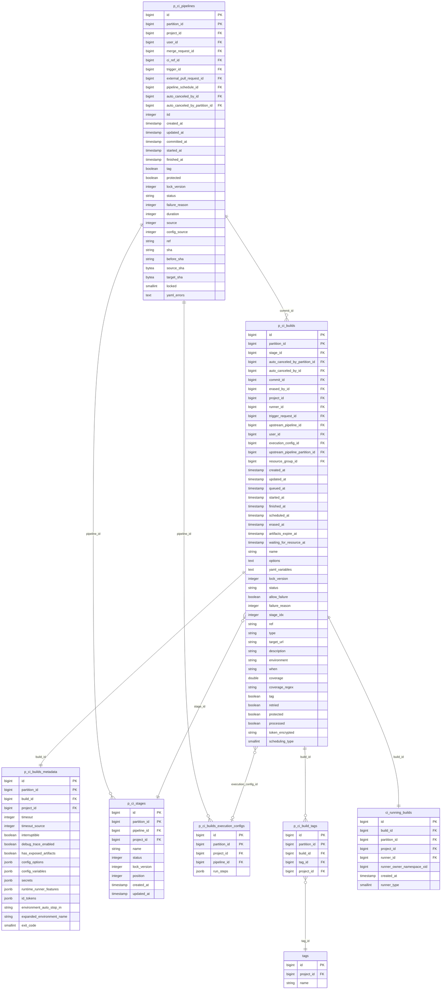
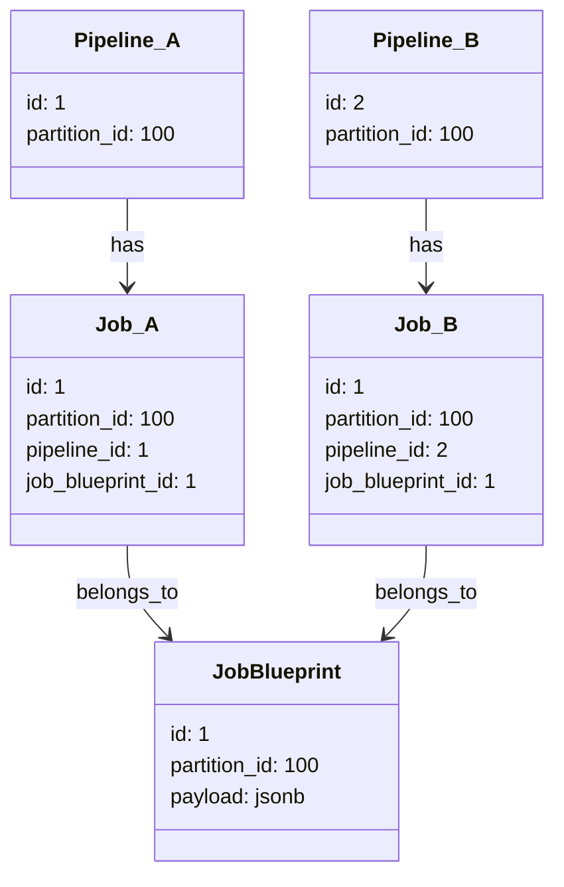



## Summary

GitLab's CI/CD system has experienced exponential growth, leading to database storage challenges. Our analysis shows that a large portion of this storage is consumed by redundant configuration data, particularly in job definitions that remain largely unchanged between pipeline runs. This document proposes a refactoring strategy to optimize storage while maintaining system performance and reliability.

## Background

The current CI/CD architecture stores complete copies of job configurations for each pipeline execution. This approach, while simple and reliable, has led to unnecessary database growth as projects scale. The `p_ci_builds_metadata` table has emerged as the primary contributor to this growth, storing duplicate job configurations and variables across pipeline runs. By analyzing usage patterns, we've identified that most projects maintain relatively stable CI configurations, making this an ideal target for optimization.

## Technical design

### Pipeline blueprint architecture

At the core of our optimization strategy is the introduction of a new Pipeline Blueprint model. This model will serve as a central repository for CI/CD configuration data, enabling efficient deduplication while maintaining the flexibility of the current system.
The Pipeline Blueprint will store configuration data that typically remains static across multiple pipeline runs. Its structure is basic, a partitioned table that has many `p_ci_pipelines` rows, composed of the following columns:

```sql
CREATE TABLE p_ci_pipeline_blueprints (
  id BIGINT NOT NULL,           -- Primary identifier for the blueprint
  partition_id BIGINT NOT NULL, -- Enables data partitioning for scale
  project_id BIGINT NOT NULL,   -- Associates the blueprint with a specific project
  file STRING NOT NULL,  -- Stores the consolidated configuration
  file_store INTEGER,    -- Indicates storage location (local/object storage)
  file_sha256 BYTEA,     -- Enables deduplication through checksum comparison

  PRIMARY KEY (id, partition_id),
  UNIQUE INDEX p_ci_pipeline_blueprints_project_file_sha_partition_idx (project_id, file_sha256, partition_id)
)
PARTITION BY LIST (partition_id);
```

The unique index on `(project_id, file_sha256, partition_id)` ensures that we maintain exactly one blueprint for each unique configuration within a project and partition. This is crucial for our deduplication strategy as it prevents duplicate configurations from being stored and provides an efficient lookup path when linking new pipelines to existing blueprints. The order of the columns is also important because it allows us to use it for queries that lookup rows by project id.

The configuration data stored in `file` consolidates information from multiple existing tables:

```json
{
  "metadata": {
    "version": "1"
  },
  "data": {
    "pipeline": {
      "jobs": {
        "build": {
          "options":   "<from p_ci_builds_metadata.config_options OR p_ci_builds.options>",
          "variables": "<from p_ci_builds_metadata.config_variables OR p_ci_builds.yaml_variables>",
          "secrets":   "<from p_ci_builds_metadata.secrets>",
          "id_tokens": "<from p_ci_builds_metadata.id_tokens>",
          "run_steps": "<from p_ci_builds_execution_configs.run_steps>",
        },
        "test": {},
        "deploy": {}
      }
    }
  }
}
```

This structure maintains the relationships between our existing data while eliminating redundancy. Each field maps directly to its source in our current schema, making the migration path clearer and maintaining data integrity.

For a `tier::3` pipeline on `gitlab-org/gitlab` that contains around 750 jobs, we'll be using less than `10MB` of disk space.

### Data classification and lifecycle

Our optimization strategy recognizes that CI/CD data serves different purposes throughout its lifecycle. We've identified three distinct categories of data:

- *Long-term Data* represents the essential history of CI/CD operations. This includes jobs statuses, logs, and artifacts that must be preserved for compliance and historical reference. This data will continue to be stored in our primary tables. Being a canonical reference, keeping or deleting this data is a Product concern, not strictly Engineering.
- *Processing Data* encompasses the configuration and instructions needed for job execution. This data, which includes runner instructions and job configurations, will be stored in the new blueprint system and frequently accessed and/or mutable data will be stored in a new table. When a pipeline needs to be retried or referenced, we can efficiently reconstruct its configuration from the blueprint. We must keep the option available to delete this data when a pipeline is no longer retryable.
- *Ephemeral Data* consists of temporary information only needed during job execution, such as job tokens. We can keep this data into the `ci_running_builds` table since the entries are removed after the job completes.

<details>
<summary>Diagram of existing tables</summary>



</details>

<details>
  <summary>Proposed changes to the structure</summary>



</details>

```mermaid
erDiagram

    p_ci_pipeline_blueprints {
        bigint id PK
        bigint partition_id PK
        bigint project_id FK
        timestamp created_at
        timestamp updated_at
        integer file_store
        bytea file_sha256
        text file
    }

    p_ci_pipelines {
        bigint id PK
        bigint partition_id PK
        bigint project_id FK
        bigint user_id FK
        bigint merge_request_id FK
        bigint ci_ref_id FK
        bigint trigger_id FK
        bigint external_pull_request_id FK
        bigint pipeline_schedule_id FK
        bigint auto_canceled_by_id FK
        bigint auto_canceled_by_partition_id FK
        bigint pipeline_blueprint_id FK
        integer iid
        timestamp created_at
        timestamp updated_at
        timestamp committed_at
        timestamp started_at
        timestamp finished_at
        boolean   tag
        boolean   protected
        integer   lock_version
        string    status
        integer   failure_reason
        integer   duration
        integer   source
        integer   config_source
        string    ref
        string    sha
        string    before_sha
        bytea     source_sha
        bytea     target_sha
        smallint  locked
        text      yaml_errors
    }

    p_ci_builds {
        bigint id PK
        bigint partition_id PK
        bigint stage_id FK
        bigint auto_canceled_by_partition_id FK
        bigint auto_canceled_by_id FK
        bigint commit_id FK
        bigint erased_by_id FK
        bigint project_id FK
        bigint trigger_request_id FK
        bigint upstream_pipeline_id FK
        bigint user_id FK
        bigint upstream_pipeline_partition_id FK
        timestamp created_at
        timestamp updated_at
        timestamp queued_at
        timestamp started_at
        timestamp finished_at
        timestamp scheduled_at
        timestamp erased_at
        timestamp artifacts_expire_at
        string name
        integer lock_version
        string status
        boolean allow_failure
        integer failure_reason
        integer stage_idx
        string ref
        string type
        string target_url
        string description
        string environment
        boolean tag
        boolean retried
        boolean processed
        bigint[] tag_ids FK
        smallint exit_code
        double coverage
        boolean debug_trace_enabled
        boolean has_exposed_artifacts
    }

    p_ci_builds_runtime_configs {
        bigint build_id PK
        bigint partition_id PK
        bigint project_id FK
        bigint scoped_user_id FK
        string when
        string coverage_regex
        bigint resource_group_id FK
        smallint scheduling_type
        timestamp waiting_for_resource_at
        integer timeout
        integer timeout_source
        boolean interruptible
        boolean enqueue_immediately
        boolean protected
        string environment_auto_stop_in
        string expanded_environment_name
    }

    p_ci_stages {
        bigint id PK
        bigint partition_id PK
        bigint pipeline_id FK
        bigint project_id FK
        string name
        integer status
        integer lock_version
        integer position
        timestamp created_at
        timestamp updated_at
    }

    tags {
        bigint id PK
        bigint project_id FK
        string name
    }

    ci_running_builds {
        bigint id PK
        bigint build_id FK
        bigint partition_id FK
        bigint project_id FK
        bigint runner_id FK
        bigint runner_owner_namespace_xid
        timestamp created_at
        smallint runner_type
        string token_encrypted
    }

    p_ci_pipeline_blueprints ||--o{ p_ci_pipelines : "pipeline_blueprint_id"

    p_ci_pipelines ||--o{ p_ci_builds : "commit_id"
    p_ci_pipelines ||--o{ p_ci_stages : "pipeline_id"

    p_ci_builds ||--|| p_ci_builds_runtime_configs : "build_id"
    p_ci_builds }o--|| p_ci_stages : "stage_id"
    p_ci_builds }o--|| tags : "tag_ids"
    p_ci_builds ||--|| ci_running_builds : "build_id"

```

#### Proposed changes overview

- Introduce `p_ci_pipeline_blueprints` table.
- Introduce `p_ci_builds_runtime_configs` to store data accelerated processing data. These rows should be deleted after the pipeline is archived.
- Remove `p_ci_builds_metadata` table. It's columns are distributed to `p_ci_builds` or `p_ci_builds_runtime_configs` depending on the data classification.
- Remove `p_ci_builds_execution_configs` table. Its data is stored in the blueprint.
- Remove `p_ci_build_tags` table. The indexes on this table waste disk space because we don't need to find a job by a given tag. The data is moved in a single array column on `p_ci_builds`.
- Move the job token to `ci_running_builds` since it's only needed while the job is running.

### Implementation strategy

Our implementation approach focuses on maintaining system stability while gradually introducing these optimizations. We'll begin by introducing the Pipeline Blueprint model alongside our existing system. New pipelines will automatically generate and reference blueprints, while a background process will gradually consolidate existing pipeline configurations.

For new pipelines, we'll enhance the `Ci::CreatePipelineService` to generate blueprint configurations. The service will calculate a checksum of the configuration and either create a new blueprint or reference an existing one if the configuration matches. This ensures deduplication without compromising the independence of individual pipelines.

Once we confirm that the blueprint record is created as expected, we can change the application logic to use the blueprint if it exists or fallback to build metadata.

A tier 3 pipeline for `gitlab-org/gitlab` has around 750 jobs which use a bit less than `10MB` of disk space to store their configuration. Downloading the blueprint file for each job is not desirable, especially when most of the reads happen while the pipeline is still running, so this could be cached into Redis for each job by the start pipeline service:

```ruby
def warm_blueprint_cache
  # Set the TTL to the average pipeline duration
  Gitlab::Json.parse(blueprint.file.read).dig("data", "pipeline", "jobs").each do |job_name, payload|
    Rails.cache.fetch("#{blueprint.id}:#{blueprint:partition_id}:jobs:#{job_name}") { payload }
  end
end
```

The [`Ci::Metadatable`](https://gitlab.com/gitlab-org/gitlab/-/blob/733ce4889bf82cccf0bff7d773506bde1993a023/app/models/concerns/ci/metadatable.rb#L106-108) concern should be updated to read from the blueprint cache, with fallback on the existing metadata records.

```ruby
def read_metadata_attribute(legacy_key, metadata_key, pipeline_bluprint_key, default_value = nil)
  blueprint_config[pipeline_bluprint_key] || metadata&.read_attribute(metadata_key) || read_attribute(legacy_key) || default_value
end
```

Migration of existing data presents unique challenges due to our historical data formats. Recent jobs store their configuration in the `p_ci_builds_metadata` table as JSON, while older jobs use YAML stored in `p_ci_builds.options` and `p_ci_builds.yaml_variables`. Our migration strategy will handle both formats.

In parallel with the blueprint changes we can work on the changes for `p_ci_builds_runtime_configs` table.

### Success metrics and monitoring

Success of this optimization will be measured through several key metrics:

- Decreased rate of database growth over time
- Reduce database size by 30%
- Successful migration of existing data with verified integrity

Epic: [Reduce the rate of builds metadata table growth](https://gitlab.com/groups/gitlab-org/-/epics/7434).

### Other options considered

One possible drawback of the blueprint model is that a change to any of the jobs would create a new blueprint. We currently don't have a metric to estimate how often that happens, but we assume that it might be more frequent with dynamically generated pipelines.

We have considered introducing a blueprint at the job level, but that would still require a significant amount of space, mainly for the unique indexes on the signature, jobs will need a new FK and index to this blueprint and it would change the top-down hierarchy of pipeline tree that is used for partition re-balancing. In this proposal it is still possible to update the `partition_id` on the pipeline record and the database would cascade the same value to all the connected resources since they do not depend on other resources.



Because both pipelines have a shared resource, we can move only one pipeline in a different partition. We could add a `job_blueprint_partition_id` to the jobs so that they could reference blueprints in other partition trees, but that would block us from dropping partitions when they are no longer needed.
