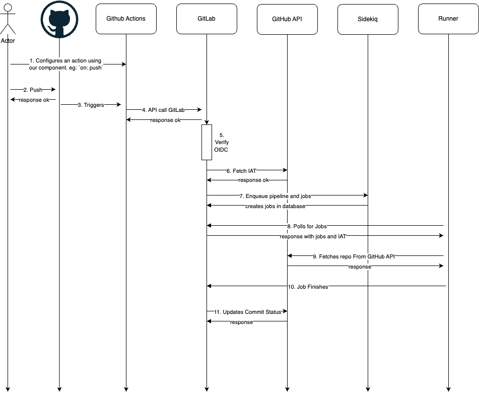



## Summary

Some customers using GitHub Source Code Management want to integrate with GitLab's CI solutions to run pipelines and leverage our security features. They do not want to mirror the source code on GitLab and want instantaneous pipelines for their pushes.

## Motivation

Our current approach with GitHub <-> GitLab integration is with mirroring at a minimum 5 minute interval. This is too slow for feedback, uses long lived personal access tokens, and requires a copy of GitHub's source code on GitLab. Additionally, as the entire project and all pipelines are run under the user that initiates the integration; this could lead to a permission mismatch.

With an effective solution, we can sell GitLab CI/CD and other Ops features to business that use GitHub as a source control management tool.

CI tools in the market currently use GitHub source to run CI/CD externally. [Buildkite, CircleCi, TeamCity, Jenkins](https://GitLab.com/GitLab-org/GitLab/-/issues/460503#note_2115425859) are examples where the runner pulls directly from GitHub. In such examples, the pipeline config file can live either on GitHub or in the services.

### Goals

As an initial MVC we want to support

1. A GitHub App (on GitHub's marketplace - this doesn't need to be in MVP, users can install with a direct link)
1. A GitHub Action Integration (on GitHub marketplace)
1. Near instant pipeline creation upon GitHub pushes
1. We will only be communicating with GitHub via short lived tokens
1. Correct user management system, through direct user mapping
    1. Each user on GitHub's side should have a billable seat on GitLab
    1. GitLab users should have the least privilege needed to run pipelines
1. Runners are the only place to interact (fetch/pull) with the source code
    1. Customer source code is stored in a GitHub Repo and is never stored in a GitLab repo

### Non-Goals

Items that are out of scope (For MVP) include

1. GitLab Self-Managed
    1. Why: This should be quite do-able. Assuming we have docs for SM users to set-up. We _should_ get this from the MVP
1. GitHub Enterprise
    1. Why: This will require extra set-up, licensing, testing, and manual configurations as GitHubApp and Actions are different on the Enterprise level
1. GitLab Security Scans, Pipeline execution policies, Merge Request widgets from artifacts (Junit/Cobertura)
    1. Why: Because the source code is in GitHub and our scans only work natively there'll be extra work to fetch and analyze the code
    1. Similary for the MR widget, since the Merge Request is on GitHub side we can't modify it

These are do-able, but just to reduce scope and complexity we can iterate on additional features.

## Proposal

GitHub will communicate with GitLab via our GitHub Actions along with an OIDC and GitHub token.
Once we receive the API request, we will generate short lived tokens Installation Access Tokens with our GitHub App.
We will verify the OIDC token and check if the user has permission to create pipelines.
When runners poll GitLab looking for jobs, we will use these tokens for the runner to directly fetch from GitHub.
GitLab will then use GitHub's API to update the commit with the pipeline status.

Unfortunately there's nuances to this diagram regarding user management and access tokens that we'll explore below.

## Design and implementation details

### Prerequisites

To start off this whole process. The 'project owner' of the GitHub organization would start off creating projects in GitLab that would need linking.

We would reuse [CI/CD For External Repositories](https://GitLab.com/projects/new#cicd_for_external_repo), and have a "checkbox" to not mirror the repository (UI pending). During the import we'll save the GitHub repository id. [Issue for discussion](https://GitLab.com/GitLab-org/GitLab/-/issues/509200)

After import, we would automatically enable a new GitLab integration called GitHub SCM for these projects.

Then the customer will use a direct link to install our GitHub App, and choose which repos on GitHub to install it on.
The customer will also need to use our GitHub Actions for the repositories

Each user that wants to run a pipeline on GitLab must first connect their GitLab account with GitHub. We have external account linking on GitLab -> Preferences -> Account -> Connect GitHub

### Once everything is set-up properly

The steps here will be in accordance with the diagram above

1. User configures a GitHub action workflow using our GitHub Action component
    1. This enables starting a pipeline [for many triggers](https://docs.GitHub.com/en/actions/writing-workflows/choosing-when-your-workflow-runs/events-that-trigger-workflows) (pull requests, pushes, issues, etc)
1. User on GitHub initiates one of these triggers
1. GitHub will automatically create a GitHub action per their `.workflow` yaml file
1. This GitHub action using our component will make an API call to our GitLab server with
    1. User OIDC token
    1. The GitHub Token for validating the request
    1. The `.gitlab-ci.yml` file
    1. The `sha, ref, commit_message, repo_url, repo_id` parameters
    1. The names of the GitHub variables they want to use
1. We will [verify the OIDC](https://docs.github.com/en/actions/security-for-github-actions/security-hardening-your-deployments/about-security-hardening-with-openid-connect) to get the `user_id`
    1. Map this GitHub `user_id` with GitLab user and see if they have permission to create pipelines
    1. Even if they do not, we will create a pipeline that fails immediately. This way the pipeline can be retried by a maintainer manually. This is helpful for bot pushes on GitHub.
1. GitLab will use our GitHub App to retrieve an [Installation Access Token (IAT)](https://docs.github.com/en/apps/creating-github-apps/authenticating-with-a-github-app/authenticating-as-a-github-app-installation) for that repository.
    1. This'll give us a short lived (1hr) token we can use for runners
    1. We will use this IAT to fetch secrets/variables for the repository
1. GitLab will use the IAT to update GitHub with a pending pipeline for that commit.
    1. This can create duplicate pipelines for the same commit on GitHub if the `.workflow` file isn't handled properly. We will have docs for this
1. GitLab will create sidekiq jobs for pipeline and job creation. They will have the necessary parameters to fetch directly from GitHub
1. Runner pulls for jobs as normal, and receive the next job in queue
1. Runner will pull the repository directly from GitHub using the IAT and `repo_url`
1. When the last job is completed the pipeline status on GitLab updates
1. GitLab will use the IAT to post a commit on GitHub to the pipeline's sha. Notifying them the commit has a finished pipeline.
    1. [GitHub commit status API](https://docs.GitHub.com/en/rest/commits/statuses?apiVersion=2022-11-28#create-a-commit-status)
    1. This is why we need a GitHub SCM integration enabled on the project
    1. We will also revoke the IAT token so it can no longer be used

## Alternative Solutions

For Step 5.

Another idea is to use [service accounts](https://docs.GitLab.com/ee/user/profile/service_accounts.html). Have the customer create a service account they want to use and assign it to a project with the permission set or [custom role](https://docs.GitLab.com/ee/user/custom_roles.html). Then we'll have a UI allowing them to select which service account they want to use for these GitHub webhook actions.

This'll need composite identities, as cross-project pipelines can exist. Additionally, there'll be extra considerations for billing as GitHub users can share GitLab seats

For Step 6.

Because IAT are limited to 1 hour. GitHub App also supports OAuth Access Tokens which has an 8 hour expiry.

This is tricky as each user needs to authorize OAuth manually. [Authenticating GitHubApp as a User](https://docs.GitHub.com/en/apps/creating-GitHub-apps/authenticating-with-a-GitHub-app/authenticating-with-a-GitHub-app-on-behalf-of-a-user). And there is extra work involved with handling refresh tokens on behalf of the user.

Alternatively, using only OIDC doesn't work, as we need to consider GitLab <-> GitHub user mapping instead of just trusting GitHub requests.

## Questions for Reviewers

1. Compliance Question: Do we need additional terms and conditions depending on how we run & keep GitHub code?
    1. As the job logs will be kept on GitLab side
    1. Answer: (Rutshah) should be okay to keep job logs
2. Compliance Question/PM: Some customers don't want anything else aside from runner interacting with the source code. This requirement is unclear; does referencing, have snipplets of file/artifact names in the job logs invalidate this reqirement?
