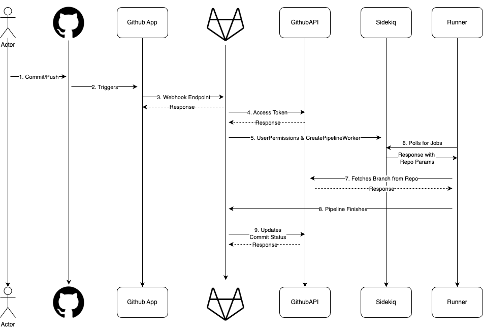



## Summary

Some customers using Github Source Code Management want to integrate with Gitlab's CI solutions to run pipelines and leverage our security features. They do not want to mirror the source code on Gitlab and want instantaneous pipelines for their pushes.

## Motivation

Our current approach with Github <-> Gitlab integration is with mirroring at a minimum 5 minute interval. This is too slow for feedback, uses long lived personal access tokens, and requires a copy of GitHub's source code on GitLab. Additionally, as the entire project and all pipelines are run under the user that initiates the integration; this could lead to permission mismatch.

With an effective solution, we can sell GitLab CI/CD and other Ops features to business that use GitHub source control.

There are similar tools in the market that can be used for GitHub to run CI/CD externally. [Buildkite, CircleCi, TeamCity, Jenkins](https://gitlab.com/gitlab-org/gitlab/-/issues/460503#note_2115425859) are examples where the runner pulls directly from GitHub. And where the pipelines config file can live either on GitHub or in the services.

### Goals

As an initial MVC we want to support

1. A GitHub App on GitHub's marketplace
2. Near instant pipeline creation upon GitHub pushes
3. Correct user management system, through direct user mapping
    1. Each user on GitHub's side should have a billable seat on GitLab
    2. Gitlab users should have the least privilege needed to run pipelines
4. Runners are the only place to interact (fetch/pull) with the source code
    1. Customer source code is stored in a GitHub Repo and is never stored in a GitLab repo

### Non-Goals

Items that are out of scope (For MVP) include

1. Github Enterprise
    1. Why: This will require extra set-up, licensing, testing, and manual configurations as GithubApps are different on the Enterprise level
2. Gitlab Self-Managed
    1. Why: This should be quite do-able. Assuming we have docs for SM users to set-up. We _should_ get this from the MVP
3. Gitlab Security Scans, and execution policies
    1. Why: Similarly to the above, we _should_ get this for free as well. But because of the additional integration and cross team collaboration, if this doesn't work; the time spent might overwhelm the MVP.
4. Different actions on GitHub side that might want/require CI such as
    1. Forks
    2. Tags
    3. Branch name changes, [etc](https://gitlab.com/gitlab-org/gitlab/-/issues/493378#future-iterations)
    4. Why: These are bit more complex as they rely on different webhooks as well as sha configurations

These are do-able, but just to reduce scope and complexity we can iterate on additional features.

## Proposal

Github will communicate with Gitlab via our GithubApp available on the GitHub marketplace
When runners poll GitLab's api, GitLab will serialize the jobs including the GitHub repo location for the runner to fetch the code from.
Gitlab will then use Github's API to update the commit with the pipeline status.

Unfortunately there's nuances to this diagram regarding user management and access tokens that we'll explore below.

## Design and implementation details

The steps here will be in accordance with the diagram above

1. User on Github initiates a push to a branch
2. Github will automatically trigger a webhook via our GithubApp. This'll send a `push` payload to Gitlab
    1. [Gitlab Webhook Push Payload](https://docs.github.com/en/webhooks/webhook-events-and-payloads#push)
3. Gitlab will receive the push payload.
4. Gitlab will use Installation Access Tokens (IAT) to exchange for a short lived token (1hr max)
    1. [Github docs for IAT](https://docs.github.com/en/apps/creating-github-apps/authenticating-with-a-github-app/authenticating-as-a-github-app-installation)
    1. Each GitHub project will come with an Installation ID. GitLab will use a secure `.pem` key with this Installation ID to get a short-lived token for that project.
5. Gitlab will use the webhook details for which email did the push. And try to run a pipeline with that user on Gitlab's side. If the user does not exist, the pipeline will be created but in a failed status. Any maintainer of the project can then retry the pipeline.
    1. The pipeline will be generated from a `.gitlab-ci.yml` present on Gitlab.com side.
6. Rails will pass the necessary params including the IAT to the runner. It will also update the pipeline on Github side to "running" via Github API and IAT.
7. The runner will directly call GitHub with the IAT to fetch and pull the repository for that branch
8. When the pipeline finishes, runner will update Gitlab as normal
9. Gitlab will use the IAT to post a commit on Github with the pipeline's sha. Notifying them the commit has a finished pipeline.
    1. [Github commit status API](https://docs.github.com/en/rest/commits/statuses?apiVersion=2022-11-28#create-a-commit-status)

**Step 5 expanded:**

There are many ways this authorization could play out. More details in [Corresponding Implementation Issue](https://gitlab.com/gitlab-org/gitlab/-/issues/505056).

We will enforce a 1:1 user mapping on Github <-> Gitlab. Currently this is product's preferred approach. This allows us to make sure the product is properly licensed with the correct number of seats.

The downside is that users or bot accounts that do not have a Gitlab account mapping will not be able to run pipelines. The workaround is to create a failed pipeline that maintainers can manually run.

**Step 5.1** - Since the `gitlab-ci.yml` is on Gitlab.com, this should allow many of the features to work automatically. Although this creates overhead as the source code is not in sync with the pipeline configuration.

To help with this, we'll run the `gitlab-ci.yml` file on the pushed branch if it exists, and default to `main` if it doesn't. This will allow for easier `gitlab-ci.yml` testing, even though it could lead to more #master-broken incidents as merge to master conditions would be different.

## Alternative Solutions

For Step 4.

Another option is for the Github App to use Oauth Access Tokens. This'll require each user on Github's side to explicity authenticate with the GithubApp.

There is extra work involved here as the user needs to be created on Gitlab's side. Additionally, we'll need to support the ability to refresh user tokens. This doesn't seem to be needed currently, as this integration won't need to update Github as a specific user.

[Authenticating GithubApp as a User](https://docs.github.com/en/apps/creating-github-apps/authenticating-with-a-github-app/authenticating-with-a-github-app-on-behalf-of-a-user)

For Step 5.

Another idea is to use [service accounts](https://docs.gitlab.com/ee/user/profile/service_accounts.html). Have the customer create a service account they want to use and assign it to a project with the permission set or [custom role](https://docs.gitlab.com/ee/user/custom_roles.html). Then we'll have a UI allowing them to select which service account they want to use for these Github webhook actions.

This'll need composite identities, as cross-project pipelines can exist.

For Step 5-1.

We could have the `gitlab-ci.yml` file hosted externally on Github.com. Only this file will then be pulled in when a webhook is triggered. This'll keep the source code and config file in sync.

Although there is more work and more uncertainty with this approach. The `includes:` yaml definition would not work, similarly cross-pipeline configs, security scans, execution policies would need additional patching to work.

There is a use-case for this, so maybe we can push this to a post-mvp feature.

## Questions for Reviewers

1. Security Question: Do we need additional terms and conditions depending on how we run & keep Github code?
    1. As the job logs will be kept on Gitlab side
2. Security Question/PM: Some customers don't want anything else aside from runner interacting with the source code. This requirement is unclear; does referencing, have snipplets of file/artifact names in the job logs invalidate this reqirement?
