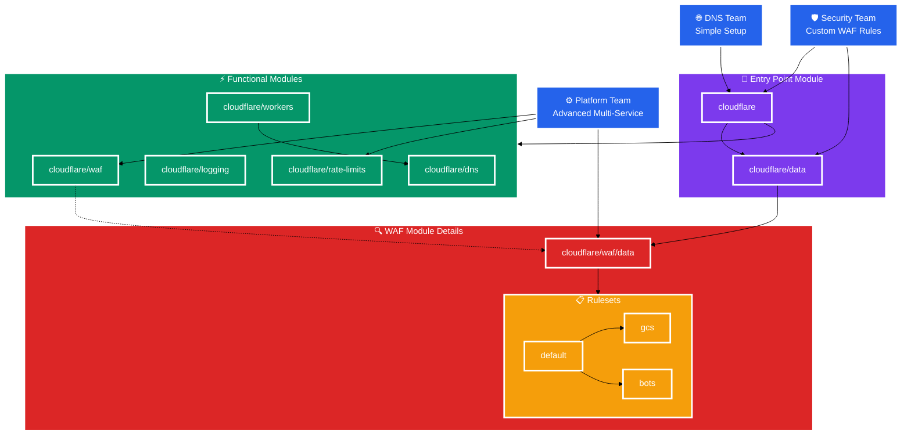

<!--
Before you start:

- Copy this file to a sub-directory and call it `_index.md` for it to appear in
  the design documents list.
- Remove comment blocks for sections you've filled in.
  When your document ready for review, all of these comment blocks should be
  removed.

To get started with a document you can use this template to inform you about
what you may want to document in it at the beginning. This content will change
/ evolve as you move forward with the proposal.  You are not constrained by the
content in this template. If you have a good idea about what should be in your
document, you can ignore the template, but if you don't know yet what should
be in it, this template might be handy.

- **Fill out this file as best you can.** At minimum, you should fill in the
  "Summary", and "Motivation" sections.  These can be brief and may be a copy
  of issue or epic descriptions if the initiative is already on Product's
  roadmap.
- **Create a MR for this document.** Assign it to an Architecture Evolution
  Coach (i.e. a Principal+ engineer).
- **Merge early and iterate.** Avoid getting hung up on specific details and
  instead aim to get the goals of the document clarified and merged quickly.
  The best way to do this is to just start with the high-level sections and fill
  out details incrementally in subsequent MRs.

Just because a document is merged does not mean it is complete or approved.
Any document is a working document and subject to change at any time.

When editing documents, aim for tightly-scoped, single-topic MRs to keep
discussions focused. If you disagree with what is already in a document, open a
new MR with suggested changes.

If there are new details that belong in the document, edit the document. Once
a feature has become "implemented", major changes should get new blueprints.

The canonical place for the latest set of instructions (and the likely source
of this file) is
[content/handbook/engineering/architecture/design-documents/_template.md](https://gitlab.com/gitlab-com/content-sites/handbook/-/blob/main/content/handbook/engineering/architecture/design-documents/_template.md).

Document statuses you can use:

- "proposed"
- "accepted"
- "ongoing"
- "implemented"
- "postponed"
- "rejected"

-->

<!-- Design Documents often contain forward-looking statements -->
<!-- vale gitlab.FutureTense = NO -->

<!-- This renders the design document header on the detail page, so don't remove it-->


<!--
Don't add a h1 headline. It'll be added automatically from the title front matter attribute.

For long pages, consider creating a table of contents.
-->

## Summary

This document describes the architecture and implementation approach for
standardized Terraform modules that provide a consistent, secure, and extensible
interface to Cloudflare configuration across GitLab's internal teams. As
GitLab's edge networking needs grow and more teams adopt Cloudflare, we need a
standardized approach that enables teams to implement robust edge networking
solutions while maintaining security and operational excellence.

The proposed solution delivers a hierarchical set of reusable Terraform modules
with sensible defaults, comprehensive documentation, and clear upgrade
paths. This standardization will enable teams to leverage Cloudflare's
capabilities effectively while ensuring consistent security posture and reducing
implementation complexity across the organization.

## Motivation

GitLab's usage of Cloudflare as our preferred edge networking provider continues
to grow, with multiple teams implementing solutions for DNS management, WAF
configuration, and worker deployments across our infrastructure estate.

As we move toward a more mature GitLab platform where we standardize our
infrastructure offerings with a platform-first mindset, establishing consistent
patterns for Cloudflare management will provide significant strategic value. A
unified approach will create a single point for implementing generic security
improvements, compliance updates, and feature enhancements across our Cloudflare
Infrastructure as Code estate. This enables faster response to security threats,
streamlined compliance management, and more efficient feature rollouts. This can
be seen with the move to using the
[`cloudflare-waf-rules`](https://gitlab.com/gitlab-com/gl-infra/terraform-modules/cloudflare/cloudflare-waf-rules)
module for WAF rules and rate limit configuration. Iterating on and expanding
this approach will allow us to support more Cloudflare functionality and improve
our ability to support configuration of our edge network.

While teams using direct Terraform resource configurations have addressed their
specific use cases, the emergence of multiple implementation patterns creates an
opportunity to establish a more unified and scalable foundation that can benefit
all teams.

This initiative directly supports the Foundations team's mission to provide
excellence in networking infrastructure with sustainable, long-term
solutions. By creating a "golden path" for Cloudflare implementation, we can
empower teams to leverage our collective expertise in edge networking while
maintaining the flexibility to address their specific requirements.

This approach also positions us well for upcoming maintenance work, including
upgrading the Cloudflare provider, allowing us to implement a coordinated,
reduced-risk upgrade process across all implementations. The standardization
effort aligns with GitLab's platform strategy of providing consistently secure
and compliant infrastructure foundations. Through comprehensive testing,
documentation, and clear upgrade processes, we can enable teams to implement and
maintain their Cloudflare configurations independently while ensuring
organizational consistency and security standards.

### Goals

- Enable teams to implement robust edge networking solutions through our
  preferred partner, Cloudflare
- Establish consistent security and compliance standards across all Cloudflare
  implementations
- Create a collaborative relationship where the Foundations team provides
  expertise and tooling while teams maintain ownership of their specific
  implementations
- Deliver flexible and extensible modular configurations that accommodate both
  common use cases and specialized requirements
- Accelerate team velocity by providing well-documented, tested infrastructure
  patterns
- Establish a foundation for efficient upgrades and security improvements across
  all implementations

### Non-Goals

- Standardizing non-Terraform Cloudflare configurations - our focus is
  specifically on infrastructure-as-code implementations
- Creating team-specific implementations; instead, we will provide the
  foundational modules that teams can use to build their own solutions
- Managing the day-to-day operations of each team's specific Cloudflare
  configurations
- Replicating Cloudflare functionality within GitLab's product offerings

## Proposal

We propose developing a comprehensive set of standardized Terraform modules that
provide teams with a robust, secure, and extensible foundation for implementing
solutions through Cloudflare configuration. This approach will balance
centralized expertise with team autonomy, creating a sustainable platform for
edge networking across GitLab.

Our solution centers on creating a hierarchical module structure that serves
teams with varying needs and expertise levels. Teams looking for quick
implementation can use our main entry-point module with carefully chosen
defaults, while teams with specialized requirements can leverage our sub-modules
for finer control over their implementation structure. This flexibility ensures
that both common use cases and complex requirements are well-supported.

The modules will embody GitLab's infrastructure-as-code principles, with
consistent interfaces, comprehensive testing, and extensive documentation. By
establishing clear patterns and providing working examples, we enable teams to
implement Cloudflare solutions confidently while maintaining organizational
standards for security and compliance. This initiative will establish a
sustainable foundation for Cloudflare usage across GitLab, with support for safe
upgrades, consistent security practices, and collaborative improvement over
time.

### Core Components

The proposed solution centers around a hierarchical Terraform module structure
that provides a main entry-point module for common use cases with sensible
defaults. This will be complemented by specialized sub-modules for teams that
need finer control over specific aspects of their Cloudflare
configuration. Additionally, we will create data-only modules to provide
standardized configuration patterns that can be reused across implementations.

A key aspect of our approach is establishing a standardized interface for the
same functionality across modules. This includes consistent variable naming and
structure, clear input/output definitions, and robust type validation to prevent
configuration errors. By maintaining a consistent interface, we ensure that
teams can easily understand and extend their configurations as needed.

Security will be a priority in our design, with pre-configured security settings
aligned with GitLab's requirements built into the modules. This includes [WAF
rule sets](https://developers.cloudflare.com/waf/) optimized for common GitLab
application patterns and rate limiting configurations to prevent abuse. By
establishing secure defaults, we ensure that all Cloudflare implementations
maintain a baseline level of security.

Comprehensive documentation will be a critical component of this initiative. We
will provide usage examples for common scenarios, clear guidance on extending
modules for custom needs, and troubleshooting guides with best practices. This
documentation will enable teams to self-serve their Cloudflare needs without
requiring extensive support from the Foundations team.

### Module Development Principles

Our modules will adhere to several key principles to ensure their long-term
success. We will implement a "leaky abstraction" approach, where we build upon
Cloudflare's existing provider and API structure, providing a reasonable
starting point for our abstraction while allowing direct access when
needed. This allows us to leverage Cloudflare's existing documentation and
reduce the depth required in our own documentation.

Maps, objects, and lists will be the primary interface to modules, as these are
generally more flexible than scalar alternatives and avoid the need for
synchronized updates across multiple modules when new options are added.

Backward compatibility will be a top priority, with strict versioning using
semantic versioning principles. Breaking changes will only be introduced in
major version upgrades, and we will provide deprecation notices with clear
migration paths when interfaces need to change. Automated tests will validate
backward compatibility and ensure that upgrades are safe and predictable.

A self-service focus will guide our design decisions, empowering teams to
implement and maintain their own configurations through thorough documentation
and intuitive interfaces.

### Success Metrics

The effectiveness of this initiative will be demonstrated through several key
indicators of organizational capability and team empowerment. We expect to see
teams successfully implementing Cloudflare solutions independently, with
consistent application of security standards across all implementations
strengthening our overall security posture.

Team satisfaction and confidence in using our Cloudflare modules will be
measured through feedback sessions and adoption rates.

## Design and implementation details

We will develop a hierarchical structure of Terraform modules to provide
standardized interfaces to Cloudflare configurations. The structure consists of
several layers, beginning with a root module (`cloudflare`) that serves as the
primary entry point for most users. This module will provide sensible defaults
and simplified configuration for common use cases, making it accessible for
teams with straightforward needs.

Beneath the root module, we will implement several standalone modules that
specialize in a specific Cloudflare functionality area. Examples include
`cloudflare/dns` for DNS configuration, `cloudflare/waf` for Web Application
Firewall configuration, and `cloudflare/rate-limits` for rate limiting
rules. These specialized modules allow teams to focus on the specific Cloudflare
features they need when more implementation flexibility is required.

When we observe common configuration patterns emerging across implementations,
we will document these use cases, and for very common instances we will develop
generic use-case modules. These modules will be based on the core `cloudflare`
module and may implement patterns such as simple DNS configuration or Worker
implementations.

To support customization without sacrificing standardization, we will create
reusable configuration options in `cloudflare/data/*` sub-modules. These data
sub-modules will allow teams to self-serve by building on top of common usage
patterns with their own specialization requirements while maintaining
consistency with organizational standards. An example is WAF rules, where sets
of WAF rules may be common across many instances but are not appropriate for all
consumers. Where we are building distinct sets of configuration (e.g., multiple
rulesets), we will also build a `default` configuration for ease of use and
extensibility.

### Module Relationships

### Versioning and Compatibility

To ensure stability and reliability for teams using our modules, we will
implement a robust versioning strategy. This includes following semantic
versioning for all modules, maintaining backward compatibility within major
versions, documenting breaking changes and migration paths between major
versions, and providing deprecation notices with transition periods when
interfaces need to change. This approach will allow teams to upgrade their
implementations with confidence, knowing that they won't experience unexpected
breakages.

### Documentation Strategy

Comprehensive documentation is essential for the success of this initiative. We
will provide detailed README files for each module, explaining its purpose,
inputs, outputs, and example usage. For common use cases, we will create example
configurations that teams can use as starting points for their own
implementations. When major version changes occur, we will provide upgrade
guides that walk teams through the process of migrating to the new
version. Additionally, we will create internal knowledge base articles for
GitLab-specific implementations, addressing unique requirements and
considerations for our environment.

## Alternative Solutions

### Continue with Custom Implementations Per Team

Continuing with the current approach of custom implementations per team would
have several advantages and disadvantages:

**Pros:**

- Teams maintain complete control over their configurations
- No upfront investment required
- Faster implementation for teams with immediate needs

**Cons:**

- Inconsistent security and compliance practices
- Duplicate effort across teams
- Higher risk of configuration drift over time
- Growing maintenance support burden as more teams adopt Cloudflare

### Fully Centralized Cloudflare Configuration

An alternative approach would be to fully centralize Cloudflare configuration
management within a single repository.

**Pros:**

- Maximum standardization and control
- Consistent security posture
- Single point of maintenance
- Simplified compliance auditing

**Cons:**

- Reduced maintainability for teams with unique requirements
- Creates bottleneck for changes on the maintaining team
- Does not foster self-service culture
- May slow down teams with time-sensitive requirements
