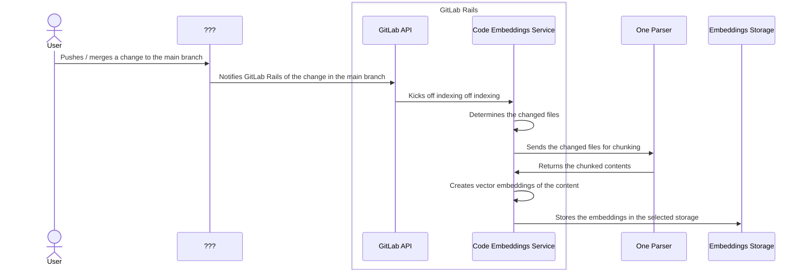
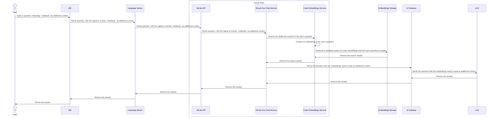

---
# This is the title of your design document. Keep it short, simple, and descriptive. A
# good title can help communicate what the design document is and should be considered
# as part of any review.
title: Codebase as Chat Context
status: proposed
creation-date: "2025-04-02"
authors: [ "@partiaga", "@tgao3701908" ]
coaches: []
dris: [ "@jordanjanes", "@mnohr" ]
owning-stage: "~devops::create"
participating-stages: []
# Hides this page in the left sidebar. Recommended so we don't pollute it.
toc_hide: true
---

<!--
Before you start:

- Copy this file to a sub-directory and call it `_index.md` for it to appear in
  the design documents list.
- Remove comment blocks for sections you've filled in.
  When your document ready for review, all of these comment blocks should be
  removed.

To get started with a document you can use this template to inform you about
what you may want to document in it at the beginning. This content will change
/ evolve as you move forward with the proposal.  You are not constrained by the
content in this template. If you have a good idea about what should be in your
document, you can ignore the template, but if you don't know yet what should
be in it, this template might be handy.

- **Fill out this file as best you can.** At minimum, you should fill in the
  "Summary", and "Motivation" sections.  These can be brief and may be a copy
  of issue or epic descriptions if the initiative is already on Product's
  roadmap.
- **Create a MR for this document.** Assign it to an Architecture Evolution
  Coach (i.e. a Principal+ engineer).
- **Merge early and iterate.** Avoid getting hung up on specific details and
  instead aim to get the goals of the document clarified and merged quickly.
  The best way to do this is to just start with the high-level sections and fill
  out details incrementally in subsequent MRs.

Just because a document is merged does not mean it is complete or approved.
Any document is a working document and subject to change at any time.

When editing documents, aim for tightly-scoped, single-topic MRs to keep
discussions focused. If you disagree with what is already in a document, open a
new MR with suggested changes.

If there are new details that belong in the document, edit the document. Once
a feature has become "implemented", major changes should get new blueprints.

The canonical place for the latest set of instructions (and the likely source
of this file) is
[content/handbook/engineering/architecture/design-documents/_template.md](https://gitlab.com/gitlab-com/content-sites/handbook/-/blob/main/content/handbook/engineering/architecture/design-documents/_template.md).

Document statuses you can use:

- "proposed"
- "accepted"
- "ongoing"
- "implemented"
- "postponed"
- "rejected"

-->

<!-- Design Documents often contain forward-looking statements -->
<!-- vale gitlab.FutureTense = NO -->

<!-- This renders the design document header on the detail page, so don't remove it-->


<!--
Don't add a h1 headline. It'll be added automatically from the title front matter attribute.

For long pages, consider creating a table of contents.
-->

## Summary

We are introducing the capability to include **codebase** as an **additional context** to **[Duo Chat](https://docs.gitlab.com/user/gitlab_duo_chat/) requests**.

To achieve this, we are leveraging the [AI Context Abstraction Layer](../ai_context_abstraction_layer/) to index the codebase as vector embeddings, referred to as _Code Embeddings_. When the user asks a question on Duo Chat, the system executes a semantic search over the Code Embeddings to retrieve relevant context from repositories, which is then processed by large language models to generate helpful responses.

## Motivation

<!--
This section is for explicitly listing the motivation, goals and non-goals of
this document. Describe why the change is important, all the opportunities,
and the benefits to users.

The motivation section can optionally provide links to issues that demonstrate
interest in a document within the wider GitLab community. Links to
documentation for competing products and services is also encouraged in cases
where they demonstrate clear gaps in the functionality GitLab provides.

For concrete proposals we recommend laying out goals and non-goals explicitly,
but this section may be framed in terms of problem statements, challenges, or
opportunities. The latter may be a more suitable framework in cases where the
problem is not well-defined or design details not yet established.
-->

Currently, we don't do a great job of helping customers understand their repository and code base. [Duo](https://docs.gitlab.com/user/gitlab_duo/) users can select and ask questions about specific code blocks, or ask questions of 1 or more files via `/include`. Competitors support a broader aperture -- a user can ask questions about an entire repository, or scope the context to multiple folders, multiple files, and portions of code. This functional gap is commonly mentioned by customers, and here's a [recent summary](https://docs.google.com/presentation/d/1oyuqOCzR4wzWa6Llo-EwwHdsTxMetd17X9bPYf-YMHA/edit#slide=id.g32a4294fe40_0_77) of research in this space.

This initiative aims to bridge a critical functional gap in GitLab's [Duo Chat](https://docs.gitlab.com/user/gitlab_duo_chat/) offering by enabling users to interact with their entire codebase through natural language queries. This capability allows users to more effectively understand, navigate, and plan changes to their repositories -- a feature already offered by competing products.

### Goals

<!--
List the specific goals / opportunities of the document.

- What is it trying to achieve?
- How will we know that this has succeeded?
- What are other less tangible opportunities here?
-->

The main goal is to add the codebase as additional context to Duo Chat. The MVC is supported by semantic search over code embeddings via the [AI Context Abstraction Layer](../ai_context_abstraction_layer/).

The creation of code embeddings is included in the initial scope of this work. When indexing repositories, the main branch _as well as_ feature branches should be included.

### Non-Goals

<!--
Listing non-goals helps to focus discussion and make progress. This section is
optional.

- What is out of scope for this document?
-->

The following is out of scope for this initiative, but could theoretically be built upon it:

- Support for indexing and querying locally changed files as vector embeddings.
- A Knowledge Graph representation of the codebase as additional context to Duo Chat.
- Codebase as additional context for Code Suggestions.

## Proposal

<!--
This is where we get down to the specifics of what the proposal actually is,
but keep it simple!  This should have enough detail that reviewers can
understand exactly what you're proposing, but should not include things like
API designs or implementation. The "Design Details" section below is for the
real nitty-gritty.

You might want to consider including the pros and cons of the proposed solution so that they can be
compared with the pros and cons of alternatives.
-->

### Iterations

- Phase 1: Support code embeddings on the main branch
- Phase 2: Support code embeddings on feature branches
- Phase 3: (Optional) Support code embeddings on the local IDE / Language Server

### Components

#### Code Embeddings

We are using the [AI Context Abstraction Layer](../ai_context_abstraction_layer/) to index repositories as code embeddings. We are using the One Parser, a common library shared with the Knowledge Graph initiative, to chunk the code files into logical elements, such as classes or functions.

On Phase 1, the indexing is triggered every time there is a merge to the main branch.

On Phase 2, the indexing is triggered when there is a commit pushed to the feature branch.

On Phase 3 (optional), local file changes are included in the codebase context.

#### Codebase as Chat Context - Backend

Given a Chat question, a semantic search is done over the code embeddings through the [AI Context Abstraction Layer](../ai_context_abstraction_layer/). The result from this search is then used to enhance the chat request sent to the AI model.

On Phase 1, the query is done over the code embeddings of the main branch.

On Phase 2, the query is done over the code embeddings of the main branch + the feature branch, with the results from feature branches being prioritized.

On Phase 3 (optional), the query is done over the code embeddings of the main branch + the feature branch + the local changes. The priority order will be: local changes, feature branch, main branch.

#### Codebase as Chat Context - Frontend

[See UI Design](https://gitlab.com/gitlab-org/gitlab/-/issues/523960).

## Design and implementation details

<!--
This section should contain enough information that the specifics of your
change are understandable. This may include API specs (though not always
required) or even code snippets. If there's any ambiguity about HOW your
proposal will be implemented, this is the place to discuss them.

If you are not sure how many implementation details you should include in the
document, the rule of thumb here is to provide enough context for people to
understand the proposal. As you move forward with the implementation, you may
need to add more implementation details to the document, as those may become
valuable context for important technical decisions made along the way. A
document is also a register of such technical decisions. If a technical
decision requires additional context before it can be made, you probably should
document this context in a document. If it is a small technical decision that
can be made in a merge request by an author and a maintainer, you probably do
not need to document it here. The impact a technical decision will have is
another helpful information - if a technical decision is very impactful,
documenting it, along with associated implementation details, is advisable.

If it's helpful to include workflow diagrams or any other related images.
Diagrams authored in GitLab flavored markdown are preferred. In cases where
that is not feasible, images should be placed under `images/` in the same
directory as the `index.md` for the proposal.
-->

### Code Embeddings

#### Phase 1 - indexing the main branch

_Note: the **Code Embeddings Service** makes use of the framework provided by the **AI Context Abstraction Layer**. This layer sends request to the AI Gateway to generate vector embeddings. That particular part of the workflow is not illustrated here._

### Codebase as Chat Context

_Note: the **Code Embeddings Service**  make use of the framework provided by the **AI Context Abstraction Layer**. This layer sends request to the AI Gateway to generate vector embeddings. That particular part of the workflow is not illustrated here._

## Alternative Solutions

<!--
It might be a good idea to include a list of alternative solutions or paths considered, although it is not required. Include pros and cons for
each alternative solution/path.

"Do nothing" and its pros and cons could be included in the list too.
-->
