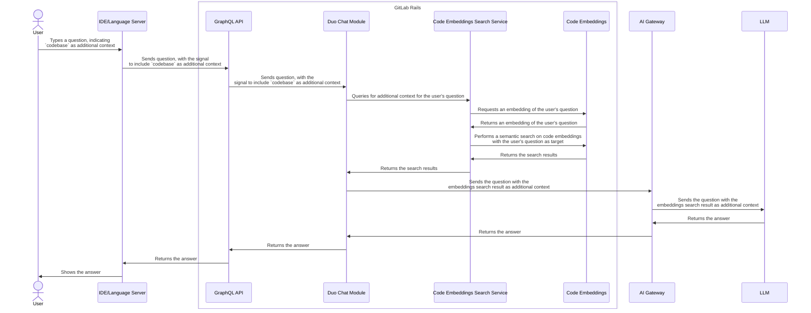

---
# This is the title of your design document. Keep it short, simple, and descriptive. A
# good title can help communicate what the design document is and should be considered
# as part of any review.
title: Codebase as Chat Context
status: proposed
creation-date: "2025-04-02"
authors: [ "@partiaga", "@tgao3701908" ]
coaches: [ "@jessieay" ]
dris: [ "@jordanjanes", "@mnohr" ]
owning-stage: "~devops::create"
participating-stages: []
# Hides this page in the left sidebar. Recommended so we don't pollute it.
toc_hide: true
---

<!--

The canonical place for the latest set of instructions (and the likely source
of this file) is
[content/handbook/engineering/architecture/design-documents/_template.md](https://gitlab.com/gitlab-com/content-sites/handbook/-/blob/main/content/handbook/engineering/architecture/design-documents/_template.md).

Document statuses you can use:

- "proposed"
- "accepted"
- "ongoing"
- "implemented"
- "postponed"
- "rejected"

-->

<!-- Design Documents often contain forward-looking statements -->
<!-- vale gitlab.FutureTense = NO -->

<!-- This renders the design document header on the detail page, so don't remove it-->


<!--
Don't add a h1 headline. It'll be added automatically from the title front matter attribute.

For long pages, consider creating a table of contents.
-->

## Summary

We are introducing the capability to include **Codebase** as an **additional context** to **[Duo Chat](https://docs.gitlab.com/user/gitlab_duo_chat/) requests**.

To achieve this, we will index the codebase as vector embeddings, referred to as **Code Embeddings**.

When the user asks a question on Duo Chat, the system executes a semantic search over the Code Embeddings to retrieve relevant context from repositories, which is then processed by large language models to generate helpful responses.

This new feature will be available to GitLab **Premium** or **Ultimate** users with the [**Duo Pro** or **Duo Enterprise**](https://docs.gitlab.com/subscriptions/subscription-add-ons/) add-ons.

**Epic:** The work for this feature is tracked in [this epic](https://gitlab.com/groups/gitlab-org/-/epics/16910).

## Motivation

Currently, we don't do a great job of helping customers understand their repository and code base. Competitors support a broader aperture -- a user can ask questions about an entire repository, or scope the context to multiple folders, multiple files, and portions of code. This functional gap is commonly mentioned by customers, and here's a [recent summary](https://docs.google.com/presentation/d/1oyuqOCzR4wzWa6Llo-EwwHdsTxMetd17X9bPYf-YMHA/edit#slide=id.g32a4294fe40_0_77) of research in this space. [LLM's are only as good as the context we give them](https://nmn.gl/blog/ai-understand-senior-developer), so it is important that we achieve parity with our competitors in this area.

This initiative aims to bridge this critical functional gap in GitLab's [Duo Chat](https://docs.gitlab.com/user/gitlab_duo_chat/) offering by enabling users to interact with their entire codebase through natural language queries. This capability allows users to more effectively understand, navigate, and plan changes to their repositories -- a feature already offered by competing products.

### Goals

The main goal is to add the Codebase as additional context to [Duo Chat](https://docs.gitlab.com/user/gitlab_duo_chat/).

The creation of code embeddings is included in the initial scope of this work.

- When indexing repositories, the main branch feature branches are included.
- We will only index repositories for projects or namespaces with [Duo enabled](https://docs.gitlab.com/user/get_started/getting_started_gitlab_duo/).

### Non-Goals

The following is out of scope for this initiative, but could theoretically be built upon it:

- Support for indexing and querying locally changed files as vector embeddings.
- A Knowledge Graph representation of the codebase as additional context to Duo Chat.
- Codebase as additional context for Code Suggestions.

_Please see [Next Steps and Future Proofing](#next-steps-and-future-proofing) for proposed plans regarding the above topics._

## Proposal

In order to support **Codebase as Chat Context**, we need to:

1. Introduce Code Embeddings
    - The changes are done on GitLab Rails, making use of the framework introduced by the [AI Context Abstraction Layer](../ai_context_abstraction_layer/).
    - This introduces the workflow to index the codebase as vector embeddings
    - This gives the ability to perform a semantic search over the embeddings
    - This will be developed in 2 phases:
        - Phase 1: Support code embeddings on the main branch
        - Phase 2: Support code embeddings on feature branches

1. Update [Duo Chat](https://docs.gitlab.com/user/gitlab_duo_chat/) to allow for setting the codebase as an additional context.
    - Both the Frontend and Backend part of Duo Chat will be updated.
    - Given a question entered on Duo Chat, a semantic search is done over the **Code Embeddings**, with the search result then used to enhance the Chat request sent to the AI model.

## Design and implementation details

### Components

This initiative introduces or updates the following components:

#### Code Embeddings

This is a module in the GitLab Rails monolith which will be introduced in this initiative.

This makes use of the framework provided by the [AI Context Abstraction Layer](../ai_context_abstraction_layer/) to index the files in the codebase as vector embeddings or to perform a search over those embeddings.

For further design and implementation details, please see the [**Code Embeddings** blueprint](./code_embeddings.md).

**Code Parser**

This is a library that does the chunking of code files into logical elements, such as classes or functions. This component will be shared with the **[Knowledge Graph](https://gitlab.com/groups/gitlab-org/-/epics/16210)** initiative.

The Code Parser lives in its own repository so that it can be used on the Backend and Frontend. For the Backend, we will wrap the Parser in a Ruby Gem to be used by the **Code Embeddings** module.

For further design and implementation details, please see the [One Parser proposal](https://gitlab.com/groups/gitlab-org/-/epics/16210).

#### Duo Chat

**[Duo Chat](https://docs.gitlab.com/user/gitlab_duo_chat/)** is already an existing AI feature on GitLab. This initiative enhances the feature such that:

Given a question entered on **Duo Chat**, a semantic search is done over the **Code Embeddings**, with the result then used as additional context to the Chat request sent to the AI model.

### Indexing the Codebase

TBA

### Adding the Codebase as Context on Duo Chat



#### Code Embeddings Search Service

This is a service class that handles the calls to the **Code Embeddings** module to perform a semantic search over the embeddings.

#### Duo Chat Changes - API

We need to add the following fields in the [`chat` input](https://docs.gitlab.com/api/graphql/reference/#aichatinput) of the [`aiAction`](https://docs.gitlab.com/api/graphql/reference/#mutationaiaction) GraphQL mutation:

- `useCodebaseAsContext` - a `boolean` value indicating whether to use the codebase as chat context
- `currentBranch` - a `string` value indicating the current branch the user is working on

The call to the mutation should then look like:

```graphql
mutation chat(
  $question: String!
  $resourceId: AiModelID
  $currentFileContext: AiCurrentFileInput
  $clientSubscriptionId: String
  $platformOrigin: String!
  $additionalContext: [AiAdditionalContextInput!]
  $useCodebaseAsContext: Boolean
  $currentBranch: String
) {
  aiAction(
    input: {
      chat: {
        resourceId: $resourceId
        content: $question
        currentFile: $currentFileContext
        additionalContext: $additionalContext
        useCodebaseAsContext: $useCodebaseAsContext
        currentBranch: $currentBranch
      }
      clientSubscriptionId: $clientSubscriptionId
      platformOrigin: $platformOrigin
    }
  ) {
    requestId
    errors
  }
}
```

#### Duo Chat Changes - Frontend

[See UI Design](https://gitlab.com/gitlab-org/gitlab/-/issues/523960).

## Evaluations

Codebase context enhancement can have different results depending on different factors such as the granularity of embeddings or the embeddings model used. Beyond the MVC iteration of this feature, we should evaluate the effectivity of different embeddings models, chunking granularity, and other approaches to embeddings.

### Possible approaches for evaluation

| Approach | Description |
| -------- | ----------- |
| **Size-based chunking** | Split files into chunks of fixed size or token count |
| **Tree-sitter chunking** | Parse code structure using AST to create semantically meaningful chunks |
| **Whole File Embedding** | Generate embeddings for entire file contents (blob content) |
| **Different Embedding Models** | Use purpose-built models for code vs. general text models |

## Next Steps and Future Proofing

### Proposed steps for porting to the Agentic Chat architecture

Once we introduce the [Agentic Chat architecture](https://gitlab.com/groups/gitlab-org/-/epics/17182), either the **Duo Workflow Service on the AI Gateway** or the **Duo Workflow Executor on the Language Server** will need to query the vector embeddings.

In order to support this, we will introduce an API over the **[Code Embeddings Search Service](#code-embeddings-search-service)** to be called either from the **Duo Workflow Service** or the **Duo Workflow Executor**.

### Proposed steps for supporting local file indexing

TBA

### Indexing the codebase as a Knowledge Graph

TBA

## Alternative Solutions

<!--
It might be a good idea to include a list of alternative solutions or paths considered, although it is not required. Include pros and cons for
each alternative solution/path.

"Do nothing" and its pros and cons could be included in the list too.
-->
