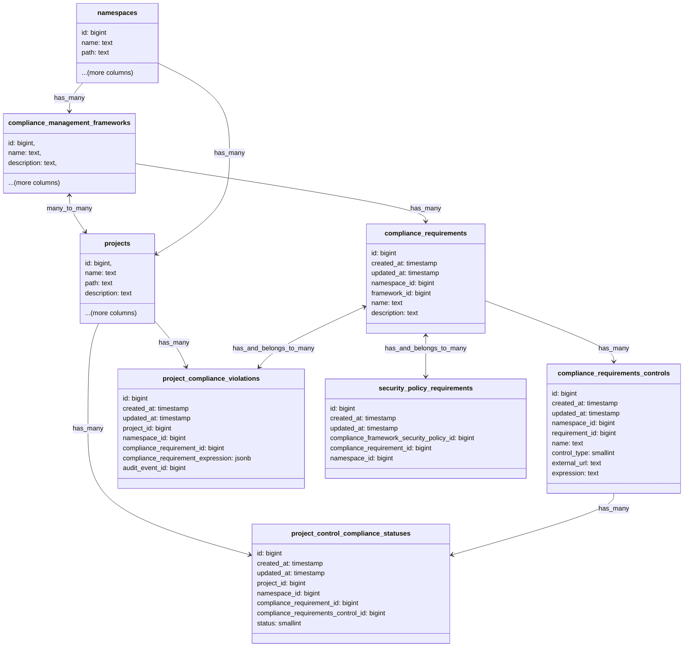
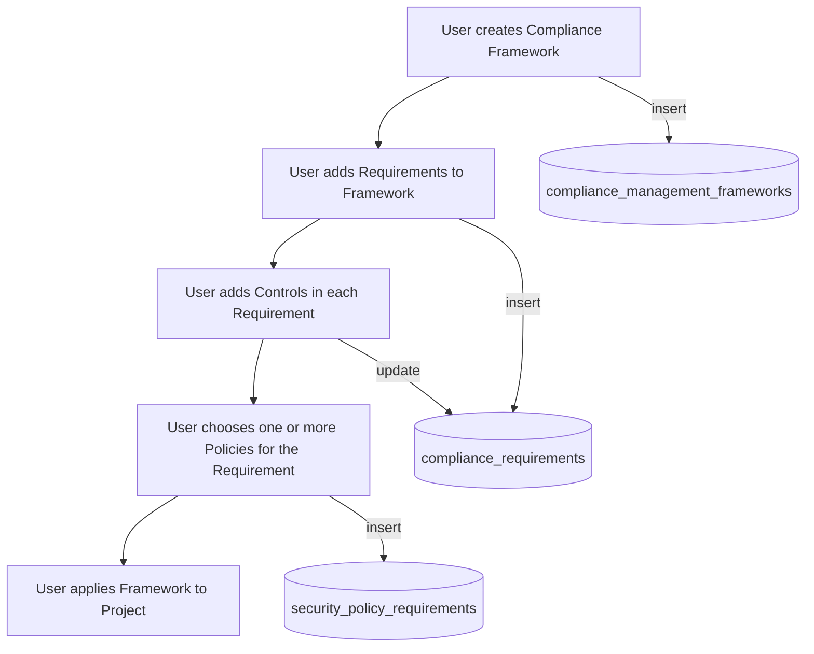
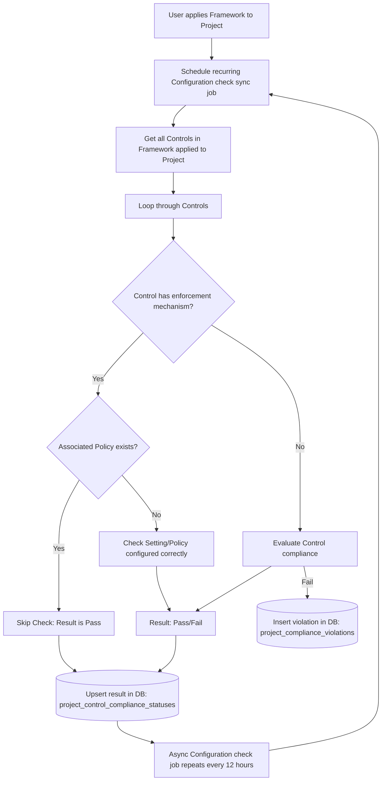
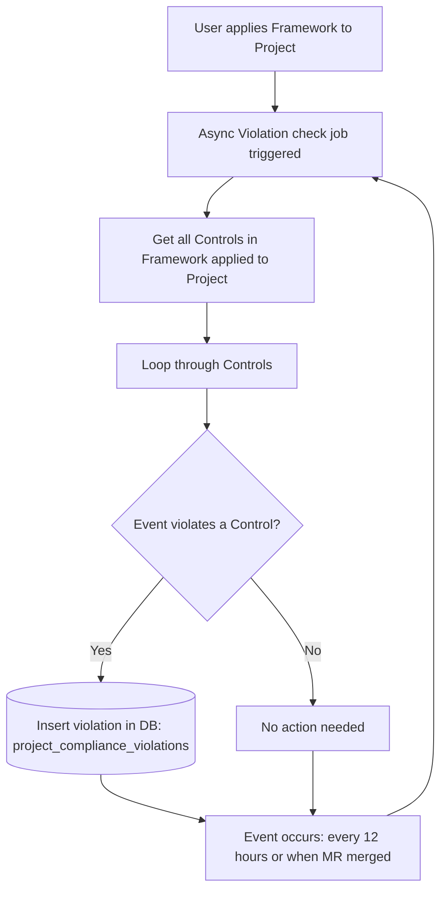



## Summary

This blueprint serves as living documentation of the technical considerations in the implementation of Compliance Frameworks. This includes functionality in [Compliance Frameworks](https://docs.gitlab.com/ee/user/group/compliance_frameworks.html), the [Compliance Center](https://docs.gitlab.com/ee/user/compliance/compliance_center/) and the relationship with [Security Policies](https://docs.gitlab.com/ee/user/application_security/policies/).

### Proposal

Outline how compliance enforcement and visibility will be handled through Compliance Frameworks as an evolution from [Compliance Standards Adherence](https://docs.gitlab.com/ee/user/compliance/compliance_center/compliance_standards_adherence_dashboard.html).

### Motivation

There are three main parts to compliance posture of a customer [Enforcement](#enforcement), [Visibility](#visibility),
and [Audit History](#audit-history).

#### Enforcement

Enforcement within GitLab is currently done through [Security Policies](https://docs.gitlab.com/ee/user/application_security/policies/) and [Compliance Pipelines](https://docs.gitlab.com/ee/user/group/compliance_pipelines.html). This gives users two very different ways of implementing the same functionality, which has been described as confusing for users. Compliance pipelines also have some inherent technical limitation, see [epic](https://gitlab.com/groups/gitlab-org/-/epics/6241).

#### Visibility

Currently the Standards are hard coded in the Adherence report (renamed to Status report) and separate from Compliance Frameworks. This makes the system inflexible as we look to:

1. Use Compliance Frameworks to include certain projects in the Adherence Report and distinguish which requirements those projects are complaint with.
1. Add a Requirements level to the Adherence report
1. Add more Standards and Controls
1. Allow users to customise Standards
1. Allow users to create their own Standards
1. Allow users to create customisable Controls

#### Audit History

This is currently achieved through compliance events ([Audit events](https://docs.gitlab.com/ee/user/compliance/audit_events.html) and [Violations within MRs](https://docs.gitlab.com/ee/user/compliance/compliance_center/compliance_violations_report.html)).

### Background

#### Deprecate compliance pipelines

We deprecated [compliance pipelines](https://docs.gitlab.com/ee/user/group/compliance_pipelines.html) in favour of
[pipeline execution policy](https://docs.gitlab.com/ee/user/application_security/policies/pipeline_execution_policies.html)
in GitLab 17.3. This decision was taken to align with the future state of enforcing compliance through security policies.

#### Scope policies through compliance frameworks

We introduced the capability of scoping security policies allowing us to enforce policies against a specific set of
projects or against projects applied a given set of compliance frameworks. This helped us move towards the
goal of enforcing compliance through frameworks.

#### Multiple compliance frameworks

Before GitLab 17.3 it was not possible to apply more than one compliance framework to a project. To work towards the
future state of allowing users to customise the adherence dashboard, we created the ability to apply multiple
compliance frameworks in GitLab 17.3.

### Goals

1. Provide support need for multiple frameworks
1. Incongruence with compliance pipelines and security policies
1. Use Compliance Frameworks to include certain projects in the Adherence Report and distinguish which requirements those projects are complaint with.
1. Add a Requirements level to the Adherence report
1. Add more Standards and Controls
1. Allow users to customise Standards
1. Allow users to create their own Standards

### Non-Goals

1. Compliance events
   1. [Audit events](https://docs.gitlab.com/ee/user/compliance/audit_events.html)
1. [Security Policies](https://docs.gitlab.com/ee/user/application_security/policies/)
   1. This document does not intend to outline how Security Policies work or how Policies use Compliance Frameworks to scope projects
   1. For more information on Security Policies refer [this document](compliance_security_policy_relationship.md)

### Terminology/Glossary

1. Framework
   1. A [Compliance Framework](https://docs.gitlab.com/ee/user/group/compliance_frameworks.html) is a user-modifiable capability within GitLab to identify projects that have certain compliance requirements or need additional oversight. Compliance Frameworks generally align with established industry compliance frameworks such as SOC2 or ISO 27001.
1. Standard - deprecated in favor of framework
   1. A standard groups together compliance checks in the Adherence report. Compliance standards align with established compliance frameworks/standards such as SOC2 or ISO 27001
1. Adherence
   1. Reports the percentage of a projects compliance posture against a compliance framework. For example if Project A is 50% complaint towards Framework A.
1. [Policy](https://docs.gitlab.com/ee/user/application_security/policies/)
1. Requirement
   1. A particular requirement from an industry standard compliance frameworks/standards such as SOC2 or ISO 27001. Usually a statement of intent for a particular part of the compliance framework. These are broken down into specific Controls.
1. Check
   1. A Check is a review of a project's settings, to confirm that it is in a particular position. Checks compose a percentage of a project's compliance posture against a Control.
1. Control
   1. A control is a specific compliance rule that needs to be met to meet a compliance requirement. Enforcement of this is achieved in GitLab through settings, Security Policies or Compliance Pipelines.
1. Violation
   1. A record of an event that when triggered was compared against a Control and found to contravene that control.

### Design Details

We will use [Sidekiq workers to create controls](decisions/001_triggering_checks.md#use-sidekiq-workers-for-creating-and-updating-checks)
and [store the adherence configuration in the database as relational data](decisions/002_custom_adherence_report.md#storing-the-compliance-adherence-configuration-in-database-as-relational-data).

See [Scalability review document](scalability_review.md) for further details.

#### Customizable Controls

NOTE: For a more detailed overview, see [ADR 003: Custom Controls](decisions/003_custom_controls.md)

We want the ability to create custom requirements so that users don't need to rely only on the exhaustive list of
controls that GitLab supports or would support in the future.

Requirements are composed of a combination of both out-of-the-box and user-defined controls. By building
a normalized and composable data model we avoid special handling for individual controls and can scale both compliance
and violation evaluations uniformally within our relational datastore.

##### Approach

To allow users to create controls on their own as per their requirements we need to have the following types of
requirements:

1. [Internal requirements](#internal-requirements): Enable users to create logical expressions from an enumerated list of project and namespace computed properties
1. [External requirements](#external-requirements): Enable users to create requirements that rely on their external services like HTTP servers.

##### Internal requirements

We will allow users to create logical expressions with all the available project settings. These expressions form the controls against
which the projects are be evaluated. We store these as a structured JSON in the `compliance_requirements` table with 'internal'
as the `requirement_type`.

We will use schema validators for validating the input and store these in the `expression` column of the
`compliance_requirements` database table.

The UI will provide dropdowns to choose the field, operator and values. This is created so that
the users don't have to write complex JSON expressions on their own.

Each expression is evaluated to a boolean true or false.

##### External requirements

The external HTTP/HTTPS URLs for the user's services are stored in the `compliance_requirements` table with
'external' as the `requirement_type`.

We POST the latest project settings to these external services and expect a boolean status as the response.
Alternatively, we could also create a POST API that can be used to update the status of an external requirement, this would be a
similar to [setting the status of external status checks](https://docs.gitlab.com/ee/api/status_checks.html#set-status-of-an-external-status-check).

#### Database Schema

It was [decided](decisions/006_storing_controls_in_a_separate_table.md#decision) to store control expressions in a
separate database table `compliance_requirements_controls`.

The compliance requirements would be stored in a separate table with the following schema:

We created a new table `project_control_compliance_statuses` for storing the results of compliance requirements and
plan on dropping the existing `project_compliance_standards_adherence` table. We no longer have a `standard` column
as we don't want to associate requirements directly with a standard, allowing the users to customise
and group requirements as per their need.

Unlike the current implementation we would only store results for the projects that have compliance requirements
configured. Instead of an enum we would store the `compliance_requirement_id` in the
`project_control_compliance_statuses` table and would display these results at the compliance dashboard.

In the next iteration we would also allow importing and exporting the compliance requirement configurations.

Violations records are stored in the new table `project_compliance_violations`. These violation records are immutable and only new records inserted, unlike the `project_control_compliance_statuses` table which is updated on status changes. This creates an immutable history of violations against a requirement for a project.

### Constraints

Feature should be designed with application limits to mitigate abuse, leading to query timeouts
and poor user experience.

1. Limit maximum number of compliance frameworks per project: 20 to be increased as needed
1. Limit maximum number of requirements per framework: 50 to be increased as needed
1. Limit maximum number of checks a control expression can have: 5 to be increased as needed
1. Allowlist of project settings and associations that could be used for creating expressions

### Compliance framework workflow diagrams

#### Compliance framework definition

This workflow diagram shows the creation of Compliance Frameworks, Requirements and Controls, and how security policies are associated with Requirments.

#### Recurring Configuration Status Checks execution flow

This workflow diagram shows the how Compliance Frameworks trigger a configuration status check against a Project.

#### Violation triggers execution flow

This workflow diagram shows how violation status checks are triggered and stored.

In the above workflows there will be audit events triggered throughout to give a full history of a projects compliance posture. For example audit events will be logged when a project is evalutated against a control and the result of that evaluation. User can then see when the configuration status changed from one state to another in the past. User can then use the [audit event reports](https://docs.gitlab.com/ee/user/compliance/audit_events.html) or [streaming audit events](https://docs.gitlab.com/ee/user/compliance/audit_event_streaming.html) to trigger other workflows.

Audit events will be logged when:

- user takes an action
- configuration check result
- violation check result

### Decisions

- ~~[001: Triggering Checks](decisions/001_triggering_checks.md)~~ (changed, see ADR 004)
- [002: Custom Adherence Report](decisions/002_custom_adherence_report.md)
- ~~[003: Custom Controls](decisions/003_custom_controls.md)~~ (changed, see ADR 006)
- [004: Use Time-based Triggers for Controls](decisions/004_time_based_triggers.md)
- [005: Violations Engine](decisions/005_violations_engine.md)
- [006: Storing Controls in a Separate Table](decisions/006_storing_controls_in_a_separate_table.md)
