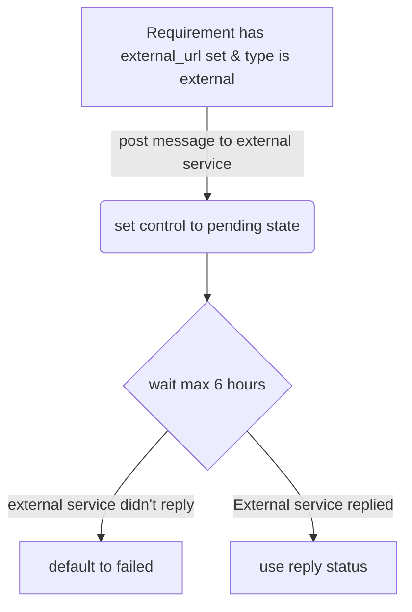

## Context

Users need to be able to create controls on their own as their requirements might not match what GitLab offers by default.

## External requirements

We would store the external HTTP/HTTPS URLs for the user's external services in the `compliance_requirements_controls` table with
'external' as the `control_type`. The same table will also store the shared HMAC secret in the `encrypted_secret_token` and `encrypted_secret_token_iv` columns.

We would POST the latest project settings to these external services and expect a boolean status as the response.
We could also create a POST API that can be used to update the status of an external requirement, this would be a
similar to [setting the status of external status checks](https://docs.gitlab.com/ee/api/status_checks.html#set-status-of-an-external-status-check).

## Workflow

When evaluating requirements we trigger a message to the external service if it has an `external_url` defined and is of `control_type` `external`.
After posting we set the corresponding `project_compliance_configuration_status` entry to state `pending` and allow for a timeout of `6 hours`.
There will be a separate, worker, preiodically run, checking for status entries that are older than the timeout and still in state `pending`, these entries will be defaulted to a `fail` state.
(This adds an additional state to what's been mentioned in [ADR001](001_triggering_checks/#decision))

When the external service reports back inside the timeout we set the status in table `project_compliance_configuration_status` to store the results of the requirements as the external service indicated.

### Application Programmer Interfaces (APIs)

For the external service to be able to post the requirement control results they have we need to provide APIs to do so.
This allows external systems to report and query the compliance status of specific project requirements.

### Auditing

Audit events need to be created for the following events in this workflow:

1. Triggering of messages to external service.
1. Non HTTP 2xx statuses encountered when attempting to message external service.
1. Storing replies from external service.
1. Defaulting to a failed state when timeout is reached.

## Constraints

1. We should limit the amount of pending status checks a requirement can have in pending state to keep execution of the worker that checks for timeouts lean.

## Decision

We decided to let external services post the status of their controls back to us in an async manner allowing for more time to let them perform more complex checks.
