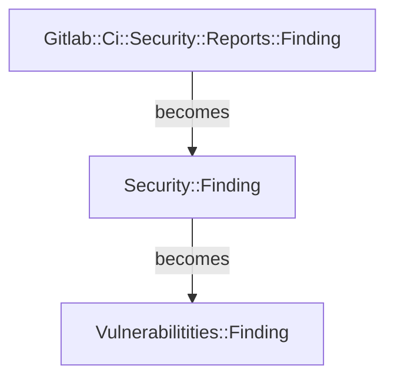
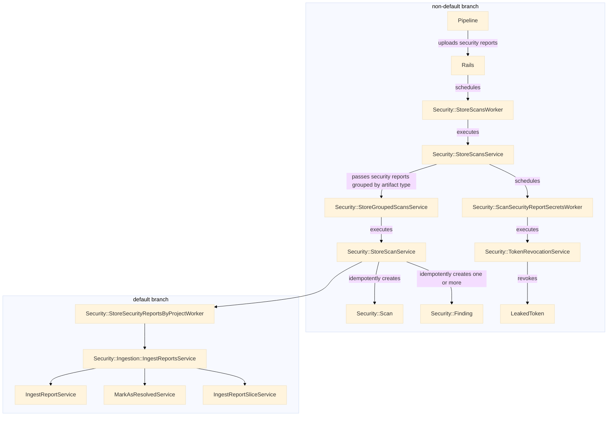
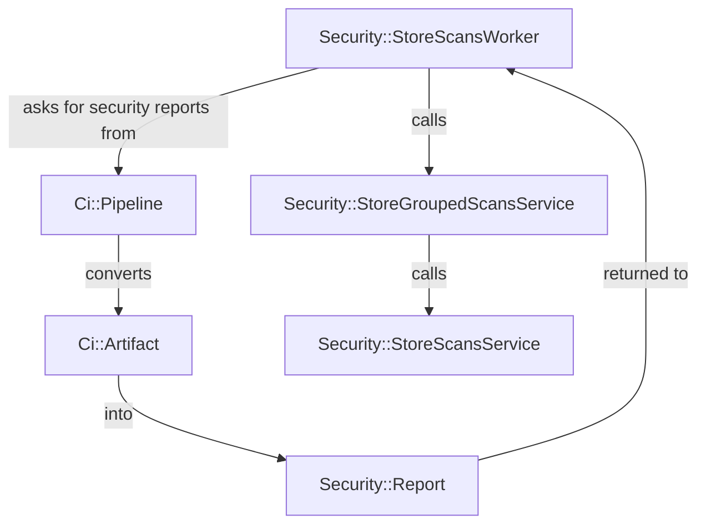
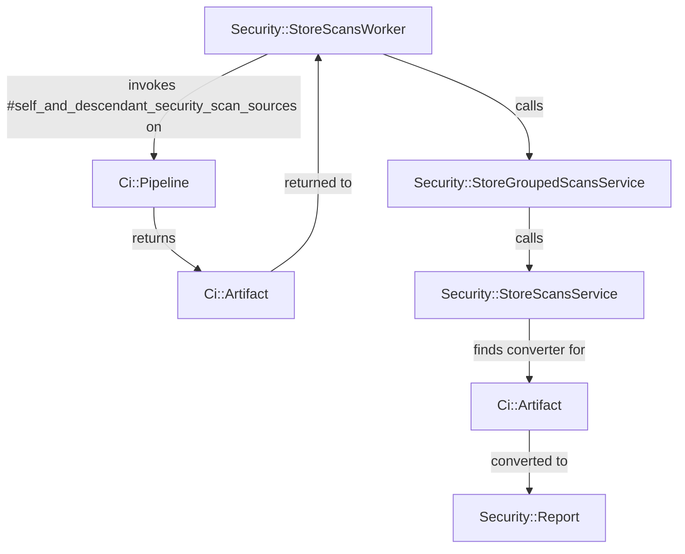

<!-- Design Documents often contain forward-looking statements -->
<!-- vale gitlab.FutureTense = NO -->

<!-- This renders the design document header on the detail page, so don't remove it-->


## Summary

The security ingestion pipeline serves a critical role in persisting the
findings reported by our security analyzers. Historically, JSON security reports
have been used to transmit the findings from the analyzer to the Rails
monolith, a method that has served our use cases well for some time. However,
recent shifts in the security landscape now require us to restructure where we
execute our security analysis, which therefore requires us to also change _how_
we transmit the findings from analyzer to the Rails monolith.

At a high level, we'll need to do the following:

1. The ingestion lifecycle should use well defined terms that
   differentiate the different stages traveled by analyzer results.
1. Establish a documented security finding API that facilitates the creation of
   security findings. Much like our security schemas, the API methods establish
   a clear contract on what specific data is needed for the various types of
   security findings we support.
1. Workers should no longer be called imperatively. Instead,
   [events](https://docs.gitlab.com/ee/development/event_store.html) should be
   used to clearly define domain boundaries.

## Motivation

This API addresses the difficulty of building application security testing
that does not run within the context of a CI/CD job, and does not produce job
artifacts. Building security testing software that works in this manner requires
workarounds, so that the source files (for example CycloneDX files) are
considered equivalent to a security report. While functional, this
workaround starts to leak implementation details quickly, adding to the overhead
of working on related areas, and results in a difficult to maintain set of code.

This will also improve the experience of working with the security report finding
class which has become overloaded. Evidence of this can be seen by looking at
the constructor which has over [20 arguments](https://gitlab.com/gitlab-org/gitlab/blob/009712173ba042d7d83ea31cb12e7019c758f39b/lib/gitlab/ci/reports/security/finding.rb#L36)
one of which is generic `details` hash that can hold arbitrarily more pieces of
data.

### Goals

* Minimize JSON artifact parsing. Loading from the database is much faster and a
  lot lighter in resources when compared to JSON artifact parsing.
* Reduced complexity of creating security findings from sources that are not
  security reports. This simplifies use cases like SBoM based dependency scanning
  and container scanning.

### Non-Goals

* Exposing security findings as CI/CD job artifacts.
* Changing database schemas.
* Completely removing support for security reports.

## Proposal

As detailed above, three changes are required to better adapt the security ingestion
process.

### Security ingestion definitions

The security ingestion process references analysis results using three types.

1. `Gitlab::Ci::Security::Reports::Finding` - used for results packaged in a security report.
1. `Security::Finding` - results **temporarily** stored in database for **non-default** branches.
1. `Vulnerabilitities::Finding` - findings stored in database for **default** branches.

Unfortunately, these names aren't very descriptive, and while manageable,
understanding and holding their concepts for development adds overhead that can
be avoided. This will be improved by using a set of well defined terms used by
other projects and tools. The `unstaged`, `staged`, and `committed` set of terms
are one such set used in high adoption pieces of software like `git`.
Conceptually, the security ingestion process operates _very_ similar to `git`,
and the set of terms used to describe the various states of a file also work
quite well for the various states of findings.

1. `Gitlab::Ci::Security::Report::Finding` results can be thought of as _unstaged_
   since they only exist within memory and hence not yet _staged_ in
   `security_findings`.
1. `Security::Finding` results can be thought of as _staged_ since they are
   stored in the temporary `security_findings` table.
1. `Vulnerabilitities::Finding` results can be thought of as
   _commits_. At this point, they're no longer in a temporary table, and are
   considered stored.

Given how well the terms work for findings, we can apply them to other security
ingestion concepts as well. The following are examples of areas where we can
apply this and gain clarity from the names of services and workers.

* `Security::StoreScansService` can be renamed to `Security::StageScansService`.
  * Both default and non-default branches have their findings saved in the
  database. This better differentiates the two by making it clear that one is
  staged, but not yet committed to.
* `Security::IngestReportService` can be renamed to `Security::CommitScansService`.
  * This makes it clear that the findings are going to a table that doesn't
  drop partitions.
  * This also works in our favor because the name no longer ties itself to
  security reports which may only be one source of unstaged findings.

### Events

An event driven system decouples two or more systems by delegating all
communication to events.

TODO: provide examples of events that can be used for DS, CS, and more.

### API

Create an API that has methods to create the following finding types:

* Dependency Scanning
* Container Scanning
* Operational Container Scanning
* DAST
* SAST
* Secret Detection

These methods replace the generic report finding class with new classes
whose constructors clearly define the data required for each finding type.
Refactor our security ingestion entrypoint to use a new method called
`#collect_unstaged_security_findings` instead of `#collect_security_reports`. This method
will be responsible for collecting security findings from eligible sources. For
example, CycloneDX SBoMs would be scanned for advisories affecting the listed
components, and security reports would be parsed for the included security
findings.

## Design and implementation details

### Overview of security ingestion

The security ingestion looks like the following:

### Points of interest

* Rename `IngestReportsService`, `IngestReportService`, and `IngestReportSliceService` to avoid usage of the term `reports`.
* [CycloneDX reports are not considered security finding sources](https://gitlab.com/gitlab-org/gitlab/blob/313de920ee86ddf30d1fa6872b1d05ce3e277e02/ee/app/models/ee/ci/pipeline.rb#L60-L64), but this assumption no longer holds true.
* Rename [can_store_security_reports?] to [can_store_security_scans?]
* `Security::Scan` depends on security reports to find the [primary scanner](https://gitlab.com/gitlab-org/gitlab/blob/5a6f937be735771e8f235e02956977ae7a15e8f7/ee/app/models/security/scan.rb#L126).

### Process changes

**Before**

**After**

In the above, we remove the burden of artifact parsing from the pipeline model,
and move it closer to where it's utilized.

## Alternative Solutions

<!--
It might be a good idea to include a list of alternative solutions or paths considered, although it is not required. Include pros and cons for
each alternative solution/path.

"Do nothing" and its pros and cons could be included in the list too.
-->
