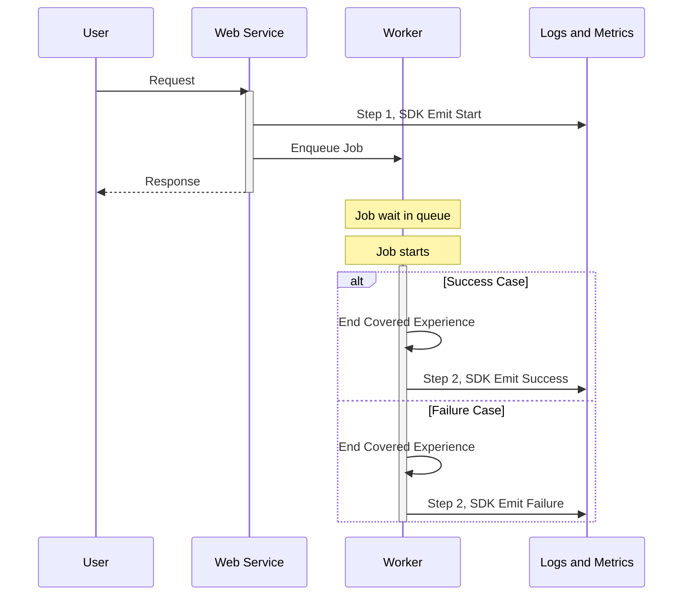

<!-- vale gitlab.FutureTense = NO -->

<!-- This renders the design document header on the detail page, so don't remove it-->


[TOC]

## Glossary

- **SLI**: [Service Level Indicator](https://en.wikipedia.org/wiki/Service_level_indicator) is a measure of the service level provided by a service provider to a customer.
- **Application SLI**: This is an SLI defined on the application side: the application decides what is “good” for apdex and error portion. The SLI is associated with a service for monitoring in the runbooks repository. https://docs.gitlab.com/ee/development/application_slis/
- **Apdex (Application Performance Index)**: At GitLab in the context of covered experience SLIs, it is the completion of something within an acceptable amount of time, for example, the changes of a push are visible on the merge request within 30 seconds.
- **User Journey**: A comprehensive visualization or map that illustrates all the steps, interactions, and emotions a customer experiences when engaging with a product, service, or brand, from initial awareness through purchase and beyond. In GitLab, it is the journey a user takes through the application. This can include multiple experiences. For example: Create a project -> Create an issue -> Create a merge request.
- **Covered Experience**: An action that a user takes inside the application that is covered with an indicator. A Covered Experience outlines the precise services, scenarios, and user interactions that establish clear performance expectations between a service provider and their client, some of which are covered by an SLI. Examples of experiences: “create a project”, “create an issue”, “create a merge request”.
- **Covered Experience SLI**: An SLI implementation that represents an end-to-end flow of user interactions that may span multiple services.
- **Multi-action Experience**: A user journey that consists of multiple user interactions before completion, for example creating an issue consisting of 2 steps: render new, submit form. We will not support this in the first iteration of Covered Experience SLIs.
- **Single-action Experience**: A user journey that consists of a single user interaction, for example “view an issue” or “add a comment to an issue”.
- **Multi-service Experience**: A journey that depends on multiple services to successfully complete, for example: a push gets received by GitLab-shell, which calls out to Rails, Gitaly and Sidekiq. A multi-service experience could be a single-action experience, only a single user-action is required for the experience, but it spans multiple services to be completed.
- **Step**: A checkpoint in the experience for which we can emit an event, an event could be a failure or a success.
- **Criteria**: Each Experience can have one or more criteria that can be used to measure success. For example: “The issue is successfully created” AND “The issue is created fast enough”.

## Motivation

While GitLab has robust service-level metrics through our SLI framework, we currently lack a systematic way to track and measure Covered Experiences that span multiple services. Our existing SLIs excel at measuring individual service performance but cannot effectively track the success/failure rate and performance of end-to-end user interactions. This gap makes it challenging to:

- Understand the true user experience across service boundaries
- Set and monitor user-centric SLOs for complex user interactions
- Identify bottlenecks in multi-service flows
- Measure reliability and impact of incidents for customers and users

## Goal

Track and measure Covered Experiences across GitLab services, establishing a framework for product teams to define and monitor Covered Experience SLIs.

### How do Covered Experiences relate to User Journeys?

Covered Experiences are small interactions that users do on the platform. Covered experiences focus specifically on single-actions users do that can be tracked and monitored through SLIs. While User Journeys represent comprehensive end-to-end paths a user might within the application. A User Journey can consist of many Covered Experiences, and a single Covered Experience can be part of many User Journeys.

Key relationships between the two concepts:

- **Scope**: A User Journey might encompass multiple Covered Experiences. For example, the User Journey of "contributing code to a project" might include several Covered Experiences like "git push," "merge request creation," and "CI pipeline execution".
- **Measurability**: Covered Experiences are specifically designed to be measurable through our SLI framework, with clear success criteria and thresholds. They should not include ambiguity through decisions that a user makes throughout their Journey.
- **Implementation**: User Journeys are often conceptual and used for product planning. Covered Experiences have specific technical implementations with instrumentation, metrics, and alerting.
- **Tracking**: Each Covered Experience must have a reference to its parent User Journey (as shown in the [Covered Experience Definition](#covered-experience-definition) schema), creating a hierarchical relationship.

## Dos

- Create a framework for product teams to define important Covered Experience SLIs in a structured way
- Develop an SDK that makes it easy for engineers to instrument Covered Experiences
- Support both GitLab.com and Dedicated deployments
- Enable measurement of Covered Experience success/failure rates and durations through metrics and logs
- Inform on the performance of Covered Experiences through SLIs that allow alerting on specified thresholds through our existing alerting framework

## Don'ts

- Building a general-purpose distributed tracing solution
- Tracking client side timings, and time on the wire to clients. In the future, we want to add support for clients we build (IDE-extensions, our frontend), but we're keeping this out of scope in the first iteration.
- Real-time covered experience visualization or debugging tools
- Logs and metrics will be emitted from self-managed, but it won't officially support ingesting information from those instances as we don't have control over such environments

## Unscoped

1. Other projects could benefit from Covered Experience SLIs, but are not part of the scope of this proposal. Such as:
    - Ensure critical user paths are well-tested and monitored (i.e. https://gitlab.com/groups/gitlab-org/quality/-/epics/144).
    The Covered Experience SLIs could provide data that can help identify end-to-end test coverage gaps for critical user paths.
    - Use covered experiences to inform Service Level Agreements (https://gitlab.com/gitlab-com/gl-infra/mstaff/-/issues/423)
2. As of the moment of writing, GitLab has no implementation for tracking and measuring end-to-end User Journeys.
The [framework porposed below](#covered-experience-definition) can be augmented in the future, to include a User Journey identification,
tying each Covered Experience to a User Journey.
3. Implementing a Covered Experience Tracker. There's a [proposal](next_step.md) for implementing a new service, as the likely
next step (covered in [epic #1540](https://gitlab.com/groups/gitlab-com/gl-infra/-/epics/1540)), however, it is prone to change
as we progress on the implementation of Covered Experiences SDK, and discover its nuances and leverage points.

## Scope

The implementation consists of the following components:

1. [Covered Experience Definition Framework](#covered-experience-definition)
2. [LabKit SDK](#sdk-requirements)

The project work items are scoped in the [epic #1539](https://gitlab.com/groups/gitlab-com/gl-infra/-/epics/1539).

The [Covered Experience Definition](#covered-experience-definition) will provide an specification for each Covered Experience SLI,
and the [SDK](#sdk-requirements) will be used to instrument the services to emit events (metrics and logs).

Example:

### Covered Experience Definition

- YAML-based Covered Experience definition authored by product teams
- Support for specifying success criteria

The Covered Experience definition will contain the following fields:

| Field                              | Type    | Required | Description                        | Example                           |
|------------------------------------|---------|----------|------------------------------------|-----------------------------------|
| covered_experience_name            | string  | Yes      | Covered Experience identifier      | `merge_request_creation`          |
| user_journey_name                  | string  | Yes      | User Journey identifier            | `open_merge_request_user_journey` |
| description                        | string  | Yes      | Human readable description         | "User creates a merge request"    |
| feature_category                   | string  | Yes      | GitLab feature category            | `source_code_management`          |
| apdex_success_threshold_in_seconds | integer | Yes      | Apdex success threshold in seconds | `30`                              |
| timeout_in_seconds                 | integer | Yes      | Timeout in seconds.                | `300`                             |

Examples:

| id                     | description                         | feature_category       | apdex_success_threshold_in_seconds | timeout_in_seconds |
|------------------------|-------------------------------------|------------------------|------------------------------------|--------------------|
| merge_request_creation | User creates a merge request        | source_code_management | 30                                 | 300                |
| git_push               | User pushes commits to a repository | source_code_management | 10                                 | 60                 |

Given that Application SLIs are implemented in the [Rails monolith](https://gitlab.com/gitlab-org/gitlab) at the moment, it will also function as a
[registry](https://gitlab.com/gitlab-com/gl-infra/observability/team/-/issues/4099) initially to store the definitions for the Covered Experience SLIs.

### SDK Requirements

- Implementation in [LabKit](https://gitlab.com/gitlab-org/ruby/gems/labkit-ruby)
- Covered Experience ID generation (as [ULID](https://github.com/ulid/spec)) and propagation
- DSL for sending Covered Experience events

The SDK will emit 1 event in every step (each interaction along the entire flow):

| **gitlab_covered_experience_steps_total** | LABEL                 | VALUE                                                        | METRIC | LOG |
|-------------------------------------------|-----------------------|--------------------------------------------------------------|--------|-----|
|                                           | ce_name               | security_scan                                                | yes    | yes |
|                                           | feature_category      | vulnerability_management                                     | yes    | yes |
|                                           | step                  | start \| intermediate \| end                                 | yes    | yes |
|                                           | step_name             | e.g. authorize (impose limited cardinality)                  | yes    | yes |
|                                           | type                  | web                                                          | yes    | yes |
|                                           | covered_experience_id | 01JP0EM7HB39WSJNR4682MYZ6V                                   | no     | yes |
|                                           | correlation_id        | f93ae47de7f848343cf85511b47923ce                             | no     | yes |
|                                           | meta                  | { "relevant attributes": "tailored for the specific event" } | no     | yes |

And 2 more events, emitted at the end of the flow, to signify error and success:

| **gitlab_covered_experience_total** | LABEL                 | VALUE                                                        | METRIC | LOG |
|-------------------------------------|-----------------------|--------------------------------------------------------------|--------|-----|
|                                     | error                 | true \| false                                                | yes    | yes |
|                                     | feature_category      | vulnerability_management                                     | yes    | yes |
|                                     | type                  | sidekiq                                                      | yes    | yes |
|                                     | covered_experience_id | 01JP0EM7HB39WSJNR4662MYZ6V                                   | no     | yes |
|                                     | correlation_id        | f93ae47de7f848343cf85511b47923ce                             | no     | yes |
|                                     | meta                  | { "relevant attributes": "tailored for the specific event" } | no     | yes |

| **gitlab_covered_experience_apdex_total** | LABEL                 | VALUE                                                                    | METRIC | LOG |
|-------------------------------------------|-----------------------|--------------------------------------------------------------------------|--------|-----|
|                                           | feature_category      | vulnerability_management                                                 | yes    | yes |
|                                           | success               | true \| false                                                            | yes    | yes |
|                                           | type                  | sidekiq                                                                  | yes    | yes |
|                                           | covered_experience_id | 01JP0EM7HB39WSJNR4662MYZ6V                                               | no     | yes |
|                                           | correlation_id        | f93ae47de7f848343cf85511b47923ce                                         | no     | yes |
|                                           | meta                  | { "relevant attribute to the event": "tailored for the specific event" } | no     | yes |

## Alternative Solutions

1. Do Nothing
   Pros:
   - No implementation cost

   Cons:
   - Continue lacking end-to-end covered experience visibility and measurement
   - Harder to set meaningful SLOs
   - Miss opportunities for better capturing perceived user experience and testing coverage
