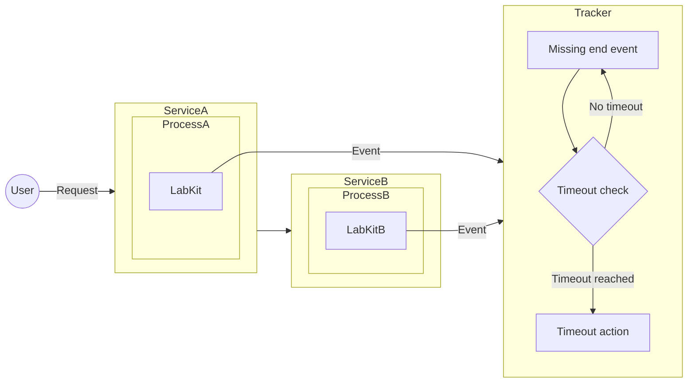
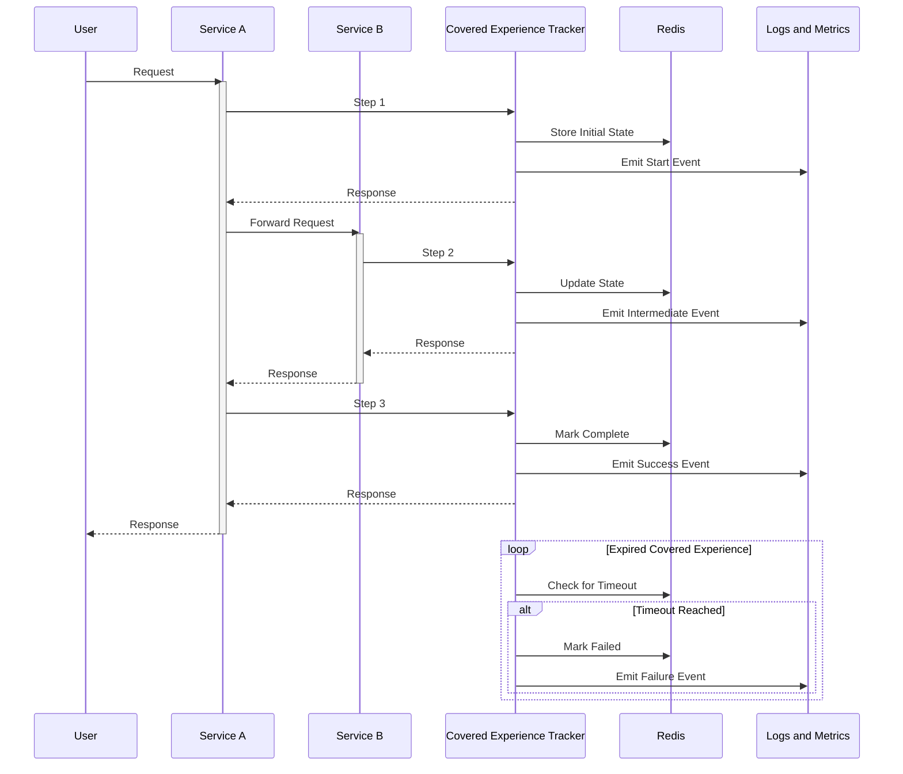
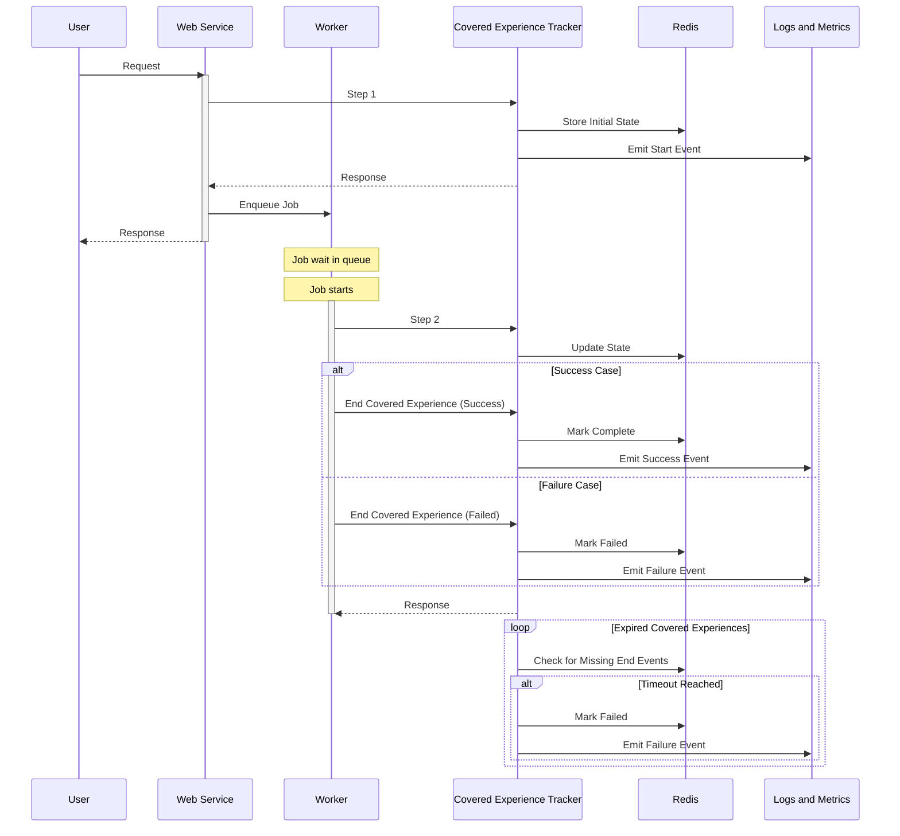

<!-- vale gitlab.FutureTense = NO -->

<!-- This renders the design document header on the detail page, so don't remove it-->


[TOC]

## Summary

This design document proposes a solution for measuring and tracking covered experiences across GitLab services. A covered experience SLI represents an end-to-end flow of user interactions that may span multiple services (e.g., from receiving a git push in GitLab Shell to updating a merge request). This proposal includes a design for instrumenting Covered Experience SLIs, and establishing a framework for product teams to define and monitor critical covered experiences.

The system will help measure the reliability and performance of key user interactions and provide valuable data for both operational excellence and product decisions.

We intend to have an aligned definition of User Journeys across the organization, with Covered Experience SLIs being a scoped set of steps from a User Journey that support the broader goal a user might be trying to accomplish. Read more [here](https://gitlab.com/groups/gitlab-com/gl-infra/-/epics/1524#are-these-related-to-covered-experiences-fka-user-journey-slis).

Here's a graph that illustrates how the different parties are connected to this idea:

[graph src](https://lucid.app/lucidchart/e911c437-dbdf-4540-bf44-23962e048661/edit)

PS: The graph is still a work in progress. The image you see might be already outdated. Please refer to the src link to the up-to-date version.

## Glossary

Here's a list of words to disambiguate the terms we are going to use in the context of this document:

- **Application SLI**: https://docs.gitlab.com/ee/development/application_slis/ This is an SLI defined on the application side: the application decides what is “good” for apdex and error portion. The SLI is associated with a service for monitoring in the runbooks repository.
- **Apdex (Application Performance Index)**: At GitLab in the context of covered experience SLIs, it is the completion of something within an acceptable amount of time, for example, the changes of a push are visible on the merge request within 30 seconds.
- **User Journey**: A comprehensive visualization or map that illustrates all the steps, interactions, and emotions a customer experiences when engaging with a product, service, or brand, from initial awareness through purchase and beyond. In GitLab, it is the journey a user takes through the application. This can include multiple experiences. For example: Create a project -> Create an issue -> Create a merge request.
- **Covered experience**: An action that a user takes inside the application that is covered with an Indicator. A Covered Experience outlines the precise services, scenarios, and user interactions that establish clear performance expectations between a service provider and their client, some of which are covered by an SLI. Examples of experiences: “create a project”, “create an issue”, “create a merge request”.
- **Limited covered experience**: Refers to a restricted subset of services, scenarios, or user interactions that have defined performance standards in an SLA, with certain conditions, exceptions, or constraints that limit the provider's obligations or the scope of guaranteed service levels.
- **Multi-action experience**: A user journey that consists of multiple user interactions before completion, for example creating an issue consisting of 2 steps: render new, submit form. We will not support this in the first iteration of Covered Experience SLIs.
- **Single-action experience**: A user journey that consists of a single user interaction, for example “view an issue” or “add a comment to an issue”.
- **Multi-service experience**: A journey that depends on multiple services to successfully complete, for example: a push gets received by GitLab-shell, which calls out to Rails, Gitaly and Sidekiq. A multi-service experience could be a single-action experience, only a single user-action is required for the experience, but it spans multiple services to be completed.
- **Step**: A checkpoint in the experience for which we can emit an event, an event could be a failure or a success.
- **Criteria**: Each Experience can have one or more criteria that can be used to measure success. For example: “The issue is successfully created” AND “The issue is created fast enough”.

## Motivation

While GitLab has robust service-level metrics through our SLI framework, we currently lack a systematic way to track and measure covered experiences that span multiple services. Our existing SLIs excel at measuring individual service performance but cannot effectively track the success/failure rate and performance of end-to-end user interactions. This gap makes it challenging to:

- Understand the true user experience across service boundaries
- Set and monitor user-centric SLOs for complex user interactions
- Identify bottlenecks in multi-service flows
- Attribute availability and impact of incidents to customers or users

### Goals

- Create a framework for product teams to define important covered experience SLIs in a structured way
- Develop an SDK that makes it easy for engineers to instrument covered experiences
- Build a service to track covered experience state and emit relevant metrics and structured logs with all the relevant context
- Support both GitLab.com and dedicated deployments
- Enable measurement of covered experience success/failure rates and durations through SLIs

### Non-Goals

- Building a general-purpose distributed tracing solution
- Tracking client side timings, and time on the wire to clients. In the future, we want to add support for clients we build (IDE-extensions, our frontend), but we're keeping this out of scope in the first iteration.
- Real-time covered experience visualization or debugging tools
- Logs and metrics will be emitted from self-managed, but it won't officially support ingesting information from those instances as we don't have control over such environments

### Unscoped related use-cases

Other projects could benefit from Covered Experience SLIs, but are not part of the scope of this proposal. Such as:

- Ensure critical user paths are well-tested and monitored (i.e. https://gitlab.com/groups/gitlab-org/quality/-/epics/144). The Covered Experience SLIs could provide data that can help identify end-to-end test coverage gaps for critical user paths.

## Proposal

The core proposal consists of three main components (detail below):

1. [Covered Experience Definition Framework](#covered-experience-definition)
2. [LabKit SDK](#sdk-requirements)
3. [Covered Experience Tracker Service](#covered-experience-tracker)

The project can be done in 2 phases:

1. **Phase 1**: Details in the [section](#phase-1) below. [Epic #1539](https://gitlab.com/groups/gitlab-com/gl-infra/-/epics/1539).
2. **Phase 2**: Details in the [section](#phase-2) below. [Epic #1540](https://gitlab.com/groups/gitlab-com/gl-infra/-/epics/1540).

## Design and implementation details

Here's a simplified flowchart to demonstrate how the communication will flow from services to tracker:

Below there are cases covering in detail synchronous and asynchronous.

### Synchronous workflow

### Asynchronous workflow

## Phase 1

In this phase, the main building blocks will be implemented, such as the [Covered Experience Definition](#covered-experience-definition) and the [library](#sdk-requirements) to emit events (metrics and logs), that will be implemented in the SDK, skipping the [Covered Experience Tracker](#covered-experience-tracker) (that will be come in [phase 2](#phase-2)). This will reduce complexity while we iterate and test our implementation against the specification.

### Covered Experience Definition

- YAML-based covered experience definition authored by product teams
- Support for specifying success criteria
- Integration with test coverage reporting

The Covered Experience definition will contain the following fields:

| Field                              | Type    | Required | Description                        | Example                               |
|------------------------------------|---------|----------|------------------------------------|---------------------------------------|
| covered_experience                 | string  | Yes      | Covered Experience identifier      | `merge_request_creation`              |
| user_journey                       | string  | Yes      | User Journey identifier            | `merge_request_creation_user_journey` |
| description                        | string  | Yes      | Human readable description         | "User creates a merge request"        |
| feature_category                   | string  | Yes      | GitLab feature category            | `source_code_management`              |
| apdex_success_threshold_in_seconds | integer | Yes      | Apdex success threshold in seconds | `30`                                  |
| timeout_in_seconds                 | integer | Yes      | Timeout in seconds.                | `300`                                 |

Examples:

| id                     | description                         | feature_category       | apdex_success_threshold_in_seconds | timeout_in_seconds |
|------------------------|-------------------------------------|------------------------|------------------------------------|--------------------|
| merge_request_creation | User creates a merge request        | source_code_management | 30                                 | 300                |
| git_push               | User pushes commits to a repository | source_code_management | 10                                 | 60                 |

### SDK Requirements

- Implementation in [LabKit](https://gitlab.com/gitlab-org/ruby/gems/labkit-ruby)
- DSL for sending covered experience events
- Covered Experience ID generation (as [ULID](https://github.com/ulid/spec)) and propagation
- Automatic retries with exponential backoff for sending reports to the Covered Experience Tracker

The SDK will emit 1 event in every step (each interaction along the entire flow):

| **gitlab_covered_experience_steps_total** | LABEL            | VALUE                                                        | METRIC | LOG |
|-------------------------------------------|------------------|--------------------------------------------------------------|--------|-----|
|                                           | ce_name          | security_scan                                                | yes    | yes |
|                                           | feature_category | vulnerability_management                                     | yes    | yes |
|                                           | step             | start \| intermediate \| end                                 | yes    | yes |
|                                           | step_name        | e.g. authorize (impose limited cardinality)                  | yes    | yes |
|                                           | type             | web                                                          | yes    | yes |
|                                           | ce_id            | 01JP0EM7HB39WSJNR4682MYZ6V                                   | no     | yes |
|                                           | meta             | { "relevant attributes": "tailored for the specific event" } | no     | yes |

And 2 more events, emitted at the end of the flow, to signify errors and successes:

| **gitlab_covered_experience_total** | LABEL            | VALUE                                                        | METRIC | LOG |
|-------------------------------------|------------------|--------------------------------------------------------------|--------|-----|
|                                     | error            | true \| false                                                | yes    | yes |
|                                     | feature_category | vulnerability_management                                     | yes    | yes |
|                                     | type             | sidekiq                                                      | yes    | yes |
|                                     | ce_id            | 01JP0EM7HB39WSJNR4662MYZ6V                                   | no     | yes |
|                                     | meta             | { "relevant attributes": "tailored for the specific event" } | no     | yes |

| **gitlab_covered_experience_apdex_total** | LABEL            | VALUE                                                                    | METRIC | LOG |
|-------------------------------------------|------------------|--------------------------------------------------------------------------|--------|-----|
|                                           | feature_category | vulnerability_management                                                 | yes    | yes |
|                                           | success          | true \| false                                                            | yes    | yes |
|                                           | type             | sidekiq                                                                  | yes    | yes |
|                                           | ce_id            | 01JP0EM7HB39WSJNR4662MYZ6V                                               | no     | yes |
|                                           | meta             | { "relevant attribute to the event": "tailored for the specific event" } | no     | yes |

## Phase 2

In this phase, the focus will be in implementing the [Covered Experience Tracker](#covered-experience-tracker), which is going to be responsible for the Covered Experience time out verification -- especially relevant for tracking the asynchronous Covered Experience SLIs.

With the SDK consolidated, we can move and centralize the functionality of emitting events to this service, removing the complexity from the client libraries.

### Covered Experience Tracker

A new service, the Covered Experience Tracker, is going to control initiated Covered Experience SLIs to guarantee they are finishing within a specified threshold. When the covered experience trepass this threshold, a failure metric will be created, meaning it did not met its completion expectations, better reflecting the perceived user experience.

- Centralized Covered Experience state tracking
- Sensible time to live (TTL) threshold for covered experience duration
- [Authentication](#authentication)
- Deployments:
  - Runway service for GitLab.com
  - Runway hosted service for Dedicated

The Covered Experience Tracker will serve an endpoint that will respond to the client generated payload:

| Field            | Type              | Required           | Description                                             | Example                                        | Observations                                                   |
|------------------|-------------------|--------------------|---------------------------------------------------------|------------------------------------------------|----------------------------------------------------------------|
| ce_id            | string (ULID)     | Yes                | Unique identifier for the covered experience            | "01JP0EM7HB39WSJNR4662MYZ6V"                   | Same ID must be used across all events in a covered experience |
| ce_name          | string            | Yes                | Name of the covered experience as defined in the config | "http_request"                                 | Must match with a covered experience definition                |
| step             | string            | Yes                | Which step in the lifecycle                             | "start" \| "end" \| "intermediate"             | -                                                              |
| component        | string            | Yes                | Service/component generating the event                  | "web", "database"                              | -                                                              |
| client_timestamp | string (ISO-8601) | Yes                | Timestamp when event occurred                           | "2025-02-06T14:30:00Z"                         | -                                                              |
| meta             | object            | Yes                | Additional metadata                                     | {"feature_category": "source_code_management"} | -                                                              |
| server_timestamp | string (ISO-8601) | No (Response only) | Server processing timestamp                             | "2025-02-06T14:30:00.123Z"                     | Timestamp of the time of processing                            |

State is managed by Redis. Allowing the querying of stale covered experiences, timing out after configured threshold.

A background process verifies all stale covered experiences and clear them out, emitting failure metrics.

#### Authentication

Authentication between the SDK and the Covered Experience Tracker is required to prevent malicious actors from injecting fake events that could distort the reliability metrics of GitLab features or cause DDoS.

## Alternative Solutions

1. Do Nothing
   Pros:
   - No implementation cost

   Cons:
   - Continue lacking end-to-end covered experience visibility and measurement
   - Harder to set meaningful SLOs
   - Miss opportunities for better capturing perceived user experience and testing coverage
