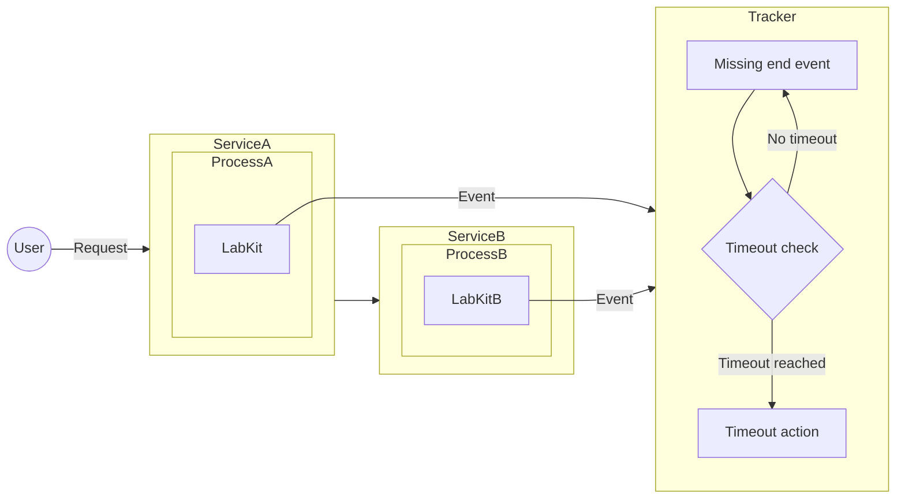
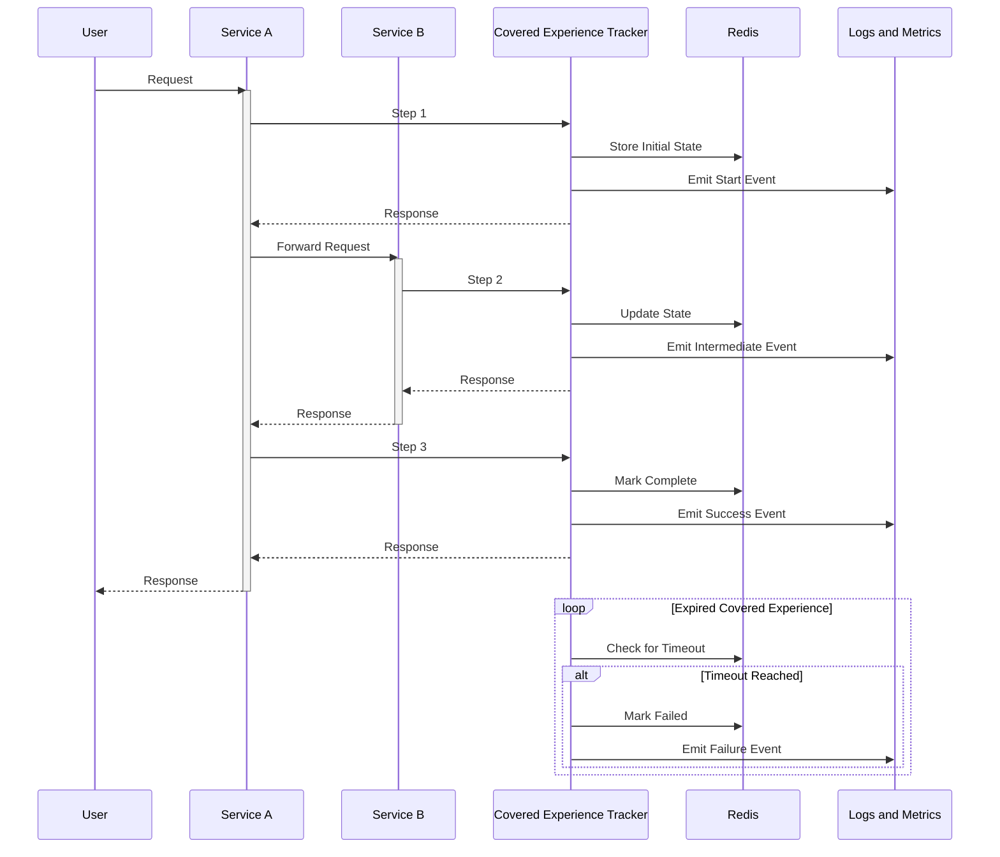
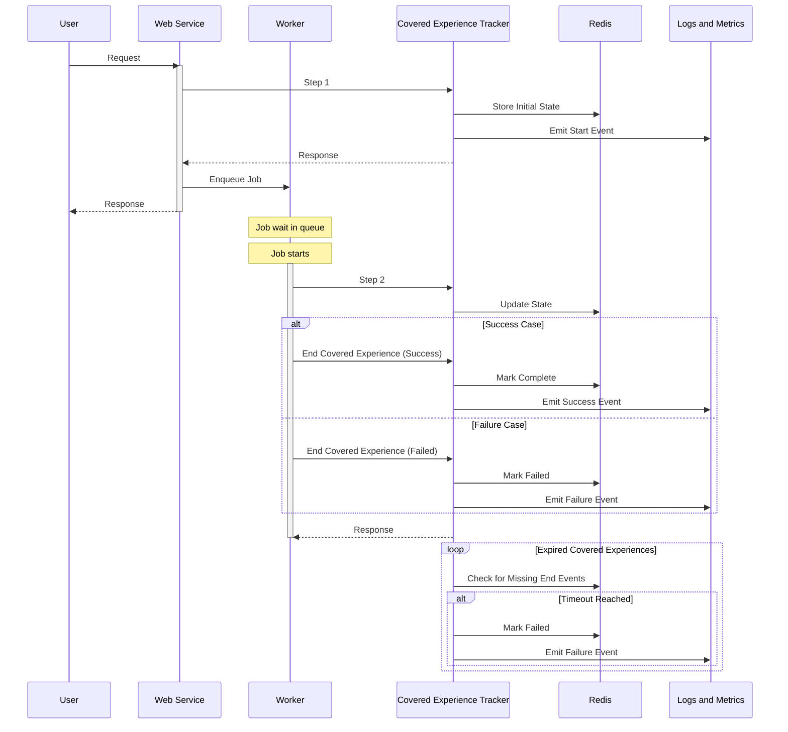

<!-- vale gitlab.FutureTense = NO -->

<!-- This renders the design document header on the detail page, so don't remove it-->


[TOC]

## Motivation

Continuing the work from [Covered Experience SLIs](_index.md), this addendum focus on the augmentation of the Covered Experience Framework
by introducing a new service, the Covered Experience Tracker, that will add the capability of tracking Covered Experiences that
never complete (due to errors mid journey), or do not complete within its expected lifetime.

## Scope

The [Covered Experience Tracker](#covered-experience-tracker) is going to be responsible for the Covered Experience time out verification --
especially relevant for tracking the asynchronous Covered Experience SLIs.

With the SDK consolidated, we can move and centralize the functionality of emitting events to this service, removing the complexity from the SDK.

The project will consist of:

1. [Covered Experience Tracker](#covered-experience-tracker)
2. [LabKit SDK](#sdk-requirements)

Example:

The project work items are scoped in the [epic #1540](https://gitlab.com/groups/gitlab-com/gl-infra/-/epics/1540).

## Covered Experience Tracker

- Centralized Covered Experience state tracking
- Sensible time to live (TTL) threshold for Covered Experience duration
- State is stored and managed by Redis. Allowing the querying of stale Covered Experiences, timing out after configured threshold.
- [Authentication](#authentication)
- Deployments:
  - Runway service for GitLab.com
  - Runway hosted service for Dedicated

It will serve an endpoint that will respond to the client generated payload:

| Field            | Type              | Required           | Description                                             | Example                                        | Observations                                                   |
|------------------|-------------------|--------------------|---------------------------------------------------------|------------------------------------------------|----------------------------------------------------------------|
| ce_id            | string (ULID)     | Yes                | Unique identifier for the covered experience            | "01JP0EM7HB39WSJNR4662MYZ6V"                   | Same ID must be used across all events in a covered experience |
| ce_name          | string            | Yes                | Name of the covered experience as defined in the config | "http_request"                                 | Must match with a covered experience definition                |
| step             | string            | Yes                | Which step in the lifecycle                             | "start" \| "end" \| "intermediate"             | -                                                              |
| component        | string            | Yes                | Service/component generating the event                  | "web", "database"                              | -                                                              |
| client_timestamp | string (ISO-8601) | Yes                | Timestamp when event occurred                           | "2025-02-06T14:30:00Z"                         | -                                                              |
| meta             | object            | Yes                | Additional metadata                                     | {"feature_category": "source_code_management"} | -                                                              |
| server_timestamp | string (ISO-8601) | No (Response only) | Server processing timestamp                             | "2025-02-06T14:30:00.123Z"                     | Timestamp of the time of processing                            |

A background process verifies all stale Covered Experiences and clears them out, emitting failure metrics.

Components interactions given a synchronous Covered Experience:

Components interactions given an asynchronous Covered Experience:

### Authentication

Authentication between the SDK and the Covered Experience Tracker is required to prevent the sending of unexpected events that could distort the reliability metrics of GitLab features. E.g. the ai-gateway [authentication and authorization](https://gitlab.com/gitlab-org/modelops/applied-ml/code-suggestions/ai-assist/-/blob/884ec8a1e92c1db13f12a1b0093e4e82aa50cad7/docs/auth.md).

## SDK Requirements

- Trigger events towards the Tracker, instead of directly pushing events
- Automatic retries with exponential backoff for sending events to the Covered Experience Tracker
