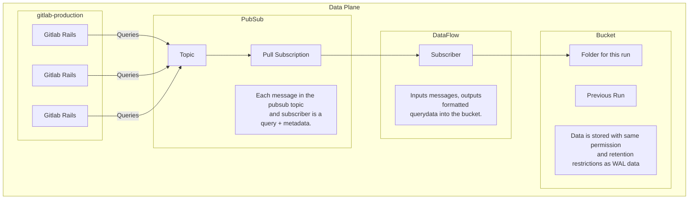

---
# This is the title of your design document. Keep it short, simple, and descriptive. A
# good title can help communicate what the design document is and should be considered
# as part of any review.
title: Database Traffic Replay
status: proposed
creation-date: "2025-05-07"
authors: [ "@mattkasa", "@stomlinson", "@zbraddock" ]
coaches: [  ]
dris: [ "@alexives", "@rmar1" ]
owning-stage: "~devops::data access"
participating-stages: []
# Hides this page in the left sidebar. Recommended so we don't pollute it.
toc_hide: true
---

<!--
Before you start:

- Copy this file to a sub-directory and call it `_index.md` for it to appear in
  the design documents list.
- Remove comment blocks for sections you've filled in.
  When your document ready for review, all of these comment blocks should be
  removed.

To get started with a document you can use this template to inform you about
what you may want to document in it at the beginning. This content will change
/ evolve as you move forward with the proposal.  You are not constrained by the
content in this template. If you have a good idea about what should be in your
document, you can ignore the template, but if you don't know yet what should
be in it, this template might be handy.

- **Fill out this file as best you can.** At minimum, you should fill in the
  "Summary", and "Motivation" sections.  These can be brief and may be a copy
  of issue or epic descriptions if the initiative is already on Product's
  roadmap.
- **Create a MR for this document.** Assign it to an Architecture Evolution
  Coach (i.e. a Principal+ engineer).
- **Merge early and iterate.** Avoid getting hung up on specific details and
  instead aim to get the goals of the document clarified and merged quickly.
  The best way to do this is to just start with the high-level sections and fill
  out details incrementally in subsequent MRs.

Just because a document is merged does not mean it is complete or approved.
Any document is a working document and subject to change at any time.

When editing documents, aim for tightly-scoped, single-topic MRs to keep
discussions focused. If you disagree with what is already in a document, open a
new MR with suggested changes.

If there are new details that belong in the document, edit the document. Once
a feature has become "implemented", major changes should get new blueprints.

The canonical place for the latest set of instructions (and the likely source
of this file) is
[content/handbook/engineering/architecture/design-documents/_template.md](https://gitlab.com/gitlab-com/content-sites/handbook/-/blob/main/content/handbook/engineering/architecture/design-documents/_template.md).

Document statuses you can use:

- "proposed"
- "accepted"
- "ongoing"
- "implemented"
- "postponed"
- "rejected"

-->

<!-- Design Documents often contain forward-looking statements -->
<!-- vale gitlab.FutureTense = NO -->

<!-- This renders the design document header on the detail page, so don't remove it-->


<!--
Don't add a h1 headline. It'll be added automatically from the title front matter attribute.

For long pages, consider creating a table of contents.
-->

## Summary

<!--
This section is very important, because very often it is the only section that
will be read by team members. We sometimes call it an "Executive summary",
because executives usually don't have time to read entire documents like this.
Focus on writing this section in a way that anyone can understand what it says,
the audience here is everyone: executives, product managers, engineers, wider
community members.

A good summary is probably at least a paragraph in length.
-->

Develop comprehensive tooling to capture, store, and replay SQL query traffic from GitLab.com.
This solution will implement a lightweight query forwarding mechanism within GitLab that sends
SQL queries to an external service with minimal performance impact on Rails and Sidekiq processes.
Combined with purpose-built replay utilities, this system will enable performance testing,
capacity planning, and database architecture evaluation, allowing us to simulate production loads at
variable speeds, identify saturation and contention points, assess potential database configuration changes,
and validate sharding strategies without adversely affecting production systems.

## Motivation

<!--
This section is for explicitly listing the motivation, goals and non-goals of
this document. Describe why the change is important, all the opportunities,
and the benefits to users.

The motivation section can optionally provide links to issues that demonstrate
interest in a document within the wider GitLab community. Links to
documentation for competing products and services is also encouraged in cases
where they demonstrate clear gaps in the functionality GitLab provides.

For concrete proposals we recommend laying out goals and non-goals explicitly,
but this section may be framed in terms of problem statements, challenges, or
opportunities. The latter may be a more suitable framework in cases where the
problem is not well-defined or design details not yet established.
-->

This tool will allow us to collect and measure our database capacity.
This will effectively settle questions about the capacity of both our current setup,
as well as the effectiveness of other mitigations such as changes to anything in our production database infrastructure.

### Goals

<!--
List the specific goals / opportunities of the document.

- What is it trying to achieve?
- How will we know that this has succeeded?
- What are other less tangible opportunities here?
-->

1. Negligible performance impact on production Rails/Sidekiq processes

2. Increased confidence in database scaling decisions and configuration changes

3. Enhanced ability to identify and mitigate performance bottlenecks proactively

4. Improved database architecture testing capabilities without production risk

### Non-Goals

<!--
Listing non-goals helps to focus discussion and make progress. This section is
optional.

- What is out of scope for this document?
-->

1. This is not a backup tool.

2. Not for data analysis, doesn't run continuously, not load bearing for any other uses.

3. We do not expect to converge on exactly the same database state that occurred in production.
   Specifically we are concerned with database performance under load, not correctness or data consistency.

4. We expect captures to be not entirely consistent. Some queries will fail to execute during replay.

## Proposal

<!--
This is where we get down to the specifics of what the proposal actually is,
but keep it simple!  This should have enough detail that reviewers can
understand exactly what you're proposing, but should not include things like
API designs or implementation. The "Design Details" section below is for the
real nitty-gritty.

You might want to consider including the pros and cons of the proposed solution so that they can be
compared with the pros and cons of alternatives.
-->

We will capture all query traffic from the gitlab application, and replay it against
the benchmarking environment. We will do this for a period of time (about an hour?),
and will use it to verify configuration changes to database hosts.

We will also support shrinking the traffic replay into a smaller period of time
to simulate higher production load that the application might see in the future.

## Design and implementation details

<!--
This section should contain enough information that the specifics of your
change are understandable. This may include API specs (though not always
required) or even code snippets. If there's any ambiguity about HOW your
proposal will be implemented, this is the place to discuss them.

If you are not sure how many implementation details you should include in the
document, the rule of thumb here is to provide enough context for people to
understand the proposal. As you move forward with the implementation, you may
need to add more implementation details to the document, as those may become
valuable context for important technical decisions made along the way. A
document is also a register of such technical decisions. If a technical
decision requires additional context before it can be made, you probably should
document this context in a document. If it is a small technical decision that
can be made in a merge request by an author and a maintainer, you probably do
not need to document it here. The impact a technical decision will have is
another helpful information - if a technical decision is very impactful,
documenting it, along with associated implementation details, is advisable.

If it's helpful to include workflow diagrams or any other related images.
Diagrams authored in GitLab flavored markdown are preferred. In cases where
that is not feasible, images should be placed under `images/` in the same
directory as the `index.md` for the proposal.
-->

We will capture query data from rails nodes, publish it to a pubsub topic, then
aggregate the query data and persist it to a bucket.

To replay, we will load the query data from the bucket, and replay it against
a benchmarking database restored from production at the time of the capture,
using the same number of connections as were originally used in production.

```mermaid
flowchart TD
    %% Main container sections



    %% Data Plane for Replay
    subgraph DataPlane2["Data Plane"]
        subgraph Benchmark["gitlab-db-benchmarking"]
            MachineCreation["Machines Created
            GPRD Snapshot used for machine creation is calculated on
            timestamp of folder of query data being replayed.
            WAL is replayed up until start LSN of the query data capture, then stopped."]
        end

        subgraph PipelineStageA["Trigger Pipeline Stage A"]
            StageAVars["input variables include:
            - foldername of querydata we want to replay
            - how many replay nodes we want to create
            - primary database instance only or also replicas
            - if we want database replicas, how many?
            - if we want to override default machine sizes, machine types etc"]
        end

        PauseA["Pause until next step manually triggered
        A good time for engineers to make any other manual changes to environment"]

        subgraph PipelineStageB["Trigger Pipeline Stage B"]
            StageBVars["input variables include:
            - replay speed (1x, 1.2x, 2x, etc)
            - write only or read & write

            Engineers can choose not to run Stage B if they just wanted
            an environment created and do not need a querydata replay"]
        end

        subgraph ReplayPerformed["Replay Performed"]
            ReplayProcess["Query Data will be gathered from GPRD bucket then replayed"]
        end

        PauseB["Pause until next step manually triggered
        A good time for engineers to make any other checks on the environment"]

        subgraph PipelineStageC["Trigger Pipeline Stage C"]
            StageCNote["- Pipeline C needs to be able to be run even if Pipelines A and B either a) were not run or b) failed"]
        end

        subgraph MachinesDeleted["Machines Deleted"]
            DeleteNote["Query Data will NOT be deleted from GPRD bucket"]
        end
    end



    PipelineStageA -->|"Creates"| MachineCreation
    MachineCreation --> PauseA
    PauseA --> PipelineStageB
    PipelineStageB -->|"Executes"| ReplayPerformed
    ReplayPerformed --> PauseB
    PauseB --> PipelineStageC
    PipelineStageC -->|"Cleans up"| MachinesDeleted

    %% Styling
    classDef sectionHeader fill:#f9f,stroke:#333,stroke-width:2px
    classDef pauseStep fill:#ffe6cc,stroke:#d79b00,stroke-width:1px
    classDef pipelineStep fill:#d5e8d4,stroke:#82b366,stroke-width:1px

    class QueryCapture,QueryReplay sectionHeader
    class PauseA,PauseB pauseStep
    class PipelineStageA,PipelineStageB,PipelineStageC,MachineCreation,ReplayPerformed,MachinesDeleted pipelineStep
```

## Alternative Solutions

<!--
It might be a good idea to include a list of alternative solutions or paths considered, although it is not required. Include pros and cons for
each alternative solution/path.

"Do nothing" and its pros and cons could be included in the list too.
-->

1. We could capture query traffic at the connection pooler level, using something like pgcat or pgdog.
   - We aren't yet running such a pooler in production (we're currently running pgbouncer) and this tool will be useful to evaluate a change in connection pooler.

2. We could use a tool already built, such as https://github.com/gocardless/pgreplay-go.
   - pgreplay-go and similar tools capture data from the postgres log file, but that won't work at our scale - the volume of query text would exceed the capacity of a disk very quickly.
