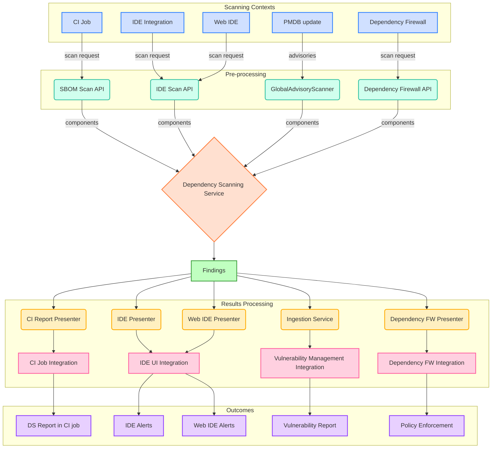

<!-- This renders the design document header on the detail page, so don't remove it-->


<!--
Don't add a h1 headline. It'll be added automatically from the title front matter attribute.
For long pages, consider creating a table of contents.
-->

## Summary

The dependency scanning feature is expanding beyond CI pipelines to support multiple scanning contexts.
To maintain consistency and avoid duplicate implementations across these contexts, we propose creating an on-demand Dependency Scanning service capable of analyzing components in a generalized manner.

## Motivation

The development of Continuous Vulnerability Scanning led to implementing the GitLab SBOM Vulnerability Scanner in the Rails backend.
Our new Dependency Scanning using SBOM feature was designed to reuse this same scanner.
However, based on user feedback, we must reconsider our approach to provide scan results back into running CI pipelines.
This requires a stateless approach to our vulnerability scanner logic and that it can send results back to the CI job.

Additionally, upcoming features on our roadmap require scanning capabilities in various contexts.
So far, the go to solution was to rely on CI pipelines, as demonstrated by our Container Scanning for the Registry implementation.
Though, this approach presents unnecessary complexity and limitations and this dependency on CI pipelines will increasingly hinder adoption of upcoming features.

Example use cases requiring scanning capabilities outside CI pipelines include:

- IDE integration
- Web IDE scanning
- Package registry scanning
- Dependency firewall
- And others

### Goals

- Design a Dependency Scanning service that can operate with minimal requirements and report detected vulnerabilities for a given list of components.
- Reuse the existing GitLab SBOM Vulnerability Scanner to maintain a single implementation of our scanner logic.
- Support all GitLab deployment types (gitlab.com, self-managed, dedicated) including offline environments.

### Non-Goals

- Define a public API for service consumption - instead, provide an internal interface that multiple ad hoc APIs or services can consume with their own needs

## Proposal

Create a generic Dependency Scanning service class in the Rails application that:

1. Takes a collection of components and configuration as input
2. Performs security analysis using the GitLab SBOM Vulnerability Scanner
3. Outputs results in a standardized format that can be transformed for various presentation contexts

### Advantages

- Focuses exclusively on security analysis using a single implementation: the GitLab SBOM Vulnerability Scanner
- Enables various scanning contexts to use the service:
  - Without additional requirements (the rails application and background jobs are core components available in all installations)
  - With different entrypoints based on needs (internal/public HTTP API, internal service calls)
  - With different input formats that can be pre-processed into the required format
  - With different output formats through specialized presentation layers

### Challenges

- A generic service might lack the necessary context for certain optimizations
- A single service for various scanning contexts will create a single point of failure

## Architecture

The dependency scanning service follows a modular architecture with clear separation of concerns:

## Implementation Details

TODO

## Alternative Solutions

### Create a Satellite Service with Runway

[Runway(https://docs.runway.gitlab.com/reference/blueprints/satellite-services-vision/#objective)] would be the ideal solution for a stateless service like this.

Unfortunately, support for all deployment types is not yet available and only part of the long term vision, which doesn't meet our requirements.

An hybrid approach using a Runway service in supported environments and a fallback to a different implementation in others would create additional development and maintenance costs.
Note that this could be considered further if we face performance limitations with the current proposal.

### Package GitLab SBOM Vulnerability Scanner into a Gem and its own container image

Multiple scanning contexts could reuse the generic scanner without depending on the Rails platform, either by bundling the gem or executing the container.

Though, the GitLab SBOM Vulnerability Scanner still requires access to the PMDB data to function, which is currently available via the GitLab rails application DB. This approach would
then require an API on the rails platform that the SBOM Scaner could use to fetch advisory data.

Additionally, some scanning contexts might lack the infrastructure to either run the scan directly (gem) or orchestrate the container execution. This would lead to additional complexity and requirements (e.g., triggering a CI pipeline to execute the workload and find a way to collect results).

## References

- [Dependency Scanning Analyzer](https://handbook.gitlab.com/handbook/engineering/architecture/design-documents/dependency_scanning_analyzer/)
- [GitLab SBOM Vulnerability Scanner](https://docs.gitlab.com/ee/user/application_security/sbom/)
- [Continuous Vulnerability Scanning](https://docs.gitlab.com/ee/user/application_security/vulnerability_report/)
