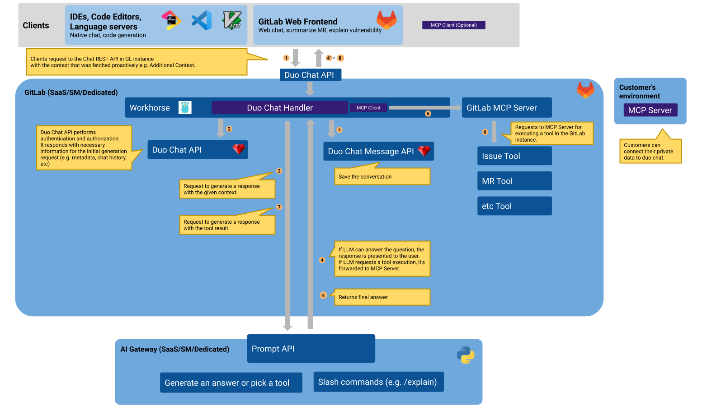



## Summary

This design document outlines the technical roadmap to [build trust through response correctness](https://gitlab.com/groups/gitlab-org/-/epics/17154) in Duo Chat,
which is part of GitLab's strategic vision for [Making Duo a Trusted Collaborator](https://gitlab.com/gitlab-org/gitlab/-/issues/523421).

## Motivation

### Goals

#### Resolve performance issues

- Minimize the latency of Duo Chat for the best user experience, which is an critically important factor in staying competitive against other AI solutions in the market. [example1](https://docs.google.com/presentation/d/12F6sjTJLP3DpLt1XNiRq9d7n0FZERzpqVGZSY1oLt-k/edit#slide=id.g2d626b4ecb5_0_258) [example2](https://gitlab.com/groups/gitlab-org/-/epics/13866)
- Reduce points of failure to provide a solid and stable feature that customers can trust. [example](https://gitlab.com/gitlab-org/modelops/applied-ml/code-suggestions/ai-assist/-/issues/713)
- Improve error handling for auto-recovery or to give clear instructions for users. [example](https://forum.gitlab.com/t/i-am-getting-error-m3003-when-running-discussion-summary-on-gitlab-ultimate-trial-and-duo-enterprise-trial/116912)
- Remove Sidekiq (Background job) dependency to reduce the risk of production incident. [example](https://gitlab.com/gitlab-com/gl-infra/production/-/issues/18489)
- Remove ActionCable and Websocket dependency to avoid the scalability risk. [example](https://docs.gitlab.com/development/real_time/#introduce-a-new-websocket-connection)

#### Build an extensible architecture

- Allow us to integrate with semantic search and context retrievals, including related assets. Allow users to ask about code base. [example](https://gitlab.com/groups/gitlab-org/-/epics/16910)
- Apply style guide and instruction templates that are shared at organization or group level. [example1](https://gitlab.com/groups/gitlab-org/-/epics/16938) [example2](https://gitlab.com/gitlab-org/gitlab/-/issues/481841)
- Provide a scalable agent tooling integration that the current architecture can't handle.
- Allow adoption of 3rd party vendor features without significant refactoring. [example](https://gitlab.com/gitlab-org/gitlab/-/issues/498749)
- Meet the user expectation that Duo Chat is aware of any context that the user can see. [example](https://gitlab.com/groups/gitlab-org/-/epics/14085)

#### Use Duo Chat over Claude Console UI

While GitLab encourages employees to use AI for their JTBD, many currently prefer Claude Console UI over Duo Chat.
This preference indicates that Duo Chat is currently a suboptimal solution compared to direct LLM access,
which could affect customers' migration to GitLab as they may struggle to eliminate such third-party dependencies.
We should resolve this [antipattern of dogfooding](https://handbook.gitlab.com/handbook/product/product-processes/dogfooding-for-r-d/).

#### Support custom models

- Allow integration with any LLMs with minimal effort.
- Enable iteration on quality improvement and prompt tuning for each LLM individually.

#### Improve contributor friendliness

- Reduce frictions of cross-functional team collaboration for tackling [1 year plan](https://about.gitlab.com/direction/ai-powered/duo_chat/#1-year-plan) together.
- Allow contributors to easily debug and investigate issues in both development and production environments.
- Allow any clients to integrate with Duo Chat easily without requiring cumbersome websocket handling, which is prone to race condition. [example](https://gitlab.com/gitlab-org/gitlab/-/issues/495541) [example2](https://gitlab.com/gitlab-org/gitlab/-/issues/523876)

### Non-Goals

<!--
Listing non-goals helps to focus discussion and make progress. This section is
optional.

- What is out of scope for this document?
-->

## Proposal

<!--
This is where we get down to the specifics of what the proposal actually is,
but keep it simple!  This should have enough detail that reviewers can
understand exactly what you're proposing, but should not include things like
API designs or implementation. The "Design Details" section below is for the
real nitty-gritty.

You might want to consider including the pros and cons of the proposed solution so that they can be
compared with the pros and cons of alternatives.
-->

NOTE: Credit goes to `@michaelangeloio` who proposed this architecture originally.

[Diagram source](https://docs.google.com/drawings/d/1EWHdfrW-OgtbniJddUkE_dLTZGuAxyU4nV1NsrHdeMM/edit?usp=sharing)

1. A client requests to `POST /api/v4/duo/chat` GitLab REST API endpoint with the context that was fetched in client side e.g. a file that is included via `/include` slash command.
   It also can retrieve available tools from the GitLab MCP server for retrieving context in server side. Clients can specify which MCP Server and tools are activated in the request.
1. The request is intercepted at the GitLab-Workhorse's Duo Chat handler, which is forward and reverse proxy server.
   The request is forwarded to Duo Chat API in Rails for authentication, authorization and composes a request to AI Gateway.
   The reason of why we use Workhorse instead of Rails is because requesting to external APIs causes a performance and scalability issue.
1. Workhorse requests to AI Gateway.
1. Workhorse examines the streamed SSE response from AI Gateway.
   If the response is the final answer from LLM, the response is streamed back to the frontend client as well.
   If the response indicates that a tool execution is required to fetch further context, Workhorse forwards the request to the MCP Server.
   In this case, workhorse also sends SSE to the frontend client to notify the progress.
1. Workhorse forwards the request to the designated MCP Server.
   GitLab's MCP Server provides tools to CRUD GitLab resources (e.g. create, read, update or destroy an issu, etc).
   See [GitLab Model Context Protocol (MCP) Server](../gitlab_mcp_server/_index.md) for more information.
1. MCP Server executes the tool and return the result.
1. Workhorse requests to AI Gateway again with the tool execution result. SSE is also sent to client to let them know the progress.
1. Workhorse examines the streamed SSE response from AI Gateway. Same with 4.
1. Workhorse requests to Duo Chat Message API to saves the conversation in database.

A few notes:

- Each internal request and response are streamed as [Server-sent events](https://developer.mozilla.org/en-US/docs/Web/API/Server-sent_events/Using_server-sent_events) (`text/event-stream` format) to the client. This allows clients to render the progress of the agent. Sensitive events are redacted or not sent to clients.
- A single event has  `data` field which contains the information of the event. It's formatted in JSON.
- We support [Server-Sent Events (SSE) as MCP transport layer](https://modelcontextprotocol.io/docs/concepts/transports#server-sent-events-sse).
- [MCP Client](https://modelcontextprotocol.io/introduction) can be implemented in two ways.
  - MCP Client at GitLab server side ... Users can configure preferred MCP Server at project-level or group-level. MCP tools are automatically appended to the function calling in the AI Gateway.
  - MCP Client at frontend client side ... Users can configure preferred MCP Server at user-level. MCP tools are proactively fetched in the frontend client and specified to the Duo Chat API in GitLab.

## Design and implementation details

<!--
This section should contain enough information that the specifics of your
change are understandable. This may include API specs (though not always
required) or even code snippets. If there's any ambiguity about HOW your
proposal will be implemented, this is the place to discuss them.

If you are not sure how many implementation details you should include in the
document, the rule of thumb here is to provide enough context for people to
understand the proposal. As you move forward with the implementation, you may
need to add more implementation details to the document, as those may become
valuable context for important technical decisions made along the way. A
document is also a register of such technical decisions. If a technical
decision requires additional context before it can be made, you probably should
document this context in a document. If it is a small technical decision that
can be made in a merge request by an author and a maintainer, you probably do
not need to document it here. The impact a technical decision will have is
another helpful information - if a technical decision is very impactful,
documenting it, along with associated implementation details, is advisable.

If it's helpful to include workflow diagrams or any other related images.
Diagrams authored in GitLab flavored markdown are preferred. In cases where
that is not feasible, images should be placed under `images/` in the same
directory as the `index.md` for the proposal.
-->

## Alternative Solutions

<!--
It might be a good idea to include a list of alternative solutions or paths considered, although it is not required. Include pros and cons for
each alternative solution/path.

"Do nothing" and its pros and cons could be included in the list too.
-->
