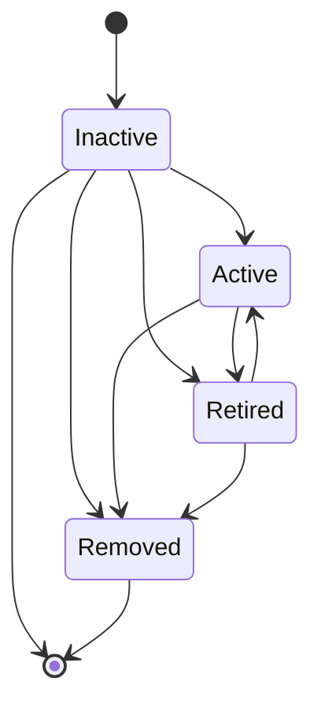
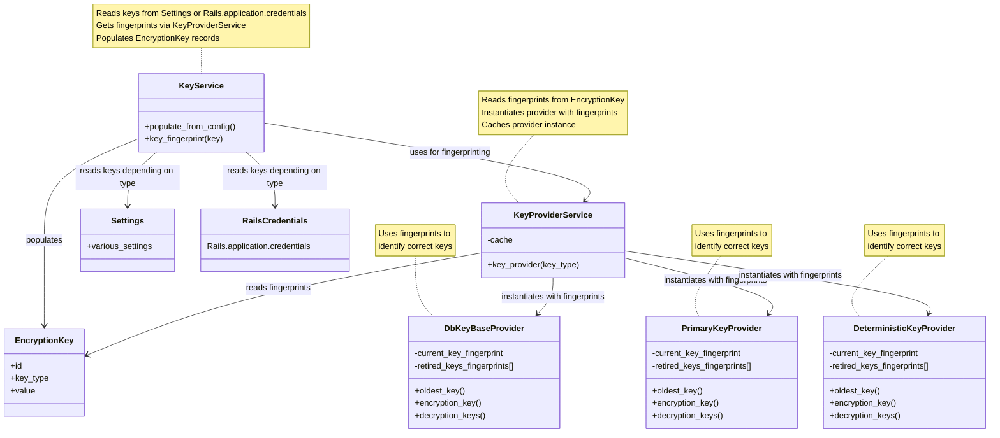



## Summary

We need a solution to rotate [encryption keys](https://docs.gitlab.com/ee/development/application_secrets.html)
without having to put GitLab offline.

## Motivation

[The `db_key_base`/`active_record_encryption_primary_key`/`active_record_encryption_deterministic_key` keys](https://docs.gitlab.com/ee/development/application_secrets.html)
are used to encrypt data at rest in the GitLab database (`db_key_base` is used by the `attr_encrypted` gem and the
`TokenAuthenticatable` framework, while `active_record_encryption_primary_key` &
`active_record_encryption_deterministic_key` are used by Active Record Encryption, which is Rails' native encryption
framework).
Their rotation is currently not possible without downtime, and there's no automation, script or even process for it.
Given the criticality of these secrets, the goal is to design a solution that allows these secrets to be rotated while
GitLab stays online.

With the Dedicated and Cells effort, the criticality of this secret and its rotation is multiplied by the increasing
number of instances deployed, for two reasons:

- The likelihood of a secret leak (through accidental or malicious means) increases with the number of instances deployed
- The amount of work needed to rotate a secret increases with the number of instances deployed

A lot of discussions happened to discuss the problem and potential solutions but no formal proposal was ever made.
The main issue where this was discussed is <https://gitlab.com/gitlab-org/gitlab/-/issues/25332>.

### Goals

Provide GitLab administrators with a way to:

- Introduce a new encryption key with an explicit enablement toggling (through UI, API, or rake task) to ensure all
  nodes have the new key before it's used to encrypt new/updated records with it.
  This is important in the scenario where an administrator adds a new key to `config/secrets.yml`, and then kicks off a
  new deployment. During the deployment phase, some of the pods/VMs will not have the new key. It's critical that the
  new pods/VMs don't start re-encrypting using the new key until the deployment is completed.
  When the deployment completes successfully, all pods/VMs now have the new key and the administrator can transition
  the new key to `active`.
- Introduce an always-running background process (with automated throttling to avoid degrading database performance) to take
  care of progressive re-encryption while GitLab stays online. The process would look up and re-encrypt any data
  encrypted with the non-current encryption key.
- Monitor the progress for the re-encryption of data encrypted with legacy keys, and overall usage of each key.
- Manage keys:
  - Enable a newly introduced key.
  - Disable a legacy key once no data is encrypted with it anymore.

#### Use cases

- An encryption key leaked and needs to be rotated.
- A security policy enforce a regular rotation of encryption keys.

### Non-goals

This blueprint does not cover the following:

- Introduce scripts to re-encrypt all the data while GitLab is offline. While there might be customer use-cases for
  this, we won't implement this initially.
- Other keys & secrets such as `secret_key_base`, `otp_key_base`, `openid_connect_signing_key`, and
  `encrypted_settings_key_base`, but ideally it should describe a solution that's generic enough to be applied to other
  secrets without too much changes in the future.
- Possibility to rotate the encryption keys from the Admin UI (this would require writing to the `config/secrets.yml`
  at runtime, which is impossible with most deployment strategies).
- Possibility to pull encryption keys from an external secrets manager (e.g. GCP and AWS KMS).
  While this is related and more secure, it should be solved with a dedicated proposal.
- Decision to use [envelope encryption or not](https://cloud.google.com/kms/docs/envelope-encryption).
  While envelope encryption has many benefits and is supported natively by Active Record Encryption, the decision to
  use it is independent from this proposal, and should be solved with a dedicated proposal.

## Proposal

The idea is based on 2 pre-requisites:

1. Support for multiple encryption keys: this allows online rotation of the secret
1. Ability to know what key was used to encrypt an attribute: this allows to re-encrypt data encrypted with a legacy key

The high-level proposal is as follows:

1. When a key need to be rotated, just add a new one last to the
   `db_key_base` / `active_record_encryption_primary_key` / `active_record_encryption_deterministic_key` arrays in
   `config/secrets.yml`, and restart GitLab.
1. Once the new secret is deployed to all nodes, the new key should be explicitely enabled, so that from now on, data
   is encrypted with this new key.
1. The decryption process uses the key that was used to encrypt the data.
   In the case the encryption key fingerprint isn't stored alongside the encrypted data, the decryption process tries
   each key (in the order they appear in the key arrays), until it can decrypt the data.
   That way, there's no need to bring GitLab down to mass-re-encrypt all data.
1. A background process continuously runs to re-encrypt any data that was encrypted with the non-current encryption key.
   The whole re-encryption process would likely take a long time on big instances (e.g. GitLab.com), but as long as we
   have a limiting/throttling mechanism in place, it shouldn't impact the database stability.
   The background process becomes a no-op as soon as all the data is re-encrypted with the current encryption key.
1. A new dedicated admin page allows to manage and monitor the encryption key usage:
   - What percentage of data is encrypted with each active encryption/decryption keys?
   - What's the expected ETA for everything to be re-encrypted with the current encryption key?
   - What keys can be removed (i.e. no data is encrypted with this key and the key is `retired` already)?

### "Encryption keys" admin page


### Technical details

#### Keys management

Keys lifecycle information will be stored in a new `encryption_keys` table, including:

- Key type `key_type`, an enum:
  - `db_key_base`
  - `active_record_encryption_primary_key`
  - `active_record_encryption_deterministic_key`
- Key fingerprint (4 hex chars), (inspired by
  <https://github.com/rails/rails/blob/v7.0.8.6/activerecord/lib/active_record/encryption/key.rb#L24>).
- Key status `status`: `inactive`, `active`, `retired`, `removed`.
  - At first a new key is `inactive`.
  - The new key will need to be explicitely enabled and will transition to `active` to become the current encryption key.
  - The current encryption key is always the `active` record with the highest `id`.
  - All keys from `config/secrets.yml` are available for decryption purpose. The encryption key fingerprint should be stored alongside
    encrypted data so that the decryption key doesn't have to be guessed from the active keys.
  - Once no data is encrypted with an `active` key anymore, it can be retired (in which case its status transitions to `retired`).
  - When the key is actually removed from the `config/secrets.yml` file, its corresponding record transitions to
    `removed` (see "During initialization" below).
- Key creation time `created_at`: the first time it appeared in a `config/secrets.yml` file.
- Key activation time `activated_at`: the time when the key transitioned to `active`.
- Key retirement time `retired_at`: the time when the key transitioned to `retired`.
- Key deletion time `removed_at`: the time when the key transitioned to `removed`.

Key statuses state diagram:



Keeping track of these information in the database gives the following abilities:

- Ability to explicitely enable a key once it's been deployed to all nodes. Otherwise, a key could be used on a node to
  encrypt data, but another node could be unable to read the data until it's deployed with the new key.
- Ability to build complex features around keys management and rotation.
- Ability to keep a history of keys and their status.

Later on, we could also keep statistics about keys usage in a separate table.

Note: The actual keys used to encrypt/decrypt data would still come from the `config/secrets.yml` file. Until the keys status is
read from the database, the oldest key would be used to encrypt/decrypt data. Hopefully, this would only mean during
the initialization of the application (i.e. before the database is ready).

##### During initialization

During initialization, if a new key is discovered in `config/secrets.yml`, the following 3 steps happens:

1. A record for the new key is created in the `encryption_keys` table (the status of the new key is `inactive`).
   - If its fingerprint collides with an existing non-`removed` key fingerprint, a warning is shown and the key cannot be transitioned to `active`.
     In that case, the key should be removed and replaced with another key.
     Note that a rake task will be provided to perform this collision check before the key is actually added to `config/secrets.yml`.
1. If a key is present in `encryption_keys` but not in `config/secrets.yml` anymore, the record is transitioned from
`inactive` or `retired` to `removed` and `removed_at` is set.
   - If the key was in the `active` state, it's problematic as it means the key was still in use (we can detect such cases
     with `state == "removed" && activated_at != nil && retired_at == nil`).
     The only remediation is to re-add the removed key from a backup. In that case, a new record would be created (and its
     fingerprint wouldn't collide since the previous record would be in the `removed` state).
1. For each key type, if no key is currently active, the latest inactive key is automatically activated.

#### Encryption key selection

The encryption key needs to be dynamically selected based on the `encryption_keys` table.

We'll introduce key providers that follow the
[`ActiveRecord::Encryption` custom key providers architecture](https://guides.rubyonrails.org/active_record_encryption.html#custom-key-providers).

Key providers don't interact with the `KeyEncryption` model, instead they only receive the current key fingerprint (for
encryption), and the retired keys fingerprints (to exclude them for decryption).

##### Architecture



##### Implementation of "Encryption keys" admin page

See the PoC code at <https://gitlab.com/gitlab-org/gitlab/-/merge_requests/177838/diffs?commit_id=c8807b44c750881c980e3de14275ca8cfc78e675>.

##### Changes required for `attr_encrypted`

The `attr_encrypted` gem supports dynamic key by passing a method name as the `key:` option, e.g.

```ruby
attr_encrypted :email, key: :db_key_base_32
```

We're taking advantage of that so that the key(s) used for encryption/decryption are retrieved from
`Gitlab::Database::Encryption::KeyProviderService`.

See the PoC code at <https://gitlab.com/gitlab-org/gitlab/-/merge_requests/177838/diffs?commit_id=904ccbf9f4408a31303e9065f0c39ad77f85a5c7#diff-content-5d31008bc68bfcfa3787a3338a808f53c51a6ad5>.

##### Changes required for `TokenAuthenticatable`

Changes are similar to what's done for `attr_encrypted`.

See the PoC code at <https://gitlab.com/gitlab-org/gitlab/-/merge_requests/177838/diffs?commit_id=904ccbf9f4408a31303e9065f0c39ad77f85a5c7#diff-content-a99cfc117c9fe8408818387e8197ef3186848efe>.

#### Background re-encryption process

Following is a naive implementation of what the background re-encryption process would roughly do.

```ruby
# ActiveRecord::Encryption
current_key_fingerprint = GitlabKeyProvider.new.encryption_key.id
ApplicationRecord.descendants.select { |d| d.encrypted_attributes.present? }.each do |model|
  model.where("NOT (#{attr}->'h'->'i') ? :value", value: ::Base64.strict_encode64(current_key_fingerprint)).find_in_batches do |batch|
    batch.each do |record|
      record.encrypt # this forces the re-encryption of all encrypted attribute
    end
  end
end

# TokenAuthenticatable
current_key_fingerprint = EncryptionKey.current_db_key_base_encryption_key_fingerprint
ApplicationRecord.descendants.select { |d| d.include?(TokenAuthenticatable) && d.encrypted_token_authenticatable_fields.present? }.each do |model|
  encrypted_fields = model.encrypted_token_authenticatable_fields

  model.where.not(encryption_key_fingerprint: current_key_fingerprint).find_in_batches do |batch|
    batch.each do |record|
      encrypted_fields.each do |field|
        record.public_send(:"#{field}=", record.public_send(field))
      end
      record.save!
    end
  end
end

# attr_encrypted
ApplicationRecord.descendants.select { |d| d.attr_encrypted_attributes.present? }.each do |model|
  encrypted_fields = model.attr_encrypted_attributes

  model.where.not(encryption_key_fingerprint: current_key_fingerprint).find_in_batches do |batch|
    batch.each do |record|
      encrypted_fields.each do |field|
        record.public_send(:"#{field}=", record.public_send(field))
      end
      record.save!
    end
  end
end
```

The final implementation could build upon
[the Background migration framework, which includes a throttling mechanism](https://docs.gitlab.com/ee/development/database/batched_background_migrations.html#throttling-batched-migrations).

Also, using the Background migration framework, we could have one background migration per table to be re-encrypted,
and report [its progress](https://docs.gitlab.com/ee/development/database/batched_background_migrations.html#monitor-the-progress-and-status-of-a-batched-background-migration)
directly in the admin UI.

### Data encrypted through `ActiveRecord::Encryption`

The `ActiveRecord::Encryption` framework already fullfills the pre-requisites (except for rotating deterministic keys,
but we might work around that, or even implement proper support for it).

### Data encrypted through `attr_encrypted` and `TokenAuthenticatable`

Currently, `attr_encrypted` and `TokenAuthenticatable` don't store the fingerprint of the key used to encrypt an attribute.
We could introduce a new `encryption_key_id` column referencing the `EncryptionKey#id` column to tables that include
encrypted columns.

A single `encryption_key_id` column per table is enough since the same key is used to encrypt all encrypted attributes
for a given record.

Once introduced, a post-deploy migration should populate all rows with the current encryption key ID.

The implementation of `attr_encrypted` and `TokenAuthenticatable` would need to be modified to populate the
`encryption_key_id` attribute.

**In the future, we should progressively migrate all the usage of `attr_encrypted` and `TokenAuthenticatable` to
`ActiveRecord::Encryption`.**

## Challenges

### Other usages of `db_key_base`

There are few places where the `db_key_base` secrets are used (mostly in JWT generation):

- `Auth::DependencyProxyAuthenticationService#secret` in `app/services/auth/dependency_proxy_authentication_service.rb`
- `Gitlab::Geo::Oauth::LogoutState#with_cipher` in `ee/lib/gitlab/geo/oauth/logout_state.rb`
  - Note that in `Gitlab::Geo::Oauth::LoginState#key`, we use `Gitlab::Application.credentials.secret_key_base`...
- `Gitlab::ConanToken#secret` in `lib/gitlab/conan_token.rb`
- `Gitlab::JWTToken#secret` in `lib/gitlab/jwt_token.rb`
- `Gitlab::LfsToken::HMACToken#secret` in `lib/gitlab/lfs_token.rb`

In all these cases, we should probably follow the general practice:

- Encrypt with the current active key
- Try to decrypt with all keys until one works

### Rotation of deterministic key

Deterministic encryption allows to query a table for a specific column value (e.g. personal access tokens are currently
queried by their digest, but we should migrate them to be encrypted instead so that we can rotate the key without
invalidating all the tokens).

`ActiveRecord::Encryption` doesn't support deterministic keys rotation at the moment, support for it should be
implemented either in GitLab, or in Rails directly.

That said, we might be able to work around this limitation by specifying a custom key provider so that under the hood
it uses the logic from `DerivedSecretKeyProvider` but with the `deterministic: true` option which makes the encryption
process generate the initialization vector based on the encrypted content instead of being random, i.e.

```ruby
encrypts :attr, deterministic: true, key_provider: Gitlab::Database::Encryption::KeyProviderService.new(:active_record_encryption_deterministic_key)
```

## Proof of Concept merge requests

### Multiple encryption key support

The following merge request shows that support of multiple encryption keys is possible today for both `attr_encrypted`
and `TokenAuthenticatable`: <https://gitlab.com/gitlab-org/gitlab/-/merge_requests/177748>

What's missing from this PoC is the second pre-requisite [from the above proposal](#proposal): the ability to know
what key was used to encrypt an attribute. It's possible to add support for this with the introduction of a new
`encryption_key_id` column per table.

### Encryption keys management

The following merge request implements the basis for encryption keys management in the DB:
<https://gitlab.com/gitlab-org/gitlab/-/merge_requests/177838>

What's missing from this PoC is:

- the automated background process to re-encrypt legacy-key-encoded data
- key usage statistics in the admin

## Iteration plan

### Iteration 1: Multiple encryption keys support for all `db_key_base` usages

1. Implement support of multiple keys in `attr_encrypted` and `TokenAuthenticatable` but still use the oldest key for
   encryption (until we have a proper keys management & rotation strategy in place).
1. Implement support of multiple keys in other usages of `db_key_base`

PoC MR: <https://gitlab.com/gitlab-org/gitlab/-/merge_requests/177748/diffs>

### Iteration 2: `EncryptionKey` model implementation

1. Implement the keys management system in the database
   - Create a new `encryption_keys` table to store keys information (id, fingerprint, status, timestamps)
   - Add collision detection to prevent `inactive` -> `active` transition

PoC MR: <https://gitlab.com/gitlab-org/gitlab/-/merge_requests/177838/diffs?commit_id=f1130cda5965d544f2cb03d9393f1dc09ba7c601>

### Iteration 3: Encryption keys management foundations

1. Introduce `KeyService`, `KeyProviderService` and key provider classes.

We don't use the key provider classes in this iteration.

PoC MR: <https://gitlab.com/gitlab-org/gitlab/-/merge_requests/177838/diffs?commit_id=a5d9db6c8f8a05617c8a88e84834f20d3d5155cc>

### Iteration 4: Encryption keys initializer

1. Implement initializer to read keys from `config/secrets.yml` and populate/update the database
   - Automatically activate the oldest key for each key type

We don't yet select keys from `EncryptionKey` in this iteration.

PoC MR: <https://gitlab.com/gitlab-org/gitlab/-/merge_requests/177838/diffs?commit_id=8d7a62e964406330e548229c853ea47350707790>

### Iteration 5: Key usage tracking in models

1. Add the `encryption_key_id` column to all models that use `attr_encrypted` and `TokenAuthenticatable`
   - Populate the column with the current encryption key (the first one, just in case several cases are already defined)

### Iteration 6: Encryption keys admin interface

1. Create the admin interface for keys management
   - Develop the UI for viewing key status, usage statistics, and controls

PoC MR: <https://gitlab.com/gitlab-org/gitlab/-/merge_requests/177838/diffs?commit_id=3eb8c0745553aef57bf514edfdc8caaf256abcb6>

### Iteration 7: Select keys based on `EncryptionKey`

1. Actually select encryption/decryption keys based on the data from `EncryptionKey`
   - This is a critical step, mostly in terms of performance

PoC MR: <https://gitlab.com/gitlab-org/gitlab/-/merge_requests/177838/diffs?commit_id=3511738098c46f96869263f4d738d703fc3b9337>

### Iteration 8: Re-encryption Process

1. Implement background re-encryption process
   - Build on top of background migration framework
   - Ensure database load is under control during re-encryption
   - Support `ActiveRecord::Encryption`, `attr_encrypted`, and `TokenAuthenticatable`
1. Develop progress tracking for re-encryption
   - Add database columns to track re-encryption progress
   - Update admin interface to display re-encryption status

### Iteration 9: Add activation/retirement actions in the admin interface

1. Implement key activation/retirement functionalities

### Iteration 10: Additional tooling

1. Create rake task to detect key collision in advance
1. Allow to disable actions in the admin UI (useful for Dedicated)
1. Create rake task to enable a new key
1. Develop safeguards against accidental key deletion

## References

- <https://gitlab.com/gitlab-org/gitlab/-/issues/25332>
- <https://gitlab.com/gitlab-org/gitlab/-/issues/26243>
- <https://gitlab.com/groups/gitlab-org/-/epics/10193>
- <https://gitlab.com/gitlab-com/gl-infra/gitlab-dedicated/team/-/issues/594> (confidential)
- <https://gitlab.com/gitlab-org/gitlab/-/issues/228663> (confidential)
- <https://gitlab.com/gitlab-com/gl-security/security-department-meta/-/issues/756> (confidential)
- <https://gitlab.com/gitlab-com/gl-infra/production-engineering/-/issues/12927> (confidential)
- <https://gitlab.com/gitlab-org/gitlab/-/issues/244855> (confidential)
- <https://gitlab.com/groups/gitlab-com/gl-infra/-/epics/443> (confidential)

## Who

DRIs:

<!-- vale gitlab.Spelling = NO -->

| Role                | Who                                            |
|---------------------|------------------------------------------------|
| Author              | Rémy Coutable, Principal Engineer              |

<!-- vale gitlab.Spelling = YES -->
