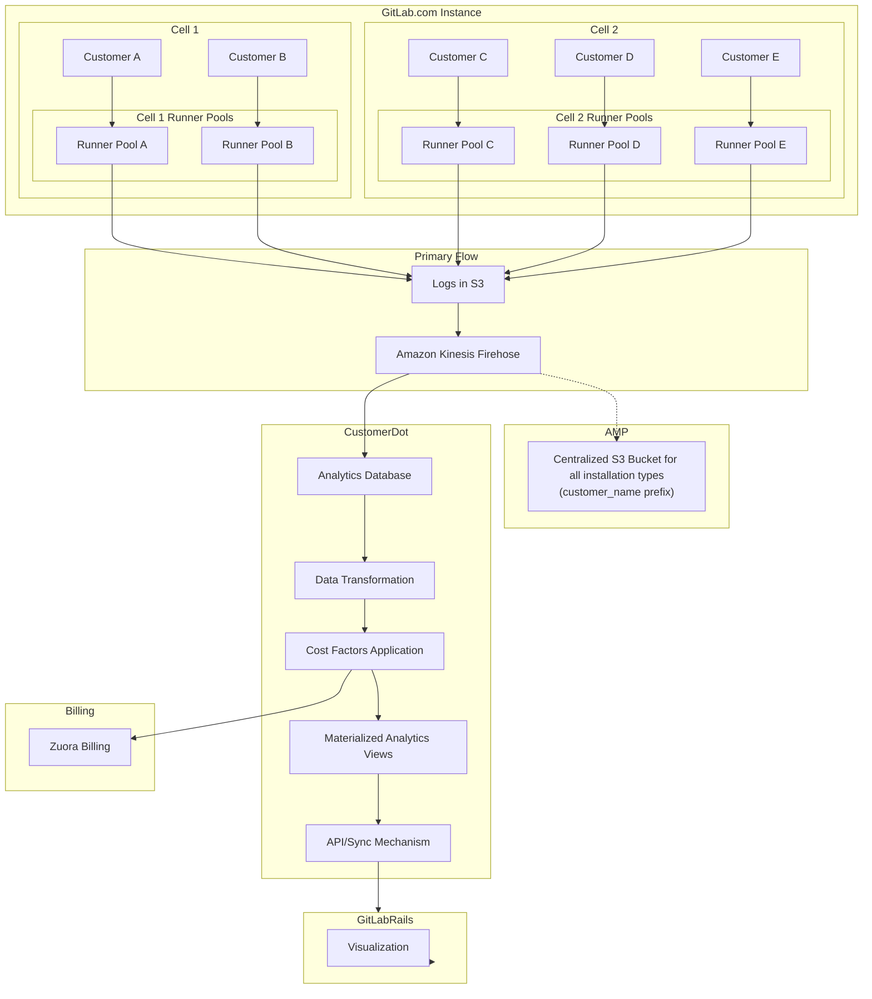



# Problem Summary

For most of the history of 'GitLab Hosted Runners', they have been instance runners (previously 
known as shared runners) on GitLab.com. These runners are accessible to customers across the entire 
.com instance. GitLab would like to explore offering GitLab hosted runners in other installation types 
such as on dedicated and self-managed instances. This is a paradigm shift in a number of ways.

Consumption based billing - We will no longer pre-pay for minutes for dedicated and self-managed installations, 
and instead send bills to customers after the month is over.

On .com we likely need to award minutes prior, and drop builds when they exceed those limits, to support
the current product requirements of dropping builds that exceed quota. And to enable free plan accounts 
to have access to a small amount of minutes if we move to pay after use billing.

Customer's GitLab instance ownership - Customers will have more access to the GitLab instance on self-managed
instances making it unsuitable for storing data that will be used to stop builds that are over the compute minute quota.

Customers could tamper with the data through the admin panel or by owning the infrastructure on self-managed

Runner Identity/Authorization - We now need mechanisms to prove the data comes from a hosted runner since customers can also register self-managed instance runners on dedicated or self-managed.

Additionally, there are existing challenges with the mechanisms we use to track minutes:

When the usage data stored at unaggregated at the build level in PostgreSQL, we were unable to perform efficient real-time querying of the data.
To solve for point 1, we created aggregated tables like ci_namespace_monthly_usages which suffers from contention on some self-managed instances as all runners for a namespace try to update the same row.
The data is better suited for an OLAP store (although PostgreSQL can be used for OLAP, other data stores may be better suited to this).

# Goals

1. The billing source of truth should be an immutable auditable system
2. Reduce code and infrastructure complexity by keeping special cases and number of tracking systems to a minimum
3. Allow for the visualization of minutes in GitLab (can be eventually consistent)
4. Allow for up-to-date minute tracking only from trusted/verifiable hosted runners
5. Allow for real-time querying of minute consumption per namespace, that is close to real-time on .com versions
1. Bills should be generated from an immutable source of logs or events using a well tested system to convert the data for use in Zuora/Gitlab
1. Cost factors for GitLab hosted runners should have a single source of truth
1. Usage Data for GitLab hosted runners should have a single source of truth
1. Improve on the resiliancy of the current system by capturing logs directly from runner 
   - less reliancy on the monolith where incidents affecting other components like sidekiq or the database can cause usage inflation if endpoints are down

# Proposal

## Design of Architecture for GA

For GA we took on tech debt by having multiple records/ledgers for usage data:
https://gitlab.com/gitlab-com/gl-infra/gitlab-dedicated/team/-/issues/6769#1-flow-proposal

## GitLab runner

1. Gitlab runner manager will be responsible for recording and sending the duration per build
  - Usage logs will be created by runner directly in S3 in the tenant accounts
  - Usage logs will then be sent by amazon kenesis firehose to a centralized bucket with a customer_name key prefix
  - Usage logs will also be loaded into an analytics database via amazon kenesis firehose
TODO: Section to determine the analytics database used based on studies of data structure/query speed at scale
2. TODO: Usage logs will include will include the data to attribute a duration to a customer

For all distirbution types each customer will have their own dedicated GitLab runner pool to execute CI/CD jobs:

Customer A ---> Runner Pool A (dedicated to Customer A)
Customer B ---> Runner Pool B (dedicated to Customer B)
Customer C ---> Runner Pool C (dedicated to Customer C)

Currently, our cells design specifies that there will be a pool of instance runners per cell on gitlab.com. A cell is
multi-tenant on gitlab.com and can include multiple customers. The goal of further breaking this down to a single customer
per runner would be to allow us to attribute a job from a runner to a customer without passing data about the job from
a self-managed instance where it would be vulnerable to tampering with the customer owned instance.

# Istrumentor

1. Registering runners in CustomerDot as associated with a customer when they are provisioned

## CustomerDot

1. Attributing and transforming the immutable data logs into data to be sent to Zuora
1. Sending the transformed usage data with cost factors applied to Zuora
1. Using an analytics focused database to store data
1. Possibly using a feature such as materialized views or an ETL pipeline to transform the data into the aggregated data views with cost factors applied for each namespace per month
1. Providing a query or syncing mechanism for GitLab to use for the purposes of vizalization and tracking

## GitLab Rails

1. Presenting a visualizaiton based on the CustomerDot Source of truth
   1a. Replicating analytics data into tables via a streaming mechanism (possiblities: Kafka)
   1b. Directly querying customerDot using a provided graphql api

