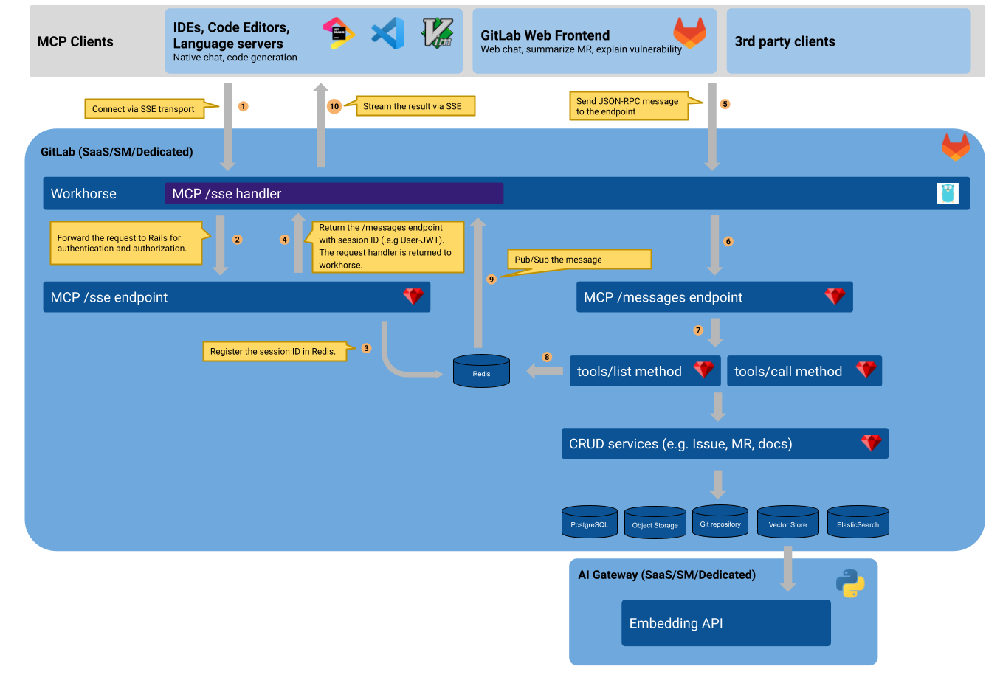



## Summary

This design document outlines the technical details for implementing Model Context Protocol (MCP) Server for GitLab.

## Motivation

### Goals

- Provide the MCP-compatible endpoint in GitLab to let clients to retrieve the contextual information and integrate with function calling with any LLM app.
- Adopt the practice of MCP in our GitLab frontend clients. For example, customers should be able to connect to their private database in Duo Chat.
- Allow us to test the context retrieval and function calling in any clients e.g. Claude Desktop.
- Ensure the [AI Context Abstraction Layer](../ai_context_abstraction_layer/_index.md) provides APIs that can be consumed by any LLM apps.

### Non-Goals

<!--
Listing non-goals helps to focus discussion and make progress. This section is
optional.

- What is out of scope for this document?
-->

## Proposal

<!--
This is where we get down to the specifics of what the proposal actually is,
but keep it simple!  This should have enough detail that reviewers can
understand exactly what you're proposing, but should not include things like
API designs or implementation. The "Design Details" section below is for the
real nitty-gritty.

You might want to consider including the pros and cons of the proposed solution so that they can be
compared with the pros and cons of alternatives.
-->

[Diagram source](https://docs.google.com/drawings/d/17xhIox0z6MABU5NYh0dkygNpThx2GOGZ5qckgfzjH6A/edit?usp=sharing)

1. MCP Client connects to the `https://gitlab.com/api/v4/mcp/sse` endpoint, which uses [SSE transport](https://modelcontextprotocol.io/docs/concepts/transports#server-sent-events-sse).
1. Workhorse forwards the request to the Rails for authentication and authorization via authorization header such as PAT or session.
1. Rails registers the session ID in Redis.
1. Rails return the request handler to Workhorse with the MCP /messages endpoint. Workhorse keeps the connection and sends the ping at the fixed interval.
1. MCP Client sends a message to GitLab when listing tools or executing a tool. This is JSON-RPC message as defined in MCP.
1. Workhorse forwards the request to Rails.
1. Rails decode the JSON-RPC message and execute the designated method, which contains CRUD services, such as Issue creation, read, update and destory. It's supported for the other entities such as Merge Request, Documentation, semantic serach, keyword search, etc.
1. Rails publish the result to Redis.
1. Redis publish the result to Workhorse.
1. Workhorse streams the result to clients.

A few notes:

- This process exactly follows the [Model Context Protocol (MCP)](https://modelcontextprotocol.io/introduction) in order to retain the compatibility between clients and servers.
- Authentication and Authorization should follow MCP's [Authorization](https://spec.modelcontextprotocol.io/specification/draft/basic/authorization/) design.
  However, we can additionally support PAT and Session based authentication for the seamless integration with GitLab VS Code extension.
- Reference: [Long polling](https://docs.gitlab.com/ci/runners/long_polling/)

## Design and implementation details

<!--
This section should contain enough information that the specifics of your
change are understandable. This may include API specs (though not always
required) or even code snippets. If there's any ambiguity about HOW your
proposal will be implemented, this is the place to discuss them.

If you are not sure how many implementation details you should include in the
document, the rule of thumb here is to provide enough context for people to
understand the proposal. As you move forward with the implementation, you may
need to add more implementation details to the document, as those may become
valuable context for important technical decisions made along the way. A
document is also a register of such technical decisions. If a technical
decision requires additional context before it can be made, you probably should
document this context in a document. If it is a small technical decision that
can be made in a merge request by an author and a maintainer, you probably do
not need to document it here. The impact a technical decision will have is
another helpful information - if a technical decision is very impactful,
documenting it, along with associated implementation details, is advisable.

If it's helpful to include workflow diagrams or any other related images.
Diagrams authored in GitLab flavored markdown are preferred. In cases where
that is not feasible, images should be placed under `images/` in the same
directory as the `index.md` for the proposal.
-->

## Alternative Solutions

<!--
It might be a good idea to include a list of alternative solutions or paths considered, although it is not required. Include pros and cons for
each alternative solution/path.

"Do nothing" and its pros and cons could be included in the list too.
-->
