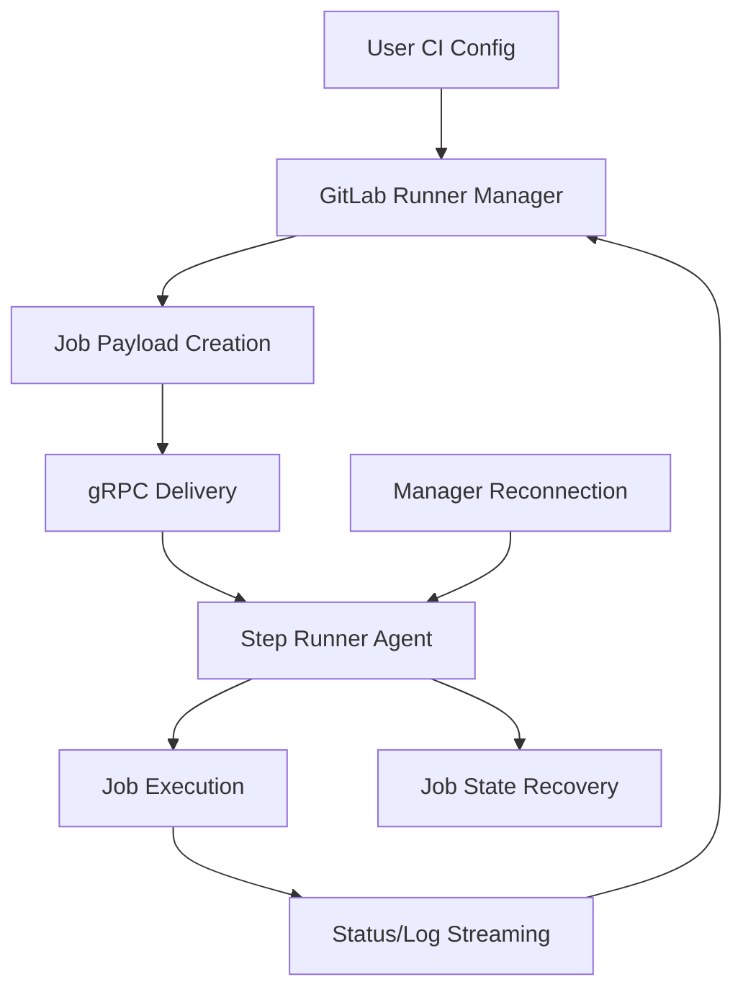
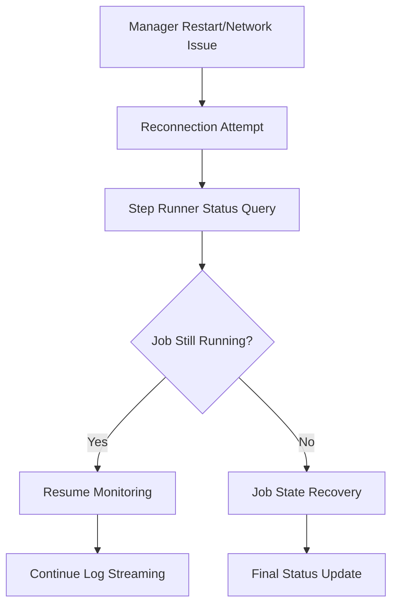

This document describes the migration strategy for transitioning GitLab CI job execution from the current script-based model to the new steps execution model. This migration focuses on changing the execution strategy while preserving all existing user-facing CI configuration syntax.

## Executive Summary

The script-to-steps execution migration transforms how GitLab CI jobs are executed in the target environment while maintaining complete backward compatibility for users. Instead of directly executing scripts, GitLab Runner will deliver job payloads over gRPC to a Step Runner agent in the execution environment. This architectural shift enables significant improvements in job resilience, manager reconnection capabilities, and execution control.

## Background

GitLab CI currently operates on a script-based execution model where GitLab Runner directly orchestrates script execution in the target environment. The new steps execution model introduces a fundamental architectural shift in job execution:

- **Current Model**: GitLab Runner → Direct script execution in target environment
- **Steps Model**: GitLab Runner → gRPC payload delivery → Step Runner agent → Structured execution

This migration changes the execution strategy without altering the user-facing CI configuration. Users continue to write the same `.gitlab-ci.yml` files, but the underlying execution mechanism shifts from direct script execution to gRPC-based step execution.

## Goals

### Primary Goals

- **Execution Model Migration**: Transition from direct script execution to gRPC-based step execution
- **Zero User Impact**: Existing `.gitlab-ci.yml` files continue to work without modification
- **Manager Reconnection**: Enable GitLab Runner manager to reconnect to running jobs across all modern executors
- **Executor Coverage**: Support all modern executors (`shell`, `instance`, `docker`, `docker-autoscaler`, `kubernetes`)
- **Architectural Benefits**: Unlock improved resilience, better sensitive data handling, and decoupled execution concerns

### Secondary Goals

- **Performance Preservation**: Maintain or improve current job execution performance
- **Enhanced Observability**: Provide better job monitoring and debugging capabilities through structured execution
- **Execution Control**: Enable fine-grained control over job execution lifecycle

## Non-Goals

- New steps-related user-facing features (dynamic secrets, `setup`/`teardown` keywords, etc.)
- Non-modern executor support (`parallels`, `virtualbox`, `docker-machine`)
- User-facing steps authoring capabilities during initial migration
- Changes to Kubernetes Pod construction methodology
- CI configuration syntax changes or enhancements

## Migration Architecture

### Execution Model Transformation

The migration transforms the job execution architecture by introducing a **Step Runner Agent** in the job execution environment and changing how GitLab Runner orchestrates job execution:

**Current Execution Flow:**
```
GitLab Runner Manager → Direct script execution in target environment
```

**New Execution Flow:**
```
GitLab Runner Manager → gRPC payload → Step Runner Agent → Structured execution
```

### Key Architectural Components

#### Step Runner Agent
A long-running service deployed in the job execution environment that:
- Receives job execution payloads via gRPC from GitLab Runner Manager
- Maintains persistent connection for job lifecycle management
- Executes jobs using the steps execution model
- Provides real-time status and log streaming back to the manager
- Enables manager reconnection to running jobs

#### gRPC Communication Layer
- **Job Delivery**: Complete job payloads delivered as structured data over gRPC
- **Execution Control**: Start, stop, pause, and resume job execution
- **Status Streaming**: Real-time job status and step-level progress updates
- **Log Streaming**: Continuous log output from job execution
- **Reconnection Protocol**: Manager can reconnect to jobs in progress

### Core Migration Components

#### 1. Job Payload Transformation

GitLab Runner Manager transforms existing CI job configurations into structured payloads for gRPC delivery:
- Preserves all current job semantics and behavior
- Packages scripts, environment variables, and job metadata
- Maintains compatibility with all existing CI features
- Handles complex scenarios (matrix jobs, parallel execution, includes, etc.)

#### 2. Step Runner Service Integration

Integration of Step Runner as a persistent service in job execution environments:
- **Shell Executor**: Native step runner process
- **Instance Executor**: Step runner service with SSH bridging
- **Docker Executors**: Step runner in container with exec bridging
- **Kubernetes Executor**: Step runner in pod with API exec bridging

#### 3. Manager Reconnection Protocol

Implementation of reconnection capabilities across all executors:
- Persistent job state management in Step Runner
- Connection recovery mechanisms
- Job status synchronization after reconnection
- Graceful handling of network interruptions

## Migration Phases

### Phase 1: Core Infrastructure (Foundation)

**Objective**: Establish the fundamental mechanisms required for gRPC-based job execution.

**Key Deliverables**:
- Step Runner gRPC service implementation
- Job payload transformation in GitLab Runner Manager
- Basic gRPC communication protocols (Run, FollowSteps, FollowLogs, Finish, Status)
- Step-based execution of traditional CI job components

**Success Criteria**:
- Jobs can be delivered as gRPC payloads and executed via Step Runner
- Manager can monitor job execution through gRPC streaming
- Basic reconnection capability demonstrated

### Phase 2: Executor Integration

**Objective**: Enable step-based execution across all modern executors.

#### Shell and Instance Executors
- Native gRPC step execution on shell executor
- SSH bridging for instance executor to connect to step runner service
- Handle nested gRPC services (macOS runners)
- Maintain performance characteristics

#### Docker and Docker-Autoscaler Executors
- Container-based step runner deployment
- Docker exec bridging to step runner gRPC service
- Image management and lifecycle integration

#### Kubernetes Executor
- Pod-based step runner deployment
- Kubernetes API exec bridging
- Service mesh integration considerations

**Success Criteria**:
- All modern executors can execute step-based jobs
- Performance parity with current script-based execution
- Equivalent debugging and troubleshooting capabilities

### Phase 3: Feature Completeness and Manager Reconnection

**Objective**: Achieve full feature parity and implement manager reconnection across all executors.

**Key Areas**:
- Complete job lifecycle management via gRPC
- Manager reconnection implementation for all modern executors
- Complex CI configurations (includes, extends, matrix jobs)
- All supported shells and platforms
- Edge cases and error handling
- Performance optimizations

**Success Criteria**:
- 100% feature parity with script-based execution
- Manager can successfully reconnect to running jobs on all modern executors
- All existing CI configurations work without modification
- Performance meets or exceeds current benchmarks

### Phase 4: Migration Strategy and Rollout

**Objective**: Safely deploy and enable the migration across GitLab infrastructure.

**Components**:
- Feature flags for controlled rollout
- Monitoring and observability
- Rollback mechanisms
- Performance monitoring
- User communication strategy

**Rollout Strategy**:
1. **Internal Testing**: GitLab.com internal projects
2. **Opt-in Beta**: Selected external projects
3. **Gradual Rollout**: Percentage-based rollout with monitoring
4. **Full Migration**: Complete transition to steps-based execution

## Technical Implementation Details

### Execution Model Transformation

The migration transforms how job execution is orchestrated while preserving all existing functionality:

| Current Execution Method | New Execution Method | Key Changes |
|--------------------------|---------------------|-------------|
| Direct script execution | gRPC payload delivery | Job data sent as structured payload |
| Runner-managed lifecycle | Step Runner agent lifecycle | Persistent agent enables reconnection |
| Shell-based coordination | gRPC-based coordination | Structured communication protocol |
| Immediate execution | Queued execution with status | Better execution control and monitoring |

### Execution Flow



### Manager Reconnection Flow



### Backward Compatibility Guarantees

1. **Execution Semantics**: All current job behavior is maintained exactly
2. **Environment Variables**: All predefined and custom variables work identically
3. **File System State**: Working directory and file permissions preserved
4. **Exit Codes**: Job success/failure determination unchanged
5. **Logging**: Output format and log streaming behavior maintained
6. **Timeouts**: All timeout behaviors preserved
7. **Cancellation**: Job cancellation and cleanup behavior unchanged
8. **CI Configuration**: No changes required to existing `.gitlab-ci.yml` files

### Key Benefits Unlocked

1. **Manager Reconnection**: Runner manager can reconnect to jobs after restart or network issues
2. **Enhanced Resilience**: Jobs continue running even if manager connection is lost
3. **Better Observability**: Structured execution provides detailed job state information
4. **Improved Control**: Fine-grained job lifecycle management through gRPC
5. **Foundation for Future Features**: Enables advanced capabilities like job migration and dynamic scaling

## Risk Mitigation

### Technical Risks

| Risk | Mitigation Strategy |
|------|-------------------|
| Performance degradation | Comprehensive benchmarking, optimization focus |
| Feature gaps | Extensive compatibility testing, phased rollout |
| Executor-specific issues | Per-executor testing and validation |
| Complex CI edge cases | Comprehensive test suite covering edge cases |

### Operational Risks

| Risk | Mitigation Strategy |
|------|-------------------|
| User disruption | Transparent migration, extensive testing |
| Rollback complexity | Feature flags, automated rollback procedures |
| Support burden | Documentation, monitoring, troubleshooting guides |
| Performance monitoring | Comprehensive observability and alerting |

## Success Metrics

### Technical Metrics
- **Execution Model Migration**: 100% of jobs execute via gRPC/Step Runner
- **Manager Reconnection**: >99% success rate for reconnection across all executors
- **Performance**: ≤5% performance impact on job execution time
- **Reliability**: ≤1% increase in job failure rate during migration
- **Coverage**: 100% of modern executors supported

### Operational Metrics
- **Migration Success Rate**: >99% of jobs execute successfully on new model
- **User Impact**: Zero user-reported breaking changes
- **Support Tickets**: No increase in CI-related support volume
- **Reconnection Effectiveness**: Measurable reduction in "lost job" incidents

## Dependencies

### Internal Dependencies
- Step Runner implementation and gRPC service
- GitLab Rails configuration parsing and translation
- GitLab Runner executor modifications
- Infrastructure step components

### External Dependencies
- Container registry for step component distribution
- Network connectivity for step component downloads
- Executor environment compatibility

## Timeline and Milestones

| Phase | Duration | Key Milestones |
|-------|----------|----------------|
| Phase 1: Core Infrastructure | 3 months | Step Runner service, basic translation |
| Phase 2: Executor Integration | 4 months | All executors support steps |
| Phase 3: Feature Completeness | 3 months | Full feature parity achieved |
| Phase 4: Migration Rollout | 2 months | Complete migration deployed |

**Total Timeline**: 12 months from start to full deployment

## Conclusion

The script-to-steps execution migration represents a fundamental architectural evolution for GitLab CI job execution while maintaining complete backward compatibility for users. By transitioning from direct script execution to gRPC-based step execution with persistent Step Runner agents, we unlock significant architectural benefits without disrupting existing workflows.

The primary immediate benefit is enabling GitLab Runner manager reconnection to running jobs across all modern executors, addressing a long-standing reliability challenge. This foundation also enables future innovations in job resilience, execution control, and advanced CI/CD capabilities.

This migration strategy prioritizes execution reliability and system architecture improvements while ensuring zero user impact. The phased approach ensures safe deployment across all modern executors and provides multiple opportunities for validation and course correction.

The successful completion of this migration will position GitLab CI for enhanced reliability, improved job lifecycle management, and advanced execution capabilities while maintaining the seamless user experience that GitLab CI users expect.