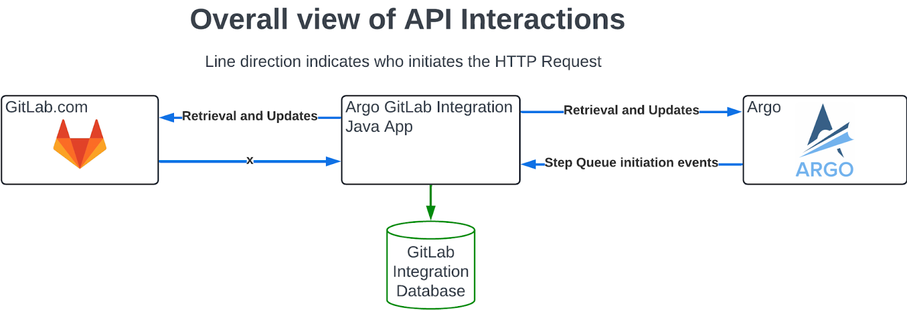
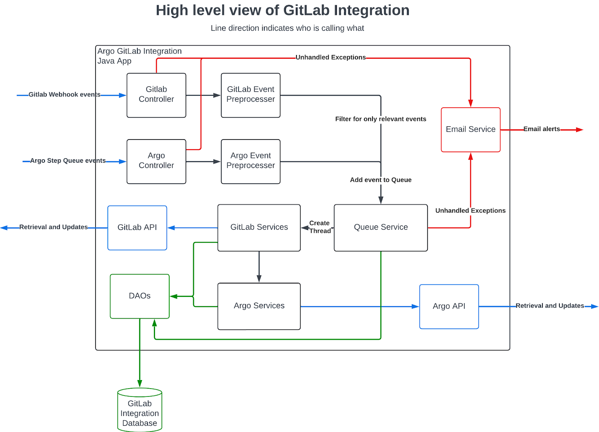

```markdown
---
# This is the title of your design document. Keep it short, simple, and descriptive. A
# good title can help communicate what the design document is and should be considered
# as part of any review.
title: GitLab Translation Service
status: proposed
creation-date: "2024-11-08"
authors: [ "@rasamhossain" ]
coaches: [ "@username" ]
dris: [ "@product-manager", "@engineering-manager" ]
owning-stage: "~devops::<stage>"
participating-stages: []
# Hides this page in the left sidebar. Recommended so we don't pollute it.
toc_hide: true
---
```

{{\< design-document-header \>}}

## Summary

This design document outlines the architectural design for an automated translation tool and a pipeline that provides translations for GitLab repositories and [Translation Management Systems (TMS)](https://phrase.com/blog/posts/translation-management-system-how-it-works/) used by Translation Vendors using a middleware Localization Request Management system called [Argo](https://gitlab.com/groups/gitlab-com/localization/-/epics/35 "Argo as a Request Management System FY25"). The [integration tool](##Proposal) is designed to automatically monitor and process translation requests for specified content changes in [GitLab](https://gitlab.com/) repositories through an event-driven Java application.

The objective of this design document is, however, not entirely on the application itself, but rather how we deploy this application in our GitLab infrastructure. But both of them will be discussed throughout the document.

The [integration tool](##Proposal) slash Java application implements an asynchronous, queue-based processing system that handles high-volume events from multiple projects/repositories while maintaining data consistency and preventing race conditions. It orchestrates the entire translation workflow - from detecting file changes in specific folders of interest, routing content through Argo's request management pipeline, all the way to managing the commit of translated content back to GitLab repositories.

The tool is deployed in GitLab architecture following these process 1) the application code is hosted through a [GitLab repository](https://gitlab.com/gitlab-com/localization/argo-gitlab-integration) under Localization group, 2) has its database hosted in [Google Cloud](https://console.cloud.google.com/welcome?hl=en&project=mktg-argo-transl-svc-ee3361e7), 3) gets the executable jar and docker file built using GitLab's [CI/CD pipeline](https://gitlab.com/gitlab-com/localization/argo-gitlab-integration/-/blob/main/.gitlab-ci.yml?ref_type=heads), and finally 4) deployed using [Runway](https://docs.runway.gitlab.com/).

## Motivation

The development of this automated localization pipeline addresses several critical challenges:

1. **Manual overhead reduction**:
   - Previously, all localization processes required manual intervention, creating a significant bottleneck,
   - Project managers were spending excessive time coordinating between development teams and translation vendors,
   - High risk of human error in file handling and version management.
2. **Operational efficiency**:
   - Automates the complete workflow from source string detection to translation deployment,
   - Eliminates the need for manual file transfers between systems,
   - Significantly reduces the time from source string updates to localized content availability.
3. **Scalability benefits**:
   - Capable of handling increasing volumes of translation requests without additional resource allocation,
   - Supports multiple repositories and projects simultaneously,
   - Easily adaptable to new language requirements and vendor integrations.
4. **Quality assurance**:
   - Maintains consistent file structure and naming conventions,
   - Ensures version control integrity through automated commit processes,
   - Reduces the risk of missing translations or outdated content.
5. **Cost effectiveness**:
   - Reduces operational costs associated with manual localization management,
   - Minimizes project delays and resource allocation issues,
   - Optimizes translation vendor utilization through streamlined request management.

This automated pipeline represents a significant step forward in modernizing the localization workflow, ensuring both efficiency and accuracy in managing multilingual content across GitLab repositories.

## Goals

### Current Goals:

Simplify and automate GitLab's translation pipeline with its translation vendors:

- Introduces an end-to-end automated localization infrastructure and pipelines - translating strings located in a GitLab repository,
- No manual human intervention required - engineers, PMs, and other associate stakeholders would save hours managing translations between GitLab and translation vendors,
- Ensuring higher accuracy in file handling and organizing large projects and decrease time-to-market for localized content,

### Future Goals:

- Ability to configure translation schedule based on team needs and vendor's availability,
- Create a robust error handling and automated quality checks for file formats,
- Set up automated QA checks for common localization issues,
- Establish monitoring for translation consistency and set up automated testing procedures.

## Proposal

It's important to emphasize that while this document touches on the tool's features and it's core functionality will be briefly discussed to provide context, the primary focus is on the deployment architecture and infrastructure implementation within our GitLab environment. This approach ensures a clear understanding of how the tool and the translation pipeline fits into and operates within our broader infrastructure ecosystem.

The proposal is divided into two sections. **Section 1:** outlines the overall architectural flow and operational mechanics of the translation pipeline within the tool itself. **Section 2:** details the deployment architecture, infrastructure requirements, and implementation strategy for the proposed solution.

### **Section 1** : The Tool

1. **Continuous monitoring and tracking**: The integration tool monitors GitLab repositories and detects closed Merge Request(s) on that repositories.
2. **Source file identification**: If there's a change in the source en-US folder as a part of a merged MR, the tool identifies it and extracts the content from the GitLab API.
3. **Translation request**: Once extracted, it automatically creates an [Argo](https://gitlab.com/groups/gitlab-com/localization/-/epics/35 "Argo as a Request Management System FY25") Request for identified files requiring translation.
4. **Vendor pipeline**: [Argo](https://gitlab.com/groups/gitlab-com/localization/-/epics/35 "Argo as a Request Management System FY25") orchestrates translation workflow through configured vendor integrations based on GitLab's localization specifications.
5. **Translated file integration to GitLab**: Once the translation is complete and available to [Argo](https://gitlab.com/groups/gitlab-com/localization/-/epics/35 "Argo as a Request Management System FY25"), it automatically commits translated files back to GitLab.
6. **Verification, review & merge**: A Localization Engineer reviews the [Argo](https://gitlab.com/groups/gitlab-com/localization/-/epics/35 "Argo as a Request Management System FY25")'s commit containing translated files, approves, and merges back to the repository.

### **Section 2:** Deployment architecture:

1. The integration tool is located in a [GitLab repository](https://gitlab.com/gitlab-com/localization/argo-gitlab-integration), and get's build into a docker file container using GitLab's CI/CD pipeline.
2. Once that's done, the docker container will be deployed with [Runway](https://docs.runway.gitlab.com/).
3. Since [Runway](https://docs.runway.gitlab.com/) doesn't support [PostGresSQL](https://www.postgresql.org/) as of now, we'll connect to a database server on [Google Cloud](https://gitlabsandbox.cloud/cloud/accounts/ee3361e7-c233-4794-b423-2241db8f2505).

## Design and implementation details

### Tool specific details:

[Spartan Software, Inc. (“Spartan”)](https://gitlab.com/gitlab-com/localization/localization-team/-/issues/41 "Argo as a Request Management System FY25") has helped us building a Java application that act as the intermediary tool to communicate with the Request Management System - [Argo](https://gitlab.com/groups/gitlab-com/localization/-/epics/35 "Argo as a Request Management System FY25"). In summary, here's what the tool does:

- The integration tool continuously monitors certain GitLab projects or repositories,
- Anytime a Merge Request is closed on the monitored project, the integration tool receives the Merge Request data from GitLab API - that gets extracted to identify the list of en-US source language files,
- The tool then creates an [Argo](https://gitlab.com/groups/gitlab-com/localization/-/epics/35 "Argo as a Request Management System FY25") Request for these files that requires translation,
- [Argo](https://gitlab.com/groups/gitlab-com/localization/-/epics/35 "Argo as a Request Management System FY25") manages the translation on it's end with the translation vendors assigned by GitLab,
- Whenever translation has completed on file(s) associated in the Request, [Argo](https://gitlab.com/groups/gitlab-com/localization/-/epics/35 "Argo as a Request Management System FY25") attempts to commit the file(s) back to GitLab.
- An engineer reviews the commits of the Merge Request created by [Argo](https://gitlab.com/groups/gitlab-com/localization/-/epics/35 "Argo as a Request Management System FY25"), approves them, and get the files merged to the repository.



#### Lifecycle of an event

The application is event driven. The application remains dormant until either GitLab or [Argo](https://gitlab.com/groups/gitlab-com/localization/-/epics/35 "Argo as a Request Management System FY25") send in an HTTP Request to the application. The application will then handle the event and perform, sometimes quite complex, operations.



##### Event preprocessing

Quick checks and handling for large volumes of HTTP Requests before putting them into the queue.

1. [Argo](https://gitlab.com/groups/gitlab-com/localization/-/epics/35 "Argo as a Request Management System FY25") or GitLab events are received to _`GitLabController`_ or _`ArgoController`_ respectively, auth is checked, then passed unaltered to the next service.
   - **Purpose**: Simple endpoint that allows the internal services to be interfaced with, and authenticate the request
2. **(GitLab Event)** _`GitLabWebhookService`_ will take the event, convert that data, and check if it's relevant. If the checks find it is relevant, then it’s added to the queue
   - **Purpose**: Filter out most of the junk events, convert the data into a more manageable form, handle events immediately, prevent the queue and database being filled with useless events
3. **(**[**Argo**](https://gitlab.com/groups/gitlab-com/localization/-/epics/35 "Argo as a Request Management System FY25")\*\* Event)\*\* _`ArgoStepService`_ will take the event and just add it to the queue
   - **Purpose**: All Argo events are relevant so this has no use, but if in the future we need to do preprocessing like with the GitLab events, then this serves as a convenient place to do so

##### Event Queuing

The complex behaviour of queueing and dequeuing. The “Queue Service in depth look” diagram below visualizes this process.

1. Event is received to the _`QueueService`_, and added to the database, and then added to an _`EventRunnable`_ before being submitted to a GroupedExecutingThreadPool.
   - **Purpose**: Events must be handled synchronously per project, so a FIFO queue prevents a race condition from occurring. The database is there to log events and allow retrying them if something goes wrong.
2. The _`EventRunnables`_ are executed by GroupedExecutingThreadPool in FIFO order immediately, but there are multiple execution queues that are grouped by the Project. So there can be multiple projects run asynchronously, but all the events in each project must be run FIFO.
   - There is a limit to the number of projects that can be run at the same time. If an event wants to be added to a queue that isn’t a part of the running projects, and there is currently a maximum number of projects executing, then it will hold up the entire line of events.
   - Purpose: Preserve the synchronous requirement of event handling, but don’t block other Projects from being processed if other Projects are taking a lot of resources. Don’t run too many events concurrently to prevent resource overuse and API rate limit issues.
3. The spun up thread for an event begins its execution in the _`QueueService#handleEvent`_ method, which then dispatch to the appropriate GitLab or Argo service.

##### Event Handling

This is where the heavy lifting of making API calls, processing the information, and making decisions comes into play. When a new thread is spun up from the EventQueue, it is passed a specific Service designed to handle that event.

###### Merge Request closed

`GitLabMergeRequestService#handleClosedEvent` Anytime an MR is closed on the monitored projects, this event is called.

1. Get Merge Request data from GitLab API
   - Purpose: Not all needed data is provided in the Event. It will also get the latest data in case there were changes since the event was called.
2. Get a list of files needing translation
   - This depends on the translation MR and the contents of the changed files in the MR.
3. Get the contents of those files
4. Create the Argo Request for those files
5. Add cards and allocate assets in the Request
   - Purpose: Provide additional data like links, and organize the Schedule so it’s ready to launch, or can be auto launched.
   - If any exception happens, delete the Argo Request so it’s not incomplete.

###### Argo Commit to GitLab

`GitLabMergeRequestService#handleCommitToTranslationMREvent` Whenever translation has completed on a target file, Argo attempts to commit the file back to GitLab. It will do this one file at a time.

1. Get details from Argo about the Request and [the Plan](https://gitlab.spartansoftwareinc.com/apidoc.html#/plans) and its content,
2. Get details from GitLab about the Project,
3. Get the Translation YAML and decide where to place the target files based on this
   - Will attempt to find the file path in the Argo Translation YAML (the configuration file that has the information on folder locations) for the source file, then remap to the target language.
4. Commit the file and its contents to a Translation MR
5. Update Argo that the step is completed

## Deployment Phase(s)

The deployment for the [Argo\<-\>GitLab Integration](https://gitlab.com/groups/gitlab-com/localization/-/epics/38 "Argo <-> GitLab integration FY25") will be handled in [two phases](https://gitlab.com/gitlab-com/localization/localization-team/-/issues/275 "Technical direction for the deployment of Argo<->GitLab integration").

### Phase 1 - Spartan

The first phase will have the application deployed in [Spartan](https://gitlab.com/gitlab-com/localization/localization-team/-/issues/41)’s environment to expedite the process of running and testing the application. It is only a temporary step until the application can ultimately be deployed to GitLab’s environment.

The application is built in GitLab’s CI/CD Pipeline. The artifact is then downloaded and deployed by the Spartan Software engineers..

The application is deployed in a Rocky Linux 8 OS running on AWS EC2. It’s runs on Java 17, with an Nginx proxy. It runs on the same instance as the Argo application. The nginx application is configured to allow only the endpoint for GitLab webhook events to access the application. All other endpoints can only be accessed within the box via localhost.

### Phase 2 - GitLab

- [Pipelines](https://docs.gitlab.com/ee/ci/pipelines/): 
  1. When the GitLab environment is ready, it will work the same for building in the Pipelines from the same [repository](https://gitlab.com/gitlab-com/localization/argo-gitlab-integration).
  2. However, pipelines would run to build the executable java(.jar) plus build the docker container, that includes Java 17 and nginx to act as a proxy.
- [Runway](https://docs.runway.gitlab.com/): 
  1. It get's deployed in [Runway](https://docs.runway.gitlab.com/guides/onboarding/), however [Runway](https://docs.runway.gitlab.com/guides/onboarding/) doesn't support Postgresql as of now, so here's where GCP comes into action.
- [Google Cloud](https://gitlabsandbox.cloud/cloud): 
  1. To configure the database part of the Argo-GitLab integration service, we can install and deploy the database services on [Google Cloud Sandbox](https://gitlabsandbox.cloud/login), and use [Cloud SQL](https://docs.runway.gitlab.com/guides/cloud-sql/) to connect from [runway](https://docs.runway.gitlab.com/guides/onboarding/).

## Alternative Solutions

One quick solution is to build a linux server in to Google Cloud and install the java application and the rest of the database configuration on cloud. We can call this as Traditional VM based deployment whether it's done on the cloud or somewhere inside GitLab:

- Quick initial setup using Google Cloud VM with Java application and database
- Minimal initial configuration required
- Lower initial development overhead

However, it has some serious limitations:

- **Deployment challenges**:
  - Manual deployment process requiring executable JAR rebuilds
  - Lack of zero-downtime deployment capabilities
  - No automated rollback mechanisms
  - Risk of configuration drift between environments
- **Operational concerns**:
  - Pipeline interruption during deployments
  - Potential data loss during Argo communications
  - Limited scalability options
  - Higher maintenance overhead
- **Monitoring and recovery**:
  - Limited built-in monitoring capabilities
  - Complex disaster recovery procedures
  - No automatic failover options