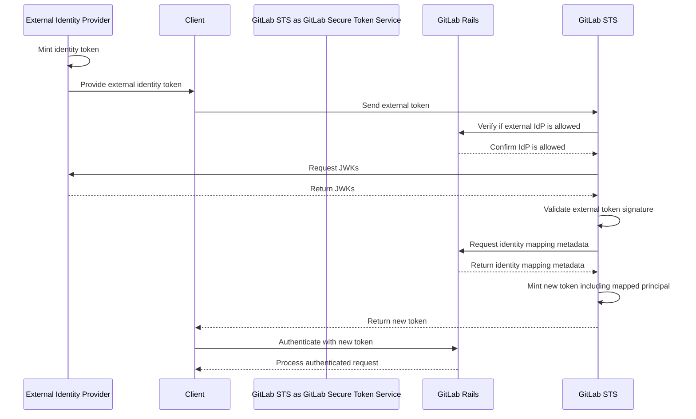



## Summary

Today, the main way in which machine-type identities interact with GitLab is by
using Personal Access Tokens. Because of Personal Access Token being relatively
long-lived tokens, there is a significant risk associated with PATs leaking or
being stolen by malicious actors.

Users are often using OAuth access tokens too, to rely on shorter-lived
credentials. This is not perfect, however, because OAuth tokens are
impersonating human-users and can't be easily associated with service accounts,
and tools built for machine-type identities.

There is an alternative solution, widely adopted across the industry. It is
[workload identity federation](https://cloud.google.com/iam/docs/workload-identity-federation),
built on top of OpenId Connect (OIDC). GitLab users are already using this
method to authenticate with Google Cloud Platform or AWS, but there is no way
to authenticate with GitLab by using identity federation.

This design doc describes the way towards GitLab Workload Identity Federation:
making GitLab users able to grant access to GitLab instance to external
identities by mapping external principals onto GitLab identities, and defining
rules around how the authentication and authorization is supposed to work for
those principals.

## Goals

Add support for GitLab being able to recognize external identities, and to map
those external identities onto GitLab principals, by using OIDC identity
tokens coming from external identity providers.

## Requirements

1. GitLab users are able to define a list of external identity provides which
will be allowed to access GitLab resources within configured groups / projects.
1. GitLab users can map external identities onto GitLab service accounts.
1. GitLab users can define the rules governing the mapping using claims carried
by external identity tokens.
1. GitLab users can audit access granted to external identities using audit logs.
1. External identity token can be used to authenticate with GitLab APIs
provided that the external identity provider has been properly added and
confiured in GitLab.

## Proposal

Build a token exchange service which will read GitLab Workload Identity
Federation rules from GitLab API based on this metadata, it will be able to
recognize and validate identity tokens issued by external identity providers.
The claims in the identity tokens will be used to map external identity onto
GitLab principal. After a successful mapping, GitLab STS will mint another
token which will be used by client SDKs to interact with GitLab APIs.

## Decisions

1. STS-001: Open source GLGO service built for GCP integration.
1. STS-002: Build GitLab Secure Token Service inside GLGO.
1. STS-003: Implement external identity to GitLab service account mapping.
1. STS-004: Add support for accessing GitLab APIs with JWTs minted by GitLab STS.
