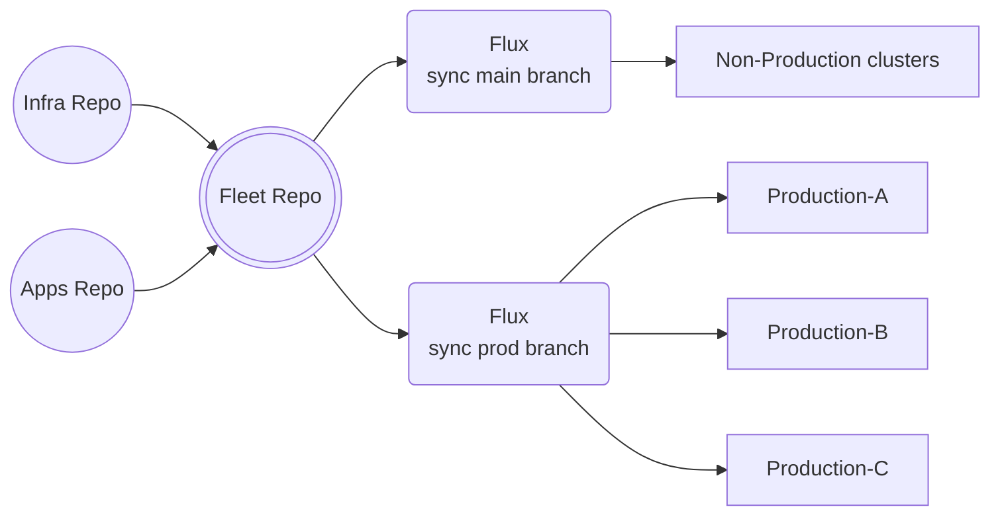



## Summary

This design document proposes adopting Flux as the standardized GitOps solution for managing GitLab.com's infrastructure workloads, replacing the current dual-tooling approach of gitlab-helmfiles and tanka-deployments. Flux will provide automated synchronization, enhanced security, and improved multi-tenancy support while reducing deployment complexity and preventing configuration drift. This adoption aligns with GitLab's involvement in the Flux project and follows successful implementations by teams like Runway.

The implementation is expected to deliver improvements across several key areas:

1. Operational Efficiency
   - Reduced deployment times through targeted reconciliation
   - Fewer manual interventions through automation
   - Automated drift detection and correction
   - Streamlined workflow with single tool and methodology

2. Resource Optimization
   - More efficient CI pipeline usage through targeted deployments
   - Lower operational overhead from consolidated tooling
   - Improved cluster resource utilization
   - Reduced engineering time spent on maintenance

3. Security Enhancements
   - Enhanced supply chain security with artifact verification
   - Improved secret management and access control
   - Better audit trails and compliance tracking
   - Standardized security practices across deployments

4. Team Productivity
   - Simplified onboarding process for new services
   - Reduced cognitive load from single tool adoption
   - Improved troubleshooting capabilities
   - Enhanced collaboration through standardized practices

## Motivation

GitLab.com's infrastructure team currently manages Kubernetes workloads using two different mechanisms - gitlab-helmfiles and tanka-deployments. This dual-tooling approach has created several challenges.

### Current Architecture Challenges

- **Deployment Complexity**

The current dual-tooling approach creates significant complexity in our deployment workflows. Managing both helmfile and tanka deployments requires maintaining parallel processes and documentation, leading to confusion and increased chances of errors. A particularly challenging aspect is the handling of dependencies between helm releases, which are currently implicit and poorly documented. This makes it difficult to understand deployment prerequisites and properly sequence releases, especially when deploying to test clusters where we may not want to deploy every component. The branching strategy across multiple repositories has become unwieldy, requiring careful coordination and often manual intervention when deployments fail. Furthermore, our current setup performs full environment diffing on every change, resulting in unnecessarily long deployment times even for minor updates.

- **Operational Overhead**

Day-to-day operations are significantly impacted by the need to maintain and switch between helmfile and tanka tooling. Teams must constantly context switch between different deployment methodologies, leading to reduced efficiency and increased chance of errors. The lack of automated drift detection means configuration divergence can go unnoticed until it causes problems, requiring periodic manual audits to ensure cluster state matches our desired configuration. Rollback procedures often require human intervention, increasing the risk of extended outages. The need to maintain separate CI pipelines for both tools further compounds the operational burden, with teams spending considerable time troubleshooting pipeline issues rather than focusing on platform improvements.

- **Technical Debt**

Years of maintaining two parallel systems has led to significant technical debt. Inconsistent deployment patterns have emerged between teams using different tools. The tanka deployment system relies on complex jsonnet libraries that are poorly documented and understood by only a few team members.

- **Security Concerns**

Our current setup presents several security challenges that are becoming increasingly critical. The limited RBAC granularity makes it difficult to implement proper access controls, while the manual secret management across environments increases the risk of exposure. Managing access through CODEOWNERS files has become complex and error-prone, requiring frequent updates and careful review. The lack of built-in supply chain security features means we have no automated way to verify the integrity of deployed artifacts. Security scanning must be implemented separately for each tool, leading to potential gaps in coverage. Additionally, audit trails are limited to Git history, making it difficult to track and report on deployment changes comprehensively.

- **Scalability Issues**

As our infrastructure grows, scalability limitations are becoming more apparent. The current setup requires long-running CI pipelines that impact deployment velocity, while resource-intensive full cluster reconciliation operations strain our infrastructure. Cross-cluster deployments require manual intervention and coordination, making it difficult to manage our expanding cluster fleet efficiently. The lack of native multi-cluster support means we've had to implement custom solutions that are difficult to maintain and scale. We're also seeing performance degradation as the number of releases increases, with no clear path to improvement without significant architectural changes.

- **Multi-tenancy Limitations**

The current architecture struggles to provide effective multi-tenant support, a critical requirement for our growing organization. Permission management across repositories is complex and error-prone, with no native tenant isolation capabilities. Teams must manually configure namespaces and RBAC settings for each new tenant, leading to inconsistencies and security risks. Delegating control to stage teams is particularly challenging, requiring careful coordination and multiple repository changes. The lack of a standardized onboarding process means each new tenant requires significant manual effort to set up, while the risk of tenant interference remains high due to limited isolation capabilities. These limitations make it increasingly difficult to scale our platform across multiple teams and applications.

### Goals

- Simplify Kubernetes workload management by consolidating on a single GitOps solution.
- Reduce deployment times through targeted reconciliation.
- Prevent configuration drift via automated synchronization.
- Improve multi-tenancy support to enable self-service for stage teams.
- Enhance security through built-in artifact signing and verification.
- Improve observability of deployment status and problems.
- Reduce cognitive load on SRE teams through standardization.
- Provide GitOps foundation to enable integration with Platform tooling like Crossplane.

### Non-Goals

- Migrating non-infrastructure workloads to Flux.
- Deploying the Gitlab application stack.
- Building custom extensions or modifications to Flux.
- Implementing custom deployment workflows outside of GitOps practices.
- Creating a general-purpose deployment solution for all GitLab teams.

## Proposal

We propose adopting Flux as the standardized GitOps solution for managing GitLab.com infrastructure workloads. Flux offers several key characteristics that make it particularly well-suited for GitLab's infrastructure needs:

### Flux Key Characteristics

1. GitOps-Native Architecture
   - Declarative configuration using Git as single source of truth
   - Automated reconciliation between Git state and cluster state
   - Built-in drift detection and correction
   - Native support for GitLab repositories and CI/CD integration

2. Security-First Design
   - Supply chain security with artifact signing and verification
   - Fine-grained RBAC with service account impersonation
   - Secure multi-tenancy isolation
   - Protected branch enforcement for production deployments

3. Scalable Operations
   - Distributed controller architecture with no central server
   - Efficient resource utilization through targeted reconciliation
   - Native multi-cluster management capabilities
   - Automated image updates reducing manual intervention

4. Enterprise Readiness
   - Production-proven at scale by major organizations
   - Comprehensive monitoring and alerting capabilities
   - Disaster recovery through Git-based state recovery
   - Strong community support and regular security updates

5. GitLab Alignment
   - Strategic alignment with GitLab's cloud-native direction
   - Deep integration with GitLab repositories and CI/CD
   - Opportunity for GitLab to influence future development
   - Dogfooding benefits for GitLab's Flux integration

The implementation will follow a phased approach:

1. Phase 1: Foundation (1 month)
   - Restructure k8s-mgmt repository to align with Flux best practices.
   - Use Ops Gitlab instance as Git repository for Flux.
   - Implement Gitlab CI pipelines for testing validity of Flux manifests and configurations as well as End to End integration testing using an ephemeral Kubernetes cluster.
   - Set up Capacitor UI for Flux visualization

2. Phase 2: Testing & Validation (2 months)
   - Complete migration of partially moved services (cert-manager, external-dns)
   - Document production readiness requirements
   - Validate multi-tenancy configuration by onboarding other Production Engineering teams to Flux.
   - Implement monitoring and alerting.
   - Document operational procedures.

3. Phase 3: Production Migration (3 months)
   - Bootstrap Flux in production clusters.
   - Gradually migrate Foundation-owned services from helmfiles and tanka.
   - Assist on the migration of non Foundations workloads.

The proposed architecture will follow the [D1 reference architecture](https://fluxcd.control-plane.io/guides/d1-architecture-reference/) pattern from the Flux documentation, with modifications to suit GitLab's specific needs:

- Repository structure: fleet, infra, and individual repositories for each stage team applications.
- Strict multi-tenancy controls via RBAC and namespace isolation.
- Automated image updates for non production environments
- Protected branches for production deployments.

## Design and Implementation Details



### Flux Architecture Components

1. Source Controller
   - Handles Git repositories and Helm repositories.
   - Validates repository authenticity.
   - Manages OCI artifacts and Bucket sources.
   - Ensures deterministic artifact delivery.

2. Kustomize Controller
   - Reconciles Kustomization objects.
   - Prunes removed resources.
   - Validates manifest syntax.
   - Manages health checks for deployments.

3. Helm Controller
   - Manages Helm release lifecycle.
   - Handles rollbacks and upgrades.
   - Supports templating and value overrides.
   - Manages release history.

4. Image Automation Controllers
   - Image Reflector: Scans container registries.
   - Image Automation: Updates manifests with new versions.
   - Policy-based image selection.
   - Automated MRs for version updates.

### GitOps Repository Structure

```sh
k8s-mgmt/
├── fleet/  # Cluster bootstrap and tenant configuration
│   ├── clusters/
│   │   ├── staging/
│   │   └── production/
│   └── tenants/
│       ├── infra/
│       ├── foundations/
│       ├── observability/
│       └── stage-teams/
├── infra/  # Infrastructure components
│   ├── components/
│   │   ├── cert-manager/
│   │   ├── external-dns/
│   │   └── monitoring/
│   └── updates/
└── applications/  # Stage team applications
    └── components/
```

### Multi-Tenancy Design

1. Namespace Isolation
   - Dedicated namespaces per team/application.
   - Resource quotas and limit ranges.
   - Policies for namespace isolation.
   - Pod security standards enforcement.

2. GitOps Workflow Separation
   - Independent Git repositories per stage tenant.
   - Separate PATs for repository access.
   - Isolated CI/CD pipelines for testing.
   - Independent reconciliation loops.

3. Resource Control
   - Kustomize controller impersonation
   - Custom resource definition access control
   - Restricted service account permissions
   - Cross-namespace reference prevention

### Security Controls

1. Role-Based Access Control (RBAC)
   - Foundation team: cluster-admin access via fleet repository
   - Stage teams: namespace-admin access via applications repository
   - Service accounts: least-privilege per component

2. Repository Protection
   - Protected branches for production deployments.
   - Required approvals for infrastructure changes.
   - Signed commits enforcement.

3. Secret Management
   - Vault integration for Kubernetes secrets and sensitive configuration

### Observability

1. Metrics
   - Flux-provided Prometheus metrics.
   - Custom metrics for deployment success/failure.
   - SLO monitoring for reconciliation time.

2. Logging
   - Structured logging for Flux controllers.
   - Logs can be aggregated with Grafana Loki.
   - Audit logging for security events
   - Error aggregation in Elastic

3. Alerting
   - Reconciliation failures.
   - Drift detection.
   - Secret rotation requirements.
   - Native alert and notification controllers can be integrated with Slack, PagerDuty and Gitlab.

4. Dashboards
   - Flux provided Grafana dashboards.

Reference: [Flux Monitoring](https://fluxcd.io/flux/monitoring/)

## Alternative Solutions

### 1. Maintain Status Quo (gitlab-helmfiles + tanka)

Maintaining our current dual-tooling approach with helmfiles and tanka would avoid the immediate effort of migration, but would perpetuate the significant challenges outlined in the Motivation section. While the current system is familiar to teams and has proven functional at our current scale, it presents increasing limitations as we grow.

Pros:

- No migration effort required
- Teams already familiar with tools
- Proven to work at scale
- Existing documentation and runbooks
- Known operational patterns
- No retraining needed

Cons:

- Continued complexity from dual tooling
- No drift prevention or detection
- Limited multi-tenancy support
- Slow deployments and high resource usage
- Security limitations
- Technical debt accumulation
- High operational overhead
- Limited automation capabilities
- Complex onboarding for new applications
- Difficulty scaling with organization growth

#### Impact on Team Velocity

1. Development Friction
   - Long lead times for new service onboarding
   - Complex debugging across two systems
   - High learning curve for new team members
   - Frequent context switching between tools
   - Manual steps slowing down deployments
   - Limited automation possibilities

2. Operational Burden
   - Increased on-call load from manual interventions
   - Complex troubleshooting across two systems
   - Double the documentation maintenance
   - Training requirements for both tools
   - Higher risk of human error
   - More time spent on maintenance

3. Future Limitations
   - Difficulty integrating with modern platform tools
   - Limited ability to implement advanced deployment strategies
   - No clear path for security improvements
   - Challenges with multi-cluster expansion
   - Growing complexity with scale
   - Technical debt accumulation

### 2. Adopt ArgoCD

#### ArgoCD Characteristics

- Web UI focused with rich visualization
- Pull-based model with server component
- Built-in SSO and RBAC
- Application-centric approach
- Strong focus on UI/UX and visual state management

Pros:

- Mature GitOps solution with extensive production usage
- Feature-rich web UI for deployment visualization and management
- Strong RBAC and SSO integration out of the box
- Application-centric model may be more intuitive for developers
- Built-in support for blue-green and canary deployments
- Native integration with Argo Rollouts for advanced deployment strategies
- Active community and extensive plugin ecosystem
- Built-in project management for multi-tenancy

Cons:

- Requires maintaining a centralized server component
- More complex architecture with additional operational overhead
- Limited native image automation capabilities
- Resource intensive due to UI and server components
- Less integrated with GitLab's existing tooling
- Steeper learning curve for advanced features

#### Why We Chose Flux Instead

While Argo CD offers a mature GitOps solution with powerful UI capabilities and deployment features, Flux's lightweight distributed architecture and native GitLab integration make it a better fit for our needs. Flux eliminates the operational overhead of maintaining a central management server while providing built-in image automation that would require additional tooling with Argo CD. As active contributors to the Flux project, we can influence its roadmap to align with our requirements, while simultaneously improving both our infrastructure and GitLab's product offering through dogfooding our own integration. This, combined with successful adoption by teams like Runway, makes Flux the clear choice for GitLab's infrastructure.
