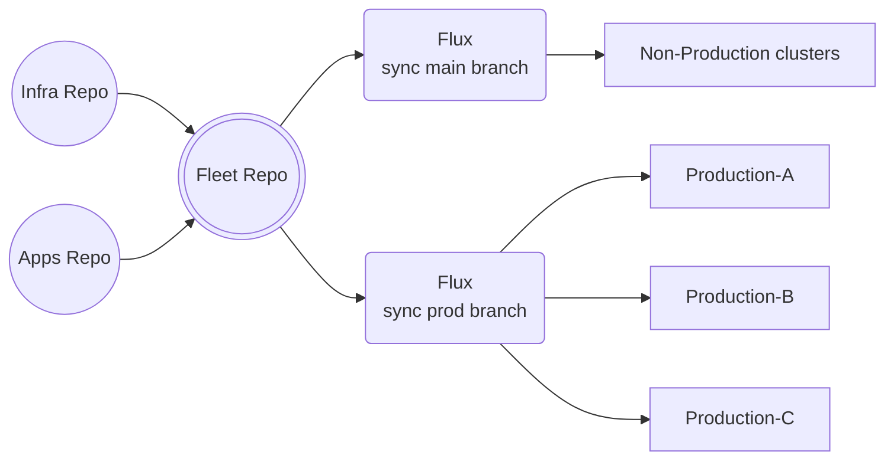



## Summary

This design document proposes adopting Flux as the standardized GitOps solution for managing GitLab.com's infrastructure workloads, replacing the current dual-tooling approach of gitlab-helmfiles and tanka-deployments. Flux will provide automated synchronization, enhanced security, and improved multi-tenancy support while reducing deployment complexity and preventing configuration drift. This adoption aligns with GitLab's involvement in the Flux project and follows successful implementations by teams like Runway.

## Motivation

GitLab.com's infrastructure team currently manages Kubernetes workloads using two different mechanisms - gitlab-helmfiles and tanka-deployments. This dual-tooling approach has created several challenges.

### Current Architecture Challenges

1. Deployment Complexity
   - Two separate deployment mechanisms require maintaining different workflows
   - Implicit dependencies between helm releases make ordering difficult
   - No standardized way to establish release prerequisites
   - Complex branching strategy across multiple repositories
   - Manual intervention often needed for failed deployments
   - Long deployment times due to full environment diffing on every change

2. Operational Overhead
   - Teams must context switch between helmfile and tanka tooling
   - Duplicate configuration patterns across both systems
   - No automated drift detection or correction
   - Manual secret rotation and management
   - Complex rollback procedures requiring human intervention
   - Additional CI pipeline maintenance for both tools
   - High cognitive load from managing two different systems

3. Technical Debt
   - Legacy configurations maintained for backward compatibility
   - Inconsistent deployment patterns between teams
   - Complex jsonnet libraries with poor documentation
   - Custom shell scripts required for deployment orchestration
   - No standardized way to handle CRDs
   - Accumulated workarounds for tool limitations

4. Security Concerns
   - Limited RBAC granularity
   - Manual secret management across environments
   - Complex CODEOWNERS maintenance for access control
   - No built-in supply chain security features
   - Lack of automated security scanning integration
   - Manual audit trail through Git history

5. Scalability Issues
   - Long CI pipeline times impacting velocity
   - Resource-intensive full cluster reconciliation
   - Manual intervention required for cross-cluster deployments
   - No native multi-cluster support
   - Limited ability to handle large numbers of releases
   - Performance degradation with increased number of resources

6. Multi-tenancy Limitations
   - Complex permission management across repos
   - No native tenant isolation
   - Manual namespace and RBAC configuration
   - Difficult to delegate control to stage teams
   - No standardized onboarding process
   - Risk of tenant interference

### Goals

- Simplify Kubernetes workload management by consolidating on a single GitOps solution.
- Reduce deployment times through targeted reconciliation.
- Prevent configuration drift via automated synchronization.
- Improve multi-tenancy support to enable self-service for stage teams.
- Enhance security through built-in artifact signing and verification.
- Improve observability of deployment status and problems.
- Reduce cognitive load on SRE teams through standardization.
- Provide GitOps foundation to enable integration with Platform tooling like Crossplane.

### Non-Goals

- Migrating non-infrastructure workloads to Flux.
- Deploying the Gitlab application stack.
- Building custom extensions or modifications to Flux.
- Implementing custom deployment workflows outside of GitOps practices.
- Creating a general-purpose deployment solution for all GitLab teams.

## Proposal

We propose adopting FluxCD as the standardized GitOps solution for managing GitLab.com infrastructure workloads. Flux offers several key characteristics that make it particularly well-suited for GitLab's infrastructure needs:

### FluxCD Key Characteristics for GitLab.com

1. GitOps-Native Architecture
   - Declarative configuration using Git as single source of truth
   - Automated reconciliation between Git state and cluster state
   - Built-in drift detection and correction
   - Native support for GitLab repositories and CI/CD integration

2. Security-First Design
   - Supply chain security with artifact signing and verification
   - Fine-grained RBAC with service account impersonation
   - Secure multi-tenancy isolation
   - Protected branch enforcement for production deployments

3. Scalable Operations
   - Distributed controller architecture with no central server
   - Efficient resource utilization through targeted reconciliation
   - Native multi-cluster management capabilities
   - Automated image updates reducing manual intervention

4. Enterprise Readiness
   - Production-proven at scale by major organizations
   - Comprehensive monitoring and alerting capabilities
   - Disaster recovery through Git-based state recovery
   - Strong community support and regular security updates

5. GitLab Alignment
   - Strategic alignment with GitLab's cloud-native direction
   - Deep integration with GitLab repositories and CI/CD
   - Opportunity for GitLab to influence future development
   - Dogfooding benefits for GitLab's Flux integration

The implementation will follow a phased approach:

1. Phase 1: Foundation (1 months)
   - Restructure k8s-mgmt repository to align with Flux best practices.
   - Use Ops Gitlab instance as Git repository for Flux.
   - Implement Gitlab CI pipelines for testing validity of Flux manifests and configurations as well as End to End integration testing using an ephemeral Kubernetes cluster.
   - Set up Capacitor UI for Flux visualization

2. Phase 2: Testing & Validation (2 month)
   - Complete migration of partially moved services (cert-manager, external-dns)
   - Document production readiness requirements
   - Validate multi-tenancy configuration by onboarding other Production Engineering teams to Flux.
   - Implement monitoring and alerting.
   - Document operational procedures.

3. Phase 3: Production Migration (3 months)
   - Bootstrap Flux in production clusters.
   - Gradually migrate Foundation-owned services from helmfiles and tanka.

The proposed architecture will follow the [D1 reference architecture](https://fluxcd.control-plane.io/guides/d1-architecture-reference/) pattern from the Flux documentation, with modifications to suit GitLab's specific needs:

- Repository structure: fleet, infra, and individual repositories for each stage team applications.
- Strict multi-tenancy controls via RBAC and namespace isolation.
- Automated image updates for non production environments
- Protected branches for production deployments.

## Design and Implementation Details



### Flux Architecture Components

1. Source Controller
   - Handles Git repositories and Helm repositories.
   - Validates repository authenticity.
   - Manages OCI artifacts and Bucket sources.
   - Ensures deterministic artifact delivery.

2. Kustomize Controller
   - Reconciles Kustomization objects.
   - Prunes removed resources.
   - Validates manifest syntax.
   - Manages health checks for deployments.

3. Helm Controller
   - Manages Helm release lifecycle.
   - Handles rollbacks and upgrades.
   - Supports templating and value overrides.
   - Manages release history.

4. Image Automation Controllers
   - Image Reflector: Scans container registries.
   - Image Automation: Updates manifests with new versions.
   - Policy-based image selection.
   - Automated MRs for version updates.

### GitOps Repository Structure

```sh
k8s-mgmt/
├── fleet/  # Cluster bootstrap and tenant configuration
│   ├── clusters/
│   │   ├── staging/
│   │   └── production/
│   └── tenants/
│       ├── foundation/
│       └── stage-teams/
├── infra/  # Infrastructure components
│   ├── components/
│   │   ├── cert-manager/
│   │   ├── external-dns/
│   │   └── monitoring/
│   └── configs/
└── applications/  # Stage team applications
    └── components/
```

### Multi-Tenancy Design

1. Namespace Isolation
   - Dedicated namespaces per team/application.
   - Resource quotas and limit ranges.
   - Policies for namespace isolation.
   - Pod security standards enforcement.

2. GitOps Workflow Separation
   - Independent Git repositories per stage tenant.
   - Separate PATs for repository access.
   - Isolated CI/CD pipelines for testing.
   - Independent reconciliation loops.

3. Resource Control
   - Kustomize controller impersonation
   - Custom resource definition access control
   - Restricted service account permissions
   - Cross-namespace reference prevention

### Security Controls

1. Role-Based Access Control (RBAC)
   - Foundation team: cluster-admin access via fleet repository
   - Stage teams: namespace-admin access via applications repository
   - Service accounts: least-privilege per component

2. Repository Protection
   - Protected branches for production deployments.
   - Required approvals for infrastructure changes.
   - Signed commits enforcement.

3. Secret Management
   - Vault integration for Kubernetes secrets and sensitive configuration

### Observability

1. Metrics
   - Flux-provided Prometheus metrics.
   - Custom metrics for deployment success/failure.
   - SLO monitoring for reconciliation time.

2. Logging
   - Structured logging for Flux controllers.
   - Logs can be aggregated with Grafana Loki.
   - Audit logging for security events
   - Error aggregation in Elastic

3. Alerting
   - Reconciliation failures.
   - Drift detection.
   - Secret rotation requirements.
   - Native alert and notification controllers can be integrated with Slack, PagerDuty and Gitlab.

4. Dashboards
   - Flux provided Grafana dashboards.

Reference: [Flux Monitoring](https://fluxcd.io/flux/monitoring/)

## Alternative Solutions

### 1. Maintain Status Quo (gitlab-helmfiles + tanka)

Pros:

- No migration effort required
- Teams already familiar with tools
- Proven to work at scale
- Existing documentation and runbooks
- Known operational patterns
- No retraining needed

Cons:

- Continued complexity from dual tooling
- No drift prevention or detection
- Limited multi-tenancy support
- Slow deployments and high resource usage
- Security limitations
- Technical debt accumulation
- High operational overhead
- Limited automation capabilities
- Complex onboarding for new applications
- Difficulty scaling with organization growth

### 2. Adopt ArgoCD

#### ArgoCD Characteristics

- Web UI focused with rich visualization
- Pull-based model with server component
- Built-in SSO and RBAC
- Application-centric approach
- Strong focus on UI/UX and visual state management

Pros:

- Mature GitOps solution with extensive production usage
- Feature-rich web UI for deployment visualization and management
- Strong RBAC and SSO integration out of the box
- Application-centric model may be more intuitive for developers
- Built-in support for blue-green and canary deployments
- Native integration with Argo Rollouts for advanced deployment strategies
- Active community and extensive plugin ecosystem
- Built-in project management for multi-tenancy

Cons:

- Requires maintaining a centralized server component
- More complex architecture with additional operational overhead
- Limited native image automation capabilities
- Resource intensive due to UI and server components
- Less integrated with GitLab's existing tooling
- Steeper learning curve for advanced features

## Production Readiness Considerations

### Risk Assessment

1. Production Impact
   - Mitigation: Gradual migration starting with non-critical services.
   - Extensive testing in staging environments.
   - Rollback procedures documented.

2. Performance
   - Impact on API server load from continuous reconciliation
   - Resource requirements for Flux controllers
   - Monitoring and auto-scaling strategy

3. Security
   - RBAC configuration complexity
   - Secret management across namespaces
   - Supply chain security considerations

### Operational Readiness

1. Documentation Requirements
   - Architecture documentation
   - Runbooks for common scenarios
   - Troubleshooting guides
   - Security policies

2. Training Needs
   - Flux training for Production Engineering and Stage Teams.
   - Stage team onboarding documentation.
   - GitOps best practices guidance and documentation.

3. Support Model
   - Day 2 Operation runbooks.
   - Document Escalation paths.
   - Incident response playbooks

### Migration Strategy

1. Service Selection Criteria
   - Complexity of current deployment
   - Business criticality
   - Team readiness
   - Dependencies

2. Validation Requirements
   - Integration test coverage
   - Performance benchmarks
   - Security scanning
   - Compliance verification

3. Rollback Procedures
   - Point-in-time recovery
   - State reconciliation
   - Communication plan
