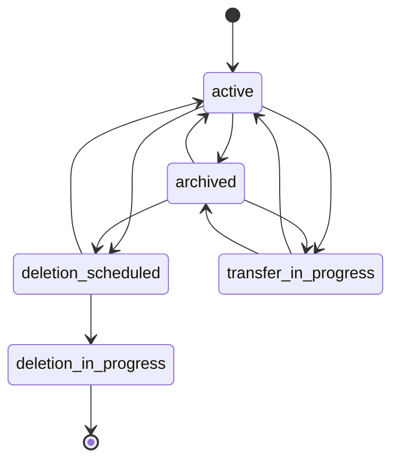

---
# This is the title of your design document. Keep it short, simple, and descriptive. A
# good title can help communicate what the design document is and should be considered
# as part of any review.
title: Group and project operations and state management
status: ongoing
creation-date: "2025-05-26"
authors: [ "@lohrc", "@rymai" ]
dris: [ "@lohrc", "@rymai" ]
owning-stage: "~devops::tenant scale"
participating-stages: []
# Hides this page in the left sidebar. Recommended so we don't pollute it.
toc_hide: true
---

## Summary

This blueprint proposes a unified state management and tracking system for GitLab namespaces (groups and projects).
Currently, groups and projects implement state management (deletion, archival, transfer) as separate features with inconsistent data representations and no historical tracking.
The proposed solution introduces a centralized state management system using `namespaces.state_id` and `namespace_details.state_metadata` to provide consistent state tracking, metadata storage, and historical records across all namespace types.

## Motivation

Groups and Projects currently have inconsistent state management implementations that create several problems:

**Current Issues:**

- No consistency in group state management
- No consistency in project state management  
- No consistency between group and project state management
- State in descendants is sometimes inferred from ancestors inconsistently
- No state history tracking - impossible to know when a group/project was archived, then unarchived
- Different data models for similar operations (e.g., `group_deletion_schedules` vs `projects.marked_for_deletion_at`)
- Performance issues with long-running synchronous operations (99.95th percentile: group transfer 51s, project transfer 27s)

**Business Impact:**

- Poor user experience due to inconsistent behavior
- Difficulty in auditing and compliance
- Performance bottlenecks causing timeouts
- Maintenance overhead from duplicated code

### Goals

- Establish a unified state management system for all namespace types
- Provide consistent APIs and behavior across groups and projects
- Enable state history tracking and audit capabilities
- Improve performance by making appropriate operations asynchronous
- Support metadata tracking (who initiated actions, error states, inheritance)
- Reduce code duplication and maintenance overhead
- Enable better observability and debugging capabilities

### Non-Goals

- Complete rewrite of existing functionality (iterative migration approach)
- Changes to user-facing APIs or UI in the initial implementation
- Migration of non-state related group/project consolidation work
- Performance optimizations unrelated to state management

## Proposal

Introduce a centralized namespace state management system with the following components:

### Core State Model

**New Attributes:**
- `namespaces.state_id` (SMALLINT) - Primary state identifier
- `namespace_details.state_metadata` (JSONB) - Associated metadata

**State Metadata Structure:**
```json
{
  "last_updated_at": "2025-05-26T10:00:00Z",
  "last_changed_by_user_id": 12345,
  "inherited_from_namespace_id": 67890,
  "last_error": "Transfer failed: insufficient permissions"
}
```

### State Definitions

| State ID | State Name | Description |
|----------|------------|-------------|
| 0 | active | Normal operational state |
| 1 | archived | Archived but recoverable |  
| 2 | deletion_scheduled | Marked for deletion with grace period |
| 3 | deletion_in_progress | Currently being deleted |
| 4 | transfer_in_progress | Currently being transferred |

### State Transitions



### Historical Tracking

Introduce `namespace_state_updates` table to track all state transitions:

```ruby
class NamespaceStateUpdate < ApplicationRecord
  belongs_to :namespace
  belongs_to :changed_by_user, class_name: 'User'
  
  # Columns: namespace_id, from_state_id, to_state_id, 
  #          changed_by_user_id, created_at, metadata
end
```

## Design and implementation details

### Database Schema Changes

**Phase 1: Add new columns**

```sql
ALTER TABLE namespaces ADD COLUMN state_id SMALLINT DEFAULT 0 NOT NULL;
CREATE INDEX index_namespaces_on_state_id ON namespaces(state_id);

-- namespace_details.state_metadata already exists as JSONB
```

**Phase 2: State history table**

```sql
CREATE TABLE namespace_state_updates (
  id bigserial PRIMARY KEY,
  namespace_id bigint NOT NULL REFERENCES namespaces(id) ON DELETE CASCADE,
  from_state_id smallint,
  to_state_id smallint NOT NULL,
  changed_by_user_id bigint REFERENCES users(id),
  created_at timestamp with time zone NOT NULL,
  metadata jsonb
);

CREATE INDEX index_namespace_state_updates_on_namespace_id ON namespace_state_updates(namespace_id);
CREATE INDEX index_namespace_state_updates_on_created_at ON namespace_state_updates(created_at);
```

### Model Changes

**New Concern: `Namespaces::Stateful`**

```ruby
module Namespaces::Stateful
  extend ActiveSupport::Concern
  
  included do
    has_many :namespace_state_updates, dependent: :delete_all
    
    enum state_id: {
      active: 0,
      archived: 1,
      deletion_scheduled: 2,
      deletion_in_progress: 3,
      transfer_in_progress: 4
    }
  end
  
  def change_state!(new_state, changed_by_user:, metadata: {})
    # Implementation handles state transition logic
  end
  
  def state_metadata
    namespace_details&.state_metadata || {}
  end
  
  def inherited_state?
    state_metadata['inherited_from_namespace_id'].present?
  end
end
```

### Service Layer

**Unified State Management Service:**

```ruby
class Namespaces::StateManagementService
  def initialize(namespace, current_user)
    @namespace = namespace
    @current_user = current_user
  end
  
  def schedule_deletion(executing_at: nil)
    # Unified deletion scheduling logic
  end
  
  def archive
    # Unified archival logic with descendant handling
  end
  
  def transfer(new_parent)
    # Unified transfer logic (async for complex cases)
  end
  
  private
  
  def update_descendants_state(state, metadata = {})
    # Efficient batch updates for descendants
  end
end
```

### Migration Strategy

**Iteration 1: Infrastructure Setup**

- Add `state_id` column to namespaces
- Create `namespace_state_updates` table
- Add `Namespaces::Stateful` concern

**Iteration 2: State Synchronization**

- Ensure `state_id` updates with legacy state changes
- Implement bidirectional synchronization
- Add validation and consistency checks

**Iteration 3: Backfill Historical Data**

- Migrate existing states to new system
- Backfill `state_id` from legacy columns/tables
- Data validation and cleanup

**Iteration 4: Feature Migration**

- Replace legacy state checks with new system
- Update controllers and services
- Maintain backward compatibility

**Iteration 5: Legacy Cleanup**

- Remove legacy state columns/tables
- Update documentation and tests
- Performance optimization

### Performance Considerations

**Asynchronous Operations:**

- Group transfers (P1 priority - currently 51s at 99.95th percentile)
- Project transfers (P1 priority - currently 27s at 99.95th percentile)
- Large group archival operations

**Optimization Strategies:**

- Batch updates for descendant state changes
- Background job processing for heavy operations
- Caching for frequently accessed state information
- Database indexes on `state_id` and related columns

### API Consistency

**Unified REST API Endpoints:**

```
GET /api/v4/namespaces/:id/state
PUT /api/v4/namespaces/:id/state
GET /api/v4/namespaces/:id/state/history
```

**GraphQL Schema:**

```graphql
type Namespace {
  state: NamespaceState!
  stateHistory: [NamespaceStateUpdate!]!
}

enum NamespaceState {
  ACTIVE
  ARCHIVED
  DELETION_SCHEDULED
  DELETION_IN_PROGRESS
  TRANSFER_IN_PROGRESS
}
```

## Alternative Solutions

### Alternative 1: Separate State Tables per Type

**Pros:**

- Clear separation of concerns
- Type-specific optimizations possible

**Cons:**

- Maintains current inconsistency
- Duplicated logic and maintenance overhead
- No unified querying capabilities

### Alternative 2: Event Sourcing Approach

**Pros:**

- Complete audit trail
- Time-travel capabilities
- Excellent for compliance

**Cons:**

- Significant complexity increase
- Performance overhead for simple state queries
- Steep learning curve for team

### Alternative 3: Do Nothing

**Pros:**

- No development effort required
- No migration risks

**Cons:**

- Performance issues persist (P1 transfer operations)
- Inconsistency continues to create bugs
- Technical debt accumulates
- Poor user experience remains

**Decision:** The proposed solution balances complexity with benefits, providing immediate improvements while enabling future enhancements.

## Metrics and Success Criteria

**Performance Targets:**

- Reduce P99.95 group transfer time from 51s to <10s
- Reduce P99.95 project transfer time from 27s to <5s
- Maintain deletion operation performance (<2s for scheduling)

**Quality Metrics:**

- Zero state inconsistency bugs after full migration
- 100% state history coverage for audit requirements
- Unified test coverage across all namespace types

**Developer Experience:**

- Single API for all state management operations
- Consistent behavior documentation
- Reduced code duplication (target: 50% reduction in state-related code)

## Risks and Mitigations

**Risk: Data Migration Complexity**
- *Mitigation:* Iterative approach with rollback capabilities, extensive testing

**Risk: Performance Impact During Migration**
- *Mitigation:* Background migrations, feature flags, monitoring

**Risk: API Breaking Changes**
- *Mitigation:* Maintain backward compatibility, versioned APIs

**Risk: State Consistency Issues**
- *Mitigation:* Bidirectional synchronization during transition, validation checks
