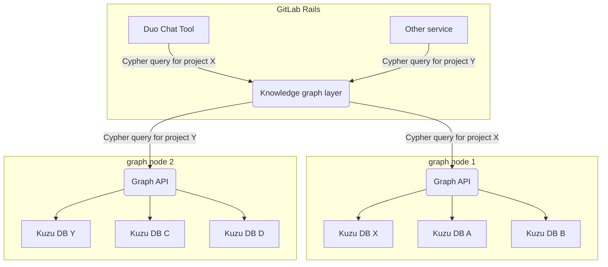
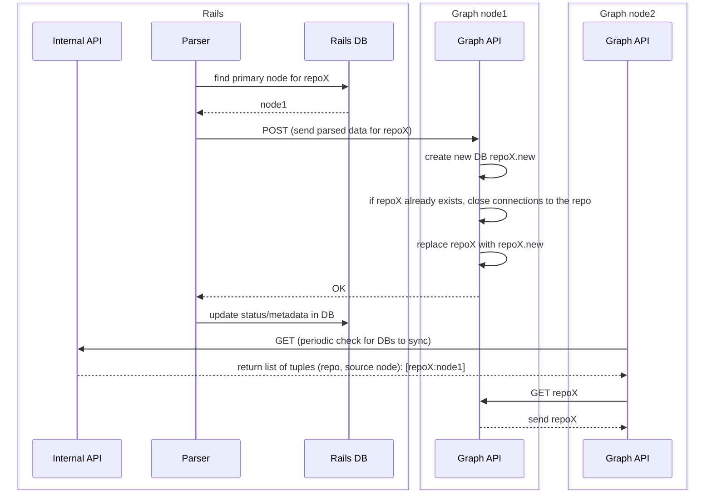
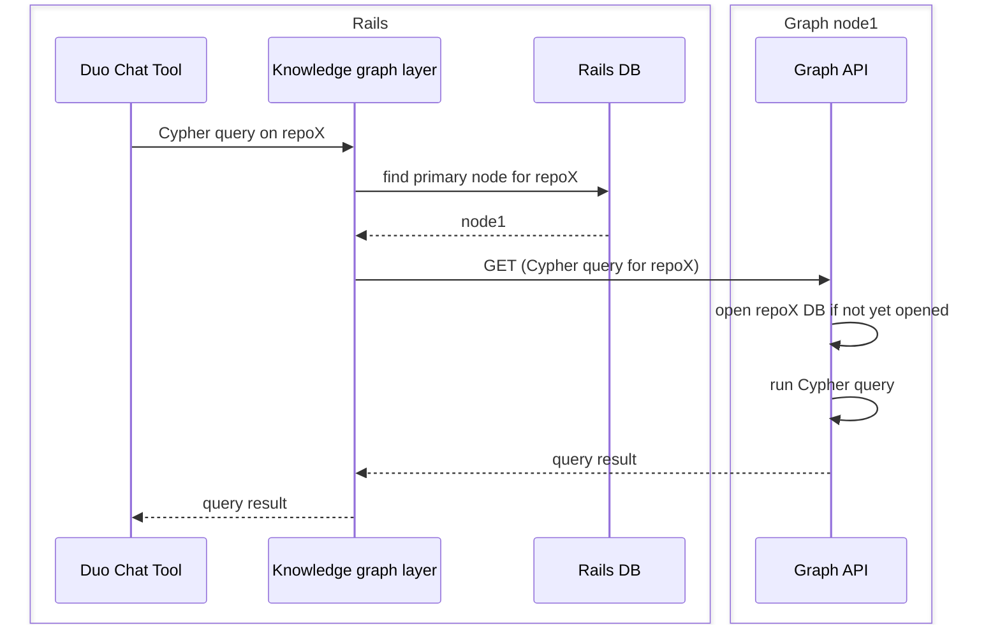



## Summary

This document proposes a new service that enhances repository insights by
creating and maintaining graph databases for repositories. Using
[Kuzu](https://docs.kuzudb.com/), a file-embedded graph database, the service
will store each repository's knowledge graph separately, enabling users to query
relationships between directories, files, classes, functions, and dependencies
through Cypher queries. The architecture includes a scalable approach with
primary nodes and replicas for high availability, with all requests routed
through GitLab Rails for authentication and authorization. This feature will
enable Duo Chat to answer complex repository questions (like "where is method X
defined" or "what dependencies are used in file Y"), while also supporting
non-AI use cases such as repository statistics and related file discovery when
browsing code.

## Motivation

Currently, we don't have a tool which would provide enhanced repository
knowledge. We are able to search a repository code, but that's all. We don't
have a tool which could be used to get better insight into repository - what
entities (directories, files, classes, functions) are defined in the repository
and how are these entities connected with each other. Knowledge graph provides
this information.

For AI it will be especially useful for Duo Chat to answer user's questions
about repository (for example "where is defined XYZ method", "from where we call
method XYZ", "what dependencies are used in a file", "are there any unused
methods", "what are commonly used functions"). So one of primary use-cases will
be usage in Duo Chat. LLMs are able to build Cypher query tailored specifically
for answering user's question if LLM knows the schema of graph database.

Having a knowledge graph will also be useful for non-AI use-cases - e.g. for
repository statistics or showing related files when browsing through repository.

### Goals

- Make available insight information about repository to other services and
  relationships between entities in the repository. For now we focus on creating
  knowledge graph primarily for source code repositories:
  - entities defined in the repository such as directories, files, classes, functions, dependencies
  - relationships between these entities - where is each class or function
    defined, what methods are defined in a class, what functions are called from
    another function, what dependencies are used in a file...
- But in future iterations we can expand knowledge graph beyond the source code
  (and track also other relationships - relationships with issues, merge
  requests and other entities).
- Allow querying graph DB with LLM-generated Cypher queries

### Non-Goals

- Implementation of repository parser. For more details on the parser, see the [Knowledge Graph First iteration](https://gitlab.com/groups/gitlab-org/-/epics/17514).
  For purposes of this document, the expectation is that repository
  parser will run as a worker in GitLab Rails. Ideally we use the same worker
  used also for [Chat with your codebase](https://gitlab.com/groups/gitlab-org/-/epics/16910), the only
  difference will be that the parser will be called with a different parameter
  because more detailed parsing will be needed for knowledge graph than for
  embeddings.

## Proposal

- Store knowledge graphs for repositories in file-embedded Kuzu DBs (each
  repository will have its own graph DB)
- Build a thin API service which runs on graph nodes and which takes care of
  serving incoming query requests (and also takes care of DB management tasks)
- Create an abstraction layer on GitLab Rails side which can be used by other
  services to query graph databases using Cypher query

## Design and implementation details

### Graph Node

Each repository will be stored in a separate [Kuzu graph database](https://kuzudb.com/). Kuzu is a
file-embedded graph DB, each graph is stored in a directory. Because Kuzu is an
embeddable file DB, we will implement a simple API layer which accepts requests
from GitLab Rails server, opens repository graph DB and executes a query.

Kuzu database will be used also on [client side](https://gitlab.com/groups/gitlab-org/-/epics/17516),
so in future we can consider also re-using server-side database on client
(client would just download the graph DB instead of re-indexing the repository
if re-indexing would be more expensive than downloading it).

[Issue 534843](https://gitlab.com/gitlab-org/gitlab/-/issues/534843) contains
performance measurements when accessing Kuzu DB depending on number of
concurrent requests. Based on these measurements, we should:

- Store Kuzu databases on fast SSDs on the same node which will serve the graph
  DB requests (instead of using e.g. NFS mounted filesystem)
- Keep pool of opened DB connections for recently used repositories

#### Storage estimation

In [issue 534843](https://gitlab.com/gitlab-org/gitlab/-/issues/534843#note_2451753797)
are listed sizes of kuzu DBs depending on repository size. Although the final
size of Kuzu DB may vary (depending on additional indexes we create and final
parser we use), it's probable that for most of repositories DB size should not
exceed 10MB. Statistics about repository sizes can be found in
[this comment](https://gitlab.com/groups/gitlab-org/-/epics/16584#note_2369932118).

Rough estimation is that we will need 1GB to index 100 repositories, so 1TB to
index 100 000 repositories.

#### Graph DB management

Apart from serving graph DB queries, the API layer on graph node will also allow
graph DB management - creation, update, deletion of graph DBs.

On repository creation/update, graph node will accept parsed repository
information (nodes and relationships) in a generic format, ideally a format
which Kuzu can use directly for importing (https://docs.kuzudb.com/import/).

Because Kuzu doesn't support multiple read-write connections to the same DB, a
new DB for the repository will be created in a separate directory and then when
import is finished we just replace directories.

#### Authentication and authorization

Knowledge graph service will not implement any authorization checks (whether a
user can access a repository), any permissions checks should be done on Rails
side. Access to knowledge graph service should be allowed only from GitLab
Rails. For authenticating requests on graph node we could use JSON Web tokens
similarly to how we use them between other components.

### Knowledge graph layer

Access to graph nodes will be allowed only from GitLab Rails. On Rails side
there will be an abstraction layer which:

- As an input it accepts a Cypher query and project ID
- It returns query result in response. It takes care of all business logic
  related to sending/processing the request.

### Scalability and high availability

Scaling of graph nodes will depend on:

- available disk space on each node (this will be the main factor, at least for
  the beginning)
- number of open database connections at the same time: each database connection
  reserves a certain memory space - this is configurable when opening the
  database connection and we can choose how much memory will be used. For
  example we can allocate 100MB memory for big graph databases and 10MB memory
  for small databases.

  For a node with 64GB RAM, we could keep >500 concurrently opened connections
  to big databases or >5000 connections to small databases.

There are multiple ways how to implement high availability for knowledge graph
service, but given the following needs:

- Kuzu DBs should be stored directly on the same node as knowledge graph service
  because of latency
- Queries for the same repository should be ideally served by the same node
  (even if there are multiple replicas of the repository) because knowledge
  graph service will keep open DB connections for recently used DBs

we will use similar strategy as [Zoekt searching](/handbook/engineering/architecture/design-documents/code_search_with_zoekt/#high-level-proposal):

- Graph nodes register themselves with GitLab by providing their address, name, and status
- GitLab maintains a registry of nodes with their status, capacity, and assignments
- GitLab manages the shard assignments internally, assigning namespaces to specific nodes
- Nodes that don't check in for a configurable period can be automatically removed

Because of similarities between knowledge graph and Zoekt searching, we can
re-use a lot of Zoekt code also for knowledge graph.

#### Creating or updating a repository

Because indexing will not be done on graph nodes, but rather on Rails worker
nodes, we will use a different replication mechanism than Zoekt. When a
repository is parsed (either because it was changed or because its graph doesn't
exist yet):

- For each repository GitLab maintains: its primary graph node, a list of
  replicas where the repository is synced, a list of replicas where the
  repository should be synced and a list of of nodes from where the repository
  shoud be removed
- Parser parses the repository and sends parsed data to the primary graph node
  (it gets primary node from Rails DB)
- Each graph node periodically requests from GitLab following information:
  - A list of DBs to synchronize (including information from which node the
    repository DB should be synchronized)
  - A list of DBs to delete

#### Adding a new graph node

When we need to add a new graph node for some reason (e.g. to better load-balance
requests or because of storage space):

- A new graph node is created and it self-registers to GitLab
- GitLab maintains rebalancing of repository DBs by updating list replicas and
  primary node for each repository in GitLab Rails DB. For repositories which
  should use the new node as a primary node, steps for each repository will be:
  - GitLab adds the new graph node to the list of replicas where the repository
    should be synced
  - When replication is finished, it sets the new node as primary node for the
    repository
  - Optionally it adds old/previous node to the list of nodes from where the
    repository should be deleted

#### Removal of a graph node

When a graph node is removed or when the node stops periodically checking-in,
then GitLab will consider this node as removed. GitLab will update database
records accordingly:

- For repositories which have the node set as primary node, it sets the primary
  node to one of replicas
- For repositories which have the node set as a replica, it removes the node from
  replicas and adds another node to the list of replicas (which triggers
  synchronization)

#### Concurrent database connections limits

By default Kuzu DB doesn't expect hundreds of concurrently opened DB connections
on the same host. Number of concurrently opened DB connections on one host is
limited by following factors:

- Virtual memory allocation - by default Kuzu allocates 8TB of virtual memory
  for each DB connection (to assure that even really huge DBs could be used).
  Because Linux virtual memory limit per one process is 128TB we would be able
  to open only 15 DB connections before hitting virtual memory limit. Because we
  don't need to support such huge DBs we can limit virtual memory by compiling
  Kuzu DB with DEFAULT_VM_REGION_MAX_SIZE set to 1GB. All performance tests were
  done with 1GB setting.
- Memory buffer pool size - parameter used when opening DB connection which sets
  memory buffer allocated for the DB connection. It shouldn't be too small to
  make sure that Kuzu can perform also complex queries. During testing 50MB pool
  size was used, but we can use `(total memory) / (max number of connections)`.
- [Performance testing](https://gitlab.com/gitlab-org/gitlab/-/issues/534843#note_2449718894)
  also showed that Kuzu performs well even for higher number of concurrent
  connections if DB is already opened. If DB connection is not pre-opened, then
  performance degrades with number of concurrent requests and is sensitive to
  disk speed (because we attempt to load many DBs at the same time). But timings
  are still decent for 10 concurrent requests. In future, this can be mitigated
  by either pre-opening DBs which we expect to be used (for example when user
  opens a project in IDE or opens Duo Chat) or by horizontal scaling of graph
  nodes.

### Querying knowledge graph

Kuzu supports Cypher query language, which is a common language used for graph
databases.

All requests to graph nodes should go through GitLab Rails which takes care of
authentication (of end users) and authorization (checking if a user can access a
repository). Whoever can read project's repository should have access to the
graph database for this repository.

- In GitLab Rails there will be a simple abstraction layer/interface which can
  be used to query knowledge graph for a repository. This layer will take care
  of permission checks, finding primary node for the repository and sending the
  request to the graph node and processing the response. As an input it will
  accept a cypher query and a project ID (on which we want to run the query).
  Note: instead of using primary node, we could also use replica (as long as we
  always pick same replica).
- Although queries could be served also by any replica, the primary node for the
  repository should be used because any follow-up queries would re-use already
  opened DB connection
- Kuzu databases on graph nodes will be always opened in read-only mode for
  security reason (we need write mode only when updating the DB which will be
  done separately from querying it)
- There will be a maximum timeout set for running a Cypher query, e.g. 15s to
  mitigate any long-running requests and exhausting maximum number of DB
  connections

### Communication protocol

A protocol for communicating with graph nodes was not specified yet. We will use
either REST or gRPC.

### Known limitations

Because separate file-embedded databases are used, this approach is not suitable
for running a query across high number of repositories (for searching all
repositories in a big group structure).

### Observability

Graph nodes will use existing monitoring, tracing and logging mechanisms to make
sure that we can monitor these nodes and have enough data to investigate
potential issues.

## Alternative Solutions

### Use one graph database per root namespace

All repositories in a top-level namespace would be stored in single graph database.
A downside is that then we would still need to handle authorization in graph
database, specifically on graph node level which would be much more complex
(more details about this complexity are in "One graph database" section below).

### Make it part of Zoekt Indexer / Webservice

[Exact Code Search (Zoekt)](/handbook/engineering/architecture/design-documents/code_search_with_zoekt) uses similar
approach - it uses self-registered nodes approach and file-based searching. A
possible solution might be making Zoekt more generic, so it would support both
Zoekt nodes and graph nodes. Then we could deploy graph DBs together with Zoekt
on the same nodes. The major benefit would be that we could re-use
existing Zoekt logic (nodes management on Rails side) and infrastructure
(deployment of Zoekt nodes) and node logic itself (Zoekt Webservice and
Indexer).

There are some open questions regarding this approach:

* Is it a good fit to deploy both services together? Graph nodes will require as
  much local disk space as possible - disk space will be major factor for
  scaling this service on SaaS. Also graph nodes will need to reserve some
  memory to keep open database connections for recently used repositories.
* Is node management and workflow similar enough for both services to make
  existing code generic?

### One graph database

An alternative approach is deploying a graph database which would be used for
storing knowledge graphs for all repositories. We originally planned this
approach but it has some major downsides:

- Security: if one graph database is used, then all repositories would have to
  be stored in one big graph (we didn't find an open source solution where use
  multi-tenancy on repository level). This means that then we would have to make
  sure that each query accesses only nodes/edges which belong to the selected
  repository. Because we plan to allow usage of LLM-generated Cypher queries
  (not only usage of predefined queries), we would have to always parse, rewrite
  and sanitize each Cypher query. Even with that this solution would be prone to
  query injections and there is a risk that a query could access other
  repositories. More details about complexity of this task can be found in
  [this comment](https://gitlab.com/gitlab-org/code-creation/repo-knowledge-grapher/-/issues/13#note_2413607378)
- Scalability: for SaaS there can be millions of repositories, if we eventually
  want to keep a knowledge graph for each repository, the database would be
  really huge - it would contain billions of nodes and edges. For Apache AGE
  (which was our primary choice) we noticed performance degradation on creation
  of new records with growing size of database. [This issue](https://gitlab.com/gitlab-org/gitlab/-/issues/526014)
  contains more details about performance measurements done on Apache AGE.
