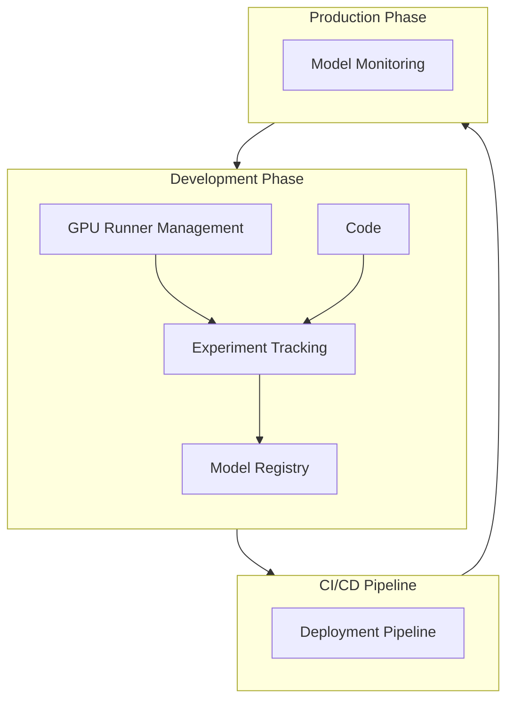



This blueprint describes GitLab end-to-end MLOps platform architecture, designed to support the complete machine learning lifecycle from experimentation to production deployment. This initiative supports our SaaS instance and self-managed instances while maintaining our "single application" philosophy.

## Summary

GitLab MLOps is an integrated platform that provides end-to-end machine learning lifecycle management capabilities within GitLab's single application. It extends GitLab's existing CI/CD and registry capabilities to support ML workflows from experimentation to production and observability.

## Motivation

Organizations face several key challenges when operationalizing ML:

1. **Reproducibility**: Data scientists struggle to track experiments and recreate results
2. **Collaboration**: Disconnect between data science, engineering and governance teams slows development
3. **Deployment**: Manual, error-prone processes for moving models to production
4. **Monitoring**: Lack of visibility into model performance and drift
5. **Governance**: Difficulty maintaining oversight of model development, deployment and impact

These challenges often result in:

- Extended time-to-production for ML models
- Inconsistent development practices
- Security and compliance risks
- Resource inefficiencies

### Goals

- Provide end-to-end ML lifecycle management integrated with existing development workflows
- Enable seamless collaboration between data scientists, engineering and governance teams
- Enable integration with existing GitLab components such as CI/CD pipelines and issues, merge requests, tracing etc.
- Integration with cloud providers; model registry and inference
- Limited support for MLflow client for model experiments and registry
- Increase storage limits for Model Registry for Premium and Ultimate

### Non-Goals

- Providing extensive computation resources for model training beyond GPU runners
- Providing a model serving infrastructure
- Implementing feature stores
- Implementing data stores
- Developing a full-fledged MLflow server
- Achieving 100% MLflow API compatibility

## Proposal

GitLab will provide a comprehensive MLOps platform built on top of existing GitLab infrastructure, leveraging and extending our CI/CD capabilities, package registry for artifact storage. The platform will support the full ML lifecycle through dedicated components while maintaining GitLab single application philosophy.

## Design and Implementation Details

### Component Architecture

#### Diagram Notes

- **Code**: This is the Git repository either remote or locally.
- **Experiment tracking**: Code produces runs, artifacts, metrics etc. the metadata is stored centrally in Experiment Tracking
- **Model Registry**: Uses Package Registry to store artifacts
- **Deployment pipeline**: These are triggered either via Model Registry or via Git triggers.
- **Model Monitoring**: Captures input and output metadata from inference and uses [GitLab Tracing](https://docs.gitlab.com/ee/development/tracing.html) for storage. CI pipelines are used for analysis and output is stored in Model Registry

### Core Components

#### 1. Experiment Tracking

The experiment management system will track ML training runs and their parameters:

- [Experiment tracking](https://docs.gitlab.com/ee/user/project/ml/experiment_tracking/) with metadata storage
- [Metric logging and visualization](https://docs.gitlab.com/ee/user/project/ml/experiment_tracking/#view-logged-metrics)
- [Storing artifacts](https://docs.gitlab.com/ee/user/project/ml/model_registry/#add-artifacts-to-a-model-version)
- [Compatibility with MLflow client](https://docs.gitlab.com/ee/user/project/ml/experiment_tracking/mlflow_client.html)

#### 2. Model Registry

Central repository for ML model management: [Model registry docs](https://docs.gitlab.com/ee/user/project/ml/model_registry/).

- Model versioning and tagging (link to [docs](https://docs.gitlab.com/ee/user/project/ml/model_registry/#model-versions-and-semantic-versioning))
- Model metadata and lineage tracking
- Model approval workflows
- Integration with CI/CD pipelines
- Access control and security policies
- Compatibility with MLflow client
- Standardized model cards
- Governance instruments

#### 3. Efficient management of GPU resources

Link to [GPU runners docs](https://docs.gitlab.com/ee/ci/runners/hosted_runners/gpu_enabled.html).

- Auto-scaling of GPU runners
- Cost optimization
- Queue management
- Resource monitoring

#### 4. Model Deployment

Automated model deployment pipeline:

- Container-based deployment
- Multi-variate testing support
- Canary deployments
- Rollback capabilities
- Environment management
- Integration with cloud providers

#### 5. Model Monitoring

Comprehensive model observability:

- Performance monitoring
- Data drift detection
- Model quality metrics
- Resource utilization tracking
- Custom alert definitions
- Retraining triggers
- Tracing via OpenTelemetry and [GitLab Tracing](https://docs.gitlab.com/ee/development/tracing.html)

#### 6. API Clients

- [Gitlab MLOps client for Python](https://gitlab.com/gitlab-org/modelops/mlops/gitlab-mlops)
- Limited MLflow client support
- Command-line (cURL) support

### Integration Points

1. **GitLab CI/CD Integration**

    - Custom pipeline templates for ML workflows
    - Predefined variables for ML operations
    - ML-specific CI/CD stages
    - Model monitoring compute

2. **Issue Tracking Integration**

    - Model development issues
    - Approval workflows

3. **GitLab Tracing**

   - Input and output of inference will be send to Tracing so it can be used for Model Monitoring

4. **GitLab Package registry**

   - Used for storage of model artifacts

### Deployment Options

MLOps will support self-managed installation, including support for air-gapped environments and GitLab.com deployment and GitLab Dedicated.

### Development Guidelines

No additional need beyond GDK. You might need MLflow client and [GitLab MLOps Python Client](https://pypi.org/project/gitlab-mlops/)

### Documentation

Comprehensive user, API and operations documentation will be provided:

- Troubleshooting guides

## Out of scope

- Full MLflow client compatibility
- LLMOps
- AgentOps
- Model Governance, Security and Compliance
- Container Registry Integration

## Conclusion

This technical blueprint provides a framework for implementing a comprehensive MLOps platform within GitLab. The proposed architecture leverages GitLab existing strengths while adding ML-specific capabilities that enable organizations to effectively manage their ML workflows at scale.
