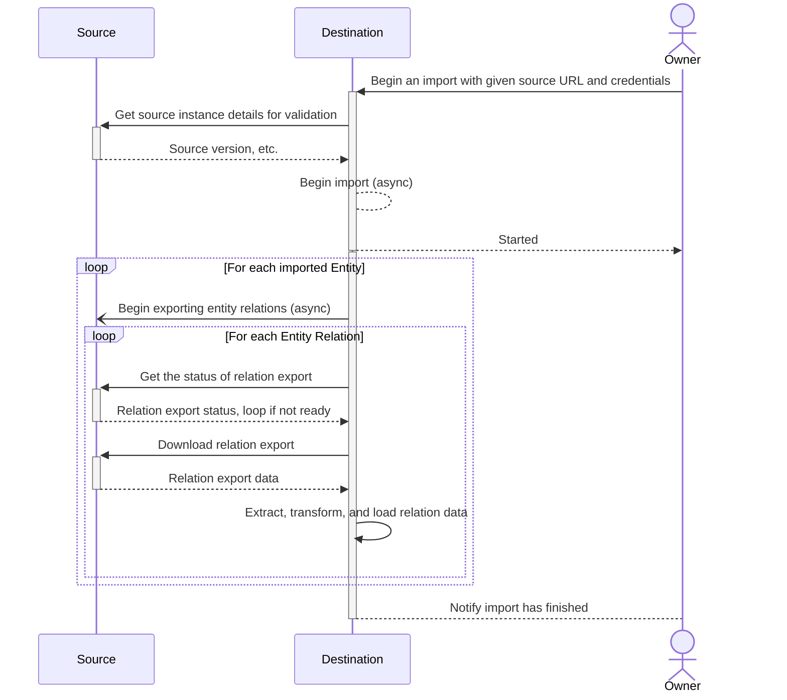
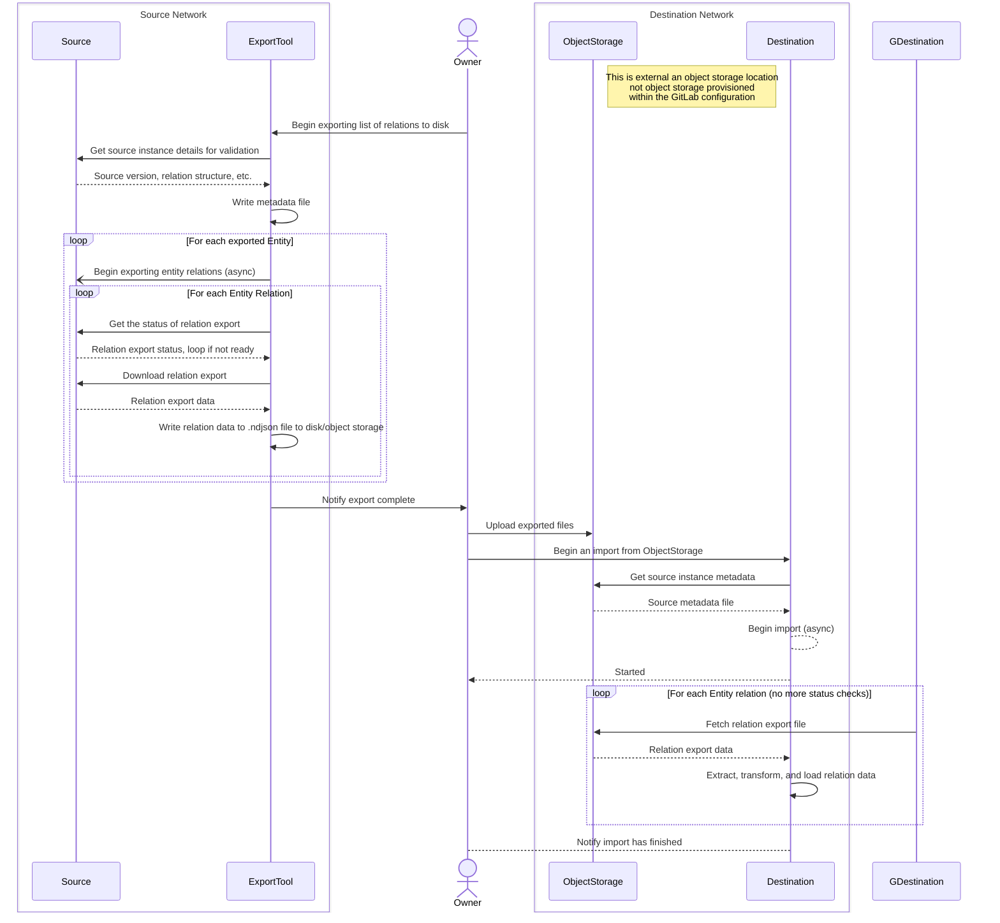

---
# This is the title of your design document. Keep it short, simple, and descriptive. A
# good title can help communicate what the design document is and should be considered
# as part of any review.
title: Offline Transfer
status: proposed
creation-date: "2025-02-26"
authors: [ "@SamWord" ]
coaches: []
dris: [ "@SamWord" ]
owning-stage: "~devops::create"
participating-stages: []
# Hides this page in the left sidebar. Recommended so we don't pollute it.
toc_hide: true
---

<!-- Design Documents often contain forward-looking statements -->
<!-- vale gitlab.FutureTense = NO -->

<!-- This renders the design document header on the detail page, so don't remove it-->


<!--
Don't add a h1 headline. It'll be added automatically from the title front matter attribute.

For long pages, consider creating a table of contents.
-->

## Summary

This blueprint describes changes to direct transfer to build a new tool, offline transfer, which will allow data to be exported from one GitLab instance and imported to another without a network connection between them. 

Currently, direct transfer requires a network connection between the source and destination GitLab instances throughout the migration process. This change would allow GitLab data to be exported on an isolated GitLab instance and manually moved and imported into a destination instance, regardless of the network policies on either end. This change also maintains the functionality and efficiency of direct transfer migrations for those who can take advantage of it.

## Current Status

Due to a team reorganization in 18.1, priorities for the Import group have shifted away from this feature for the time being. However, there has been significant collaboration on the topic so far that have spun off several issues to refine this proposal further:

- Implementing offline transfer exports in the GitLab source instance without the use of an export tool: https://gitlab.com/gitlab-org/gitlab/-/issues/536479
- Determining an offline transfer export architecture in lieu of the export tool: https://gitlab.com/gitlab-org/gitlab/-/issues/536631
- Determining how to implement user contribution mapping in offline transfer: https://gitlab.com/gitlab-org/gitlab/-/issues/545824

See the merge request that implemented this proposal for all discussions before the shift in team priorities for full context on where this proposal left off: https://gitlab.com/gitlab-com/content-sites/handbook/-/merge_requests/12056.

Once these topics have been addressed in the proposal, if accepted, the issues representing the work needed to implement this proposal can be finalized. Issues that have already been made have the label `~"offline transfer:import"` or `~"offline transfer:export"`.

## Glossary of terms

In the past, we've had confusion over terms used within our importers. Here's a glossary of terms to help clear up what some terms mean:

- **Air-gapped network**: A network isolated from the public internet. See [offline GitLab docs](https://docs.gitlab.com/topics/offline/) for more information. For the purposes of offline transfers, we should assume that both the source and destination instances are 100% air-gapped and no conenction between the source and destination instances can be established. However, customers don't need to be on an air-gapped network to use this feature.
- **Destination:** The destination instance where Group or Project data is imported into.
- **Entity:** A group or project. An entity has many relations, such as milestones, labels, issues, merge requests, etc.
- **Export tool**: A tool that exists outside of GitLab to generate export data on a GitLab instance that does not already generate export data compatible with offline transfer. In this context, the export tool is Congregate, but if requirements change and Congregate is not a viable tool, then the export tool will likely be just a script.
- **Entity prefix**: A replacement string for an entity path to avoid extremely long file keys in object storage.
- **Offline transfer**: The name of the proposed feature. It is a migration between GitLab instances where the destination instance is unable to make HTTP requests to the source to perform a regular direct transfer.
- **Relation:** A resource, generally a model, that belongs to an entity. Relations include things like milestones, labels, issues, merge requests. A relation can also be a self relation (attributes on the entity itself), or more abstract concepts such as user contributions.
- **Source**: The source instance where Group or Project data is exported from.

## Motivation

Customers with no network connectivity between their GitLab instances or with strict network policies are unable to use direct transfer. These customers must use file-based import/export to manually export and import each group separately. It's a tedious process and [file-based group transfer is deprecated](https://docs.gitlab.com/user/project/settings/import_export/#migrate-groups-by-uploading-an-export-file-deprecated).

### Goals

This feature should enable customers with the following restrictions to do convenient, semi-automated migrations:

- Outside access to or from their network is disallowed
- Cannot quickly and easily get an IP added to their firewall system
- Have strict restrictions on what lives on the external machines that can connect to their networks (must have this specific VPN, antivirus, etc)

#### Additional Requirements

- Users should be able to use direct transfer API to export groups and projects into an object storage location and to import groups and projects from an object storage location. This should be available first, before UI.
- Users should be able to use UI to choose groups and projects they want to migrate. That means direct transfer should support migration of many groups and projects at the time.
  - It should be possible to transfer subgroups and projects.
- The process cannot be fully automated, but it should be straightforward and convenient.
- Customers with most strict security requirements ("data cannot leave our network") need to be supported.
- Support optional encryption.
- Support offline transfers for customers who are unable to use third party object storage due to organization data policies, etc.

### Non-Goals

- Continuous syncs: direct transfer should support one-off migrations, but not syncing the diffs as the source changes. This is another opportunity requested by customers, but not the focus of this architecture. This work should not prevent it, but this capability is out of scope.

### Nice-to-haves

- Workarounds for older instances: Older versions of GitLab may be able to use this feature, but they may have to do more manual tasks. As with all changes to direct transfer, older versions should be considered.
- Supporting an importer platform: This is not a requirement, but something that has been floated as an idea. Now that the importing side of direct transfer needs to support previously exported data, this is an opportunity to allow imports from any source, as long as the exported data fits a particular data schema. It would be ideal to open up this opportunity based on this proposal, but not a requirement the complexity is significantly increased compared to a simpler option.

## Proposal

With an offline transfer, the export and import sides of direct transfer will be separated into two sequential steps: export entities to files, then import those files into another instance. The user can manually move the files to an external object storage provider if the source is unable to upload them directly on export. Offline transfers won't be able to benefit from the same efficiency as online migrations that concurrently import and export entities, but it will allow them to be possible.

### Proposed User Flow via Congregate and existing APIs on source

1. The user on the source instance configures and runs Congregate to begin fetching relations to export.
1. The export tool begins fetching relations for the requested entities. Once it’s done, it saves all of the requested export data to disk storage or an object storage bucket, if available.
1. The user then moves the export files over to an object storage bucket or a location that's accessible by the destination, if not already done by Congregate.
1. On the destination, the user triggers the new offline transfer via a new API endpoint. Users using object storage provide the API endpoint with object storage configuration and credentials. They also provide a list of paths to entities on the source and a destination name and namespace, exactly the same as starting a direct transfer via the API. All entity relation files for the entities passed in the API params must exist in the provided object storage bucket and their full source paths must be mapped in the metadata file before the import begins. Not all entities in the bucket need to be imported, however. Users using disk storage will need an alternative method of making the export data available locally to each Sidekiq node (likely network storage) which is still to be determined and signal in the API call to refer to local disk for exported files.
1. The bulk import will begin to process using the object storage bucket in place of a connection to the source instance. The the remaining user flow will be the same as an online direct transfer migration.

**Note:** Details for how customers who cannot use external object storage providers has not been fully defined yet. Further design and limitations for those users will need to be detailed further.

#### Current direct transfer process

This diagram vastly simplifies direct transfer, however it shows how frequently the source and destination instances communicate via network requests. Not all entities download relation files, some make GraphQL queries or REST requests to the source instead. Entities and their relations can be processed concurrently within each stage with online migrations ([group stages](https://gitlab.com/gitlab-org/gitlab/-/blob/master/lib/bulk_imports/groups/stage.rb), [project stages](https://gitlab.com/gitlab-org/gitlab/-/blob/master/lib/bulk_imports/projects/stage.rb)).



#### Proposed offline transfer process

This is similarly simplified, but it demonstrates how the export and import processes are now split and no requests to either instance need to be made. If the source and destination both have access to the same object storage, the export tool can upload directly to object storage instead of the owner needing to manually upload the exported files.



### Which versions will support offline transfer?

Assume offline transfer is released in version `n`, and no breaking changes to offline migrations are introduced:

| Source version -> Destination version | Will it work? |
| ------ | ------ |
| `n` -> `n` | :white_check_mark:  |
| `n` -> `n+1`, `n+2`, ... `n+x`     | :white_check_mark: |
| `n+x` -> `n+x-1`, `n+x-2`, ... `n` | :white_check_mark:  |
| `n` -> `n-1`, `n-2`, ... `n-x` | :x: |
| `n-x`, ... `n-1` -> `n` | :x: unless using the export tool and `n-x` supports direct transfer |

## Design and implementation details

### New Import Architecture

#### Offline API design

Once data has been exported from the source instance, the user will be able to input the credentials of the object storage instance that contains their exported data.

- Object storage providers must be one that's currently supported in [GitLab's configuration](https://docs.gitlab.com/administration/object_storage/) because GitLab already has the gems necessary to interface with those. In future iterations, additional [`Fog`](https://fog.github.io/) providers may be added if needed.
- Create a new file download service for bulk imports similar to `BulkImports::FileDownloadService` that downloads from S3 configuration. Validations such as file size, type, etc. on remote file can be done in this service. These services abstract the work to fetch relation files away from the pipelines themselves. 
- When the user begins an offline import on the destination, they query a new API endpoint to begin an offline export with the following params:

  ```ruby
  # These params may change depending on object storage implementation
  requires :configuration, type: Hash, desc: 'Object storage configuration' do
    requires :access_key_id, type: String, desc: 'Object storage access key ID'
    requires :secret_access_key, type: String, desc: 'Object storage secret access key'
    requires :bucket_name, type: String, desc: 'Object storage bucket name where all files are stored'
  end
  requires :entities, type: Array, desc: 'List of entities to import' do
    requires :source_type,
    type: String,
    desc: 'Source entity type',
    values: %w[group_entity project_entity]
    requires :source_full_path,
    type: String,
    desc: 'Relative path of the source entity to import'
    requires :destination_namespace,
    type: String,
    desc: 'Destination namespace for the entity'
    optional :destination_slug,
    type: String,
    desc: 'Destination slug for the entity'
    optional :migrate_projects,
    type: Boolean,
    default: true,
    desc: 'Indicates group migration should include nested projects'
    optional :migrate_memberships,
    type: Boolean,
    default: true,
    desc: 'The option to migrate memberships or not'
  end
  ```

  The main difference between this new API is this endpoint accepts params for an object storage storage bucket instead of source instance configuration. It may also call a new service to handle creating the `BulkImport` record for offline imports if it's substantially different from `BulkImports::CreateService`.
- `BulkImports::Configuration` is updated to store credentials for the object storage bucket and store a hash of mappings to tie `source_full_path` to `object_storage_file_prefix`. These mappings are stored in a metadata file

#### Import metadata file structure

**WIP: Do not rely on this specification for development until it's finalized**

Offline transfers will need a metadata file to map entity source paths to file keys in object storage. Since object storage is always a flat structure, and disk storage is always a nested structure, opting for a flat object storage with information on how to link entities seems best.

The metadata file holds the following information:

- `instance_version`: Version of the source instance.
- `instance_enterprise`: Whether or not the source instance was enterprise edition.
- `export_tag`: Prefix for all files included in the current export. This allows multiple exports of the same entities to exist in object storage at the same time.
- `entities_mapping`: Hash of entity full paths as keys to its object storage entity prefix. This shortens full paths into a short key to avoid excessively long object storage keys. It has no effect on the order that entities are imported, or on the heirarchy of the entities.

Example metadata file:

```ndjson
{"instance_version":"17.0.0"}
{"instance_enterprise":true}
{"batched":true}
{"entities_mapping:
  {
    "top_level_group":"group_1"
    "top_level_group/group":"group_2",
    "top_level_group/group/first_project":"project_1",
    "top_level_group/group/second_project":"project_2",
    "top_level_group/another_group":"group_3"
  }
}
```

File keys in object storage follow the format `#{export_tag}/#{entity_prefix}/#{relation_name}.ndjson`. Relation names are defined in each `group/import_export.yml` and `project/import_export.yml`. Archive file relations and batched relations include their `.tar.gz` files and batch files in a relation folder. For example:

- `group_1-self.json` - `self` relations are exported as JSON files
- `group_1-milestones.ndjson` - an example of a non-batched tree relation export
- `project_1-issues/batch_1.ndjson` - an example of a batch of s tree relation export
- `project_1-repository.tar.gz` - an example of a non-batched, non-tree relation export
- `project_1-uploads/batch_1.tar.gz` - an example of a batched, non-tree relation export

`batched` is true if relations were exported in batches. In the current architecture, all batchable are exported in batches or no exports are batched. There is no way to batch some relations but not others, so it's simple enough to include the flag in the metadata file.

### Export Architecture

#### Current export limitations

With online imports, the destination instance periodically queries the status of exporting relations. There's no export-side process to determine when relation exports are done and ready to export. The export script will need to do this in place of the destination instance because older versions of GitLab won't have anything to keep track of overall entity export progress. New models will need to be made within GitLab so that export progress can be seen in the UI.

#### Congregate Export Script

Congregate should export relations GitLab versions NNN and up. The script should loosely follow the following process:

1. Call `export_relations` for each entity.
1. Within each entity, loop through relations. If the relation/batch is done, write it to disk and add metadata line for entry once relation is complete.
1. Call API/GraphQL queries that direct transfer would have called.
1. With API response, create ndjson file for each response with attributes needed by direct transfer. Write file to disk and add entry if needed.

#### GitLab Export Architecture

In order to support offline exports from the UI, we will need to build models to track export progress on the source. To immediately support customers without requiring them to upgrade, a script to export entities to disk and AWS will be written in Congregate.

## Iterations

1. Define metadata structure and file structure. 
1. Convert data that is currently downloaded from source to destination via API calls to file exports so they will be supported by offline transfer
1. Create a document describing how to fetch all files for the process above so that export files can be consistently fetched during development. This document allows engineers and users to manually build and export data as needed, and also serves as a template for how Congregate should perform offline exports.
1. Begin work to update import side according to file discovery and metadata definitions. Anything discovered during this process can also refine the file structure definitions as needed, but should not be how files structures are defined to avoid confusion and inconsistencies. Engineers can to begin dogfooding offline imports with this iteration for continuous improvement. Customers on self-managed instances will technically be able to perform offline imports immediately if they are willing to manually build the import data files.
1. Build export tool in congregate to support offline transfers for older instances. Start with congregate because all existing instances are too old to use UI or a new API for export. Once this is complete, customers should be able to begin performing offline transfers using Congregate.
1. Build GitLab API support for offline exports to be done from the source instance directly. Once this is complete, customers with the latest version of GitLab on the source instance can begin performing offline transfers without Congregate using the API.
1. Build a UI in GitLab to export groups offline. This allows customers with the latest version of GitLab to export groups without congregate or any API calls to the source.
1. Allow upload to other object storage providers other than AWS. This can be done as soon as the first iteration on offline imports is complete.

**Why work on Congregate before an API in GitLab?**

It's not necessary to implement a script to export relations in Congregate before supporting offline exports in GitLab directly. It can be done simultaneously if there's enough development capacity. However, it's a convenience to customers to provide offline exports in Congregate as soon as possible because it allows them to perform offline exports without upgrading to the latest version of GitLab first. It also means that customers don't also need to upgrade to the latest version on their source instance if a bug is found in the built-in export functionality. Congregate might have bugs as well, but it's much easier to fetch the latest version of Congregate than it is to upgrade an instance of GitLab, especially if a customer plans to migrate their data out anyway.

## Alternative Solutions

### Alternatives to Congregate

- _Only_ building offline export directly into GitLab. It's not necessary to add offline direct transfer support into GitLab, but it will require all customers to upgrade to the first version where offline transfer exports are supported, at a minimum. Plus, as bugs are discovered in the offline export process, customers might need to upgrade again to fix those bugs on the source instance. Building a solution in Congregate first allows customers with older source versions to be able to perform offline transfers.
- Writing a plain-ol-Ruby script: This is possible, but Congregate includes the basis for time-intensive features like upload to AWS S3. It's already well-supported by Professional Services as well, meaning they don't need to learn how to use and possibly maintain another script when helping a customer with specific needs.
