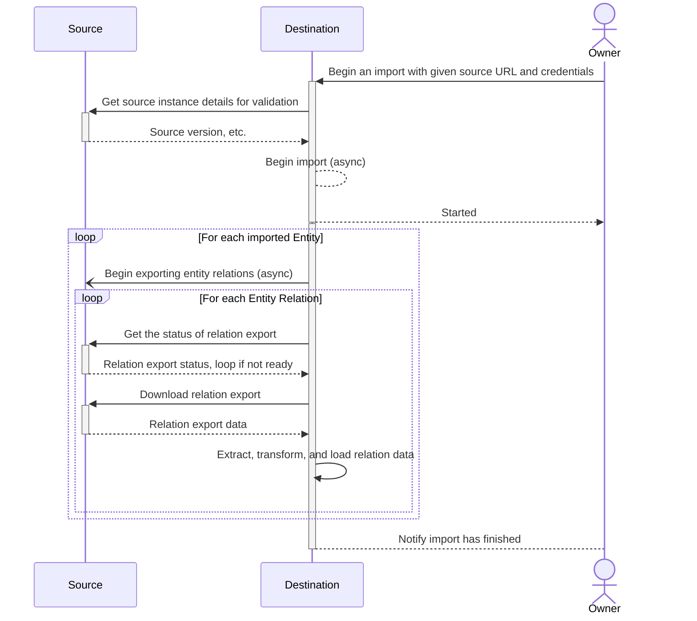
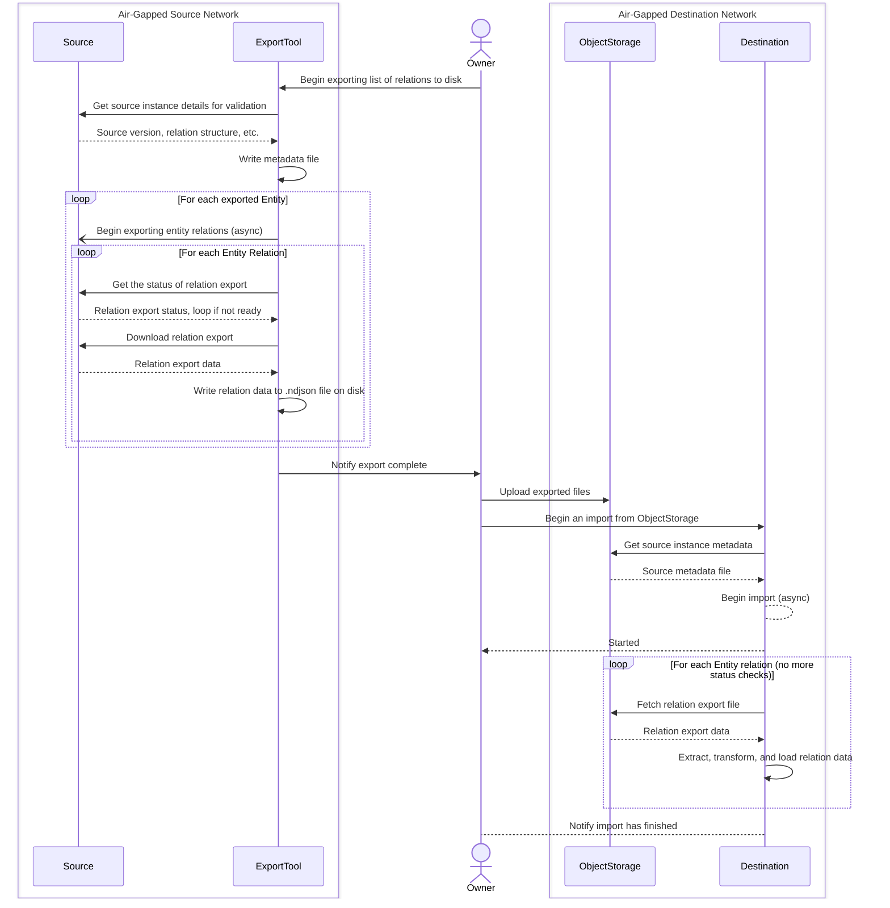

<!--
Before you start:

- Copy this file to a sub-directory and call it `_index.md` for it to appear in
  the design documents list.
- Remove comment blocks for sections you've filled in.
  When your document ready for review, all of these comment blocks should be
  removed.

To get started with a document you can use this template to inform you about
what you may want to document in it at the beginning. This content will change
/ evolve as you move forward with the proposal.  You are not constrained by the
content in this template. If you have a good idea about what should be in your
document, you can ignore the template, but if you don't know yet what should
be in it, this template might be handy.

- **Fill out this file as best you can.** At minimum, you should fill in the
  "Summary", and "Motivation" sections.  These can be brief and may be a copy
  of issue or epic descriptions if the initiative is already on Product's
  roadmap.
- **Create a MR for this document.** Assign it to an Architecture Evolution
  Coach (i.e. a Principal+ engineer).
- **Merge early and iterate.** Avoid getting hung up on specific details and
  instead aim to get the goals of the document clarified and merged quickly.
  The best way to do this is to just start with the high-level sections and fill
  out details incrementally in subsequent MRs.

Just because a document is merged does not mean it is complete or approved.
Any document is a working document and subject to change at any time.

When editing documents, aim for tightly-scoped, single-topic MRs to keep
discussions focused. If you disagree with what is already in a document, open a
new MR with suggested changes.

If there are new details that belong in the document, edit the document. Once
a feature has become "implemented", major changes should get new blueprints.

The canonical place for the latest set of instructions (and the likely source
of this file) is
[content/handbook/engineering/architecture/design-documents/_template.md](https://gitlab.com/gitlab-com/content-sites/handbook/-/blob/main/content/handbook/engineering/architecture/design-documents/_template.md).

Document statuses you can use:

- "proposed"
- "accepted"
- "ongoing"
- "implemented"
- "postponed"
- "rejected"

-->

<!-- Design Documents often contain forward-looking statements -->
<!-- vale gitlab.FutureTense = NO -->

<!-- This renders the design document header on the detail page, so don't remove it-->


<!--
Don't add a h1 headline. It'll be added automatically from the title front matter attribute.

For long pages, consider creating a table of contents.
-->

## Summary
This blueprint describes changes to Direct Transfer to allow exports to be generated from an instance of GitLab running on an air-gapped network, to another instance of GitLab (GitLab SaaS, another GitLab instance on an air-gapped network, etc.). Currently, Direct Transfer requires a network connection between the source and destination GitLab instances throughout the migration process. This change would allow Direct Transfer relations to be generated on an isolated GitLab instance and manually moved and imported into a destination instance, regardless of the network policies on either end. This change also maintains the functionality and efficiency of online migrations who can take advantage of it.
## Motivation
Customers that are using air-gapped networks, with no network connectivity between their GitLab instances or with no network connectivity between their GitLab instance and Gitlab.com are currently not able to use Direct transfer to migrate their GitLab resources, as DT requires network connection between instances or GitLab.com. They need to either use file-based import/export and manually export and import each group and project or hire Professional Services to support their migrations.
### Goals
This feature should enable customers with the following restrictions to do convenient, semi-automated migrations:
- Won't allow ANY outside access to their network for various reasons (internal policy, gov't policy)
- Don't want to allow an IP range required for online DT
- Cannot quickly and easily get an IP added to their firewall system
- Have strict restrictions on what lives on the external machines that can connect to their networks (must have this specific VPN, antivirus, etc)

##### Additional Requirements
- Users should be able to use API to migrate chosen groups and projects between offline instances. This should be available first, before UI.
- Users should be able to use UI to choose groups and projects they want to migrate. That means DT should support migration of many groups and projects at the time.
  - Currently in UI users can choose only top-level group. In the future it should be possible to choose also subgroups and project from UI. This feature should not prevent more selective choice of resources in the future.
- Users should be able to easily understand from UI which path they need to follow and what they need to do in case they want to migrate between connected instances and what they need in case they want to migrate between not connected instances.
- The process cannot be fully automated, but it should be straightforward and convenient.
- Customers with most strict security requirements ("data cannot leave our servers") need to be supported.
- Support optional encryption.

### Non-Goals
- Continuous syncs: Direct Transfer should support one-off migrations between online, and now offline instances, but not syncing the diffs as the source changes. This is another opportunity requested by customers, but not the focus of this architecture. This work should not prevent it, but this capability is out of scope.
### Additional considerations
- Workarounds for older instances: Older versions of GitLab may be able to use this feature, but they may have to do more manual tasks. As with all changes to Direct Transfer, older versions should be considered.
- Supporting an importer platform: This is not a requirement, but something that has been floated as an idea. Now that the importing side of Direct Transfer needs to support previously exported data, this is an opportunity to allow imports from any source, as long as the exported data fits a particular data schema. It would be ideal to open up this opportunity based on this proposal, but not a requirement the complexity is significantly increased compared to a simpler option.
## Proposal

<!--
This is where we get down to the specifics of what the proposal actually is,
but keep it simple!  This should have enough detail that reviewers can
understand exactly what you're proposing, but should not include things like
API designs or implementation. The "Design Details" section below is for the
real nitty-gritty.

You might want to consider including the pros and cons of the proposed solution so that they can be
compared with the pros and cons of alternatives.
-->

With an offline migration, the export and import sides of Direct Transfer will be separated into two sequential steps, with the user manually moving the exported files onto the destination instance. Offline migrations won't be able to benefit from the same efficiency as online migrations that concurrently import and export entities, but it will allow these migrations to happen at all.
### Proposed User Flow via the API
1. The user on the source instance runs an export tool (script or Congregate) to begin fetching relations to export. The user must provide the tool a list of entities (groups or projects) to export, and current Direct Transfer options (import_projects, import_memberships) as needed.
2. The export tool begins fetching all of the relations requested. Once it’s done, it saves all of the requested export data to disk storage. In later iterations, there will be an option to provide the tool with a remote storage URL and the tool will directly upload the completed export files there.
3. The user then moves the export files over to object storage on the destination. In later iterations, if a remote object storage URL was provided and the destination source also has access to it, this step can be skipped.
4. On the destination, the user calls POST /bulk_import and provides a list of entities to import along with an object storage URL and access token instead of a source URL and token. The provided entities must exist in the file on object storage because the object storage will be treated as the “source”.
5. The bulk import will begin to process and the remaining user flow will be the same as an online Direct Transfer migration.
##### Current Direct Transfer process
This diagram vastly simplifies Direct Transfer, however it shows how frequently the source and destination instances communicate via network requests. Not all entities download relation files, some make GraphQL queries or REST requests to the source instead. Entities and their relations can be processed concurrently within each stage with online migrations ([group stages](https://gitlab.com/gitlab-org/gitlab/-/blob/master/lib/bulk_imports/groups/stage.rb), [project stages](https://gitlab.com/gitlab-org/gitlab/-/blob/master/lib/bulk_imports/projects/stage.rb)).

##### Proposed offline migration process
This is similarly simplified, but it demonstrates how the export and import processes are now split and no requests to either instance need to be made. If the source and destination both have access to the same object storage, the export tool can upload directly to object storage instead of the owner needing to manually upload the exported files.

## Design and implementation details

<!--
This section should contain enough information that the specifics of your
change are understandable. This may include API specs (though not always
required) or even code snippets. If there's any ambiguity about HOW your
proposal will be implemented, this is the place to discuss them.

If you are not sure how many implementation details you should include in the
document, the rule of thumb here is to provide enough context for people to
understand the proposal. As you move forward with the implementation, you may
need to add more implementation details to the document, as those may become
valuable context for important technical decisions made along the way. A
document is also a register of such technical decisions. If a technical
decision requires additional context before it can be made, you probably should
document this context in a document. If it is a small technical decision that
can be made in a merge request by an author and a maintainer, you probably do
not need to document it here. The impact a technical decision will have is
another helpful information - if a technical decision is very impactful,
documenting it, along with associated implementation details, is advisable.

If it's helpful to include workflow diagrams or any other related images.
Diagrams authored in GitLab flavored markdown are preferred. In cases where
that is not feasible, images should be placed under `images/` in the same
directory as the `index.md` for the proposal.
-->

## Iterations

## Alternative Solutions

<!--
It might be a good idea to include a list of alternative solutions or paths considered, although it is not required. Include pros and cons for
each alternative solution/path.

"Do nothing" and its pros and cons could be included in the list too.
-->

### Glossary of terms
In the past, we've had confusion over terms used within our importers. Here's a glossary of terms to help clear up what some terms mean:

- **Source**: The source instance where Group or Project data is exported from.
- **Destination:** The destination source where Group or Project data is imported into.
- **Air-gapped network**: A network that doesn't allow any outside access. For the purposes of offline migrations, we should assume that both the source and destination instances are air-gapped.
- **Offline migration**: A migration where the source, destination, or both instances of GitLab are on air-gapped networks. In general, offline = air-gapped.
- **Export tool**: A tool that exists outside of GitLab to generate export data on an air-gapped GitLab instance. In this context, the export tool is Congregate, but if requirements change and Congregate is not a viable tool, then the export tool will likely be just a script.
- **Placeholder user**: A literal `User` object with `user_type: :placeholder`. Placeholder users cannot login and do not have any abilities within GitLab. They are meant to fill `user_id` foreign key constraints in the database after an import until the owner of the import can decide which real GitLab user should be in place of the placeholder.
- **Source user**: An `Import::SourceUser` object that holds details about the user record on the source instance, which placeholder user is associated to the source user, and which real user on the destination the user on the source should be assigned to. It's the connecting object between a user data from an import source and the literal `User` on the destination. Colloquially, we might say "a placeholder user is reassigned," but technically speaking, a `reassign_to_user_id` is set on a source user, then a process runs in the background to replace every `user_id` of its placeholder user with the `reassign_to_user_id`.