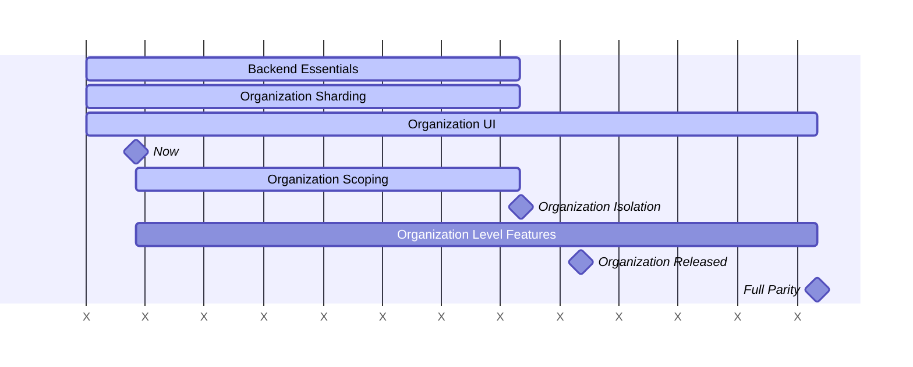



This document is a work in progress and represents the current state of the Organization design.

## Glossary

- Organization: An Organization is the container for one or multiple top-level Groups. Organizations are isolated from each other, and are not publicly visible.
- Top-level Group: Top-level Group is the name given to the topmost Group of all other Groups. Groups and Projects are nested underneath the top-level Group.
- User: A user belongs to one Organization. An Organization has many Users.
- Organization Member: Organizations have many Users called Members. Only
  Organization Members have visibility of the Organization. Adding a User to a Group or Project within an Organization makes them an Organization Member.

## Summary

GitLab.com is a public shared installation of the GitLab software. This provides GitLab as a convenient SaaS but falls short of the full GitLab experience in important ways:

1. Parity: The features provided to a customer on GitLab.com and Self Managed
   are different. For example, on GitLab.com customers do not receive
   administrative privileges which accounts for a significant amount of
   functionality.
2. Isolation: On GitLab.com a customer can not exist independant of other
   customers like they do with a Self Managed installation.

Organizations will solve these problems by being a common container across all platforms. Through the creation of an Organization container we can enforce isolation boundaries, and provide a common entity for all top level features.

In effect, the Organization will wrap the Self Managed features into a container and bring this experience to all other GitLab platforms.

The isolation solution is also a pre-requisite for the [Cells project](https://docs.gitlab.com/ee/architecture/blueprints/cells/index.html) which is described in relation to Organization in [Organizations and Cells](cells.md).

## Splitting the GitLab.com Platform

The GitLab.com platform will be split into two distinct experiences.

Customers join GitLab.com today as a top level group within the default
organization. This experience will persist indefinitely in part to allow for a shared pool of users to contribute to open source projects.

GitLab.com will now expand its offering with a dedicated solution for private enterprise Organizations. These enterprise Organizations will operate in complete isolation from all other Organizations, including the default organization.

Eventually it will be possible for customers to migrate out of the default
organization and into their own private Organization.

## Fundamentals of Organizations

Organization will wrap around nearly all GitLab features.
It won't be possible to read or write data between Organizations.
Many product features will remain unchanged, but most instance level features will move down and other features up to Organization level. Level changes are elaborated [below](#level-structure).
Users belong to a single Organization and can be owners of the Organization or just standard members. In future we will review the ability for Users to belong to multiple Organizations.
Organization owners will have admin style privileges within their Organization, such as the ability to delete user accounts. More details [below](#roles-and-permissions).
These changes will occur on all GitLab platforms including GitLab.com, Self
Managed, and Dedicated.

## Impact of the Organization on Other Domains

Here is a growing list of pages that describe in more detail how
Organization affects other parts of the system.

- [Billing](billing.md)
- [Cells](cells.md)
- [Settings](settings.md)
- [Users](users.md)

## Level Structure

Below is a depiction of the current and future hierarchy levels within GitLab.
Organization will form a new level that combines most Instance Level functionailty and all of the Top Level Group functionality.

Instance Level will be reserved for infrastructure level settings.

Top Level Groups are a psuedo level that overload Group level with specific
behavior. Until Organizations, this has been the defacto method of finding
parity with Self Managed.

| Current Hierarchy         | Future Hierarchy |
| Instance Level            | Instance Level |
|                           | Organization Level |
| Top Level Group           | |
| Group                     | Group |
| Project                   | Project |

## Roles and Permissions

Organizations will have an Owner role. Compared to Users, they can perform the following actions:

| Action | Owner | User |
| ------ | ------ | ----- |
| View Organization settings | ✓ |  |
| Edit Organization settings | ✓ |  |
| Delete Organization | ✓ |  |
| Remove Users | ✓ |  |
| View Organization front page | ✓ | ✓ |
| View Groups overview | ✓ | ✓ (1) |
| View Projects overview | ✓ | ✓ (1) |
| View Users overview | ✓ |  |
| View Organization activity page | ✓ | ✓ (1) |
| Transfer top-level Group into Organization if Owner of both | ✓ |  |

(1) Members can only see what they have access to.
(2) Users can only see Users from Groups and Projects they have access to.

[Roles](https://docs.gitlab.com/ee/user/permissions.html) at the Group and Project level remain as they currently are.

### Relationship between Organization Owner and Instance Admin

Users with the (Instance) Admin role can currently [administer a self-managed GitLab instance](https://docs.gitlab.com/ee/administration/index.html).
As functionality is moved to the Organization level, Organization Owners will be able to access more features that are currently only accessible to Admins.
On our SaaS platform, this helps us in empowering enterprises to manage their own Organization more efficiently without depending on the Instance Admin, which is currently a GitLab team member.
On SaaS, we expect the Instance Admin and the Organization Owner to be different users.
Self-managed instances are generally scoped to a single organization, so in this case it is possible that both roles are fulfilled by the same person.
There are situations that might require intervention by an Instance Admin, for instance when Users are abusing the system.
When that is the case, actions taken by the Instance Admin overrule actions of the Organization Owner.
For instance, the Instance Admin can ban or delete a User on behalf of the Organization Owner.

## Routing

Today only Users, Projects, Namespaces and container images are considered routable entities which require global uniqueness on `https://gitlab.com/<path>/-/`.
Initially, Organization routes will be [unscoped](https://docs.gitlab.com/ee/development/routing.html).
Organizations will follow the path `https://gitlab.com/-/organizations/org-name/` as one of the design goals is that the addition of Organizations should not change existing Group and Project paths.

## Organization Development

Below is a high level development roadmap for Organizations.
The project is complicated and requires coordination across many engineering teams.
In response to this, the roadmap has been broken into the following broad phases.

Data Isolation (FY26 Q1 - Q3): Prevent reads/writes from crossing Organization boundaries. Complete database table sharding.
Organization UI Release (FY26 Q4): Basic functionality with much already built.
Feature Alignment (FY27 and beyond): Moving all other features to the Organization level.

### Default Organization

Nearly every feature exists within an Organization. Therefore every
GitLab instance has a "default organization" with an ID of 1.

[Work is in progress](https://gitlab.com/groups/gitlab-org/-/epics/13678) to link as many tables as possible directly or indirectly to an Organization.
These associations will group all entities underneath an Organization, which is a pre-requisite to scaling Organizations across Cells.
Note that not all tables fit within an Organization.

### Organization backend essentials

[Organization backend essentials](https://gitlab.com/groups/gitlab-org/-/epics/14111)

This is foundational work to integrate the Organization at low levels of the code base.

- All tables with an `organization_id` foreign key are defined with not null foreign key constraints.
- All code paths are writing the correct `organization_id` value and are not relying on a default value.

This stage will be completed by Cells 1.0 and must be completed before the next phases listed below.

### Organization Product Feature

This phase formally introduces the Organization UI so that basic Organization features are available:

- Organization [front page](https://gitlab.com/groups/gitlab-org/-/epics/11187)
- Organization user overview
- Organization [group](https://gitlab.com/groups/gitlab-org/-/epics/11188) and [project](https://gitlab.com/groups/gitlab-org/-/epics/11189) overview
- [Display of the current organization](https://gitlab.com/groups/gitlab-org/-/epics/11190).

This work will be required by Cells 1.5.
We expect that these pages will allow other teams to add features more easily to Organizations.
After this stage, there will be additional enhancements to the Organization UI.

## Links

- [Organization epic](https://gitlab.com/groups/gitlab-org/-/epics/9265)
- [Organization MVC design](https://gitlab.com/groups/gitlab-org/-/epics/10068)
- [Enterprise Users](https://docs.gitlab.com/ee/user/enterprise_user/index.html)
- [Cells blueprint](https://docs.gitlab.com/ee/architecture/blueprints/cells/index.html)
- [Cells epic](https://gitlab.com/groups/gitlab-org/-/epics/7582)
- [Namespaces](https://docs.gitlab.com/ee/user/namespace/index.html)
- [Organization Isolation](isolation.md)
- [Organization: Frequently Asked Questions](organization-faq.md)
- [Organization development
  guidelines](https://docs.gitlab.com/development/organization/)
