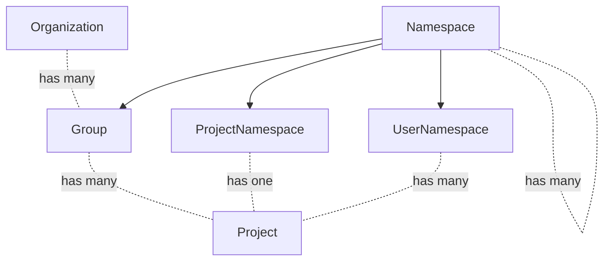

# Organizations and Cells Integration

Operating a GitLab instance as a SaaS also poses some important technical
challenges:

1. Scalability challenges: As the user base grows, it becomes increasingly difficult to scale the entire application uniformly.
1. Performance bottlenecks: Heavy usage by one organization can potentially impact the performance for others.
3. Limited isolation: Issues affecting one part of the application can potentially impact all users.
4. Maintenance complexity: Updating or maintaining the system requires careful coordination to avoid disrupting all users simultaneously.

The Organization and Cell concepts aim to address these limitations by introducing a more modular and scalable architecture. Here's how they work together:

1. Organizations provide logical separation: They group related users, groups, and projects under a single entity, allowing for better management and isolation of resources.
2. Cells provide physical separation: Each Cell is an independent set of infrastructure components that can host multiple Organizations.

By combining Organizations and Cells, we can achieve:

1. Improved scalability: We can add new Cells as needed to accommodate growth, rather than scaling the entire application.
2. Better performance isolation: Issues or heavy usage in one Cell won't affect Organizations in other Cells.
3. Enhanced reliability: Problems in one Cell are contained, reducing the risk of system-wide outages.
4. Easier maintenance: Cells can be updated or maintained independently, minimizing disruption to users.

This approach allows GitLab.com to grow more efficiently while providing a more stable and performant experience for all users.

# Overview

GitLab.com, our SaaS offering, is growing rapidly.
This growth requires that the underlying infrastructure components are able to scale to accommodate additional users.

Scaling GitLab requires different strategies for the individual components.
For example, web application nodes are stateless and can be scaled relatively easily by creating more individual servers.
Stateful components are much harder to scale. As a single solution for the entire DevOps lifecycle, GitLab depends on a single data store which serves as a the single source of truth of data.
For GitLab, this data store is mostly a single PostgreSQL database.
Given the continuing growth of GitLab.com, this PostgreSQL database needs to handle more and more transactions per second.
Reading data can be accelerated by provisioning additional replicas.
Writing new data, however, can't be easily scaled in the same way.
There can only be one primary server and all writes have to go through it.
In order to address this problem there are several possible solutions:

1. Buy more capable hardware - Bigger servers can handle more transactions. This is generally referred to as vertical scaling.
1. Define a horizontal scaling strategy.

GitLab.com is approaching a point where buying bigger servers is no longer easily possible.
Hence, the shift to a [Cells](https://docs.gitlab.com/ee/architecture/blueprints/cells/index.html) architecture is an investment into our horizontal scaling strategy.
This architecture creates many mostly isolated GitLab instances, called Cells, that include all required services (database, web, Redis, Gitaly, Runners, Sidekiq etc.).
The number of Cells can grow alongside the growth of the business.

Organizations will be the vehicle to distribute customers amongst different Cells.
While customers will not be exposed to Cells via the UI and they will operate in the context of Organizations, they are likely to benefit from improved service availability as a result of this architecture change.
Further, the increased isolation of functionality will allow us to tailor the user experience more to an organization's context.

[Cells](https://docs.gitlab.com/ee/architecture/blueprints/cells/index.html) provide a solution for organizations in the small to medium business (up to 100 users) and the mid-market segment (up to 2000 users). Larger organizations may benefit substantially from [GitLab Dedicated](https://docs.gitlab.com/ee/subscriptions/gitlab_dedicated/index.html).

Organizations will offer the following functionality:

1. **Centralized management:** An Organization entity allows all groups, projects, and members to be managed under a single umbrella. This centralization simplifies administration, as it allows for easier configuration and maintenance of access controls, policies, and settings across the entire Organization.
   - An Organization can contain multiple top-level groups. For example, the following top-level groups would belong to the Organization `GitLab`:
     1. `https://gitlab.com/gitlab-org/`
     1. `https://gitlab.com/gitlab-com/`
   - Organizations remove the constraint of having a single hierarchy. An Organization is a container that could be filled with any collection of hierarchies that make sense.
   - Centralized control of user profiles. With an Organization-specific user profile, administrators can control the user's role in a company, enforce user emails, or show a graphical indicator that a user is part of the Organization. An example could be adding a "GitLab employee" indicator on comments.
   - **Unified UX and wider audience.** Organizations allow us to better unify the experience on SaaS and self-managed deployments. Many instance-level features are admin only. We do not want to lock out users of GitLab.com in that way. We want to make administrative capabilities that previously only existed for self-managed users available to our GitLab.com users as well. The Organization Owner will have access to instance-equivalent settings with most of the configuration controlled at the Organization level. Instance-level workflows like dashboards can also be shifted to the Organization. This also means we would give users of GitLab.com more independence from GitLab.com admins in the long run. Today, there are actions that self-managed admins can perform that GitLab.com users have to request from GitLab.com admins, for instance banning malicious actors.
1. **Isolation:** In a cellular architecture, each Organization's data, configurations, and resources are isolated. This is particularly important for customers in highly regulated industries, such as finance, healthcare, or government. Top-level Groups of the same Organization can interact with each other but not with Groups in other Organizations, providing clear boundaries for an Organization, similar to a self-managed instance. Isolation should have a positive impact on performance and availability as things like User dashboards can be scoped to Organizations.
1. **Integration with Cells:** Isolating Organizations makes it possible to allocate and distribute them across different Cells. The benefit of being on a cellular architecture is:
   - **Increased reliability:** A group of Organizations is fully isolated from other Organizations located on a different Cell. If an issue arises within one Organization, the impact is contained within the Cell the Organization is on, preventing a single point of failure from affecting the entire platform. This enhances the overall reliability of GitLab, reducing the risk of widespread outages and improving customer satisfaction. Having isolated Organizations is a pre-requisite to distribute customers amongst multiple Cells.

## Goals

- Improved UX: Inconsistencies between the features available at the Project and Group levels create navigation and usability issues. Moreover, there isn't a dedicated place for Organization-level features.
- Aggregation: Data from all Groups and Projects in an Organization can be aggregated.
- An Organization includes settings, data, and features from all Groups and Projects under the same owner (including personal Namespaces).
- Cascading behavior: Organization cascades behavior to all the Projects and Groups that are owned by the same Organization. It can be decided at the Organization level whether a setting can be overridden or not on the levels beneath.
- Minimal burden on customers: The addition of Organizations should not change existing Group and Project paths to minimize the impact of URL changes.

## Non-Goals

Due to urgency of delivering Organizations as a prerequisite for Cells, it is currently not a goal to build Organization functionality on the Namespace framework.

# Decision Log

- 2024-07-21: [Self-managed instances will initially be restricted to one Organization](https://gitlab.com/gitlab-org/gitlab/-/issues/419543#note_2013887114)
- 2023-05-10: [Billing is not part of the Organization MVC](https://gitlab.com/gitlab-org/gitlab/-/issues/406614#note_1384055365)
- 2023-05-15: [Organization route setup](https://gitlab.com/gitlab-org/gitlab/-/issues/409913#note_1388679761)

# Proposal

We create Organizations as a new lightweight entity, with just the features and workflows which it requires. We already have much of the functionality present in Groups and Projects, and Groups themselves are essentially already the top-level entity. It is unlikely that we need to add significant features to Organizations outside of some key settings, as top-level Groups can continue to serve this purpose at least on GitLab.com. From an infrastructure perspective, cluster-wide shared data must be both minimal (small in volume) and infrequently written.

All instances would set a default Organization.

## Benefits

- No changes to URL's for Groups moving under an Organization, which makes moving around top-level Groups very easy.
- Low risk rollout strategy, as there is no conversion process for existing top-level Groups.
- The Organization becomes the key for identifying what is part of an Organization, which is on its own table for performance and clarity.

## Drawbacks

- By not basing Organizations on the existing namespace construct, it is not clear how we would avoid duplicating the effort of achieving parity for features like reporting between GitLab.com and self-managed, without doing the work twice. (At instance/organization level for top-level reporting, and at group-level for sub-group level reporting)
- Long term, it may make sense to shift billing from top-level Groups to the Organization level.

# Data Exploration

From an initial [data exploration](https://gitlab.com/gitlab-data/analytics/-/issues/16166#note_1353332877), we retrieved the following information about Users and Organizations:

- For the users that are connected to an organization the vast majority of them (98%) are only associated with a single organization. This means we expect about 2% of Users to navigate across multiple Organizations.
- The majority of Users (78%) are only Members of a single top-level Group.
- 25% of current top-level Groups can be matched to an organization.
  - Most of these top-level Groups (83%) are associated with an organization that has more than one top-level Group.
  - Of the organizations with more than one top-level Group the (median) average number of top-level Groups is 3.
  - Most top-level Groups that are matched to organizations with more than one top-level Group are assumed to be intended to be combined into a single organization (82%).
  - Most top-level Groups that are matched to organizations with more than one top-level Group are using only a single pricing tier (59%).
- Most of the current top-level Groups are set to public visibility (85%).
- Less than 0.5% of top-level Groups share Groups with another top-level Group. However, this means we could potentially break 76,000 existing links between top-level Groups by introducing the Organization.

Based on this analysis we expect to see similar behavior when rolling out Organizations.

### Organization MVC

##### Dependencies on other services

- Organizations rely on the Topology Service
  - to guarantee the uniqueness of global claims (like usernames, emails, namespaces, SSH public keys, and more) across the cluster.
  - provides IDs that are unique across the cluster.
- Organizations rely on the router to route requests to the correct Cell based on eg. path, token prefix, users, or SSH public keys.
- All Cells have their own application secrets
- Application settings are synchronized across Cells

##### Some affected features

- All forms of authentication. As the Topology Service cannot classify the request with an unauthenticated user, the process is as follows:
  1. Cell #1 displays the login form.
  1. Cell #1 identifies the user based on the request data.
  1. Cell #1 looks up the user's associated Cell from the Topology Service.
  1. Cell #1 sets a cookie indicating the associated Cell and redirects the user.
  1. The router routes the request to the correct Cell based on the cookie.
  1. Cell X authenticates the user
- Billing stays at top-level Group.
- Enterprise Users or verified domains are not required to be used with Organizations.
- Public visibility of Groups and Projects, or unauthenticated requests are not allowed apart from Cell #1.

A list of features not supported in Cells 1.0 is available in the [Cells 1.0 blueprint](/handbook/engineering/architecture/design-documents/cells/iterations/cells-1.0/#features-on-gitlabcom-that-are-not-supported-on-cells).

##### Open Questions

- To minimize the number of cluster-wide resources, consider refactoring [Standalone resources](https://docs.gitlab.com/ee/api/api_resources.html#standalone-resources) to scope them to an Organization, Group, or Project.
- Consider refactoring global endpoints (e.g. `/jwt/auth`) to be scoped to an Organization, Group, or Project, unless they are supporting cluster-wide resources.

#### Organizations on Cells 1.5 (FY26Q1-FY26Q2)

Organizations in the context of Cells 1.5 will contain the following functionality:

- **Deletion**
  - Organizations can be deleted by Organization Owners.
- **Users**
  - Organization Users can be part of multiple Organizations using one account.
  - Users are able to navigate between their Organizations using an Organization switcher.
  - Non-Enterprise Users can be removed from or leave an Organization.
  - When users are added to Organizations they receive an email informing them that they have been added to the Organization.
  - Users get [a personal Namespace in each Organization](https://docs.gitlab.com/ee/architecture/blueprints/cells/impacted_features/personal-namespaces.html) they are associated with.
  - [User Profile can be scoped to multiple Organizations](https://docs.gitlab.com/ee/architecture/blueprints/cells/impacted_features/user-profile.html). Changing the Organization in the switcher will change the scope of the User Profile to the selected Organization.
- **Groups**
  - Users can transfer existing top-level Groups into Organizations.
- **Isolation**
  - Organizations are fully isolated. We aim to complete [phase 2 of Organization isolation](https://gitlab.com/groups/gitlab-org/-/epics/11838), with the goal to implement isolation constraints.

#### Organizations on Cells 2.0 (FY26Q3-FY26Q4)

Organizations in the context of Cells 2.0 will contain the following functionality:

- Public visibility. Organizations can now also be `public`, containing both private and public Groups and Projects.

