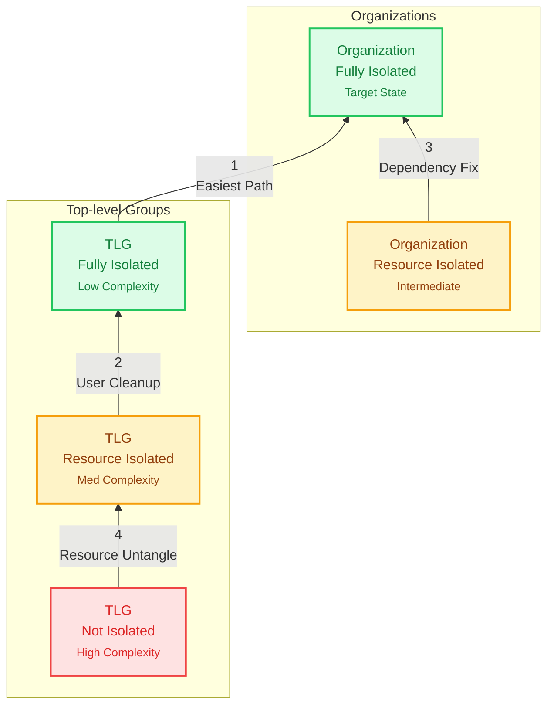
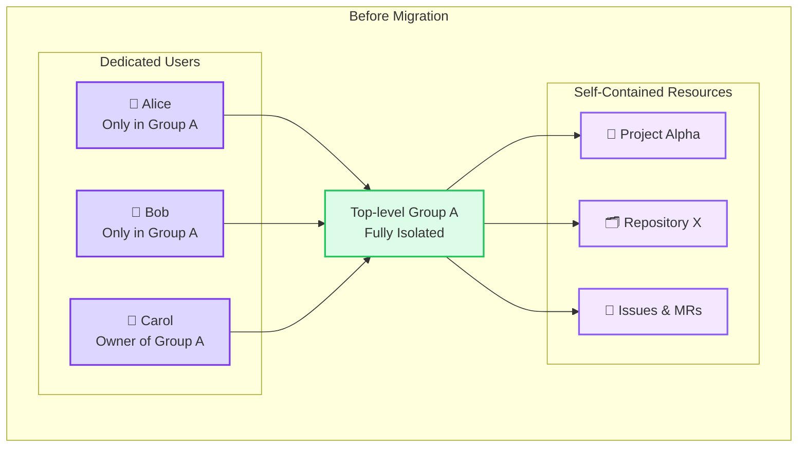
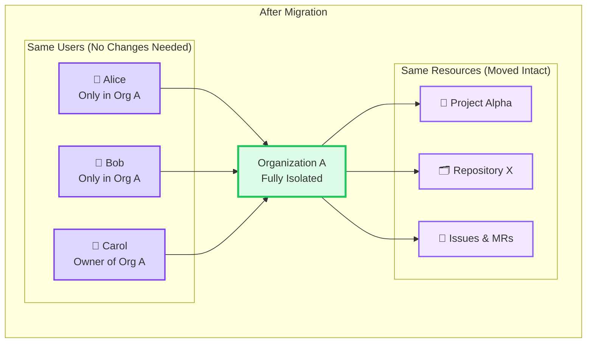
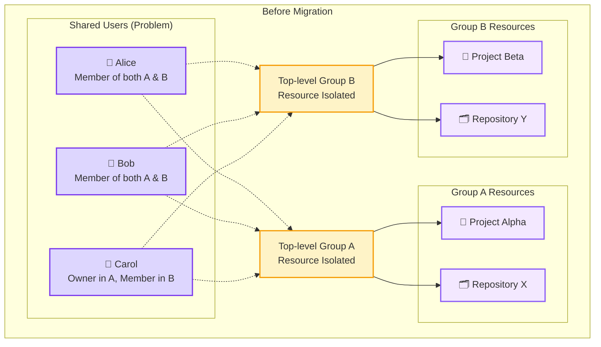
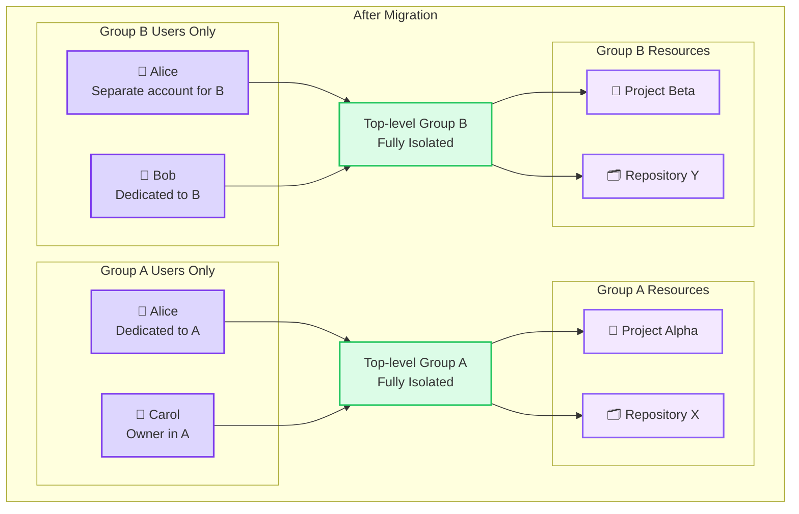
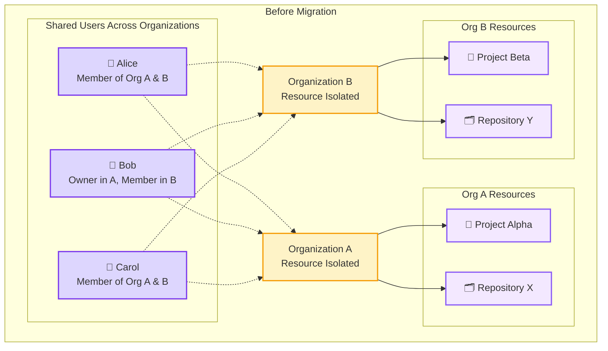
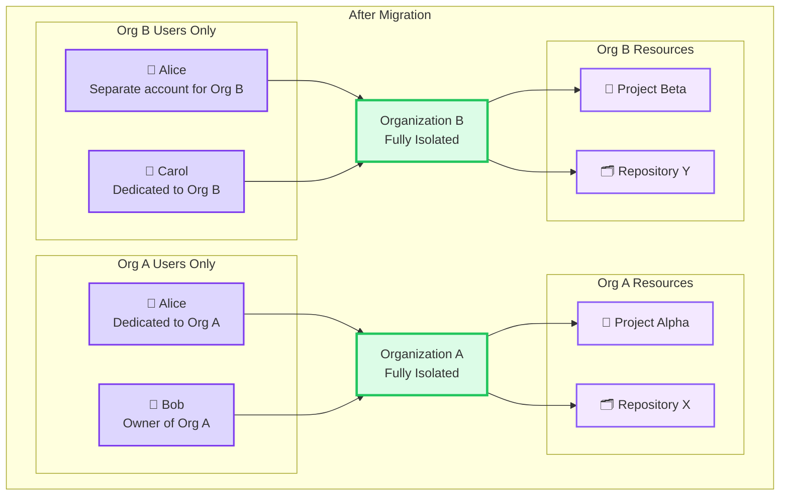
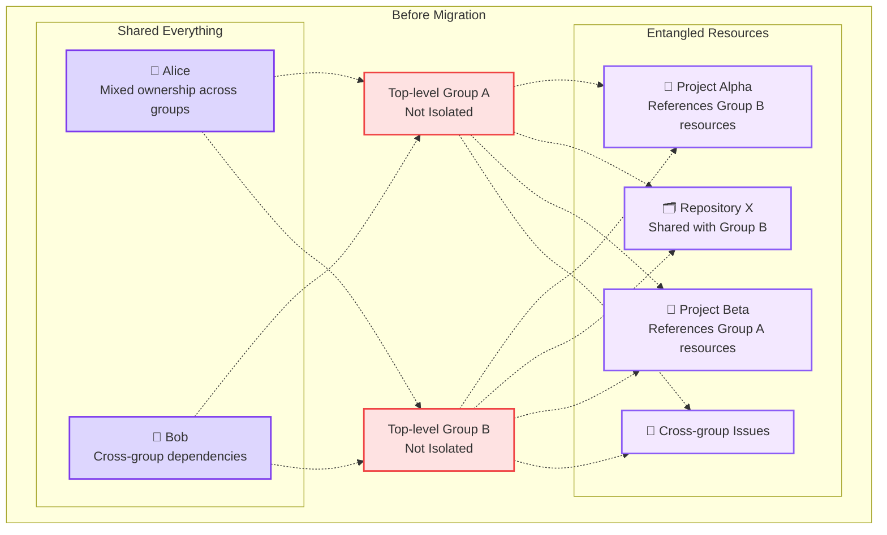
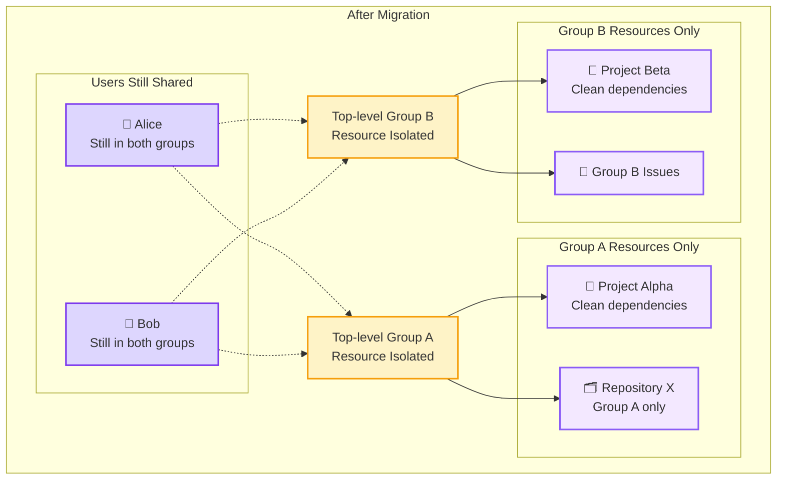

With the introduction of the distributed architecture concerns the GitLab data partitions have become complicated. With Cells and Organizations we no longer have a shared single data pool but instead have varying levels of segmented data. Crucially, the segmented data will exist in various levels of isolation from other data.

We have devised a compliance framework that clarifies both the various isolation levels and their broader impact on our distributed architecture. This framework allows us to decouple problem dependencies by acknowledging multiple data states and thereby treating them as their own problem sets.

The framework consists of a set of isolation levels within logical data containers, and a set of corresponding validation and enforcement functions. These will now be detailed.

## Container Hierarchy

We have multiple data containers with varying isolation levels:

- **Organization**: A logical grouping that contains users and one or more top-level groups
- **Top-level Group** (TLG): A container that exists within an organization as the top most group in a group hierarchy.

Each container will store two attributes:

- The current level of isolation achieved by this container.
- Whether the isolation will be enforced or not.

## Isolation Levels

The level of Isolation within each container can vary by degree. In order of most isolated first:

- **Fully Isolated**: This data is entirely self contained and can be moved to another cell without concern.
- **Resource Isolated**: All data except user data is self contained within the container. This container is confined to the same Cell as where the user belongs.
- **Not Isolated**: Resource data associates outside the container.

We could get away with simply two levels: isolated, and not isolated. However, by adding nuance between user and resource isolation we can better enable dog fooding.

In order to enable GitLab team member dog fooding, we will allow user data to cross Organization boundaries. But, as part of the dog fooding process we still want to enforce resource isolation as we would with other Fully Isolated Organizations.

Regardless of Isolation Level it's possible to move any set of containers across Cells provided the entire interconnected network graph is moved. For example, if a Cell has three Organizations and one is self contained while two are interconnected, we can move the two Organizations to another Cell. This is a possible scenario for a company with multiple top-level groups to move into a new Organization.

### Isolation Levels for Organizations

Each level in the container hierarchy may operate at any isolation level. Below, we describe these combinations and their implications. The diagrams represent logical data boundaries and do not necessarily translate to database tables.

#### Organization - Fully Isolated

- **Definition**: All Users and Resources are fully isolated within the Organization.
- **Implications**: Organization can be moved between cells. Fully Isolation Level enforcement can be applied.

```text
┌────────────────────────────────────┐
│Cell 1                              │
│                                    │
│  ┌──────────────────────────────┐  │
│  │Org 1                         │  │
│  │Fully Isolated                │  │
│  │       ┌──────────────┐       │  │
│  │       │Org 1         │       │  │
│  │       │Resources     │       │  │
│  │       └──────────────┘       │  │
│  │       ┌──────────────┐       │  │
│  │       │Org 1 Users   │       │  │
│  │       │              │       │  │
│  │       └──────────────┘       │  │
│  └──────────────────────────────┘  │
│   ┌───────────┐    ┌───────────┐   │
│   │Org 2      │    │Org 3      │   │
│   │           │    │           │   │
│   │           │    │           │   │
│   │           │    │           │   │
│   └───────────┘    └───────────┘   │
└────────────────────────────────────┘
```

#### Organization - Resource Isolated

- **Definition**: Resources are isolated, but Users are shared between Organizations
- **Implications**: Organization cannot be moved to another cell.  Resource Isolation Level enforcement can be applied.

We expect GitLab dog food Organizations to exist with this level of isolation.

```text
┌────────────────────────────────────┐
│Cell 1                              │
│                                    │
│  ┌──────────────────────────────┐  │
│  │Org 1                         │  │
│  │Resource Isolated             │  │
│  │           ┌───────┐ ┌───────┐│  │
│  │┌─────────┐│Org 1  │ │       ││  │
│  ││Org 1    ││Users  │ │       ││  │
│  ││Resources││       │ │       ││  │
│  │└─────────┘│       │ │       ││  │
│  └───────────┤       ├─┤       ├┘  │
│              │       │ │       │   │
│              │       │ │       │   │
│              │       │ │       │   │
│  ┌───────────┤       ├─┤       ├┐  │
│  │┌─────────┐│       │ │       ││  │
│  ││Org 2    ││       │ │       ││  │
│  ││Resources││       │ │Org 2  ││  │
│  │└─────────┘│       │ │Users  ││  │
│  │           └───────┘ └───────┘│  │
│  │Org 2                         │  │
│  │Resource Isolated             │  │
│  └──────────────────────────────┘  │
│                                    │
└────────────────────────────────────┘
```

#### Organization - Not Isolated

- **Definition**: Resources and optionally Users are shared across organizations.
- **Implications**: We found a bug. We need to have at least basic Resource Isolation.

```text
┌────────────────────────────────────┐
│Cell 1                              │
│                                    │
│  ┌──────────────────────────────┐  │
│  │Org 1                         │  │
│  │Not Isolated                  │  │
│  │      ┌─────────┐ ┌─────────┐ │  │
│  │      │Org 1    │ │         │ │  │
│  │      │Users +  │ │         │ │  │
│  │      │Resources│ │         │ │  │
│  │      │         │ │         │ │  │
│  └──────┤         ├─┤         ├─┘  │
│         │         │ │         │    │
│         │         │ │         │    │
│         │         │ │         │    │
│  ┌──────┤         ├─┤         ├─┐  │
│  │      │         │ │         │ │  │
│  │      │         │ │Org 2    │ │  │
│  │      │         │ │Users +  │ │  │
│  │      │         │ │Resources│ │  │
│  │      └─────────┘ └─────────┘ │  │
│  │Org 2                         │  │
│  │Not Isolated                  │  │
│  └──────────────────────────────┘  │
│                                    │
└────────────────────────────────────┘
```

### Isolation Levels for Top-level Groups

#### Top-level Group - Fully Isolated

- **Definition**: All user and resources are self-contained within the top-level group.
- **Implications**: Can be moved to another organization, even across cells

Note that Enterprise Users have the same `users.managing_group_id` and are more likely to fit this compliance level from the GitLab.com Default Organization.

```text
┌──────────────────────┐
│Top-level group 1     │
│Fully Isolated        │
│                      │
│                      │
│        ┌───────────┐ │
│        │Org 1 Users│ │
│        │           │ │
│        └───────────┘ │
└──────────────────────┘
```

#### Top-level Group - Resource Isolated

- **Definition**: All resources are self-contained but users are shared with other top-level-groups.
- **Implications**: Can be moved to another Organization but may force that Organization to downgrade to Resource Isolated if currently Isolated.

We will eventually need to identify manual and automated methods of unstitching interconnected users.

```text
┌────────────────────────────────────┐
│Org 1                               │
│                                    │
│  ┌──────────────────────────────┐  │
│  │Top-level Group 1             │  │
│  │Resource Isolated             │  │
│  │           ┌───────┐ ┌───────┐│  │
│  │┌─────────┐│Top    │ │       ││  │
│  ││TLG 1    ││Level  │ │       ││  │
│  ││Resources││Group 1│ │       ││  │
│  │└─────────┘│Users  │ │       ││  │
│  └───────────┤       ├─┤       ├┘  │
│              │       │ │       │   │
│              │       │ │       │   │
│              │       │ │       │   │
│  ┌───────────┤       ├─┤       ├┐  │
│  │┌─────────┐│       │ │Top    ││  │
│  ││TLG 1    ││       │ │Level  ││  │
│  ││Resources││       │ │Group 2││  │
│  │└─────────┘│       │ │Users  ││  │
│  │           └───────┘ └───────┘│  │
│  │Top-level Group 2             │  │
│  │Resource Isolated             │  │
│  └──────────────────────────────┘  │
│                                    │
└────────────────────────────────────┘
```

#### Top-level Group - Not Isolated

- **Definition**: Resources and optionally Users span multiple top-level groups
- **Implications**: Cannot be independently moved out of the same Organization. The set of Top-level groups could be moved as a whole.

```text
┌────────────────────────────────────┐
│Org 1                               │
│                                    │
│  ┌──────────────────────────────┐  │
│  │Top-level Group 1             │  │
│  │Not Isolated                  │  │
│  │      ┌─────────┐ ┌─────────┐ │  │
│  │      │Org 1    │ │         │ │  │
│  │      │Users +  │ │         │ │  │
│  │      │Resources│ │         │ │  │
│  │      │         │ │         │ │  │
│  └──────┤         ├─┤         ├─┘  │
│         │         │ │         │    │
│         │         │ │         │    │
│         │         │ │         │    │
│  ┌──────┤         ├─┤         ├─┐  │
│  │      │         │ │         │ │  │
│  │      │         │ │Org 2    │ │  │
│  │      │         │ │Users +  │ │  │
│  │      │         │ │Resources│ │  │
│  │      └─────────┘ └─────────┘ │  │
│  │Top-level Group 2             │  │
│  │Not Isolated                  │  │
│  └──────────────────────────────┘  │
│                                    │
└────────────────────────────────────┘
```

## Framework Functions

The framework functions work together with the isolation levels and hierarchy. While the levels themselves define the current isolation state of the container, the functions ensure they are correct and can remain that way.

### Validation

Containers can be validated against an Isolation Compliance Level.

If the container passes validation at that level then it's possible to set that container to that Compliance Level.

If the validation fails, a list of validation errors should be returned. This list of current violations may not be exhaustive as that could be costly to produce.

For example, if a customer wants to upgrade their Top-level Group to an Organization but the Top-level Group shares users with other hierarchies, the validation function will return a list of invalid users with a description of the error.

### Enforcement

The enforcement function will ensure that containers remain valid at their given Isolation Compliance Level. Any attempt to violate the compliance level will be rejected.

At a bare minimum we want to avoid ever entering an Organization state of "Not Isolated" as Organizations should never link Resources between Organizations. Top-level Groups that are "Not Isolated" are expected and will present challenges to move towards Isolation.

## Isolation Roadmap

A combination of isolation levels can co-exist within a single cell. It is possible to have a set of Organizations that share users and/or data, and another set of Organizations that are entirely self contained. The compliance framework enforcement functions will allow the data partitions to co-exist.

The ability to operate an installation with various levels of isolation is what allows us to transition out of the legacy behavior on GitLab.com and into the new Isolated Organization paradigm. We will do so with the following roadmap.

### 1. Default Organization

All top-level groups and descendant data has been placed within the Default Organization.

There are millions of Top-level Groups with an assortment of isolation levels. Some groups have already expressed a desire to be Fully Isolated through their use of the Enterprise Users feature, while others could be considered Fully Isolated but lacking formal connection. We will need product decisions to increase isolation levels on many of these cases as User ownership needs to be managed and inter-mingled data will need to be separated. It's important to note that there is no requirement to increase isolation level of these Top-level Groups unless the hierarchies want to move into an Organization.

The Default Organization will likely exist for a long time. Our aim is to migrate customers out of this Organization and into other Fully Isolated Organizations where possible. This will help with scaling and cell balancing. However, there are many complications around this process that require development of migration paths out of each successive isolation level and container.

### 2. Dog Fooding

The GitLab Team will be given the ability to create organizations so they can dog food Isolated Organizations. This will mean that the Default Organization and any Organization created by the GitLab Team will only be Resource Isolated and not Fully Isolated because their User accounts will be shared between these Organizations.

These Organizations with shared users will be prevented from dog fooding the Org Mover intra-cluster migration process. There are two possible solutions to test the org mover intra-cluster ability:

1. Build a Fully Isolated Organization by allowing the GitLab Team to have multiple SAML identities. This could be possible with a separate SAML IdP or an IdP Chaining/Proxy mechanism.
2. Develop a Cells capability such that Users exist at the Cluster level and not at the Cell level.

It is important to note that even though Dog Food Organizations are Resource Isolated and not Fully Isolated we can still test nearly all of the isolation features.

### 3. New Customer Onboarding

New customers will have the option to setup within their own isolated organization or the default organization. We anticipate this option to exist indefinitely. We will favor the default organization initially, but as our confidence grows we will transition to favor the isolated organization pathway.

This will be phased according to a yet to be decided Organization roll out process. Initial customers will be more akin to beta testers and will be manually setup and then closely managed.

As we gain confidence we will channel new sign ups into the Isolated Organization experience.
We will also begin to provide migration paths for customers to leave the Default Organization (detailed below in 4. Existing Customer Migration).

### 4. Existing Customer Migration

We will need to build pathways to transition between isolation states. We want to direct top-level groups out of the Default Organization and into their own Organizations, and Organizations to become Fully Isolation compliant so they can eventually move to another Cell.

The intention is to make this a simple customer experience. We will need to iterate through this process to gradually improve the experience.

Many customers may need to make decisions on data that prohibits them from migrating. This is a long and involved topic and will require heavy product involvement.

The migration pathways should be developed in a priority order such that we can achieve greater numbers of Organization - Fully Isolation adoption sooner than later. The initial priorities are suggested as:



| Priority | From State              | To State                | Complexity | Blocking Factors       |
| -------- | ----------------------- | ----------------------- | ---------- | ---------------------- |
| 1        | TLG - Fully Isolated    | Org - Fully Isolated    | Low        | None expected          |
| 2        | TLG - Resource Isolated | TLG - Fully Isolated    | Medium     | Shared user ownership  |
| 3        | Org - Resource Isolated | Org - Fully Isolated    | Medium     | Cross-org user sharing |
| 4        | TLG - Not Isolated      | TLG - Resource Isolated | High       | Resource untangling    |

#### Priority 1 - TLG Fully Isolated to Organization Fully Isolated





#### Priority 2 - TLG Resource Isolated to Fully Isolated





#### Priority 3 - Organization Resource Isolated to Fully Isolated





#### Priority 4 - TLG Not Isolated to Resource Isolated




