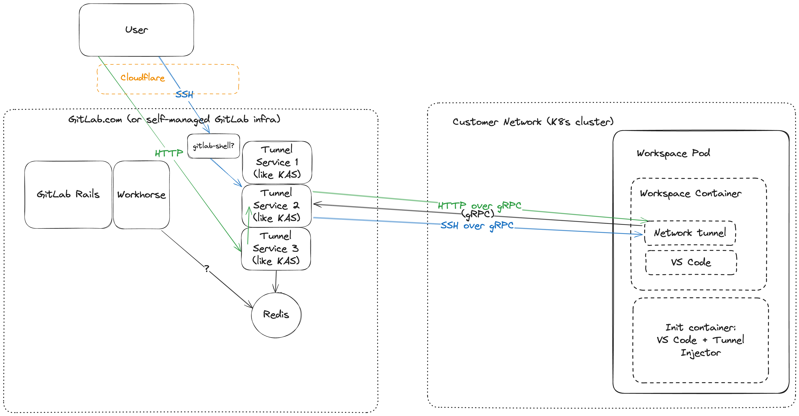
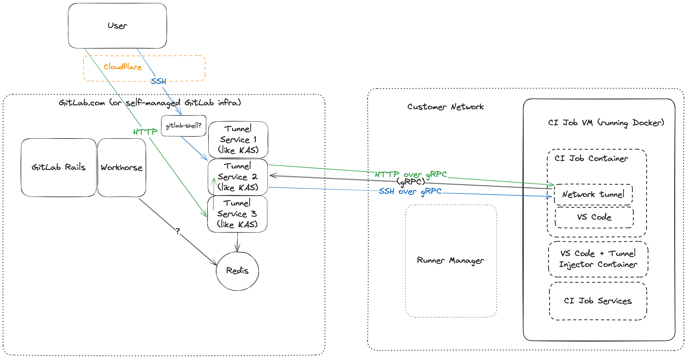

<!-- Design Documents often contain forward-looking statements -->

<!-- This renders the design document header on the detail page, so don't remove it-->


## Summary

Configuring and deploying the Workspace proxy with a valid SSL certificate and
domain name record is a very complicated process and is a requirement for using
Workspaces today.

This proposal is based on experimental proof of concept work done as part of
https://gitlab.com/gitlab-org/gitlab/-/issues/505764 to explore ways to minimise
the amount of effort to get started with Workspaces. The work work complements
another proposal for how we might also run workspaces without Kubernetes at all,
but this proposal focuses solely on the network tunneling behaviour that will be
used for both of these.

In addition we found that it was easy to extend this tunnel to be useful for
debugging CI jobs using the Web IDE so that is also included in this proposal.
Additionally this idea of tunneling may provide an alternative network transport
to support [Interactive Web
Terminals](https://docs.gitlab.com/ee/ci/interactive_web_terminal/) which
currently relies on direct network access to the Runner Manager and is likely a
blocker for adoption.

During the investigation we found that
[KAS](https://gitlab.com/gitlab-org/cluster-integration/gitlab-agent) already
has most of the building blocks for this network tunnel and as such would be the
most efficient option for getting this to production. KAS was originally built
as a way to tunnel into customer's K8s clusters, and this is reflected in the
name, but the same techniques can easily be applied to tunneling into any
customer workloads so it seems like a natural extension of this service.

## Proposal

