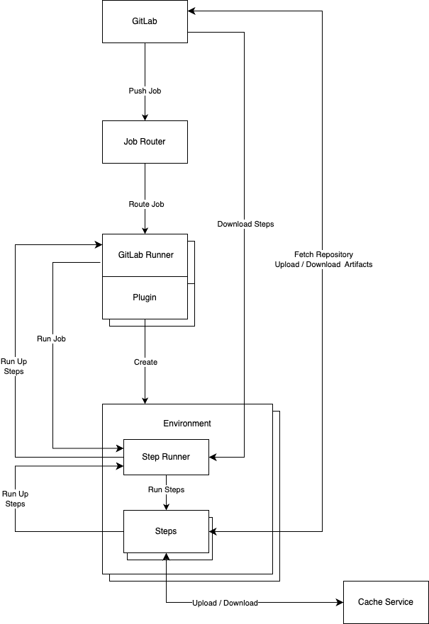



This document is a technical vision, not a product or feature
roadmap. It describes how to decompose the GitLab Runner problem space
in such a way that it can be reassembled into the products and
features we have, the ones we want, and the ones we haven’t thought of
yet.

> "Design is to take things apart in such a way that they can be put
> back together" - Rich Hickey
> https://www.infoq.com/presentations/Design-Composition-Performance
> (3:10)

# Vision #

## Environments ##

GitLab Runner is available for all major operating systems and
architectures. It can run thousands of jobs concurrently in local or
remote environments. It can autoscale remote environments based on
current and future load. It can be adapted to an unbounded number of
environments through a self-service plugin mechanism, such that
autoscaling works out-of-the-box.

The runner operating system and architecture does not need to match
that of the remote environment. GitLab Runner is capable of
discovering and reconnecting to jobs running in remote environments,
without losing job state. It provides observability of the remote
environment capacity and asserts back-pressure in response to resource
constraints (such as insufficient capacity).

## Job Composition ##

Jobs are delivered as gRPC payloads. All jobs are composed of steps
which are executed by an agent (Step Runner) in the job
environment. Steps may be local or remote. Local step versions are
determined by the commit SHA. Remote step versions are determined by a
secure lockfile stored in the repository. The results of a job are
returned over gRPC to GitLab (separately from the logs) and describe
the exact parameters of every step executed. Steps can be written to
be deterministic, allowing step results to be used to reproduce
artifacts, byte-for-byte

Step policy is provided by GitLab and enforced by GitLab Runner and
its agent in the job environment. Policy may constrain available steps
and their versions, insert required steps, and constrain resources
consumed (such as network and disk).

## Delegation ##

Steps can control the execution of sub-steps by sending a “run up”
request which is handled by Step Runner. If the run up request asks
for a separate environment, Step Runner will forward the request back
to GitLab Runner who will provision a separate environment for the
requested steps. Results from the run up request are passed back down
and the originating step can decide what to do with them. E.g. retry,
ignore, pass onward, etc..

This mechanism allows steps to be encapsulated in a separate
environment while maintaining control of environments in a single
place, GitLab Runner. Permission to access additional environments,
which steps can run in other environments, and additional privileges
are controlled by policy stored in GitLab and delivered with the job
payload.

Steps which are capable of creating their own environment locally,
such as a Docker step, can delegate steps into that environment with a
regular run (down) request. Having full control of the results, they
can decide what to do with them and then incorporate the results in
the overall tree. In this way the final job results capture step
execution across environments.

## Development ##

Job payloads container steps and calling parameters can be downloaded
from any environment and run locally for debugging. Or jobs can be
debugged in-place by inserting breakpoints into steps and connecting
via gRPC to see the execution context and interact with the job
environment. Steps can be unit tested with a built-in testing
framework. They can be published and consumed through public and
private catalogs, as well as within the local repository. Steps can be
marked as deprecated or defective and consumers are automatically
notified.

## Federated Ownership ##

Common aspects of jobs such as checkout, cache and artifacts are
implemented as steps, outside GitLab Runner and its agent. Vertical
integrations such as artifacts can be owned entirely by a single
team. E.g. The team who owns the artifact APIs in GitLab can also own
the steps that upload and download from them. GitLab Runner provides
an environment and injects the job payload. But it doesn’t control
exactly what runs in that payload. Ownership of various aspects of job
execution is federated to specialized teams. E.g. Artifact signing and
secret management are implemented as steps owned by other teams.

## Unified Execution ##

GitLab Runner has one way to execute jobs. All aspects of “executors”
are implemented by means of encapsulation steps (such as Docker) or as
pre/post hooks in the environment plugin mechanism. Runner is
responsible only for dispatching jobs to environments and connecting
to those environments to deliver the job payload and return results.

There is no more “kubernetes” executor, just a Kubernetes plugin
configured with GitLab runner, capable of customizing pods according
to job requirements. There is no more “docker” executor, just a Docker
step which wraps the job payload. There are no more built-in services,
just service steps which the runner prepends to the job payload.

Even pre-existing "scripts" are wrapped and delivered as step payloads
so all CI configuration gain the benefits of a unified steps-based
execution model.

## Management ##

GitLab Runner is supported by tools to setup, configure and maintain
small, medium and large installations. Fleet management tools
implement industry best practices such as blue-green
deployments. These tools are used to operate all runners on GitLab.com
as well as being available for self-hosted customers. Anyone can
contribute to GitLab.com’s runner infrastructure.

Default images for remote job environments are publicly
available. Tools to build private images are also available and work
out-of-the-box. Best practices for GitLab Runner efficiency and
reliability are implemented in the shared tool set.

Time spans for every job, step and sub-step are exported via
OpenTelemetry and are available as observability data. Likewise
real-world resource consumption (CPU, memory, etc..) is available for
each job. Resource consumption is tracked over time and, when an
environment permits, resource requests are tailored automatically to
the job’s need.

## Routing ##

Job routing and autoscaling decisions are made centrally in a simple,
dedicated routing service. Jobs can be routed around outages and
capacity limitations. Created jobs are immediately known to the runner
autoscaling system, even before the jobs are ready for
execution. GitLab can provide policy which affects routing, including
preferred regions, providers and instance types.

Jobs can also be routed according to resource requirements and
available capacity, reported by individual runners. Jobs can also have
a relative priority which will affect queuing behavior.

# Architecture #

Arrows are the flow of data

