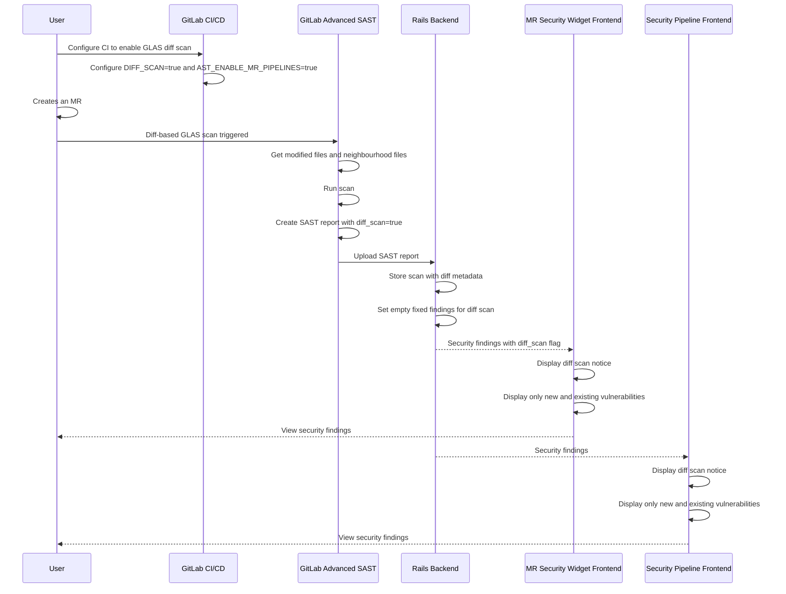
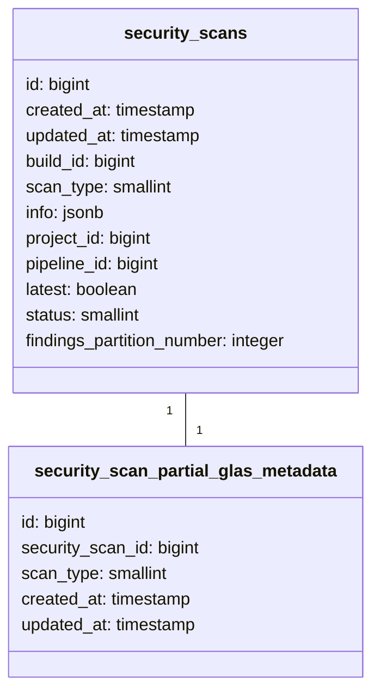



## Summary

This design document outlines the changes to be made to the `Security Widget` and `Security Pipeline Tab` to display diff-based scan results from GitLab Advanced SAST (GLAS). Diff-based scanning focuses on analyzing only the files modified in a merge request and [files dependent on it up to a configured neighborhood depth](#understanding-neighborhood-depth), rather than scanning the entire codebase. This approach significantly reduces scan duration while still providing actionable security insights for most use cases.

If you're unfamiliar with any of the terms used, you may want to skip ahead to the [GLAS concepts](#glas-concepts) section for clarification.

## Motivation

Full security scans can be time-consuming, especially for large codebases. By focusing the analysis on modified files and their immediate dependencies, we can provide faster feedback on security issues in merge requests.

### Goals

- Reduce GLAS scan time for MRs
- Clearly indicate in the **Security Widget** and **Security Pipeline tab** that the scan is diff-based
- Ensure fixed vulnerabilities are **not displayed** in the **Security Widget**, and clearly explain the reasoning to the user
- Target release in 18.2

### Non-Goals

- Stateful incremental scanning (planned for future iterations)
- Create UI components to manually trigger full scans (will use CI/CD variables in MVC)
- Support fixed vulnerability detection (will be hidden in MVC)
- Enable users to configure neighborhood depth (consider for future iteration)

## Proposal

### Diff-based Scanning

There will be **no change** to the `Security Widget` or `Pipeline Security Tab` for **full GLAS scans**. Diff-based scanning is **not a breaking change**, as it can be enabled via the `SAST_PARTIAL_SCAN` CI/CD variable.

#### In a GLAS diff-based scan

- Enabled by setting CI/CD variables `SAST_PARTIAL_SCAN: differential`
The GLAS scanner analyzes only the modified files and the files that depend on them (based on the configured [neighborhood depth](#understanding-neighborhood-depth))
- The resulting SAST report includes a `sast_partial_scan` field that is set to `differential` and findings limited to the scanned files
- The `Security Widget` displays a notice indicating this is a diff-based scan and **only shows new and existing findings, [excluding fixed vulnerabilities](#fixed-vulnerabilities-in-diff-scanning)**
- The `Security Pipeline tab` displays a diff-scan notice

### Sequence Diagram for Diff-based Scan Process



### Database Schema



### Key Design Decisions

#### 1. Hide Fixed Vulnerabilities

**Decision: Do not display fixed vulnerabilities for GLAS diff-based scans**

As part of the MVC implementation, fixed vulnerabilities will **not** be shown in the Security Widget when diff-based scanning is enabled. This limitation will be clearly communicated to users.

*Rationale:*

- Diff-based scans cannot reliably detect all fixed vulnerabilities. 
- See background and reasoning [here](#fixed-vulnerabilities-in-diff-scanning)

#### 2. Maintain Security Approval Functionality

**Decision: Maintain existing security approval rules; document limitations**

For the MVC, we will maintain existing security approval functionality but provide clear documentation about potential false negatives when using diff-based scanning with approval rules.

*Rationale:*

- Maintains current workflows without disruption
- Avoids introducing complex feature interactions in the MVC phase
- See background and reasoning [here](https://gitlab.com/gitlab-org/gitlab/-/issues/536864#note_2485990368)

#### 3. Full Scan Option

**Decision: Allow users to override diff-based scanning and run a full scan via the `SAST_PARTIAL_SCAN` CI variable**

By default, GLAS runs full scans. However, users who have enabled diff-based scanning can trigger a full scan for a specific pipeline by setting the `SAST_PARTIAL_SCAN` variable to false.

*Alternative approach:*

- Add a button in the Security Widget to trigger a full scan

*Rationale:*

- Provides flexibility without requiring UI changes for the MVC
- See background and reasoning [here](https://gitlab.com/gitlab-org/gitlab/-/issues/536864#note_2485990368)

## Design and Implementation Details

### Database Schema Changes(WIP)

Introduce a new table to track whether a scan is a GLAS diff-based scan. This is kept separate from security_scans to avoid adding unused fields for other scan types.

1. Create a new table `security_scan_partial_glas_metadata` associated with the `security_scan` table

   ```ruby
    create_table :security_scan_partial_glas_metadata do |t|
        t.references :security_scan, null: false, foreign_key: true, index: { unique: true }
        t.smallint :scan_type, null: false, default: 1
        t.timestamps
    end
   ```

2. Add a `ScanPartialGlasMetadata` model that belongs to [`Security::Scan`](https://gitlab.com/gitlab-org/gitlab/-/blob/d9105304152646f2b784b39d9ffe87a315eb787e/ee/app/models/security/scan.rb)

   ```ruby
   class ScanPartialGlasMetadata < ApplicationRecord
     belongs_to :security_scan, class_name: 'Security::Scan'

     enum scan_type: {
       differential: 1,
     }
   end
   ```

### Backend Changes(WIP)

- Identify code to parse the SAST report and if it's a GLAS diff_scan, create a `security_scan_glas_diff_metadata` entry that the frontend code can retrieve to determine if the scan is a diff-based scan.
- For the security widget data, it should also return an empty array for fixed vulnerabilities to ensure that it is hidden.

### Frontend Changes(WIP)

Identify code to update the `Security Widget` and `Pipeline Security Tab` to present a diff-based scan notice and other UI elements determined by design team.

## GLAS concepts

### What does "diff" mean in GLAS diff-based scanning?

In GitLab Advanced SAST, the diff isn't a line-by-line comparison like git diff. Instead, it refers to which files were added or modified in the merge request (MR). These are what I refer to as diff files below. Deleted files are excluded from scanning as they no longer exist, so they’re not relevant to the scan.

### Understanding Neighborhood Depth

Neighborhood depth determines how many levels of files that depend on the modified files should be scanned.

- **depth = 0**: only the diff files are scanned
- **depth = 1**: diff files + files that import (depend on) the diff files
- **depth = 2**: depth 1 files and files that import those

We don’t scan files imported by the diff files — only the ones that depend on them. The idea is that changes in a file only affect the files that rely on it.

#### Example

```txt
fileA:
  imports: fileB
fileB:
  imports: fileC
fileC:
  imports: fileD
fileD:
  imports: fileE
  note: diff file
fileE:
  imports: -
```

With neighborhood depth = `2` and diff file = `fileD`:

- Scanned files: `fileD`, `fileC`, `fileB`
- Unscanned files: `fileA`, `fileE`

### Taint signature (definition)

A **taint signature** represents how potentially untrusted data flows through the program, from a **source** (like user input) to a **sink** (like a dangerous operation such as an SQL query).

In diff-based scanning, we only scan modified files and their dependents because only they can gain or change taint paths. Files that are imported by a modified file don’t change behavior as a result of the import.

### Fixed vulnerabilities in diff scanning

Let’s use the same example again to visualize how the security widget would work with GLAS diff-based scanning, now with vulnerability states:

```txt
fileA:
  imports: fileB
  vuln: vulnA (new)
fileB:
  imports: fileC
  vuln: vulnB (present in target branch, gone in source branch)
fileC:
  imports: -
  note: diff file
fileD:
  imports: -
```

Neighborhood depth = `2`. Diff file = `fileC`.\
Scanned files: `fileC`, `fileB`, `fileA`.\
Unscanned files: `fileD`.

In this case:

- `vulnA` appears newly in the source branch.
- `vulnB` existed in the target but is **no longer detected** in the source.

The GLAS SAST report of the source branch only detects `vulnA`.

Current Security widget would display:

- **new**: `vulnA`
- **fixed** `vulnB`

Security widget with GLAS diff-based scanning should display(which excludes fixed vuln):

- **new**: `vulnA`

Reason being that it is complex for diff-based scanning to determine if vulnB was truly fixed ([background of why it's complex](https://gitlab.com/gitlab-org/gitlab/-/issues/536864#note_2485990368:~:text=Approach%202%3A%20Filter,a%20later%20iteration.)). So we **plan to hide fixed vulnerabilities** from the security widget for GLAS diff-based scans to avoid confusing or inaccurate results.

### Cross-file vulnerabilities

Cross-file vulnerabilities occur when a vulnerability spans across multiple files — for example, the *source* of untrusted data might be in one file, while the *sink* (where the data is used unsafely) is in another.

```txt
fileA:
  imports: fileB
  sink: vulnX
fileB:
  imports: fileC
fileC:
  imports: fileD
  source: vulnX
fileD:
  imports: -
```

Neighborhood depth = `2`. Diff file = `fileC`.\
Scanned files: `fileC`, `fileB`, `fileA`.\
Unscanned files: `fileD`.

In this case, **vulnX is detected**, because the full taint flow from source to sink is included in the scan.

But if `fileD` is the diff file:

```txt
fileA:
  imports: fileB
  sink: vulnX
fileB:
  imports: fileC
fileC:
  imports: fileD
  source: vulnX
fileD:
  imports: -
  note: diff file
```

Neighborhood depth = `2`. Diff file = `fileD`.\
Scanned files: `fileD`, `fileC`, `fileB`.\
Unscanned files: `fileA`.

Result: **vulnX is not detected**, because the scan didn’t reach the sink in `fileA`.

## References

- [Spike diff based scanning for advanced SAST](https://gitlab.com/gitlab-org/gitlab/-/issues/536864#note_2477867954)
- [Faster Advanced SAST: Diff-based scanning in MRs](https://gitlab.com/groups/gitlab-org/-/epics/16790)
