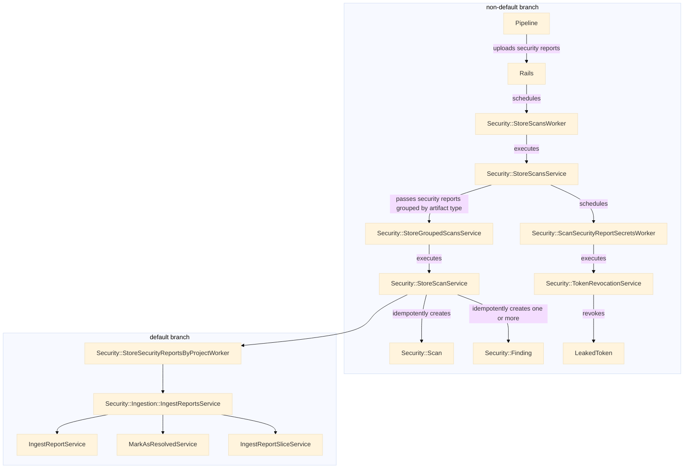
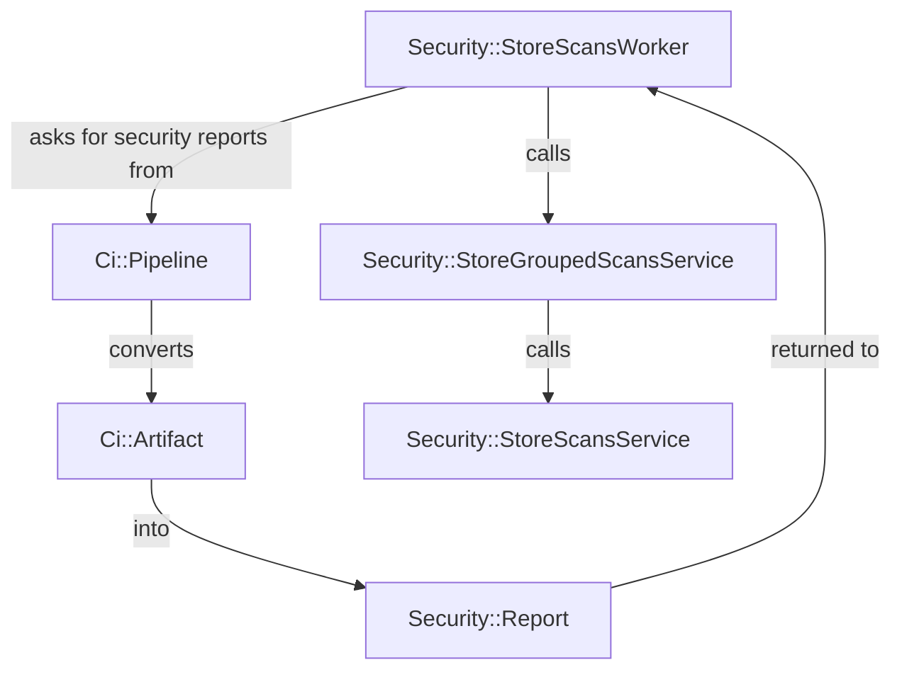
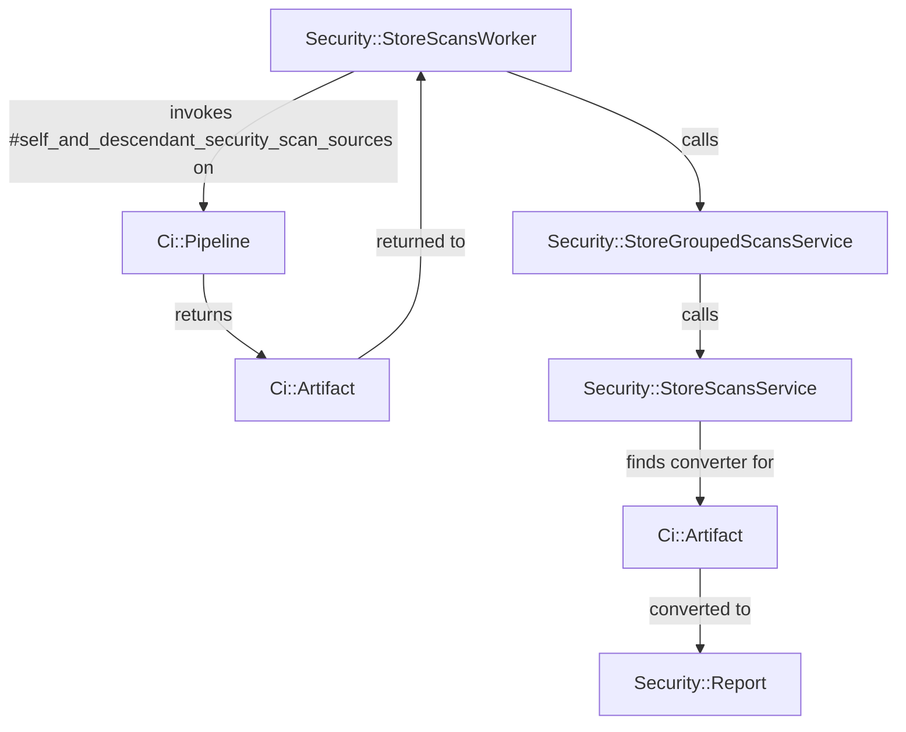

<!-- Design Documents often contain forward-looking statements -->
<!-- vale gitlab.FutureTense = NO -->

<!-- This renders the design document header on the detail page, so don't remove it-->


## Summary

The security finding creation API is an _internal_ API that facilitates
the creation of security findings without the need for CI/CD job
artifacts. This API establishes a clear contract on what's needed to create
the various types of security findings we store in the database.

## Motivation

This API addresses the difficulty of building application security testing
that does not run within the context of a CI/CD job, and does not produce job
artifacts. Building security testing software that works in this manner requires
workarounds, so that the source files (for example CycloneDX files) are
considered equivalent to a security report. While functional, this
workaround starts to leak implementation details quickly, adding to the overhead
of working on related areas, and results in a difficult to maintain set of code.

This will also improve the experience of working with the security report finding
class which has become overloaded. Evidence of this can be seen by looking at
the constructor which has over [20 arguments](https://gitlab.com/gitlab-org/gitlab/blob/009712173ba042d7d83ea31cb12e7019c758f39b/lib/gitlab/ci/reports/security/finding.rb#L36)
one of which is generic `details` hash that can hold arbitrarily more pieces of
data.

### Goals

* Decouple security report parsing and security finding sourcing.
* Reduce complexity of creating security findings from CycloneDX SBoMs.
* Improved performance when loading security findings from database.

### Non-Goals

* Exposing security findings as CI/CD job artifacts.

## Proposal

Create an API that has methods to create the following finding types:

* Dependency Scanning
* Container Scanning
* Operational Container Scanning
* DAST
* SAST
* Secret Detection

These methods replace the generic report finding class with new classes
whose constructors clearly define the data required for each finding type.
Refactor our security ingestion entrypoint to use a new method called
`#collect_security_findings` instead of `#collect_security_reports`. This method
will be responsible for collecting security findings from eligible sources. For
example, CycloneDX SBoMs would be scanned for advisories affecting the listed
components, and security reports would be parsed for the included security
findings.

## Design and implementation details

### Overview of security ingestion

The security ingestion looks like the following:

### Points of interest

* Rename `IngestReportsService`, `IngestReportService`, and `IngestReportSliceService` to avoid usage of the term `reports`.
* [CycloneDX reports are not considered security finding sources](https://gitlab.com/gitlab-org/gitlab/blob/313de920ee86ddf30d1fa6872b1d05ce3e277e02/ee/app/models/ee/ci/pipeline.rb#L60-L64), but this assumption no longer holds true.
* Rename [can_store_security_reports?] to [can_store_security_scans?]
* `Security::Scan` depends on security reports to find the [primary scanner](https://gitlab.com/gitlab-org/gitlab/blob/5a6f937be735771e8f235e02956977ae7a15e8f7/ee/app/models/security/scan.rb#L126).

### Process changes

**Before**

**After**

In the above, we remove the burden of artifact parsing from the pipeline model,
and move it closer to where it's utilized.

## Alternative Solutions

<!--
It might be a good idea to include a list of alternative solutions or paths considered, although it is not required. Include pros and cons for
each alternative solution/path.

"Do nothing" and its pros and cons could be included in the list too.
-->
